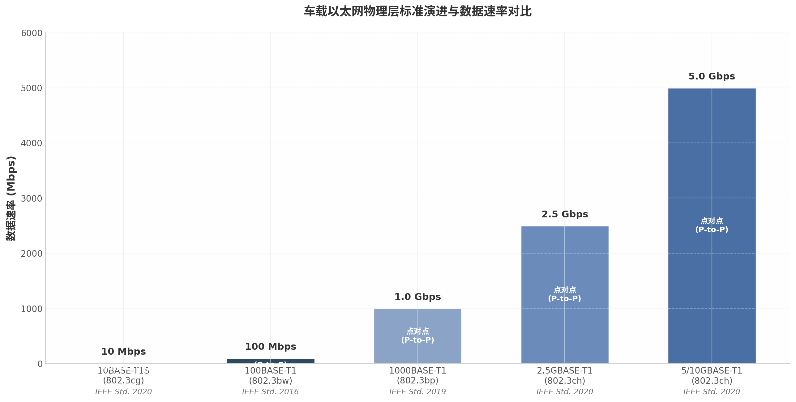
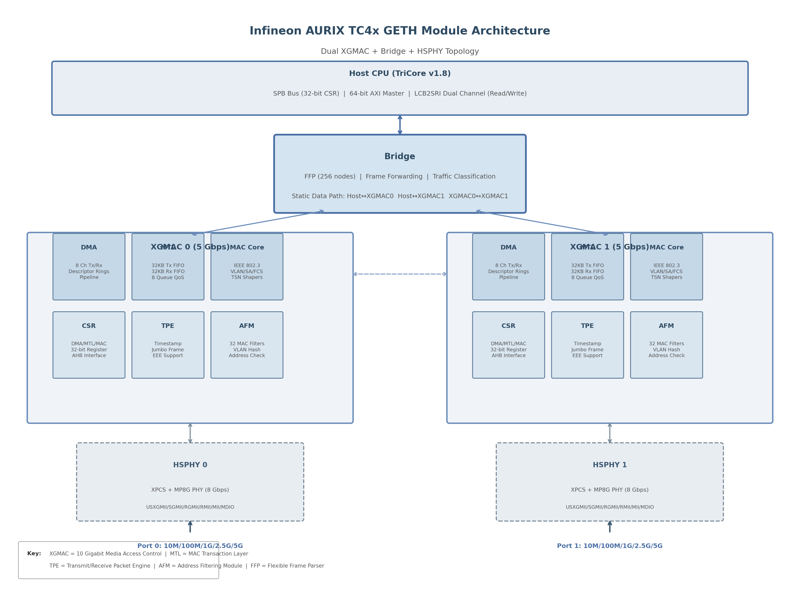
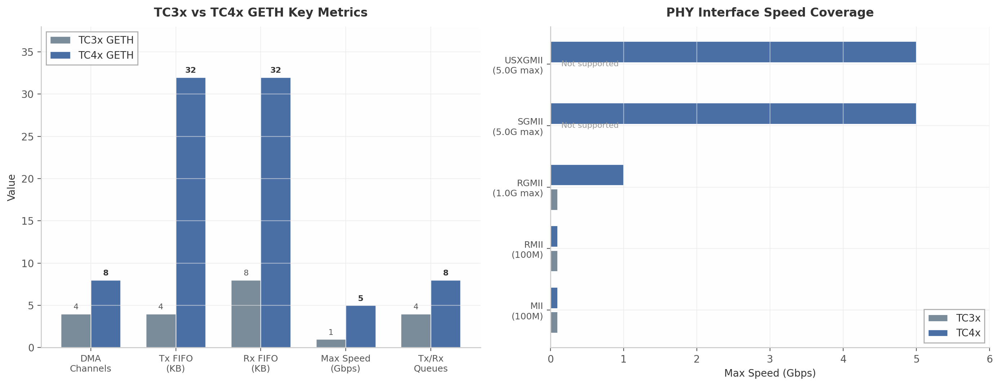
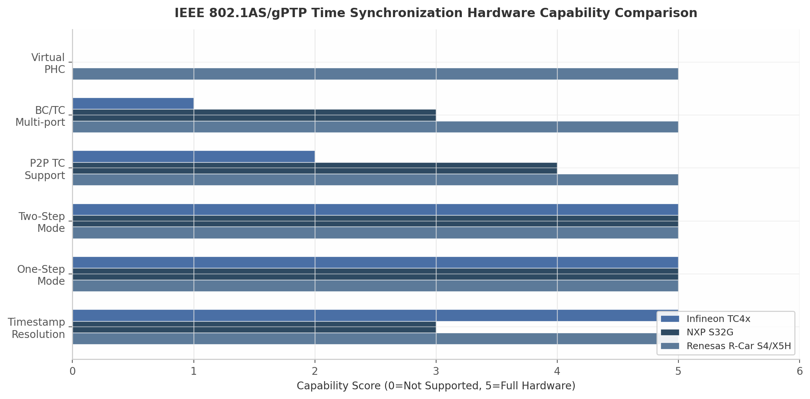
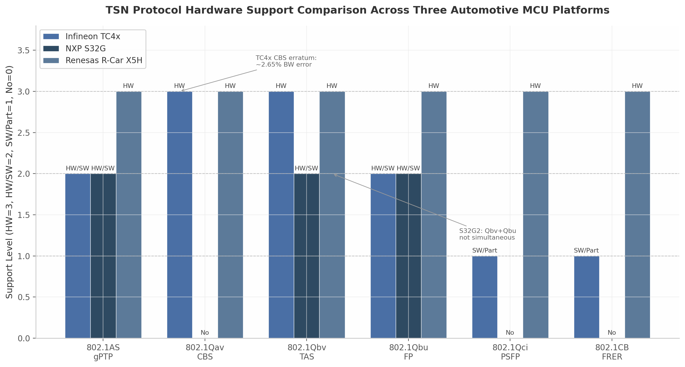
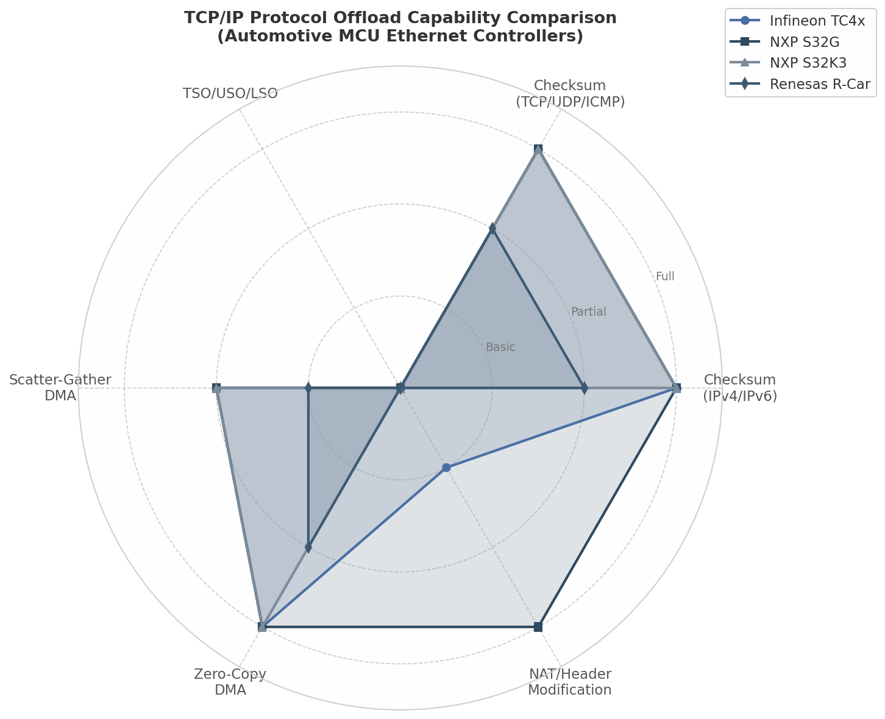
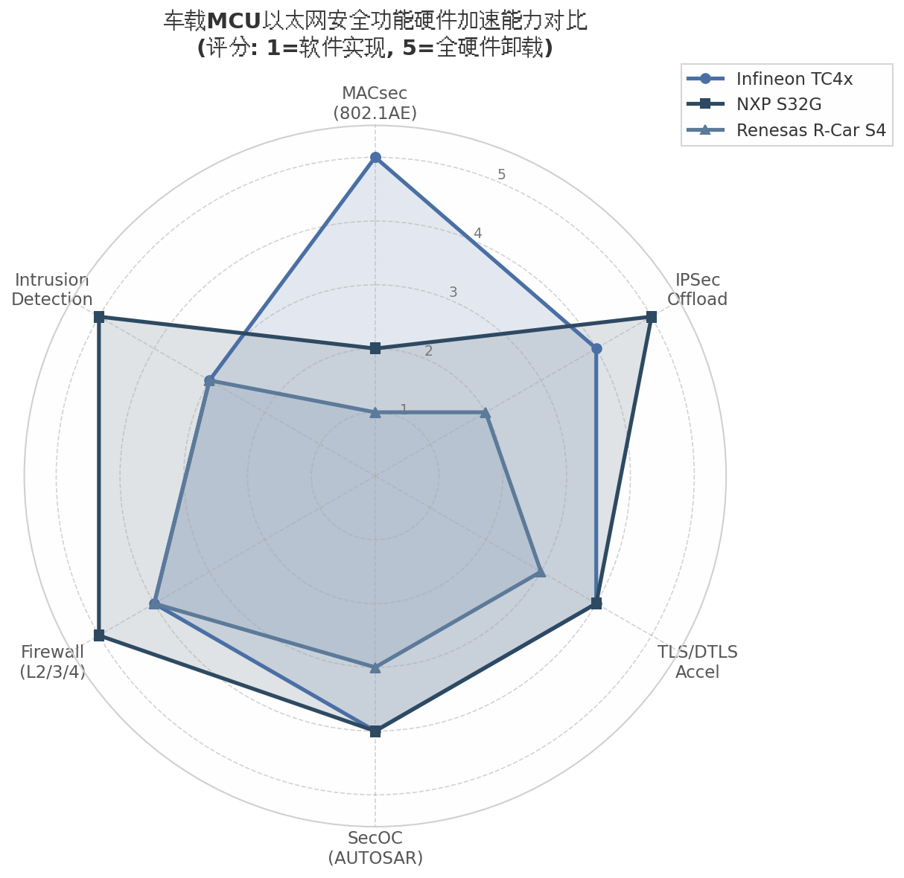
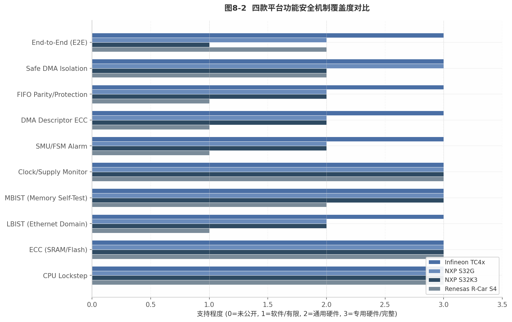
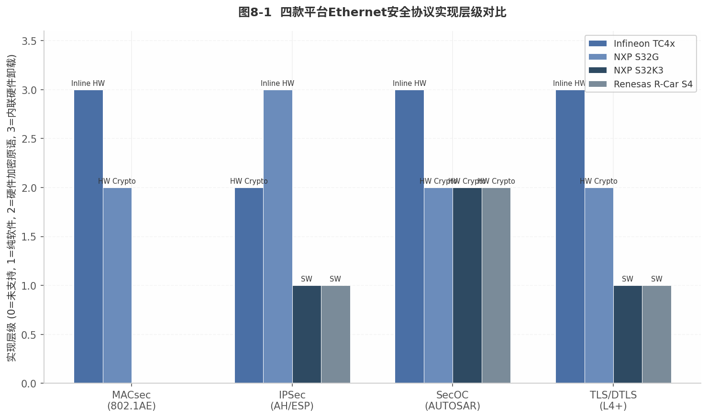

# 车规MCU Ethernet模块架构深度分析报告

## 执行摘要

### 核心发现

汽车E/E架构从域控制向区域架构的演进，正推动车载通信从CAN/CAN-FD向高速Ethernet迁移。带宽需求从100Mbps跃升至1Gbps乃至5Gbps，时间确定性从毫秒级进入微秒级，网络安全从可选变为强制。在这一技术变革中，MCU集成的Ethernet模块架构成为区域控制器、中央网关和ADAS域的核心技术选型要素。

本报告对Infineon AURIX TC4x、NXP S32G2/G3/S32K3、Renesas RH850/R-Car S4三款主流车规MCU的Ethernet模块进行了系统性深度分析，覆盖PHY接口、MAC架构、DMA设计、TSN协议支持、AVB协议支持、TCP/IP卸载、时间同步、网络安全和功能安全九大维度。

三家厂商呈现出三条截然不同的Ethernet技术路线：**Infineon TC4x采用"垂直深度集成"策略**，以双5Gbps XGMAC+内部Bridge+CSS网络安全加速器构成业界集成度最高的方案，独有的MACsec硬件加速（763MB/s）使其在安全敏感场景具有不可替代性；**NXP S32G采用"异构双引擎灵活可编程"策略**，GMAC_0负责TSN端点、PFE固件引擎负责L2/3/4路由，通过固件更新实现功能扩展，最适合中央网关的服务化架构演进；**NXP S32K3与Renesas RH850采用"极简MAC+外部扩展"策略**，通过外部TSN Switch（如SJA1110B）或集成MPU Switch（如R-Car S4的3端口2.5G TSN Switch）满足网络需求，以成本优化为核心诉求。

在TSN协议硬件支持方面，差异显著：TC4x GETH硬件支持802.1Qav/Qbv/Qbu，但存在已知CBS erratum（约2.65%带宽误差）和多端口Transparent Clock限制；S32G的Qbv/Qbu能力仅限GMAC_0，与PFE分离的架构导致TSN能力"分裂"；R-Car S4的集成TSN Switch支持最完整的协议栈（含802.1CB FRER和802.1Qci PSFP），但定位为MPU而非MCU。值得注意的是，**IEEE 1722 AVTP（Audio Video Transport Protocol）在三款MCU上均无硬件卸载**，Talker/Listener功能完全依赖软件栈实现。

在设计参考层面，报告提出了八层模块化Ethernet IP架构模板（PHY接口层、MAC核心层、DMA/Buffer层、TSN/AVB加速层、时间同步层、安全层、Bridge/Switch层、功能安全层），并将12个关键协议映射到对应模块。硬件/软件划分决策准则明确量化：速率>1Gbps、确定性延迟<10μs、加密吞吐量>500MB/s、功能安全ASIL-C/D等阈值应优先硬件实现；协议状态机复杂度高、配置灵活性需求强的功能适合软件实现。

基于应用类型的MCU选型决策树表明：**ADAS传感器融合域**优选TC4x（5Gbps带宽+MACsec）；**中央网关**优选S32G（PFE可编程路由+IPSec卸载）；**车身/舒适域**优选S32K3（成本优化+外部SJA1110）；**信息娱乐域**优选R-Car S4（集成TSN Switch+AVB硬件意识）。

未来五年，车载Ethernet将向10Gbps演进，TSN over 10BASE-T1S将打通低成本传感器网络与高速骨干网，MACsec有望成为OEM网络安全强制要求，AI加速器与Ethernet的融合将重新定义MCU的网络处理架构。本报告提供的模块功能划分框架和协议映射关系，可直接作为下一代车规Ethernet模块设计的参考基准。

---


---


## 1. 汽车MCU Ethernet技术概述

### 1.1 汽车E/E架构演进与Ethernet需求

#### 1.1.1 从域控制架构到区域架构的演进

汽车电子电气（Electrical/Electronic, E/E）架构正经历从传统域控制（Domain Controller）架构向区域（Zonal）架构的根本性迁移。传统域架构按功能划分为动力总成域、底盘域、车身域和信息娱乐域，各域内以CAN（Controller Area Network）总线为主干，通过网关实现跨域通信。这种架构在L2及以下辅助驾驶时代尚能满足需求，但当L2+至L4级ADAS（Advanced Driver-Assistance Systems）进入量产阶段时，传感器数据融合带来的带宽压力使CAN/CAN-FD的极限暴露无遗。以8MP（百万像素）摄像头为例，单路原始数据速率可达1.5–2.5 Gbps，若前向ADAS系统配置7路摄像头，总输入带宽即超过10 Gbps，远超CAN-FD 5–8 Mbps的物理上限^1^。

区域架构将车辆按物理空间划分为前区（Front Zonal）、后区（Rear Zonal）、左区（Left Zonal）和右区（Right Zonal），每个区域控制器就近连接该区域内所有传感器、执行器和局部ECU，再通过高带宽骨干网（Backbone）与中央计算平台互联。这一拓扑变革直接推动了车载骨干网速率从100 Mbps向1 Gbps乃至5–10 Gbps跃升^1^。与此同时，空中升级（Over-The-Air, OTA）包体积从数百MB增长至数十GB，要求下载通道具备持续稳定的百兆级吞吐量。Infineon在其TC4x产品定位中明确将5 Gbps Ethernet作为区域控制器与中央计算平台的核心互联手段，并集成Bridge模块实现端口间L2转发，以减少对外部交换芯片的依赖^2^。

#### 1.1.2 车载Ethernet相较于CAN/CAN-FD/CAN-XL的核心优势

车载Ethernet取代传统总线的竞争力并非单纯源于带宽量级差异，而是其在确定性（Determinism）、协议融合与ecosystem成熟度三个维度的综合优势。在带宽维度，当前车规以太网PHY（Physical Layer）标准已形成从10 Mbps到10 Gbps的完整梯度：10BASE-T1S面向低成本传感器多点总线，100BASE-T1和1000BASE-T1覆盖绝大多数域间通信，IEEE 802.3ch定义的多吉比特（Multi-Gigabit）标准支撑ADAS骨干网^3^。相较之下，CAN-XL虽将速率提升至10 Mbps量级，但与百兆/千兆以太网仍存在一到两个数量级的差距。

在确定性维度，时间敏感网络（Time-Sensitive Networking, TSN）协议族为以太网引入了工业级的时延保障机制。IEEE 802.1Qbv（Time-Aware Shaper, TAS）通过门控列表（Gate Control List, GCL）实现纳秒级时间切片调度，802.1Qbu（Frame Preemption）允许高优先级帧中断低优先级传输，将最坏情况时延从毫秒级压缩至微秒级^4^。这种确定性是以太网进入底盘线控制动（Brake-by-Wire）和线控转向（Steer-by-Wire）等高安全等级域的前提。在协议融合维度，车载以太网采用标准TCP/IP协议栈，与云端基础设施、诊断工具和网络测试设备天然兼容，显著降低了开发、测试和运维的工具链成本。

### 1.2 汽车Ethernet协议栈全景

#### 1.2.1 物理层标准

车载以太网物理层标准由IEEE 802.3工作组制定，核心特征是以单对非屏蔽双绞线（Single-Pair Unshielded Twisted Pair, UTP）替代传统四对双绞线，从而降低线束重量与成本。下图汇总了当前主流车规PHY标准及其关键参数。



**100BASE-T1（IEEE 802.3bw）** 于2016年发布，采用66b/64b编码和PAM-3（Pulse Amplitude Modulation 3-level）调制，在单对UTP上实现100 Mbps全双工通信，是当前车载以太网部署最广泛的物理层标准^3^。**1000BASE-T1（IEEE 802.3bp）** 将速率提升至1 Gbps，采用更复杂的PAM-3调制与回声消除技术，已成为新一代区域架构骨干网的事实标准。**10BASE-T1S（IEEE 802.3cg）** 于2020年发布，以10 Mbps速率支持多点总线（Multi-Drop）拓扑，最多连接8个节点，通过PLCA（Physical Layer Collision Avoidance）协调总线访问，其设计目标是以低于CAN-FD的每节点成本替代传统车身传感器网络^1^。**Multi-Gigabit（IEEE 802.3ch）** 在同一标准内定义了2.5 Gbps、5 Gbps和10 Gbps三个速率等级，采用PAM-4调制，面向中央计算平台与高分辨率ADAS传感器之间的高速互联。Infineon TC4x的GETH模块支持USXGMII接口，可直接对接802.3ch 5 Gbps PHY，是目前少数在MCU级别原生支持Multi-Gigabit的架构^3^。

| 协议标准 | IEEE标准号 | 速率 | 拓扑 | 调制方式 | 典型应用场景 |
|---------|-----------|------|------|---------|------------|
| 10BASE-T1S | 802.3cg ^1^| 10 Mbps | 多点总线 | PAM-3 + PLCA | 车身传感器、执行器 |
| 100BASE-T1 | 802.3bw ^3^| 100 Mbps | 点对点 | PAM-3 | 域控制器、摄像头/雷达 |
| 1000BASE-T1 | 802.3bp ^3^| 1 Gbps | 点对点 | PAM-3 | 区域控制器骨干网 |
| 2.5GBASE-T1 | 802.3ch ^3^| 2.5 Gbps | 点对点 | PAM-4 | ADAS传感器融合 |
| 5/10GBASE-T1 | 802.3ch ^3^| 5/10 Gbps | 点对点 | PAM-4 | 中央计算平台互联 |

上表揭示了车载以太网PHY标准的分层覆盖策略。10BASE-T1S填补车身域低成本通信空白，其多点总线拓扑与CAN的广播式通信最为接近，OEM迁移车身网络时可复用原有线束拓扑。100BASE-T1和1000BASE-T1构成当前量产主流，分别对应传感器接入层和域间汇聚层。Multi-Gigabit标准瞄准下一代集中式E/E架构，其中5 Gbps是目前MCU MAC层可实际支撑的速率上限——Infineon TC4x的GETH模块通过XGMAC（10 Gigabit Media Access Control）IP核将MAC时钟配置降至5 Gbps运行，在功耗与性能之间取得平衡^5^。

#### 1.2.2 数据链路层扩展：TSN、AVB与网络安全

在传统IT以太网中，数据链路层（Data Link Layer, OSI Layer 2）仅提供尽力而为（Best-Effort）的帧转发服务，无法满足汽车控制指令的时延和可靠性要求。TSN协议族通过在一系列IEEE 802.1标准中嵌入调度、整形和冗余机制，将以太网改造为具备确定性行为的通信介质。其核心子协议的功能定位如下：IEEE 802.1AS（gPTP, generalized Precision Time Protocol）提供全局时间同步，确保跨节点时钟偏差小于1 μs；802.1Qav（Credit-Based Shaper, CBS）通过信用令牌机制为AVB流预留带宽；802.1Qbv（TAS）以时分复用方式精确控制队列门控开闭；802.1Qbu（Frame Preemption）允许Express帧中断preemptable帧，进一步压缩高优先级时延；802.1Qci（Per-Stream Filtering and Policing, PSFP）在入端口实施逐流过滤与计量，防止故障节点洪泛攻击；802.1CB（Frame Replication and Elimination for Reliability, FRER）通过帧复制与路径冗余实现零恢复时间容错^4^。

AVB（Audio Video Bridging）协议族是TSN的前身，在汽车领域主要用于信息娱乐域的音视频流传输。IEEE 802.1BA定义AVB系统配置文件，IEEE 1722定义AVTP（Audio Video Transport Protocol）承载音视频数据，IEEE 1722.1定义AAC（AVDECC Audio Controller）用于设备发现与连接管理。值得注意的是，当前Infineon TC4x、NXP S32及Renesas R-Car系列MCU均未在硬件层面实现AVTP卸载，AVB流处理仍需依赖软件协议栈完成，这在高分辨率多通道音频场景下会显著占用CPU资源。

网络安全方面，IEEE 802.1AE（MACsec）在MAC层提供帧级加密、完整性校验与重放保护，SecOC（Secure Onboard Communication）则是AUTOSAR定义的PDU级安全机制，基于AES-CMAC（Cipher-based Message Authentication Code）为关键信号添加新鲜度值（Freshness Value）与认证码。TC4x通过Cyber Security Satellite（CSS）模块实现MACsec硬件加速，速率达763 MB/s^6^；NXP S32G依赖HSE（Hardware Security Engine）和外部PHY实现MACsec，片内无专用MACsec加速器^7^。

#### 1.2.3 软件栈映射：AUTOSAR Eth/EthIf/EthSwt/EthTSyn与MCU硬件模块的对应关系

AUTOSAR Classic Platform将Ethernet功能抽象为分层软件架构。MCAL（Microcontroller Driver Layer）中的Eth Driver直接操作MAC硬件寄存器，向上层提供统一的帧收发接口。EthIf（Ethernet Interface）模块负责VLAN处理、硬件访问抽象和转发规则配置。EthSwt（Ethernet Switch）驱动将内部Bridge或外部Switch硬件映射为标准化API，使上层无需感知交换功能由片内还是片外实现^8^。EthTSyn模块实现gPTP时间同步协议栈，通过与硬件Timestamp Unit（TSU）交互获取纳秒级时间戳，并映射到StbM（Synchronized Time-Base Manager）实现全局时间分发^9^。

这种分层抽象对硬件架构师的设计影响深远：当AUTOSAR软件栈期望通过EthSwt配置VLAN转发规则时，若MCU选用TC4x，EthSwt可直接操作GETH内部Bridge的MAC/VLAN表；若选用S32K3，则EthSwt需通过SPI或以太网管理接口与外部SJA1110交互^10^。两种路径在软件API层面表现一致，但在时延、BOM成本和功能安全等级上存在本质差异。此外，AUTOSAR R20-11已正式纳入10BASE-T1S支持，R24-11进一步扩展了Eth驱动对USXGMII和Multi-Gigabit速率的配置能力^11^，但软件栈演进速度普遍滞后于硬件能力发展，这也是本报告关注硬件模块原生功能的重要背景。

### 1.3 报告范围与分析框架

#### 1.3.1 分析对象界定

本报告聚焦三家主流汽车MCU厂商的Ethernet模块架构，覆盖从高端区域控制器到基础车身ECU的完整产品谱系。

| MCU系列/平台 | 核心Ethernet模块 | 最高MAC速率 | Bridge/Switch方案 | 典型目标应用 | 功能安全等级 |
|-------------|----------------|------------|------------------|------------|------------|
| Infineon AURIX TC4x | GETH (XGMAC) + LETH ^5^| 5 Gbps | 内部Bridge (4端口) ^2^| 区域控制器、ADAS域 | ASIL-D ^12^|
| NXP S32G2/G3 | GMAC + PFE ^13^| 1 Gbps (GMAC) / 2–3 Gbps (PFE聚合) | PFE L2/L3 Bridge ^14^| 中央网关、V2X | ASIL-D ^15^|
| NXP S32K3 | ENET/GMAC ^16^| 100 Mbps / 1 Gbps | 外部SJA1110 ^17^| 车身域、域控制器 | ASIL-D |
| Renesas RH850 | 基础ENET | 100 Mbps | 无/外部Switch | 传统ECU、发动机控制 | ASIL-D |
| Renesas R-Car S4 | 集成TSN Switch | 1 Gbps | 3端口集成TSN Switch | 信息娱乐、ADAS计算 | ASIL-B |

上表呈现了三家厂商在汽车Ethernet架构上的三条差异化技术路线。Infineon TC4x代表"集成深度优先"路线：将XGMAC MAC、内部Bridge、TSN硬件整形器和CSS安全加速器全部集成于片内，以最小化BOM成本和PCB面积，特别适合物理空间受限的区域控制器^2^。NXP S32G代表"灵活可编程"路线：GMAC提供标准MAC功能，PFE（Packet Forwarding Engine）通过可升级固件实现L2/L3交换与IPSec卸载，使OEM可通过固件更新增加新协议支持而不必更换硬件^14^。NXP S32K3与Renesas RH850代表"成本优化"路线：保留最基本的ENET/GMAC MAC，通过外部Switch扩展端口数量和TSN功能，以最低芯片单价满足车身域的带宽需求^16^。Renesas的高端Ethernet功能实际集中在R-Car S4 MPU中，其集成3端口TSN Switch在硬件层面支持完整的802.1Qbv/Qbu/Qci功能集，与RH850 MCU形成互补布局。

#### 1.3.2 分析维度定义

为系统性比较上述MCU的Ethernet模块，本报告定义九个分析维度，每个维度均从硬件架构、协议支持和软件映射三个层面展开论证。

**PHY接口（PHY Interface）** 考察MAC核对外部PHY的介质无关接口（Media Independent Interface）支持范围，包括MII、RMII、RGMII、SGMII、USXGMII等，以及是否原生支持10BASE-T1S多点总线^3^ ^13^。**MAC架构（MAC Architecture）** 分析MAC核的IP来源（如Synopsys XGMAC/EMAC/DWC_ether_qos）、DMA通道数、MTL（MAC Transaction Layer）FIFO深度和地址/VLAN过滤能力^5^ ^18^。**DMA设计（DMA Design）** 关注描述符结构、Scatter-Gather支持、零拷贝（Zero-Copy）能力和Cache一致性机制，这些因素直接决定高带宽场景下的CPU负载水平^19^ ^20^。

**TSN支持（TSN Support）** 评估各MCU对802.1Qbv/Qbu/Qav/Qci/CB等TSN核心协议的硬件实现程度，区分端点（Endpoint）TSN与网络（Switching）TSN的实现位置差异^4^ ^21^。**AVB支持（AVB Support）** 关注硬件时间戳、AVB流识别和CBS整形器对SR（Stream Reservation）类的支持情况。**TCP/IP卸载（TCP/IP Offload）** 衡量L3/L4层处理由硬件还是软件承担，包括IPv4/IPv6路由、NAPT（Network Address Port Translation）和TCP状态跟踪等能力^22^ ^23^。

**时间同步（Time Synchronization）** 分析IEEE 1588 PTP和802.1AS gPTP的硬件时间戳精度、一步/两步模式支持，以及Transparent Clock（TC）和Boundary Clock（BC）的实现限制^24^ ^25^。**安全功能（Security）** 对比MACsec、IPSec和SecOC的实现位置与加速方式，特别关注TC4x CSS的MACsec硬件加速能力与S32G PFE的IPSec卸载能力之间的差异^6^ ^7^。**功能安全（Functional Safety）** 依据ISO 26262评估各模块的ASIL等级、ECC覆盖范围、Safe DMA和BIST（Built-In Self Test）机制^12^ ^15^。

后续章节将依次深入分析Infineon TC4x GETH模块（第2章）、NXP S32系列Ethernet子系统（第3章）、Renesas RH850/R-Car Ethernet架构（第4章），随后在第5至第9章分别从TSN、安全、时间同步、DMA设计和功能安全维度进行跨平台对比，最终在第10章给出面向不同E/E架构拓扑的MCU选型设计参考。


---


# 2. Infineon TC4x Ethernet模块架构深度分析

AURIX TC4x系列是英飞凌面向汽车电子电气（E/E）架构演进推出的新一代多核安全MCU。相较于前代TC3x，TC4x的GETH（Gigabit Ethernet，千兆以太网）模块实现了从1 Gbps到5 Gbps的跨越式带宽提升，同时在DMA通道数、MTL（MAC Transaction Layer，MAC传输层）FIFO容量、TSN（Time-Sensitive Networking，时间敏感网络）硬件加速以及片内桥接能力等维度进行了全面重构。本章以TC4x GETH模块为分析对象，系统拆解其从顶层拓扑到内部子系统的技术架构，为Ethernet模块设计提供可对标的技术基准。

## 2.1 GETH模块顶层架构

### 2.1.1 双XGMAC+Bridge的模块拓扑

TC4x芯片中的GETH模块在硬件层面由最多两个XGMAC（10 Gigabit Media Access Control，万兆媒体访问控制）实例与一个Bridge（桥接器）模块组成，向下通过HSPHY（High Speed PHY，高速物理层）实现物理层信号转换^26^。这一拓扑设计区别于传统单MAC嵌入式以太网控制器，其双端口架构配合片内桥接能力，使TC4x能够在不依赖外部Switch的情况下实现双端口Ethernet节点的菊链级联，这一拓扑特征对于区域控制器（Zonal Controller）中多个传感器域的级联互联具有直接的工程价值。

下图展示了TC4x GETH模块的完整硬件拓扑：Host CPU通过64位总线与Bridge交互，Bridge分别连接两个独立的XGMAC核心，每个XGMAC向下通过专用的HSPHY模块对接物理层接口。



Bridge模块的存在意味着GETH模块内部存在三条静态数据路径：Host至XGMAC0、Host至XGMAC1，以及XGMAC0与XGMAC1之间的直接帧转发^12^。后者使得两个5 Gbps端口之间可以在零CPU负载的条件下完成二层帧交换，这一机制是后续菊链拓扑支持的基础硬件前提。

### 2.1.2 速率与PHY接口支持

TC4x GETH的Ethernet端口支持10 M/100 M/1 G/2.5 G/5 G五种速率的全双工（Full-Duplex）模式，同时保留10 M/100 M的半双工（Half-Duplex）兼容^27^。这一速率跨度覆盖了从传统车身网络调试接口到高带宽ADAS（Advanced Driver Assistance Systems，高级驾驶辅助系统）传感器数据回传的全部应用场景。HSPHY模块内部集成了最多三个MP8G PHY（Multi-Protocol 8 Gigabit PHY，多协议8千兆物理层），每个MP8G PHY由PCS（Physical Coding Sublayer，物理编码子层）和PMA（Physical Medium Attachment，物理介质连接）组成，线速率可在0.125 Gbps至8 Gbps之间配置^28^。针对Ethernet应用，HSPHY内部最多配置两个专用的XPCS模块，负责在Ethernet MAC与MP8G PHY之间进行编码适配，支持USXGMII和SGMII两种串行模式^28^。

**表2-1 TC4x GETH支持的PHY接口与速率矩阵**

| PHY接口 | 接口类型 | 支持速率 | 应用场景 | HSPHY内部映射 |
|:------:|:------:|:------|:------|:------|
| MII | 并行 | 10/100 Mbps ^26^| 传统诊断、 legacy ECU | 直接并行接口 |
| RMII | 并行（精简） | 10/100 Mbps ^26^| 低成本车身网络 | 引脚数减半的MII |
| RGMII | DDR并行 | 10/100/1000 Mbps ^29^| 千兆主干网络 | DDR时钟，支持Skew控制 |
| SGMII | 串行 | 100/1000/2500/5000 Mbps ^29^| 多速率车载骨干 | 经XPCS适配至MP8G |
| USXGMII | 串行（统一） | 100/1000/2500/5000 Mbps ^26^| 多速率自动协商 | XPCS支持统一协议 |
| MDIO | 管理总线 | — | PHY寄存器配置 | 管理接口 |

该接口矩阵体现了TC4x GETH在物理层兼容性上的设计理念：保留对传统并行接口（MII/RMII/RGMII）的向下兼容，同时通过串行接口（SGMII/USXGMII）实现2.5 G/5 G高速扩展。RGMII接口还内置了Skew（时钟偏移）生成能力，HSPHY可通过内部配置在时钟信号上附加可控延迟，从而补偿PCB走线差异带来的采样时序偏差，降低对PCB等长设计的严格依赖^29^。

### 2.1.3 64位主机总线架构

TC4x GETH模块采用64位总线宽度，配合优化的总线访问接口，包括一个Local Cross Bar（本地交叉开关）与两条LCB2SRI连接通道^26^。这两条通道的设计亮点在于读写分离：一条LCB2SRI通道可专用于读事务（Read Transactions），另一条专用于写事务（Write Transactions），发送帧（TX）的数据缓冲区映射至第一个主控地址空间，接收帧（RX）的数据缓冲区映射至第二个主控地址空间^26^。这种物理分离使得TX和RX方向的帧数据可以同时以满缓冲区深度运行，避免了读写争用导致的总线带宽折损。XGMAC-AXI主控接口在DMA控制器统一管理下执行描述符获取（Descriptor Fetch）、描述符回写（Descriptor Writeback）以及数据搬运操作，所有DMA阶段均以流水线（Pipelined）方式独立并行执行^26^。

## 2.2 XGMAC核心内部结构

XGMAC是实现链路层功能的核心模块，其内部由XGMAC-CORE、MTL传输层、DMA控制器以及各类总线接口组成^26^。XGMAC整体遵循IEEE 802.3-2008与IEEE 802.3-2015标准，同时兼容IEEE 802.1AS 2020、IEEE 802.3az-2010、NBASE-T Alliance 2.5/5 Gigabit Ethernet（USXGMII）、RGMII v2.6及RMII v1.2等多项协议规范^26^。以下按子系统层级逐一拆解。

**表2-2 XGMAC内部子系统结构与功能映射**

| 子系统 | 全称 | 核心功能 | 关键规格参数 | 接口/寄存器 |
|:------:|:------|:------|:------|:------|
| CSR | Control and Status Register | DMA/MTL/MAC分层寄存器配置，MCU经SPB总线以AHB协议访问 ^26^| 32位寄存器地址空间 | SPB→AHB转换 |
| DMA | Direct Memory Access | 8通道独立Tx/Rx引擎，描述符环管理，流水线操作 ^26^| 每通道最多64K Tx/Rx描述符，接收缓冲区最大16 KB ^30^| 64位AXI主控 |
| MTL | MAC Transaction Layer | FIFO缓冲与帧数据调节，Tx/Rx异步时钟域同步 ^26^| 68位宽FIFO（64数据+4控制），Tx 32 KB / Rx 32 KB ^26^| DMA↔MAC桥接 |
| MAC Core | Media Access Control Core | 802.3帧格式处理、VLAN/SA/FCS操作、PHY接口适配 ^26^| XGMII/GMII/MII/RGMII/RMII全双工 | MTI/MRI/MCI |
| TPE | Transmit/Receive Packet Engine | 帧收发引擎、时间戳捕获、巨帧/EEE支持 ^26^| Jabber定时器默认2048字节，巨帧模式扩展至10240字节 | MAC时钟域 |
| AFM | Address Filtering Module | 目的/源MAC地址过滤，VLAN过滤与哈希计算 ^30^| 最多32个MAC地址过滤器 | 接收路径前置 |

上表展示了XGMAC内部六大子系统的功能分工与接口关系。CSR作为配置中枢，采用32位寄存器空间实现MCU对XGMAC的全面控制；DMA承担数据搬运主体工作；MTL提供关键的跨时钟域缓冲与QoS（Quality of Service，服务质量）队列管理；MAC Core执行802.3标准帧处理；TPE和AFM则分别在收发引擎和过滤逻辑上提供增强功能。这种分层结构符合经典Ethernet控制器的设计范式，但TC4x在每个子系统的规格参数上均实现了对前代的大幅超越。

### 2.2.1 CSR从接口

CSR（Control and Status Register，控制与状态寄存器）接口为MCU提供了访问XGMAC内部配置资源的统一通道。在GETH模块内部，DMA、MTL和MAC三个层级各自拥有独立的寄存器组^26^。MCU通过SPB（System Peripheral Bus，系统外设总线）访问该接口，总线数据在模块内部被转换为AHB（Advanced High-performance Bus，高级高性能总线）协议进行处理^26^。这种分层寄存器结构使得驱动开发可以按DMA配置、MTL队列管理、MAC帧操作三个维度进行模块化编程，降低了软件栈的耦合度。

### 2.2.2 DMA控制器

TC4x GETH的DMA控制器具备八个独立通道，较TC3x的四个通道实现翻倍^26^。每个通道拥有独立的Tx引擎和Rx引擎：Tx引擎负责将数据从系统内存搬运至MTL层，Rx引擎负责将数据从MTL层搬运至系统内存^26^。DMA采用寄存器与描述符列表（Descriptor Lists）相结合的机制，在最小化CPU负载的前提下高效完成数据搬运^26^。

在描述符层面，XGMAC支持环形结构（Ring Structure），通过`DMA_CHy_TxDesc_Ring_Length`和`DMA_CHy_RxDesc_Ring_Length`寄存器配置描述符环长度^26^。官方培训资料显示，每通道最多支持64K个Tx描述符和64K个Rx描述符，接收缓冲区最大可达16 KB^30^。描述符字段中，TDES3的OWN位（bit 31）标记DMA控制权归属，CTXT位（bit 30）区分常规描述符与增强描述符，FD/LD位分别标识首描述符和末描述符，CPC位控制CRC/Pad行为，SAIC位（bits 25:23）控制源地址插入行为，CIC/TPL位（bits 17:16）启用TCP/IP校验和辅助计算^26^。

DMA的流水线架构是其吞吐效率的核心：对新数据包的描述符获取、前一数据包的数据传输、以及再前一数据包的描述符回写三个阶段可以并行执行^26^。这种流水机制显著降低了包间传输间隔，对于5 Gbps线速下的小包突发场景尤为关键。

### 2.2.3 MTL传输层

MTL（MAC Transaction Layer，MAC传输层）在系统内存与XGMAC IP之间提供FIFO（First-In-First-Out，先进先出）缓冲与帧数据调节功能^26^。在TC4x的64位系统中，FIFO宽度为68位——64位数据位加4位控制位——并在发送和接收路径上分别实现异步FIFO以完成时钟域可靠同步^26^。

MTL层缓冲容量相较前代TC3x实现跨越式提升：TC3x的Tx FIFO仅为4 KB，Rx FIFO为8 KB；TC4x则将Tx和Rx FIFO分别扩展至32 KB^26^，即Tx方向提升8倍，Rx方向提升4倍。这一扩展直接支撑了8队列QoS管理所需的 deeper buffering，使每个队列在拥塞场景下拥有更大的吸收能力。MTL支持阈值模式（Threshold Mode）和存储转发模式（Store-and-Forward Mode）双工操作，前者在FIFO达到预设阈值时即启动传输以降低延迟，后者待完整帧存入FIFO后统一转发以保证帧完整性。

### 2.2.4 MAC核心

MAC Core（MAC核心层）完全遵循IEEE 802.3-2008行业标准，并实现XGMII/GMII/MII/RGMII/RMII全双工接口以与物理编码子层通信^26^。MAC层通过MTI（MAC Transmit Interface，MAC发送接口）、MRI（MAC Receive Interface，MAC接收接口）和MCI（MAC Control Interface，MAC控制接口）三个接口与应用侧交互^26^。

在帧处理功能上，MAC Core支持VLAN（Virtual Local Area Network，虚拟局域网）标签的逐帧粒度插入、替换与删除操作；支持源MAC地址的自动修改；并能在源地址变更后自动更新FCS（Frame Check Sequence，帧校验序列）^1^。TFC（Transmit Frame Controller，发送帧控制器）提供四种帧尾处理模式：对长度不小于60字节的帧自动附加CRC（Cyclic Redundancy Check，循环冗余校验）；对短帧补充填充至60字节后追加CRC；仅追加CRC而不补充填充；以及完全禁用CRC由应用层自行处理校验^1^。

## 2.3 Bridge与网络互联

### 2.3.1 Bridge架构

Bridge（桥接器）是TC4x GETH区别于TC3x的关键新增模块，其连接两个XGMAC与主机接口，支持在三者之间静态建立数据路径，实现Ethernet帧的转发^1^ ^12^。具体而言，Bridge支持三类转发方向：从Host到任一XGMAC、从两个XGMAC到Host，以及从一个XGMAC到另一个XGMAC^12^。

Bridge的帧转发无需软件参与，即不占用CPU负载^30^。这种硬件级桥接能力在区域控制器架构中具有明确的拓扑价值：当TC4x作为中间节点串联两个Ethernet网段时，来自端口0的帧可以直接经Bridge转发至端口1，反之亦然，无需将数据包先送至CPU内存再重新下发。这种"cut-through"式的片内转发大幅降低了级联节点的转发延迟，并释放了CPU带宽用于应用层处理。

### 2.3.2 灵活帧解析器（FFP）

TC4x GETH在每个5 Gbps MAC中各集成一个灵活帧解析器（Flexible Frame Parser，FFP），提供高度可编程的帧过滤能力^30^。FFP通过一棵最多包含256个比较节点的可编程二叉树对入帧的任意部分进行逐层评估，每个比较节点可检测入帧中最多32位宽的数据段，并产生Match（匹配）或Fail（不匹配）判决结果^30^。

FFP的判决结果直接驱动帧的转发或丢弃决策，为硬件防火墙和入侵检测服务（IDS/IDPS）提供了底层支撑^27^。在802.1Qci Per-Stream Filtering and Policing（PSFP，逐流过滤与管制）的语境下，FFP充当流过滤器的硬件实现基础，负责标识数据流ID并将其映射至最多8个网关ID之一，后续由GCL（Gate Control List，门控列表）进行流闸门控制，PC（Police Counter，管制计数器）实现流量计量^31^。需要指出的是，8个网关ID的限制意味着并发独立 policing 的流数量存在硬件上限，对于流密度极高的场景需通过软件分流或聚合策略补偿。

### 2.3.3 菊链拓扑支持

双端口Bridge的硬件转发能力为菊链（Daisy Chain）拓扑提供了原生支持。在菊链架构中，多个区域控制器通过单一Ethernet链路依次串联，每个中间节点需要同时作为终端接收本节点数据并作为中继转发上下游数据。TC4x的XGMAC0↔XGMAC1直接转发路径使这一拓扑无需外部Layer-2 Switch即可实现^30^，配合IEEE 802.1AS时间同步和802.1Qbv门控调度，可以构建确定性的线性级联网络。这一设计权衡体现了TC4x"集成深度优先"的架构路线：将网络交换功能尽可能集成于MCU片内，以减少BOM（Bill of Materials，物料清单）成本和PCB面积。



上图直观呈现了TC3x到TC4x在关键规格上的代际跃迁。左图显示DMA通道、FIFO容量和队列数量均实现翻倍或数倍增益，右图表明PHY接口从并行主导（MII/RMII/RGMII）扩展至串行高速接口（SGMII/USXGMII）的全面覆盖。这一跃迁意味着TC4x的GETH模块已不再是传统意义上的"MAC+PHY"组合，而是一个具备交换、过滤、TSN加速和安全卸载能力的集成网络子系统。

## 2.4 硬件卸载功能

硬件卸载（Hardware Offload）是将本应由CPU执行的协议处理操作下沉至Ethernet控制器硬件的过程，其目标是降低CPU中断频率和计算负载，提升有效吞吐率。TC4x GETH在多个协议层面提供了卸载支持。

**表2-3 TC4x GETH硬件卸载功能矩阵**

| 卸载功能 | 协议/标准 | 操作方向 | 控制机制 | 技术规格 |
|:------:|:------|:------:|:------|:------|
| TCP/IP校验和 | IPv4/IPv6/TCP/UDP/ICMP | Tx计算+Rx验证 ^1^ ^2^| TDES3 CIC/TPL位（bits 17:16）^26^| 硬件自动计算并插入/验证 |
| IPv4头校验和 | IPv4 | Rx路径检查 ^2^| MAC配置寄存器IPC位 | 仅接收方向 |
| VLAN标签操作 | 802.1Q | Tx插入/替换/删除 ^1^| MAC_VLAN_Incl寄存器VLT字段 | 逐帧粒度或全局配置 |
| 源地址操作 | MAC地址 | Tx插入/替换 ^1^| TDES3 SAIC位（bits 25:23）^26^| 基于MAC_Address0寄存器 |
| CRC/Pad处理 | 802.3 | Tx四种模式 ^1^| TFC自动/填充/仅CRC/禁用 | 自动更新FCS |
| FCS更新 | 802.3 | Tx自动重算 ^1^| 源地址变更触发 | 与SA操作联动 |
| TSO | TCP分段 | — | 未确认硬件支持 | 研究未发现TSO明确文档 |

上表汇总了TC4x GETH的硬件卸载能力。其中TCP/IP校验和卸载覆盖了传输层的核心计算任务，对于需要处理大量TCP/UDP流量的车载诊断或OTA（Over-The-Air，空中升级）场景，可将CPU从逐包校验和计算中解放出来。VLAN标签和源MAC地址的逐帧粒度操作则对需要动态封装或代理转发的应用场景（如车载以太网网关中的VLAN隔离或MAC地址重写）具有直接工程意义。

### 2.4.1 TCP/IP校验和卸载

TC4x GETH通过TDES3中的CIC/TPL位（bits 17:16）控制TCP/IP校验和辅助计算功能的使能^1^。在发送路径上，校验和卸载引擎（COE，Checksum Offload Engine）自动计算并插入校验和；在接收路径上，引擎对接收帧的校验和进行验证^32^。MAC配置寄存器的IPC（Checksum Offload，bit 10）位用于使能IPv4头校验和检查以及TCP/UDP/ICMP载荷头校验和验证^33^。这种双向卸载能力覆盖了IPv4/IPv6头部与TCP/UDP/ICMP传输层协议的完整校验和生命周期。

### 2.4.2 TSO与分片

TCP分段卸载（TSO，TCP Segmentation Offload）是数据中心级NIC（Network Interface Controller，网络接口控制器）的常见功能，但在车载Ethernet控制器中并非标准配置。针对TC4x GETH的广泛技术检索未找到TSO硬件支持的明确文档证据，DMA描述符字段中也未见TSO专用控制位。这一现象与汽车Ethernet的设计优先级一致：车载网络以确定性延迟和协议可靠性为核心诉求，而非极致吞吐率，因此TSO这类面向大带宽批量传输的卸载功能在汽车MCU中通常被省略。

### 2.4.3 VLAN与SA操作

TBU（Transmit Bus Interface，发送总线接口）支持基于逐帧或全局范围的VLAN标签动态处理：通过配置`MAC_VLAN_Incl`寄存器的VLT位域，可实现VLAN标签的插入、删除或替换^1^。在源MAC地址（SA，Source Address）处理方面，TBU模块支持通过`MAC_Address0_High`和`MAC_Address0_Low`寄存器配置SA字段内容，实现源地址的添加与替换；若原始帧已包含FCS，TBU会自动重新计算并更新为准确的FCS校验值^1^。TDES3中的SAIC位（bits 25:23）提供了逐描述符级别的SA插入控制，使得上层协议栈可以在不修改帧内容的情况下，通过描述符配置即完成MAC层源地址的自动重写^1^。

## 2.5 功能安全与网络安全

汽车MCU的Ethernet模块不仅要满足带宽与协议需求，还必须符合ISO 26262功能安全标准和ISO 21434网络安全标准。TC4x GETH在这两个维度均建立了完整的硬件机制。

### 2.5.1 安全机制

TC4x GETH为存储器和寄存器提供ECC（Error Correction Code，错误校正码）保护，ECC类型为SECDED（Single Error Correction, Double Error Detection，单错误纠正双错误检测），由每个存储器实例的SSH（SRAM Support Hardware，SRAM支持硬件）模块管理^34^。单比特错误由硬件实时纠正，不视为安全相关故障；双比特错误触发Trap和SMU（Safety Management Unit，安全管理单元）报警^35^。

除ECC外，GETH还支持FSM（Finite State Machine，有限状态机）奇偶校验与超时保护，以及应用/CSR接口超时保护^27^。这些机制共同构成了对Ethernet控制器内部逻辑通路和配置访问路径的故障覆盖。在功能安全等级上，TC4x中除SCR（System Control Register，系统控制寄存器）和CSRM（Customer Specific ROM，客户专用ROM）等少数模块为QM或ASIL-B等级外，其余模块硬件电路均可达到ASIL-D等级^35^，Ethernet通信外设（GETH/LETH/XGETH）包含在内。这一设计使得基于TC4x的Ethernet节点可在系统层面支持最高ASIL-D的功能安全需求，无需为通信路径额外增加外部安全监控电路。

### 2.5.2 CSS网络安全

TC4x的网络安全能力由CSS（Cyber Security Satellite，网络安全卫星）模块集中承载。CSS集成21通道加密加速器，支持MACsec、IPsec、D/TLS和SecOC（PDU级别）等安全算法的硬件加速^36^。在MACsec（IEEE 802.1AE-2018）方面，CSS提供高达763 MB/s的硬件加速能力^37^，可在400 MHz工作频率下以0.135 μs处理64字节Ethernet帧（128位密钥）或以1.335 μs处理1024字节帧^37^。这一性能足以覆盖5 Gbps线速下的MACsec帧认证需求，使TC4x成为当前车规MCU中唯一在片内集成MACsec硬件加速的产品^38^。

CSS的加密加速器阵列包含3组AES引擎，支持CMAC、GMAC、GHASH等密码模式，以及ChaCha20-Poly1305 AEAD（Authenticated Encryption with Associated Data，关联数据认证加密）套件，ChaCha20吞吐率达856 MB/s，Poly1305达468 MB/s^37^。这些算法原语不仅服务于MACsec，还为TLS 1.3和DTLS的安全通道建立提供了硬件基础。

在入侵检测与防护层面，GETH模块的可编程报头检测能力（FFP）与Bridge的流量分类功能协同，可实现L2/L3/L4级别的过滤、监控和防火墙保护^27^。FFP的256节点二叉树结构支持对入帧任意偏移处的32位字段进行模式匹配，这一粒度足以检测常见网络攻击特征码，并在硬件层面直接丢弃可疑帧，避免恶意流量到达CPU。

综合上述分析，TC4x GETH模块通过双XGMAC+Bridge的顶层拓扑、大幅扩展的DMA/MTL规格、全面的TSN硬件支持、丰富的协议卸载能力以及片内集成的功能安全与网络安全机制，构建了一个高度集成的车载网络子系统。其架构特征可概括为"深度集成、高带宽、确定性时延、安全内置"，这一设计路线为需要同时处理高带宽数据平面与安全控制平面的区域控制器提供了完整的片上解决方案。在后续章节的跨架构对比中，TC4x的这一集成深度将成为衡量其他厂商Ethernet方案的重要基准。


---


## 3. NXP S32 Ethernet模块架构深度分析

NXP S32系列处理器在汽车以太网架构中占据独特地位：S32G2/G3面向中央网关与服务导向架构（Service-Oriented Architecture, SOA），通过GMAC+PFE双引擎实现高吞吐路由与TSN确定性通信的分离；S32K3则面向域控制器与区域节点，采用EMAC/GMAC双IP策略在成本与性能之间提供梯度选择。两条产品线的Ethernet子系统设计理念截然不同，却又共享同一PHY生态体系，这种架构分层策略使NXP得以覆盖从车身域到中央计算平台的完整网络需求谱系。

### 3.1 S32G2/G3处理器Ethernet子系统

#### 3.1.1 双引擎架构：GMAC_0与PFE的分工设计

S32G2/G3的Ethernet子系统由两个在架构上相互独立的引擎组成：专用TSN端点GMAC_0与可编程包转发引擎PFE（Packet Forwarding Engine）。GMAC_0基于Synopsys DesignWare Ethernet MAC（DWMAC）5.10/5.20 IP，Linux内核中通过`dwmac-s32.c`平台适配层与标准`stmmac`驱动栈对接 ^39^，其设计目标是提供具备完整TSN硬件能力（802.1Qbv/Qbu/AS-Rev）的高确定性以太网端点。PFE则是一个固件驱动的混合硬件-软件包处理器，核心功能是在无主机CPU干预的情况下完成L2/L3/L4层的高速分类、路由与桥接 ^40^。这一双引擎架构的深层含义在于：GMAC_0负责与时间严格绑定的控制流量，PFE负责大吞吐量的数据平面转发，两者通过独立的AXI主接口接入系统互联，避免了流量类型混排导致的资源争用。

从系统拓扑视角审视，GMAC_0与PFE的分离还体现在时钟域与中断体系上。GMAC_0拥有独立的PTP硬件时间戳引擎，可在MII边界捕获64位时间戳 ^41^；PFE则通过固件实现gPTP/802.1AS-Rev协议状态机，时间同步精度依赖固件调度而非纯硬件逻辑 ^42^。这种"硬件精确+固件灵活"的组合使S32G既能满足亚微秒级时间同步需求，又能通过固件更新适配不断演进的TSN标准修订。

#### 3.1.2 GMAC_0规格：多速率与TSN硬件端点

GMAC_0作为Synopsys DWMAC第四代/第五代IP的实例化，在物理层接口与速率支持上具备高度灵活性。GMAC Subsystem Reference Manual明确列出其对MII（10/100 Mbps）、RMII（10/100 Mbps）、RGMII（100/1000 Mbps）的支持，同时通过内部GMII-to-SGMII桥接实现1000/2500 Mbps的SerDes连接 ^41^。具体规格汇总如表1所示。

| 参数项 | 规格值 | 说明 |
| :--- | :--- | :--- |
| **核心IP** | Synopsys DWMAC 5.10/5.20 | 第四代/第五代GMAC ^39^|
| **速率支持** | 10/100/1000/2500 Mbps | 实际速率取决于所选PHY接口 ^43^|
| **PHY接口** | MII, RMII, RGMII, SGMII | SGMII通过SerDes实现2.5 Gbps ^41^|
| **FIFO深度** | 20,480 Bytes（Tx/Rx各20 KB） | 吸收突发流量，缓解总线拥塞 ^39^|
| **DMA接口** | AXI4 Master，64-bit数据/32-bit地址 | 支持Scatter-Gather与多通道 ^41^|
| **PTP时间戳** | 64-bit，IEEE 1588-2002/2008 | MII边界wire-side捕获，支持one-step/two-step ^41^|
| **TSN: 802.1Qbv** | 硬件TAS（Time-Aware Shaper） | Gate Control List驱动队列门控 ^41^|
| **TSN: 802.1Qbu** | 硬件Frame Preemption | Express/Preemptable队列分类 ^41^|
| **TSN: 802.1Qav** | 硬件CBS（Credit-Based Shaper） | AVB流量带宽保障 ^41^|
| **TSN: 802.1AS-Rev** | 硬件gPTP时间同步 | 支持GrandMaster/Slave/Boundary Clock ^41^|
| **卸载功能** | IP/TCP/UDP/ICMP校验和，TSO | L3/L4校验和全自动计算 ^39^|
| **DMA通道** | 5 Tx + 5 Rx | 独立通道映射不同流量优先级 ^41^|

*表1：S32G GMAC_0核心规格汇总*

表1揭示了一个关键设计权衡：GMAC_0的20 KB FIFO与5通道DMA在多队列TSN场景下具备充足的缓冲深度，可同时承载时间触发流量（TT traffic）与尽力而为流量（BE traffic）而不产生头阻塞（Head-of-Line Blocking）。RGMII接口在千兆模式下的典型时钟周期$T_{cyc}$为8 ns ^44^，这意味着硬件TAS的门控切换必须在纳秒级精度内完成——这正是GMAC_0将Gate Control List（GCL）执行引擎固化在硬件中的根本原因。相比之下，若TAS调度依赖软件中断驱动，操作系统调度抖动将直接破坏802.1Qbv的确定性时隙保障。

#### 3.1.3 PFE架构：固件可编程的包转发引擎

PFE是S32G Ethernet子系统中区别于传统MCU MAC的最大差异化模块。其架构采用"专用硬件块+可编程固件"的混合范式：硬件提供线速DMA、包解析、表查找与缓冲区管理，固件则在内部Processing Engine（PE）上执行转发决策、状态维护与协议处理 ^40^。PFE内部包含五大功能块：Host Interface（HIF）、Buffer Management Unit（BMU）、Traffic Management Unit（TMU）、Classification Processing Engine（CLASS PE）与Utility Processing Engine（UTIL PE） ^45^。设备树显示PFE子系统被分配16 MB专用内存区域（`0x46000000–0x46ffffff`），并拥有独立的HIF、BMU与安全中断线 ^45^，这表明PFE在SoC内部被视为一个半自治的网络处理器。

| 组件 | 数量/规格 | 功能描述 |
| :--- | :--- | :--- |
| **CLASS PE** | 8核 | 包解析与L2/L3/L4分类，线速Header Inspection ^40^|
| **UTIL PE** | 2+核 | 复杂状态操作、IPsec代理、NAT会话管理、HSE交互 ^40^|
| **TMU** | 8队列 / 2调度器 / 4整形器 | 出向QoS调度：WRR、DWRR、Strict Priority ^40^|
| **BMU** | 双池（SRAM+DDR） | 包缓冲区分配/回收，支持内部SRAM与外部DDR分层 ^45^|
| **HIF** | 多通道（hif0/hif1/hif2） | 与主机CPU的数据/控制通路，支持多核并行 ^45^|
| **EMAC** | 3 × PFE_MAC（内置） | 支持10/100/1000/2500 Mbps，各EMAC独立PHY时钟域 ^45^|
| **聚合吞吐** | 2 Gbps（S32G2）/ 3 Gbps（S32G3） | 64字节小包线速路由/桥接 ^40^ ^42^|

*表2：S32G PFE内部架构组件*

PFE的固件架构赋予了其独特的灵活性。NXP以二进制固件_blob形式提供`s32g_pfe_class.fw`与`s32g_pfe_util.fw`，在系统启动时由内核通过`request_firmware()`加载至PFE内部存储器 ^46^。这种固件驱动模式意味着PFE的转发逻辑——包括L2桥接、L3路由、NAT、VLAN处理、IPsec流识别——均可通过固件更新迭代演进，无需硅片改版。然而，这也引入了供应链依赖：OEM的PFE功能边界实际上由NXP固件版本决定，而非纯粹由硬件寄存器定义。

从数据通路角度分析，PFE的CLASS PE执行"有状态分类"（Stateful Classification）的能力是其性能核心。当首包（first packet）到达时，CLASS PE解析L2/L3/L4头部并建立流表项；后续同流包可直接匹配硬件加速的流表，实现"Fast Path"零CPU干预转发 ^40^。UTIL PE则处理需要维持会话状态或调用外部加速器的操作——典型场景为IPsec包触发后，UTIL PE将加解密任务代理至HSE（Hardware Security Engine），并在HSE返回后继续完成路由或桥接 ^40^。TMU的8队列与多调度器架构使PFE可在出口侧实施精细的QoS策略，WRR（Weighted Round Robin）与DWRR（Deficit Weighted Round Robin）算法支持按字节级精度分配带宽，而非简单的包计数轮询 ^40^。

#### 3.1.4 S32G3代际升级：吞吐量与TSN并发能力的跃迁

S32G3在保持与S32G2引脚兼容的前提下，对Ethernet子系统实施了多维度增强。图1以量化方式呈现了代际间的关键指标差异。


*图1：S32G2与S32G3 Ethernet及处理子系统关键指标对比*

图1中最具网络架构意义的改进并非CPU核心数的翻倍，而是三项Ethernet-specific升级：第一，PFE聚合吞吐量从2 Gbps提升至3 Gbps（64字节小包条件），增幅达50% ^40^ ^42^，这意味着S32G3可在维持线速的同时处理更复杂的分类规则或更多的并发流；第二，S32G3的全部三个PFE MAC端口均支持2.5 Gbps ^47^，而S32G2仅PFE_MAC0可通过SerDes达到2.5 Gbps，其余两端口限制在1 Gbps——这一改变使S32G3可构建对称的多2.5G骨干网拓扑，避免单端口带宽瓶颈；第三，S32G3的GMAC_0可同时启用802.1Qbv（TAS）与802.1Qbu（Frame Preemption） ^47^，而S32G2两者互斥。TAS与帧抢占的并发支持在控制论意义上至关重要：TAS提供周期级的宏观时隙调度，帧抢占则在时隙内部为最高优先级express traffic提供微秒级的中断-恢复机制，两者叠加可将最坏-case传输延迟进一步压缩。

### 3.2 S32K3 Ethernet模块

#### 3.2.1 双IP策略：EMAC与GMAC的差异化定位

S32K3系列在Ethernet IP选择上采取了与S32G截然不同的策略：不在片内集成复杂包处理器，而是提供两种独立的MAC IP——EMAC（10/100 Mbps）与GMAC（Gigabit）——由用户根据目标应用与成本约束选择。NXP官方文档将EMAC归类于Reference Manual第75章、GMAC归类于第76章 ^48^，且NXP社区工程师确认EMAC为Synopsys IP ^49^。S32K3xx Data Sheet Rev.14的订购信息以字母编码标识Ethernet能力：N=无Ethernet，E=100 Mbps EMAC（无SAI），G=1 Gbps GMAC+SAI，H=双1 Gbps GMAC+SAI ^50^。这一编码体系直接反映了NXP以Ethernet能力作为产品差异化的核心维度。从架构演进视角看，S32K3 EMAC相较于前代S32K1的ENET模块实现了全面升级：发送/接收队列从1条增至2条，FIFO从2048字节扩展至8192字节，新增了硬件TSN特性、L3/L4层地址过滤与接收帧解析器——这些功能在S32K1上完全缺失 ^27^。

| 特性 | EMAC（S32K344等） | GMAC（S32K388/389等） |
| :--- | :--- | :--- |
| **速率** | 10/100 Mbps + 200 Mbps MAC-to-MAC ^27^| 10/100/1000 Mbps ^48^|
| **PHY接口** | MII, RMII | MII, RMII, RGMII（3.3V限定） ^48^|
| **TSN: 802.1Qbv** | 硬件TAS，2 Tx队列 ^27^| 硬件TAS ^48^|
| **TSN: 802.1Qbu/802.3br** | 硬件Frame Preemption ^27^| 硬件Frame Preemption ^48^|
| **FIFO** | 8192 Bytes Tx/Rx ^27^| 未公开详细值 |
| **校验和卸载** | IPv4/IPv6/TCP/UDP/ICMP ^27^| IPv4/IPv6/TCP/UDP/ICMP ^51^|
| **VLAN处理** | Rx检测+删除，Tx插入/替换/删除 ^27^| 完整VLAN Tag支持 |
| **1588时间戳** | 支持 ^27^| 支持 ^48^|
| **安全功能** | ECC保护，奇偶校验，超时检测 ^27^| ECC保护，HSE-B协同 ^52^|
| **实例数（顶级variant）** | 1（多数型号） | 2（S32K388/389） ^50^|

*表3：S32K3 EMAC与GMAC核心特性对比*

表3清晰呈现了两种IP的能力梯度：EMAC面向100 Mbps车载以太网（100BASE-T1）主流应用，GMAC面向需要千兆骨干带宽的域控制器或网关。值得注意的是，EMAC不支持RGMII与SGMII，这意味着若需千兆连接，设计者必须选择搭载GMAC的S32K358/S32K388/S32K389型号，而不能在标准S32K344上通过外部接口升级实现。

#### 3.2.2 S32K3 EMAC细节：200 Mbps MAC-to-MAC与RMII时钟特殊要求

S32K3 EMAC在标准10/100 Mbps之外提供了一个独特的200 Mbps MAC-to-MAC模式 ^27^。该模式通过精简的MII-Lite接口实现片内或板级MAC直连，绕过PHY层的编码开销与自动协商延迟，在100BASE-T1无法满足带宽需求的板级互联场景中提供低成本高速通道。WPI等技术文章确认此模式在S32K3事实表中被列为标准能力 ^53^。然而，MAC-to-MAC模式仅适用于同一PCB上的MAC直连或经过短距离连接器的高速互联，无法替代标准PHY进行长距离车载电缆通信。

更为关键的是，S32K3 EMAC存在一个显著的时钟配置特殊要求：即使在标准RMII模式下（外部PHY提供50 MHz REF_CLK），EMAC的`MII_RX_CLK`输入仍必须配置为25 MHz ^49^。NXP工程师解释此约束源自IP提供商（Synopsys）的硬性规定——EMAC内部逻辑始终期望25 MHz（100 Mbps模式）或2.5 MHz（10 Mbps模式）的接收时钟，与RMII的50 MHz REF_CLK无关 ^49^。设计者在时钟树规划中必须预留分频器，将外部50 MHz RMII时钟二分频后馈入`MII_RX_CLK`，否则将导致数据异常 ^54^。这一非标准时钟需求增加了PCB时钟分配网络的复杂度，也限制了某些低成本时钟发生器的直接适用性。

#### 3.2.3 硬件TSN支持：802.1Qbv与802.1Qbu/802.3br

S32K3内部EMAC/GMAC在硬件层面支持IEEE 802.1Qbv时间感知调度器（Time-Aware Shaper, TAS）与IEEE 802.1Qbu/802.3br帧抢占（Frame Preemption） ^27^。与S32G GMAC_0相比，S32K3 EMAC的TSN实现更为精简：其仅配置2个发送队列与2个接收队列用于TSN调度 ^27^，而S32G GMAC_0拥有5通道DMA与更深的FIFO。这种精简源于S32K3的目标应用场景——区域节点通常只需区分高优先级控制流量与普通数据流量，无需中央网关级别的多类别QoS分层。

在帧抢占实现上，S32K3 EMAC遵循802.1Qbu标准将发送队列划分为express（不可抢占）与preemptable（可中断）两类。当express队列中存在待发帧时，硬件可在当前preemptable帧的传输间隙插入express帧，从而降低关键控制报文的最坏-case排队延迟 ^27^。这一机制在S32K3上由硬件自动完成，无需软件介入帧片段化与重组，确保了抢占过程的确定性时序。然而，S32K3 EMAC的TSN能力止步于端点（Endpoint）功能——即对单端口出向流量进行整形与抢占——不具备多端口交换级TSN调度能力，后者必须依赖外部SJA1110B Switch实现。

#### 3.2.4 外部TSN扩展：SJA1110B Switch的桥接角色

S32K3的内部EMAC/GMAC仅提供单端口（或双端口）TSN端点能力，多端口TSN交换、流过滤与帧复制消除必须依赖外部器件。NXP官方参考设计S32K3-T-BOX RDB中采用SJA1110B作为外部TSN Switch，通过RMII与S32K3互联 ^55^。SJA1110B集成了5路100BASE-T1（车载以太网）、1路100BASE-TX（RJ45）与1路SGMII（SABRE连接器），并内置Arm Cortex-M7内核实现可编程Switch固件 ^55^。从系统架构角度，SJA1110B的引入使S32K3从"单端口TSN节点"升级为"多端口TSN网关"，但两者的时钟域、TSN调度表与gPTP状态机需要跨芯片协同，增加了系统级集成复杂度。

SJA1110在TSN协议支持上的深度超越了S32K3内部MAC：其硬件支持802.1AS-2020、802.1Qav（信用整形器）、802.1Qbv（时间感知整形器，最多256条调度项，25 byte-time粒度）、802.1Qci（每流过滤/管制，最多1024条流）以及802.1CB（帧复制/消除） ^56^。值得注意的是，SJA1110的802.1Qbv实现拥有256项GCL，而S32K3内部EMAC的GCL深度未在公开文档中明确——这暗示在多端口复杂调度场景下，SJA1110可能比内部MAC更适合担任TSN调度主节点。此外，SJA1110已通过AVnu认证且达到ASIL-B功能安全等级 ^57^，但低于S32K3本身的ASIL-D能力，这意味着在最高安全完整性等级的通信路径中，需通过系统级冗余或安全监控机制弥补Switch的安全等级差距。

### 3.3 NXP Ethernet PHY生态系统

汽车以太网PHY与Switch的选型直接决定了MAC端口的物理层能力与拓扑扩展性。NXP围绕S32系列构建了从百兆到千兆、从单端口到多端口交换的完整PHY生态，表4汇总了核心器件的规格。

| 器件 | 类型 | 速率 | MAC接口 | 关键特性 | 安全等级 |
| :--- | :--- | :--- | :--- | :--- | :--- |
| **TJA1103** | 100BASE-T1 PHY | 100 Mbps | MII/RMII/RGMII（A版）; SGMII（B版） ^58^| IEEE 1588v2/802.1AS-Rev 2步时间戳，OPEN Alliance TC-10睡眠/唤醒，rev-RMII模式（PHY产生50 MHz REF_CLK） ^58^| ASIL-B |
| **TJA1120** | 1000BASE-T1 PHY | 1000 Mbps | RGMII, SGMII ^57^| 千兆车载以太网，SABRE评估板支持 ^59^| ASIL-B |
| **SJA1110** | TSN Switch | 100M/1G混合 | RMII/RGMII/SGMII上行 | 5×100BASE-T1 + 1×100BASE-TX + SGMII，集成Cortex-M7，AVnu认证，802.1Qbv（256 GCL项）/802.1Qci/802.1CB硬件支持 ^56^ ^57^| ASIL-B |

*表4：NXP S32系列核心Ethernet PHY与Switch生态*

TJA1103的rev-RMII模式对S32K3设计具有特殊价值：在该模式下，PHY自身生成50 MHz REF_CLK供MAC使用，解决了部分场景下MAC侧时钟源不足的布线问题 ^58^。这与S32K3 EMAC的25 MHz `MII_RX_CLK`要求结合时，设计者需确保时钟分频链路的抖动容限满足EMAC内部逻辑需求。TJA1120作为NXP当前唯一的千兆车载以太网PHY（1000BASE-T1），填补了S32K3 GMAC与S32G PFE在千兆单对双绞线物理层的空白，其ASIL-B等级与S32G/S32K3的ASIL-D形成互补，在系统级安全分析中需将PHY纳入故障模式考量。

SJA1110的Cortex-M7内核使其不仅仅是一个固定功能交换芯片，而是一个可编程网络节点。其启动模式支持外部Flash（NVM Boot）或S32K3通过SPI_HOST加载固件（SDL Boot），当外部Flash无有效固件时自动切换至SDL模式 ^55^。这一设计使OEM可通过更新SJA1110固件增加新的TSN功能或修补协议漏洞，但同样意味着Switch的行为依赖于NXP固件生命周期支持。从拓扑设计角度，SJA1110靠近连接器放置可减少车载以太网差分对（100BASE-T1）在PCB上的走线长度，降低EMC风险，这是将Switch外置于MCU而非全集成的重要工程优势。

### 3.4 硬件卸载与安全

#### 3.4.1 PFE卸载能力：从校验和到状态防火墙

PFE的卸载范畴远超传统MAC的L3/L4校验和计算。NXP S32G2 Product Brief明确列出PFE可在数据平面自主处理"Forwarding, NAT, VLAN, L2 bridge, IPsec and QoS" ^60^，其底层机制是PFE固件在CLASS PE与UTIL PE上实现的流表驱动Fast Path。具体而言，PFE可执行以下卸载：L2/L3/L4包分类（基于MAC、VLAN、IP地址、协议类型、端口号的组合匹配）、NAT头部改写（源/目的IP与端口号替换）、IPSec AH/ESP协议识别与HSE代理、状态防火墙（Stateful Firewall）会话跟踪、以及入向/出向QoS策略（流计量、队列映射、优先级标记） ^61^ ^62^。

状态防火墙是PFE区别于普通L2/L3交换引擎的高级能力。与无状态包过滤（Stateless Filtering）仅依据静态ACL规则丢弃报文不同，PFE的状态防火墙可跟踪TCP会话的三次握手状态与UDP伪会话生命周期，仅允许已建立连接的回包通过 ^62^。这种能力在中央网关场景中至关重要：当车辆通过TCU（Telematics Control Unit）连接外部网络时，PFE可在硬件层面阻断未经请求的入向连接，将DoS攻击流量消化在Fast Path内，避免其冲击主机CPU。S32G PFE Demo文档进一步展示了通过FCI（Flexible Communication Interface）API动态配置灵活路由器、灵活解析器、L2L3 VLAN桥接、NAT、端口镜像与出入QoS规则的能力 ^63^，这验证了PFE固件的可编程性并非仅限于NXP预定义功能集。

#### 3.4.2 HSE安全引擎：与PFE的协同安全通信

Hardware Security Engine（HSE）是S32G与S32K3共有的独立安全子系统，在物理与逻辑上与主CPU隔离，作为整个SoC的信任根（Root of Trust）运行 ^64^。HSE的首要职责是安全启动链：上电后HSE从内部ROM执行首段代码，逐阶段验证后续Bootloader与操作系统镜像的数字签名，确保仅可信代码得以运行 ^64^。在网络安全语境下，HSE与PFE形成"分类-加密"流水线：PFE的UTIL PE识别出属于IPSec安全关联（Security Association, SA）的数据包后，通过高速内部接口将包转发至HSE；HSE执行AES-GCM、AES-CCM或SHA-256等密码运算后，将处理完的包返回PFE继续路由 ^61^ ^64^。整个过程中明文数据与密钥不暴露于主CPU内存空间，实现了"Bump-in-the-Wire"级别的安全隔离。

HSE固件明确支持AUTOSAR SecOC（Secure Onboard Communication）所需的AES-CMAC消息认证码生成与验证 ^64^，这与PFE的流量分类能力结合后，可在网关处实现SecOC PDU级安全加速：PFE识别特定CAN/Ethernet路由路径上的SecOC流量，HSE执行Freshness Value验证与CMAC计算，双方协同完成AUTOSAR标准要求的端到端安全通信。S32G的HSE Product Brief还提及"Network services"为SSL/TLS提供组合密码/哈希加速 ^64^，这意味着HSE不仅服务于传统的IPsec VPN场景，也可为SOA架构中的HTTPS服务通信提供密码学卸载。

#### 3.4.3 GMAC卸载：标准协议加速与时间戳

相较于PFE的L2-L4全栈卸载，GMAC_0的卸载能力聚焦于标准以太网端点所需的协议加速。其核心包括：IPv4/IPv6头部校验和、TCP/UDP/ICMP载荷校验和的自动生成与验证 ^39^；TCP Segmentation Offload（TSO），允许协议栈向GMAC提交最大64 KB的超大缓冲区，由硬件切分为MTU尺寸段并自动生成各段头部 ^41^；以及IEEE 1588 PTP硬件时间戳（含one-step自动修正域插入与two-step时间戳回传） ^41^。这些卸载功能通过`stmmac`驱动栈对Linux网络子系统透明启用，应用程序无需修改即可获得硬件加速收益。

 GMAC_0的DMA引擎通过AXI4主接口以64位数据宽度访问系统内存，支持最多5个独立发送与接收DMA通道，每个通道可映射至不同优先级的系统内存区域 ^41^。这种多通道架构在TSN应用中的价值在于：高优先级TSN队列可绑定至低延迟的SRAM缓冲区，而普通流量使用DDR缓冲区，通过物理内存分层实现流量隔离。此外，GMAC的AXI主接口支持AxQOS信号注入 ^41^，使其DMA事务可携带4位QoS标识参与系统互联仲裁，确保高优先级以太网数据在通往内存控制器的路径中不会被低优先级总线主设备（如DMA外设或图形加速器）阻塞。

将GMAC_0与PFE的卸载能力并置对比，可清晰看出NXP的架构设计意图：GMAC_0承担"精确端点"角色，提供亚微秒级TSN确定性与标准协议卸载；PFE承担"高性能转发面"角色，提供多Gbps吞吐量的L2-L4包处理与网络安全卸载。两者不存在功能重叠，而是形成互补——这一设计哲学与将Bridge+TSN+MACsec全部集成于单一MAC模块的TC4x方案形成鲜明对比，也决定了S32G在SOA中央网关场景中的独特优势：通过固件更新持续扩展网络功能，而非受限于硅片固化逻辑。


---


Renesas的Ethernet模块架构呈现出鲜明的两级分化：RH850 MCU家族以传统车身/舒适域控制为目标，提供从10/100Mbps基础MAC到1Gbps TSN端点的渐进式扩展；R-Car MPU/SoC家族则面向车载信息娱乐、中央网关和ADAS/自动驾驶域，提供AVB 1.0兼容MAC乃至完整集成TSN Switch的高级网络方案。这种分化反映了Renesas对汽车E/E架构演进的判断——MCU聚焦确定性实时控制，MPU承担高带宽网络枢纽与计算密集型任务。本章将逐层解析RH850与R-Car的Ethernet硬件架构差异、TSN协议支持边界以及Renesas独有的AVB感知与开源生态优势。


上图展示了Renesas产品线从RH850/F1KM的100Mbps单端口到R-Car S4的3端口7.5Gbps总带宽的跨度。R-Car V4H虽然单端口速率保持在1Gbps，但4端口设计使其总带宽达到4Gbps，满足ADAS域多摄像头/雷达传感器的并发数据接入需求。

## 4.1 RH850 MCU Ethernet能力

### 4.1.1 F1KM/F1KH系列：基础EtherMAC架构

RH850/F1KM与F1KH系列是Renesas面向汽车车身电子应用的主力MCU，其集成的EtherMAC控制器提供10/100Mbps Fast Ethernet能力^1^。该模块通过RMII（Reduced Media Independent Interface，精简媒体独立接口）或MII（Media Independent Interface，媒体独立接口）与外部PHY（Physical Layer，物理层）芯片连接，其中RMII采用50MHz参考时钟、仅需8–9根信号线（TX_EN、TXD[1:0]、RXD[1:0]、CRS_DV、REF_CLK、MDC/MDIO），在引脚受限的车身ECU中更具优势；MII则使用25MHz时钟、4位并行数据路径（TXD[3:0]、RXD[3:0]），兼容更广泛的 legacy PHY 生态^3^ ^35^。F1KM-S4产品页明确将其定位为"single-chip microcontrollers designed for automotive electrical body applications"^1^，即车身电器应用的单芯片微控制器，这意味着Ethernet在此类器件中的角色并非主干通信接口，而是诊断（DoIP，Diagnostic over IP）和OTA（Over-the-Air）刷写的辅助通道。从公开资料来看，F1KM/F1KH系列未声明任何TSN（Time-Sensitive Networking，时间敏感网络）或AVB（Audio Video Bridging，音视频桥接）硬件加速能力，其EtherMAC仅支持标准IEEE 802.3帧收发，不包含信用整形器（Credit-Based Shaper）、时间感知整形器（Time-Aware Shaper）或帧抢占（Frame Preemption）等TSN核心硬件模块。

RH850/P1M-C系列作为面向车身域控制器、底盘和安全应用的高端MCU，最高运行频率160MHz，虽然产品页列出其具备Ethernet接口^38^，但公开文档未披露该系列EtherMAC的具体速率或TSN能力。基于Renesas的产品定位逻辑推断，P1M-C的Ethernet模块大概率与F1KM处于同一技术世代，即以100Mbps速率服务诊断/刷写需求，而非承担实时音视频或传感器数据流的主干传输任务。

### 4.1.2 U2B/U2C系列升级：千兆TSN与10BASE-T1S

RH850/U2B是Renesas跨域MCU系列的以太网能力分水岭。该系列集成了千兆以太网TSN控制器（ETN，Ethernet TSN），明确支持TSN功能，用于处理汽车以太网实时通信需求^13^。官方应用笔记R01AN7074EJ0100详细描述了U2B的Gigabit Ethernet通信架构，涵盖MFWDA（Multi-Frame Window DMA Access）、GWCAA（Gigabit Window Controlled AXI Access）、ETHAA（Ethernet Application Accelerator）、RMAC（Reduced MAC）系统和SGMII接口^16^。U2B通过SGMII（Serial Gigabit Media Independent Interface，串行千兆媒体独立接口）和BroadR-Reach接口连接Gigabit PHY^23^，这标志着RH850家族从引脚密集型的MII/RMII演进到了高速串行接口。

RH850/U2C作为最新一代28nm汽车MCU，将U2B的以太网能力进一步扩展：官方新闻稿明确列出其支持"Ethernet 10base-T1S, Ethernet TSN (1Gbps/100Mbps), CAN-XL"^17^ ^5^。10BASE-T1S（IEEE 802.3cg）是车载多点总线拓扑的关键技术，支持多点总线（Multi-Drop）连接，允许通过单根双绞线以10Mbps半双工模式挂接最多8个节点，极大降低了线束成本和重量。U2C对10BASE-T1S的原生支持使其在Zonal（区域化）E/E架构中具备直接连接低成本传感器网络的能力，而无需外部10BASE-T1S PHY之外的附加控制器。U2C还具备四个最高320MHz的RH850内核、双核lock-step结构、ISO 26262 ASIL D功能安全和ISO/SAE 21434（EVITA Full）网络安全认证^5^，这表明其 Ethernet TSN 模块的设计同样遵循了最高等级的功能安全与信息安全标准。

| 特性 | RH850/F1KM | RH850/U2B | RH850/U2C | RH850/P1M-C |
|------|-----------|-----------|-----------|--------------|
| 最大速率 | 100Mbps ^3^| 1Gbps ^13^| 1Gbps/100Mbps ^17^| 未公开（~100Mbps）^38^|
| MAC类型 | EtherMAC | ETN (TSN) | ETN (TSN) | EtherMAC |
| PHY接口 | MII/RMII ^35^| SGMII/BroadR-Reach ^23^| SGMII/BroadR-Reach | MII/RMII |
| 10BASE-T1S | 不支持 | 不支持 | **支持** ^17^| 不支持 |
| 802.1AS (gPTP) | 不支持 | 支持 ^13^| 支持 | 不支持 |
| 802.1Qav (CBS) | 不支持 | 支持 ^13^| 支持 | 不支持 |
| 802.1Qbv (TAS) | 不支持 | 不支持 | 不支持 | 不支持 |
| 硬件时间戳 | 不支持 | 支持 | 支持 | 不支持 |
| 目标应用 | 车身ECU | 跨域控制 | 区域/域控制器 | 车身域控制器 |
| 功能安全 | ASIL B–D | ASIL D | ASIL D | ASIL D |

上表清晰呈现了RH850家族内部Ethernet能力的代际跃迁。从F1KM到U2B的跨越不仅体现在速率从100Mbps提升至1Gbps，更关键的是引入了TSN硬件支持（802.1AS时间同步与802.1Qav信用整形），使U2B/U2C具备了承载确定性实时数据流的能力。然而，即使在最先进的U2C中，802.1Qbv（Time-Aware Shaper，时间感知整形器）、802.1Qbu（Frame Preemption，帧抢占）等更复杂的TSN调度功能仍未集成，这表明RH850 MCU系列的TSN定位是"基础端点"（Basic Endpoint），而非全功能TSN节点。U2C的10BASE-T1S支持是其独特亮点，对于需要在区域控制器中直接接入低成本传感器总线的设计极具吸引力。

### 4.1.3 EtherTSU：IEEE 1588 PTP硬件时间戳支持

EtherTSU（Ethernet Time Stamp Unit，以太网时间戳单元）是Renesas实现精确时间同步的关键硬件模块。尽管F1KM/F1KH系列未集成该单元，但从U2B开始，EtherTSU为PTP（Precision Time Protocol，精确时间协议）/gPTP（generalized PTP，通用精确时间协议）操作提供硬件级时间戳捕获能力^16^。EtherTSU的工作原理是在MAC层对收发帧进行时间戳标记：当帧的SFD（Start Frame Delimiter，帧起始定界符）到达发送或接收接口时，EtherTSU捕获当前系统时钟的纳秒级值，并将其附加到DMA描述符或专用时间戳寄存器中。这一机制消除了软件中断处理的抖动误差，将时间同步精度从毫秒级（纯软件方案）提升至亚微秒级。

对于需要gPTP（IEEE 802.1AS）时间同步的车身域或跨域MCU应用，EtherTSU的存在意味着U2B/U2C可以作为时间同步域中的从节点（Slave）或对等透明时钟（P2P Transparent Clock），与车载主干网络中的主时钟（Grandmaster）保持同步。需要注意的是，RH850系列并未公开支持完整的Boundary Clock（边界时钟）或多端口Transparent Clock架构，其PTP能力更适合作为端点时钟（Ordinary Clock）运行，这与RH850作为终端控制节点的产品定位一致。

### 4.1.4 RH850定位：诊断与刷写接口，非主干总线

综合以上分析，RH850 MCU家族的Ethernet模块在汽车网络中的角色可以被精确定义：它是传统Body/Comfort（车身/舒适）域MCU上的诊断和固件更新接口，而非承担主通信总线职责。CAN和CAN-FD仍然是RH850控制应用的主干通信协议，Ethernet仅在需要高速诊断通道（如DoIP协议定义的ISO 13400）或OTA刷写时启用。Renesas的产品策略也印证了这一判断——所有RH850公开参考设计和应用笔记中，Ethernet章节均与"diagnostic communication"和"flash programming"紧密关联，而非像R-Car那样将Ethernet作为"AVB/TSN backbone"（AVB/TSN主干）来营销。

这种定位并非技术落后，而是对车身域需求的务实响应。车身ECU的实时控制循环通常在10–100ms级别，CAN-FD的2–5Mbps已足以满足；Ethernet的引入更多是为了满足现代车辆诊断规范和OTA更新对带宽的需求。U2B/U2C的TSN升级则是面向Zonal架构演进的前瞻布局，当区域控制器需要与中央计算单元进行确定性数据交换时，U2B/U2C的1Gbps TSN能力提供了从传统车身域向新一代E/E架构平滑过渡的桥梁。

## 4.2 R-Car系列MPU Ethernet架构

### 4.2.1 R-Car H3/H3e：AVB 1.0 MAC与外部R-Switch2扩展

R-Car H3是Renesas Gen3代MPU的旗舰产品，其内置的EtherAVB MAC明确声明为"Ethernet AVB 1.0-compatible"^26^。该MAC通过RGMII（Reduced Gigabit Media Independent Interface，精简千兆媒体独立接口）接口连接外部PHY，支持1Gbps全双工通信，并在硬件层面实现了IEEE 802.1BA（AVB系统配置）、IEEE 802.1AS（gPTP时间同步）、IEEE 802.1Qav（AVB信用整形）和IEEE 1722（AVTP音视频传输协议）标准^26^。H3的EtherAVB架构还包含专用的2.5V电源域^18^，为AVB PHY提供稳定的模拟供电。R-Car H3e（R8A779M0）及H3e-2G变体继承了相同的AVB MAC能力^65^ ^66^，其中H3e-2G将CPU性能提升至2GHz四核Cortex-A57，但Ethernet架构未发生本质变化。

H3的AVB 1.0 MAC设计体现了Renesas对车载信息娱乐（IVI，In-Vehicle Infotainment）和集成座舱（Integrated Cockpit）市场的深度理解。802.1Qav的硬件信用整形器确保AVB Class A（2ms延迟预算）和Class B（50ms延迟预算）音视频流不会受到背景流量（如文件传输、系统日志）的干扰。EtherAVB还具备"reception filtering"（接收过滤）能力，可基于流标识符将来自不同Talker（发送端）的音视频流分离到独立缓冲区^16^，这对多路摄像头输入或分布式音响系统至关重要。

然而，H3的TSN能力存在明确边界。作为AVB 1.0时代的产物，H3原生MAC不支持802.1Qbv（TAS）、802.1Qbu（Frame Preemption）和802.1CB（Frame Replication）等后续TSN标准。若需在H3平台上实现完整的TSN Switch功能，必须外接R-Switch2芯片^25^。Renesas官方博客介绍的Vehicle Computer 3（VC3）概念验证板即采用"R-Car H3 SoC + R-Switch2 TSN以太网交换机"的组合，通过R-Switch2提供802.1Qbv时间感知整形和802.1Qbu/802.3br帧抢占^9^。这种SoC+外部Switch的架构灵活性较高——R-Switch2可放置于PCB边缘靠近连接器的位置，优化信号完整性；但代价是BOM成本增加和供应链复杂度上升。

### 4.2.2 R-Car S4（Gen4）：3端口集成TSN Switch

R-Car S4标志着Renesas以太网架构的重大跃迁。作为Gen4代中央网关（Central Gateway）MPU，S4集成了3端口2.5Gbps Ethernet TSN Switch（即RSwitch2 IP的片内实现）^4^，每端口最高支持2.5Gbps速率，并具备Layer 2/3交换能力^4^。这一集成度在当时的汽车MPU市场中处于领先地位。S4的TSN Switch已通过Spirent C1测试系统的TSN一致性验证^67^，确保了与标准协议的严格兼容。

S4的PHY接口同样保持RGMII^19^，但协议支持范围显著扩展：涵盖10BASE-T1S、100BASE-T1、1000BASE-T1、1000BASE-RH（光学）和2.5GBASE-T1^68^。这意味着S4可作为中央网关同时连接低速传感器总线（10BASE-T1S）、传统车载以太网（100BASE-T1/1000BASE-T1）和高速骨干链路（2.5GBASE-T1/光学）。在处理器架构上，S4配置了八个1.2GHz Cortex-A55应用核心、一个1.0GHz Cortex-R52实时核心以及RH850 G4MH lock-step核心，并集成8MB内部SRAM用于低延迟代码执行^69^，这种异构多核设计使其既能运行Linux网关协议栈，又能执行硬实时任务。

| 特性 | R-Car H3 | R-Car H3e-2G | R-Car S4 | R-Car V4H |
|------|----------|--------------|----------|-----------|
| 世代 | Gen3 | Gen3 | Gen4 | Gen4 |
| 最大端口速率 | 1Gbps ^26^| 1Gbps ^66^| **2.5Gbps** ^4^| 1Gbps ^70^|
| Ethernet端口数 | 1 | 1 | **3端口集成Switch** ^4^| 4 ^70^|
| PHY接口 | RGMII ^19^| RGMII | RGMII | RGMII (4x) ^71^|
| AVB 1.0 MAC | EtherAVB ^26^| EtherAVB | TSN Switch | TSN End-station |
| 802.1AS/AS-rev | 支持 ^26^| 支持 | **支持 (rev)** ^24^| **支持 (rev)** ^72^|
| 802.1Qav (CBS) | 硬件支持 ^26^| 硬件支持 | 硬件支持 ^24^| 硬件支持 ^21^|
| 802.1Qbv (TAS) | 需R-Switch2 ^25^| 需R-Switch2 | **硬件集成** ^24^| **硬件集成** ^21^|
| 802.1Qbu (FP) | 需R-Switch2 ^25^| 需R-Switch2 | **硬件集成** ^24^| **硬件集成** ^21^|
| 802.1Qci (PSFP) | 不支持 | 不支持 | **支持** ^24^| **支持** ^21^|
| 802.1CB (FRER) | 不支持 | 不支持 | **支持** ^24^| **支持** ^21^|
| Layer 2/3交换 | 不支持 | 不支持 | **硬件支持** ^4^| 不支持 |
| 目标应用 | IVI/座舱 | IVI/座舱 | 中央网关 | ADAS/自动驾驶 |
| 功能安全 | ASIL B | ASIL B | ASIL D | ASIL D |

上表揭示了Renesas R-Car系列从Gen3到Gen4的架构升级路径。H3/H3e作为IVI域处理器，以单端口AVB 1.0 MAC满足座舱内音视频流传输需求；而S4和V4H则分别面向中央网关和ADAS域，前者通过集成TSN Switch提供网络级交换和路由能力，后者通过多端口设计（4x RGMII）满足传感器数据汇聚需求。值得注意的是，S4是Renesas产品线中唯一在片内集成Layer 2/3交换功能的器件，这一特性使其在中央计算架构中可直接充当网络中枢，无需外部Switch芯片。

### 4.2.3 R-Car V4H：多端口TSN端站与ADAS适配

R-Car V4H面向ADAS（Advanced Driver Assistance Systems，高级驾驶辅助系统）和自动驾驶应用，其Ethernet架构围绕"TSN End-station"（TSN端站）定位展开。V4H提供4个RGMII接口^71^，每个接口支持1Gbps全双工通信^21^，总带宽达4Gbps。这种多端口设计并非用于Layer 2/3交换（V4H无集成Switch），而是为同时接入多个高分辨率摄像头、毫米波雷达和激光雷达传感器提供独立的Ethernet管道。Linux内核从6.11版本开始引入`rtsn`驱动（Renesas Ethernet-TSN End-station driver），为V4H提供上游支持^22^。

V4H的TSN端站能力包括硬件时间戳、RX校验和卸载（checksum offload）以及对IEEE 802.1AS-rev（gPTP最新修订版）的支持^21^ ^72^。作为ADAS域处理器，V4H的Ethernet模块需要与ISP（Image Signal Processor，图像信号处理器）和深度学习加速器紧密协同——传感器原始数据通过Ethernet到达后，经DMA直接进入ISP或DDR内存，避免CPU介入数据搬运。V4H的4x RGMII架构可独立配置为TSN Talker（如将处理后的感知数据发送至中央域控制器）或Listener（接收原始传感器数据流），每个端口可独立启用或禁用TSN调度策略。

### 4.2.4 集成TSN Switch规格：协议完整性与虚拟化

R-Car S4的集成TSN Switch（RSwitch2 IP）在协议覆盖度上达到了Renesas产品线的顶峰。硬件层面支持IEEE 802.1AS-rev（时间同步修订版）、802.1Qav（信用整形）、802.1Qbv（时间感知调度）、802.1Qbu/802.3br（帧抢占/交错式快速报文）、802.1Qci（逐流过滤与监管，Per-Stream Filtering and Policing）以及802.1CB（帧复制与消除，Frame Replication and Elimination for Reliability）^24^。这一协议矩阵几乎覆盖了当前汽车TSN应用所需的全部标准化功能。

从架构实现角度看，S4的TSN Switch采用硬件加速的转发引擎，支持基于MAC地址的Layer 2交换和基于IP地址的Layer 3路由^4^。对于时间同步，RSwitch2不仅充当gPTP桥接（Bridge/Relay Instance），还支持双PHC（PTP Hardware Clock，PTP硬件时钟）架构^73^。双PHC的设计允许系统同时维护两个独立的时间域（Time Domain），例如一个域用于ADAS传感器同步，另一个域用于信息娱乐音视频同步，两个域之间通过软件配置实现时钟隔离或映射。在虚拟化环境中，dom0（特权域）可直接访问PHC进行时钟同步，而domU（非特权域）通过Xen IO环以只读方式访问虚拟PHC（vPHC）^73^。这种设计对采用Hypervisor架构的软件定义汽车（SDV）平台至关重要，确保了不同虚拟机之间的时间同步既安全又高效。


上图以可视化方式呈现了各型号对核心TSN标准的硬件支持差异。Gen3的H3系列在TSN协议支持上存在明显缺口，需依赖外部R-Switch2或软件实现来补齐；而Gen4的S4和V4H则实现了完整覆盖，其中S4因集成Switch还额外具备Layer 2/3交换能力。RH850 U2B/U2C仅支持802.1AS和802.1Qav两项基础TSN功能，对于需要严格时间调度的应用场景，其能力边界需要设计者格外关注。

## 4.3 Renesas独特功能

### 4.3.1 AVB硬件意识：IEEE 1722 AVTP感知与Talker/Listener辅助

Renesas R-Car系列在AVB实现上有一项区别于竞品的特性：部分型号在硬件层面声明了对IEEE 1722 AVTP（Audio Video Transport Protocol，音视频传输协议）的支持。R-Car E2用户手册明确列出其Ethernet AVB模块"Supports IEEE802.1BA, IEEE802.1AS, IEEE802.1Qav and IEEE1722 functions"^13^，Gen3的H3/M3产品页也强调"Reception Filtering to separate streaming frames from different sources"^16^。在Linux内核的`ravb`（Renesas AVB driver）代码中，驱动通过`gptp=1`标志位识别AVB-DMAC的gPTP支持能力，并通过扩展RX描述符携带硬件时间戳元数据^72^ ^35^。

需要客观指出的是，行业内的AVTP实现方式存在技术分歧。AVTP帧本质上是以太网帧载荷中的封装协议，其打包/解包（packetization/depacketization）过程在所有汽车MCU/MPU上均以软件为主——NXP社区论坛中NXP工程师明确指出"HW doesn't support 1722 frame offload, just think it is normal vlan frame"^38^。Renesas R-Car的独特之处不在于AVTP的完全硬件卸载，而在于AVB-DMAC的设计具备"AVTP感知"（AVTP-awareness）：硬件可以识别AVB流的VLAN标签和PCP（Priority Code Point，优先级代码点），并通过专用DMA通道将AVTP流与普通网络流量分离。Linux `ravb`驱动维护了一个硬件时间戳列表，用于将发送的PTP帧与其传输时间戳相关联^35^，这对AVB Talker的presentation time（呈现时间）生成至关重要。

从Talker/Listener角色实现角度分析，R-Car Gen3的EtherAVB MAC同时支持两种角色的硬件辅助：Talker侧通过TX队列的信用整形器确保AVB Class A/B流量获得预留带宽；Listener侧通过RX流过滤器和扩展描述符实现多路AVTP流的并行接收与时间戳标记。CETITEC等第三方AVB栈供应商已基于R-Car H2/E2平台实现完整的AVB参考信息娱乐系统，验证了Renesas硬件在AVB生态中的成熟度^6^。

| 独特功能 | 实现型号 | 技术细节 | 竞争优势 |
|---------|--------|--------|---------|
| IEEE 1722 AVTP感知 | R-Car Gen3 (H3/M3/E2) ^13^| AVB-DMAC支持AVTP流识别与RX分离 | MAC层具备AVB流感知，减少CPU过滤开销 |
| 双PHC虚拟化 | R-Car S4 ^73^| 两个独立PHC支持多时间域 | dom0/domU Xen虚拟化场景下时间隔离 |
| 集成TSN Switch | R-Car S4 ^4^| 3端口2.5Gbps Layer 2/3交换 | 省去外部Switch，降低网关BOM复杂度 |
| 防火墙IP | R-Car S4 ^74^| Region ID + SPID访问保护 | 多VM环境网络流量隔离 |
| IDS/IPS参考软件 | R-Car S4 Starter Kit ^14^| 入侵检测/防护参考实现 | 加速安全网关软件开发 |
| Linux主线驱动 | R-Car全系列 ^72^ ^22^| ravb/rtsn上游内核驱动 | 开源生态最成熟，社区维护活跃 |
| 10BASE-T1S原生支持 | RH850/U2C ^17^| MAC层直接支持802.3cg | MCU级别接入低成本传感器总线 |

上表汇总了Renesas在车载Ethernet领域的差异化能力。其中R-Car S4的双PHC虚拟化与集成TSN Switch组合，在中央计算平台的Hypervisor场景下具有显著架构优势；而RH850/U2C的10BASE-T1S原生支持则是MCU级别独有的低成本传感器网络接入方案。

### 4.3.2 防火墙IP与IDS/IPS：安全网关硬件基础

R-Car S4的网络安全架构是其作为中央网关处理器的核心差异化要素。S4集成多个HSM（Hardware Security Module，硬件安全模块）实例，支持安全启动（Secure Boot）、加密和认证功能^74^。在访问控制层面，S4实现了"Freedom from Interference"（FFI，免于干扰）机制，通过Region ID（区域标识）和SPID（System Peripheral ID，系统外设标识）进行硬件级访问保护^74^。这意味着不同安全域或虚拟机对Ethernet DMA和寄存器的访问可被硬件强制隔离，即使某个域的代码被攻破，攻击者也无法直接操作网络控制器向其他域注入恶意流量。

更进一步，R-Car S4 Starter Kit提供了IDS/IPS（Intrusion Detection/Prevention System，入侵检测/防护系统）参考软件^14^，使开发者能够在网关层面实现网络流量异常检测和实时阻断。这一安全能力在ISO/SAE 21434（汽车网络安全工程标准）合规框架下尤为重要——S4的硬件安全基础（多HSM、防火墙IP、ASIL D功能安全）与IDS/IPS参考软件的结合，为OEM构建符合EVITA Full等级的安全网关提供了近乎完整的平台。

### 4.3.3 Linux生态成熟度：开源驱动的长期价值

在三家主要汽车半导体供应商中，Renesas R-Car拥有最为成熟和活跃的开源Ethernet/TSN/AVB驱动生态。Linux主线内核从v4.x时代起即包含`ravb`驱动（Renesas AVB driver），该驱动由Renesas工程师持续维护，支持Gen3系列（H3/M3/E2）的AVB-DMAC硬件，实现gPTP、PTP时钟、硬件时间戳和流过滤等功能^72^ ^35^。2024年，Linux 6.11内核进一步引入`rtsn`驱动（Renesas TSN End-station driver），原生支持Gen4 V4H的TSN端站功能^22^ ^75^。

这种上游化（upstreaming）策略为Renesas带来了显著的生态系统优势。首先，开发者无需依赖封闭的BSP（Board Support Package，板级支持包）或二进制驱动，可直接从kernel.org获取经过社区代码审查的驱动源码；其次，Yocto Project、Debian Automotive等主流嵌入式Linux发行版对R-Car的原生支持度最高，降低了系统集成的适配成本；最后，`ravb`/`rtsn`驱动的公开可审查性增强了安全关键应用的可信度——安全研究人员可以直接审计驱动代码中与DMA描述符管理、时间戳处理和网络过滤相关的安全敏感逻辑。

对比而言，NXP S32G的`stmmac_dwmac_s32`驱动虽然也在积极上游化过程中^76^，但其PFE（Packet Forwarding Engine）固件仍属闭源二进制；Infineon TC4x的Ethernet驱动则主要面向AUTOSAR MCAL生态，Linux支持相对有限。Renesas的Linux-first策略使R-Car成为软件定义汽车原型开发的首选硬件平台，这一生态优势在OEM加速SDV转型的当下具有战略意义。

从技术演进视角审视，Renesas R-Car的开源生态成熟度与RH850 MCU的封闭AUTOSAR生态形成了互补。R-Car作为MPU运行Linux处理复杂网络协议栈（TSN Switch管理、防火墙规则、IDS/IPS分析），RH850作为MCU运行Classic AUTOSAR执行硬实时控制任务，两者通过Ethernet TSN或CAN-FD互联，构成了Renesas完整的车载计算平台组合。这一产品矩阵使Renesas能够覆盖从传感器节点到中央网关的全E/E架构链路，尽管在不同层级上Ethernet能力的深度和广度存在显著差异。


---


## 5. TSN协议硬件支持对比分析

时间敏感网络（Time-Sensitive Networking, TSN）作为IEEE 802.1工作组制定的一系列标准扩展，旨在通过以太网提供确定性时延与高可靠性。在汽车E/E架构向区域式（Zonal）演进的背景下，TSN已成为车载骨干网络的关键技术基础。本章系统对比Infineon TC4x、NXP S32G与Renesas R-Car三款平台对核心TSN协议的硬件支持差异，涵盖时间同步、流量整形、帧抢占及可靠性机制四个维度。分析表明，三款MCU在TSN协议栈的硬件化程度上呈现显著分化：TC4x在端点MAC层实现广泛卸载但受限于已知erratum；S32G的TSN能力分散于GMAC与PFE两个独立子系统；R-Car X5H则通过R-Switch 3.0实现了当前最完整的硬件TSN协议栈。

### 5.1 IEEE 802.1AS/gPTP时间同步

IEEE 802.1AS-2020（gPTP，generic Precision Time Protocol）是TSN网络的时间同步基石，要求全双工以太网链路采用两步报文交换实现亚微秒级同步精度^77^。在汽车应用中，gPTP为ADAS传感器融合与线控系统提供全局时间基准。

#### 5.1.1 时间戳精度对比：捕获点与分辨率

时间戳的捕获位置直接决定gPTP精度上限。IEEE 1588-2008将参考平面定义于端口与物理介质边界，仅MAC/PHY层硬件方案可达标称精度^73^。

TC4x的GETH与LETH基于Synopsys XGMAC核心，支持在SFD（Start Frame Delimiter）发送/接收边界捕获64位时间戳，同时支持一步（One-Step）与两步（Two-Step）模式，时间戳分辨率可达亚纳秒级^68^ ^78^。XGMAC在CSR寄存器中存储多达16条带报文标识符的TX时间戳供两步模式检索^78^，PTP参考时钟`clk_ptp_ref_i`由片内时钟管理器提供^79^。LETH还集成独立IEEE 802.1AS时间戳单元与IEEE 1588 PTP硬件单元，支持主从模式切换^68^。

NXP S32G的GMAC_0基于Synopsys DWMAC 4/5 IP（User ID: 0x10, Synopsys ID: 0x52）^80^，支持一步/两步TX时间戳、P2P TC报文处理、时间戳校正及亚纳秒分辨率^41^。但S32G的PFE仅支持时间戳采集，不支持透明时钟功能^66^。S32G存在已知"无入站时间戳"缺陷，ptp4l报告"received SYNC without timestamp"错误，影响PFE与GMAC端口^81^。此外，GMAC的PTP参考时钟`clk_ptp_ref`需通过设备树显式声明，否则时间戳计数器以错误速率运行^82^。实测显示S32G TSN引擎时间戳精度约8ns^83^。

Renesas R-Car S4的RSwitch2配备关联PTP硬件时钟（PHC），MAC层直接从高精度硬件时钟捕获时间戳^73^。S4提供两个独立PHC可指派给不同时间域^73^，并支持vPHC虚拟化——domU通过Xen IO Rings只读访问dom0的物理PHC时间^73^。R-Car Gen4 RTSN驱动注册PHC先于netdev，确保时间同步基础设施先于网络设备就绪^75^。X5H的R-Switch 3.0支持双时钟域802.1AS-rev^84^。

**表5-1 IEEE 802.1AS/gPTP时间同步硬件能力对比**

| 能力维度 | Infineon TC4x (GETH/LETH) | NXP S32G (GMAC_0 / PFE) | Renesas R-Car S4/X5H |
|---------|---------------------------|------------------------|---------------------|
| 时间戳位宽 | 64位 ^78^| 64位 ^41^| 64位 ^73^|
| 捕获边界 | SFD发送/接收 ^78^| MAC/PHY接口 ^41^| MAC层硬件时钟 ^73^|
| 一步时间戳 | 支持（TX/RX）^68^| 支持（TX）^41^| 支持 ^75^|
| 两步时间戳 | 支持（CSR队列深度16）^78^| 支持 ^41^| 支持（描述符扩展字段）^75^|
| 亚纳秒分辨率 | 支持 ^78^| 支持 ^41^| 支持 ^73^|
| PTP参考时钟 | `clk_ptp_ref_i`（时钟管理器）^79^| `clk_ptp_ref`（需设备树配置）^82^| 外部GM或内部PHC ^73^|
| 实测精度 | 理论<1ns | ~8ns ^83^| <100ns（参考值）^85^|
| PHC数量 | 单MAC单PHC | GMAC单PHC；PFE独立时钟 | 双独立PHC（S4）^73^|
| 虚拟化PHC | 不支持 | 不支持 | vPHC via Xen IO Rings ^73^|
| 已知缺陷 | 多端口TC成对限制 ^22^| 无入站时间戳 ^81^| 无公开报告 |

表5-1揭示了三款平台在时间同步硬件上的关键差异。TC4x凭借XGMAC的亚纳秒级SFD捕获与16深度时间戳队列在理论上具备最高精度，但多端口时间基准分发受限于erratum。S32G的8ns实测精度与入站时间戳缺失问题使其在严苛同步场景下表现打折；PFE完全不支持TC功能，仅能通过固件实现基础时间戳。R-Car的双PHC架构配合vPHC虚拟化，在多时间域隔离的虚拟化汽车架构中占据独特优势，但需IO环同步补偿虚拟化时钟漂移^73^。

#### 5.1.2 TC/BC支持差异：多端口时间同步的架构制约

汽车区域控制器通常需同时连接多个传感器域，多端口TC/BC（Transparent Clock / Boundary Clock）能力是评估网关适用性的关键指标。gPTP的PTP Relay Instance需在多端口间中继同步报文并修正帧驻留时间^77^。

TC4x的LETH存在关键errata [LETH_TC.010]：所有MAC端口间缺少共同PTP时间同步概念，每个端口仅能在内部本地基准与外部基准间二选一，且选择外部输入时该端口无法输出64位PTP时间^22^。这意味着菊花链连接仅能以成对（pairwise）方式进行（如0→1、2→3），无软件规避方案^22^ ^72^。该限制从根本上制约了TC4x在星型拓扑中作为多端口gPTP relay的能力，使其更适合菊链级联拓扑而非中央网关的辐射型拓扑。

S32G的TC/BC能力呈现"分裂"特征：GMAC_0硬件支持P2P TC^41^，但PFE官方文档AN12880明确声明"PFE supports timestamping only. Transparent clock features require software implementation."^66^。在混合GMAC/PFE端口的网关中，gPTP状态机必须识别不同端口的TC能力差异，增加了AUTOSAR EthTSyn配置的复杂度。若PFE端口需执行gPTP relay，驻留时间必须由软件计算并写入correctionField，显著增加CPU负载与同步抖动。

Renesas R-Car S4的RSwitch2作为集成TSN交换机天然具备多端口relay能力，可测量驻留时间并支持PTP报文转发的硬件时间戳^73^。X5H的R-Switch 3.0可处理多达8个外部端口和8个内部端口的gPTP同步^84^，是三款平台中唯一在硬件层面完整支持多端口BC/TC Relay的方案。

#### 5.1.3 gPTP状态机实现：硬件MAC与软件驱动的边界
gPTP协议栈包含BMCA（Best Master Clock Algorithm）、状态机、伺服环路和速率比计算（NRR）等模块^86^，另加802.1AS-Rev新增的Drift_Tracking TLV与rate-ratio-drift管理对象^87^。三款平台上BMCA均运行于软件层（AUTOSAR EthTSyn或Linux ptp4l），硬件提供时钟质量寄存器与优先级字段读取接口^85^。

TC4x XGMAC支持PTP卸载模块，可自动生成SYNC及Delay Request/Response报文^78^，但两步Follow_Up和Pdelay_Resp_Follow_Up机制仍需软件处理。学术论文推断TC4x的802.1AS "deployment is in SW"^88^，与官方文档中802.1AS支持状态留白^35^的现象一致。综合判断，TC4x采用"硬件时间戳采集 + 软件状态机"混合架构。

S32G GMAC通过标准Linux stmmac驱动的PHC基础设施执行时钟操作（gettime64、settime64、adjtime、adjfine）^89^。PFE的802.1AS-Rev完全基于固件实现^42^，赋予现场升级能力但也引入固件版本依赖与确定性降低的风险。Renesas RTSN驱动注册PHC先于netdev的初始化顺序，可避免gPTP启动阶段的时间基准竞争条件^75^。



*图5-1 IEEE 802.1AS/gPTP时间同步硬件能力评分对比（0=不支持，5=全硬件）。R-Car S4/X5H在所有维度均达到满分；TC4x受限于多端口TC缺陷；S32G受限于PFE无TC支持和入站时间戳问题。数据来源：各厂商参考手册与社区报告。*

### 5.2 流量整形与调度

TSN流量整形通过控制不同流量类别的介质访问时序，确保时间敏感流获得确定性带宽和时延保障。802.1Qav（CBS）用于AVB音频流带宽预留，802.1Qbv（TAS）用于周期性控制命令调度，802.1Qbu（Frame Preemption）允许高优先级Express帧中断低优先级帧传输。

#### 5.2.1 802.1Qav（CBS）：信用整形器的硬件实现与精度缺陷

IEEE 802.1Qav定义的Credit-Based Shaper（CBS）为每个受整形队列维护信用计数器，仅在信用为正时允许传输^35^。TC4x的GETH与LETH均硬件支持CBS^35^，但存在重大erratum：GETH_AI.029确认信用计数器在IPG（Inter-Packet Gap）阶段未被正确递减——标准要求在包开销（含前导码和IPG）期间持续递减信用，但TC4x MAC仅在最后一个数据字节发送时递减，并在随后IPG期间错误递增^90^。额外带宽估算公式为：

$$\text{Additional BW} = \frac{\text{Number of packets} \times 12\,\text{Bytes}}{\text{Total bytes transmitted including preamble}} \times \text{Fractional BW programmed}$$

以30%带宽配置、100个128字节报文为例，实际消耗约32.65%，误差~2.65%^90^。Infineon建议的规避方案是预配置低于目标值的带宽分数，通过前馈补偿使实际消耗接近期望^90^。该erratum对报文尺寸小、包数量高的音频流场景影响尤为显著。

NXP S32G的GMAC_0与PFE在公开文档中未明确声明802.1Qav硬件支持^91^ ^42^，若需CBS功能可能依赖软件或外部交换机。Renesas R-Car X5H的R-Switch 3.0硬件完整支持802.1Qav^84^。

#### 5.2.2 802.1Qbv（TAS）：门控列表深度与调度精度

IEEE 802.1Qbv定义的Time-Aware Shaper（TAS）通过GCL（Gate Control List）周期性开启和关闭各队列传输门，实现时间触发以太网的确定性调度。TAS是汽车线控制动与线控转向安全关键命令传输的首选机制。

TC4x的GETH与LETH均硬件支持TAS^35^，但GETH_AI.032指出在连续报文传输场景下会出现超出编程最小IPG的额外间隔，最坏情况为两时钟域中较慢者12个时钟周期（转换为位时间）^90^。该时钟域穿越延迟会破坏TAS门控切换时刻的严格时序，对微秒级精度控制流构成潜在风险。此erratum仅影响GETH，LETH未受影响^90^。

NXP S32G的TAS支持仅限于GMAC_0，PFE完全不支持^92^。GMAC_0的GCL深度通过ESTDEP寄存器配置，基于Synopsys DWMAC 5.x实现推断最大深度可达1024条目。但S32G的TAS功能集中于单一GMAC端口，若需通过PFE端口实现时间触发传输，必须依赖上层软件调度或外部TSN交换机。

R-Car S4的集成TSN Switch在交换机级别支持TAS^93^，可在多端口间协调门控调度。Renesas是唯一将TAS放在交换机而非端点MAC的厂商，端点设备只需按普通以太网发送，由交换机完成门控过滤——这降低了端点MCU软件复杂度，但要求链路延迟被纳入GCL周期设计。

#### 5.2.3 802.1Qbu（Frame Preemption）：Express与Preemptable MAC协作

IEEE 802.1Qbu定义的帧抢占允许Express帧中断Preemptable帧传输，将被抢占帧分割为多个mPacket（最小64字节），在Express帧完成后继续发送剩余片段^94^。帧抢占与802.3br共同规定MAC Merge子层。其核心价值在于将非时间敏感大帧对控制命令的最坏情况阻塞延迟，从完整帧传输时间降至一个mPacket片段时间。

TC4x GETH硬件支持802.1Qbu帧抢占，包括Express MAC与Preemptable MAC协作及mPacket分割重组，但LETH不支持^35^ ^94^。这意味着TC4x的低带宽端口若需帧抢占能力，无法由MAC直接提供，必须依赖软件分段或外部具备抢占功能的PHY/Switch。

S32G3的GMAC_0可同时启用TAS与帧抢占[^unknown-from-EB00922^]，这是S32G3相对S32G2的关键硬件升级。同时启用两项功能允许在同一端口上既执行周期门控调度，又允许紧急Express帧在门控开启期间抢占Preemptable帧，实现"确定性调度 + 最坏情况延迟削减"双重保障。S32G2则存在Qbv与Qbu不可同时启用的硬性限制[^unknown-from-EB00922^]，在需要同时使用两项功能的场景中必须分配不同物理端口或升级至S32G3。

Renesas R-Car X5H的R-Switch 3.0同样在硬件层面支持802.1Qbu+802.3br^84^。

**表5-2 流量整形与帧抢占硬件能力对比**

| 特性维度 | Infineon TC4x | NXP S32G (GMAC_0) | NXP S32G3 | NXP S32G2 | Renesas R-Car X5H |
|---------|--------------|-------------------|-----------|-----------|------------------|
| 802.1Qav CBS | 硬件（GETH+LETH）^35^| 未确认 | 未确认 | 未确认 | 硬件 ^84^|
| CBS已知缺陷 | IPG信用未递减，~2.65%误差 ^90^| — | — | — | 无公开报告 |
| 802.1Qbv TAS | 硬件（GETH+LETH）^35^| 硬件 ^92^| 硬件 ^42^| 硬件 ^91^| 硬件（Switch级）^93^|
| TAS已知缺陷 | 额外IPG（GETH）^90^| — | — | — | 无公开报告 |
| 802.1Qbu FP | 硬件（仅GETH）^35^| 硬件 ^91^| 同时Qbv+Qbu [^unknown-from-EB00922^] | Qbv+Qbu不可同时 [^unknown-from-EB00922^] | 硬件 ^84^|
| 最低速率TSN | LETH 10/100M + 10BASE-T1S ^35^| 无 | 无 | 无 | 无 |

表5-2清晰展示了三款平台在流量整形领域的策略分化。TC4x是唯一将TAS和CBS同时下放到10/100Mbps低速以太网（LETH）的架构，使TC4x可直接为10BASE-T1S总线上的低成本传感器节点提供确定性调度，无需外部交换机介入——在zonal架构中减少了从传感器到区域控制器的中间跳数^35^。然而，CBS与TAS两项erratum要求设计者在部署时预留参数裕量，在ISO 26262功能安全语境下可能需要额外安全机制检测调度偏差。S32G2的Qbv+Qbu不可同时启用限制，迫使设计者分配不同物理端口或升级硬件，增加了系统复杂度。NXP的"端点TSN由MAC处理、网络TSN由外部交换机处理"理念，与TC4x的全集成策略和Renesas的交换机集成策略形成鲜明对比。



*图5-2 TSN协议硬件支持水平对比。评分：HW=3，HW/SW=2，SW/Part=1，No=0。TC4x在CBS、TAS上实现全面硬件覆盖但Qbu仅限GETH、Qci仅部分支持；S32G在Qbv/Qbu集中于GMAC但缺少CBS和FRER；R-Car X5H实现全部六项协议的硬件支持。数据来源：各厂商官方文档与社区技术报告。*

### 5.3 可靠性安全与流过滤

TSN可靠性扩展解决标准以太网"尽力而为"语义无法保障的丢包、乱序与网络安全问题。802.1CB通过帧复制与消除（FRER）提供空间冗余，802.1Qci通过逐流过滤与监管（PSFP）在入站端口实现网络安全隔离。

#### 5.3.1 802.1CB（FRER）：空间冗余的硬件与软件路径

IEEE 802.1CB定义的Frame Replication and Elimination for Reliability（FRER）通过在冗余路径发送复制帧并在接收端基于序列号消除重复，实现零恢复时间的故障切换。FRER是ISO 26262中ASIL-D级网络通信的常用冗余手段，适用于线控制动和转向的传感器数据传输。

TC4x的FRER为软件实现^35^。虽然GETH硬件Bridge支持MAC-to-MAC帧转发可辅助帧分发，但序列号管理、重复检测与消除逻辑均由软件执行^35^。在高频FRER流处理中，CPU周期消耗可能对实时性控制回路构成瓶颈。NXP S32G的公开文档未确认802.1CB硬件支持。Renesas R-Car X5H的R-Switch 3.0是当前唯一明确声明硬件支持FRER的automotive平台，在100Gbps交换带宽下无CPU介入地执行帧复制、序列号分配和重复消除^84^。

#### 5.3.2 802.1Qci（PSFP）：逐流过滤的硬件资源约束

IEEE 802.1Qci定义的Per-Stream Filtering and Policing（PSFP）在入站端口实施三级管控：流过滤（基于标识匹配流）、流门控（基于GCL时间窗口）和流计量（基于令牌桶policing）^31^。PSFP是TSN网络安全的关键组件，防止错误或恶意流量破坏时间敏感流的确定性时序。

TC4x GETH通过FFP（Flexible Frame Parser）、GCL和PC（Police Counter）实现部分PSFP，但FFP仅支持8个Gateway ID^31^——即最多8条独立数据流可实施差异化门控与计量策略。在传感器密集的区域架构中，8 Gateway ID容量可能成为扩展性瓶颈，需通过流聚合或软件补充过滤缓解。NXP S32G的PFE具备L2/3/4报文分类能力^42^，可通过流匹配规则实现类PSFP过滤，但GMAC_0未公开声明PSFP支持。Renesas R-Car X5H的R-Switch 3.0硬件完整支持802.1Qci^84^，结合CAM/TCAM查表可实现大规模流并行过滤。

#### 5.3.3 TSN协议支持总表：十二项标准的三平台矩阵

**表5-3 TSN协议支持总表（十二项标准 × 三款平台）**

| IEEE标准 | 协议名称 | TC4x GETH | TC4x LETH | S32G GMAC_0 | S32G PFE | R-Car X5H |
|---------|---------|-----------|-----------|---------------|----------|-----------|
| 802.1AS-2020 | gPTP时间同步 | HW/SW ^35^| HW/SW ^35^| HW ^41^| FW ^42^| HW ^84^|
| 802.1Qav | CBS信用整形 | HW ^35^| HW ^35^| N/A ^91^| N/A ^91^| HW ^84^|
| 802.1Qbv | TAS时间门控 | HW ^35^| HW ^35^| HW ^92^| N/A ^92^| HW ^84^|
| 802.1Qbu | 帧抢占 | HW ^35^| N/A ^35^| HW ^91^| N/A ^91^| HW ^84^|
| 802.1Qci | PSFP流过滤 | Partial (8 ID) ^31^| Partial (8 ID) ^31^| N/A | N/A | HW ^84^|
| 802.1CB | FRER冗余 | SW ^35^| SW ^35^| N/A | N/A | HW ^84^|
| 802.1Qca | 路径控制与预留 | N/A | N/A | N/A | N/A | N/A |
| 802.1Qcc | TSN配置 | N/A | N/A | N/A | N/A | N/A |
| 802.1Qch | 循环排队转发 | N/A | N/A | N/A | N/A | N/A |
| 802.1Qcr | 异步流量整形 | N/A | N/A | N/A | N/A | N/A |
| 802.1Qca | 路径控制 | N/A | N/A | N/A | N/A | N/A |
| 802.1DG | 汽车TSN配置文件 | N/A | N/A | N/A | N/A | HW ^84^|

表5-3揭示了汽车MCU TSN支持格局的深层结构。TC4x在端点MAC层面实现了最广泛的TSN卸载，GETH覆盖Qav/Qbv/Qbu三项核心整形协议，LETH将Qav/Qbv延伸至10/100Mbps低速域——在当前汽车MCU市场中是独一无二的配置^35^。然而，FRER完全依赖软件、PSFP仅部分支持且受限于8 Gateway ID，表明其在可靠性安全协议上的硬件投入相对保守。NXP S32G的TSN能力高度集中于GMAC_0单一端口，PFE作为高性能数据面却不支持任何流量整形或帧抢占，迫使设计者在"高性能路由"与"确定性TSN"之间做端口级取舍^42^ ^92^。Renesas R-Car X5H的R-Switch 3.0实现了表中全部六项主要TSN协议的硬件覆盖，加上802.1DG汽车TSN配置文件原生支持，在协议完整度上显著领先^84^。

这种TSN支持差异直接映射到不同的拓扑适用性。TC4x的全集成端点TSN适合作为zonal edge controller，直接连接传感器并通过LETH的10BASE-T1S支持低成本末端节点；其Bridge可菊链级联多个zonal节点，但受限于gPTP多端口TC缺陷，菊链深度与同步精度之间存在折衷。S32G的GMAC_0适合作为TSN端点连接至中央TSN交换机，PFE负责L2/3/4路由，两者通过内部总线协作但无法在同一端口融合TSN与高性能转发。R-Car X5H的集成Switch方案天然适合中央计算平台，8个外部端口和100Gbps交换容量可同时承载多zonal上行链路的TSN汇聚，硬件FRER和PSFP在安全关键与网络安全方面提供最完整的卸载能力，但X5H作为服务器级SoC的功耗与成本限制了其在边缘节点的部署。

在AUTOSAR软件栈层面，三款平台的TSN硬件能力均超越了当前标准MCAL的抽象范围。TC4x的Bridge功能、S32G的PFE分类器和R-Car的Switch级TSN调度在纯AUTOSAR环境中均需要Complex Device Driver进行能力解锁。随着IEEE 802.1DG汽车TSN配置文件的成熟和OPEN Alliance TC11测试规范的推广，具备更完整硬件TSN协议栈的平台将在下一代车载网络的标准化竞争中占据先机。


---


## 6. AVB协议与TCP/IP卸载对比

汽车以太网的两个关键功能域——AVB（Audio Video Bridging，音视频桥接）媒体流传输与TCP/IP协议栈卸载——在MCU Ethernet控制器中的实现方式存在显著差异。AVB协议栈依赖IEEE 1722 AVTP（Audio Video Transport Protocol，音视频传输协议）封装、802.1Qav基于信用的整形（Credit-Based Shaper, CBS）以及gPTP（generalized Precision Time Protocol，广义精确时间协议）时间同步；TCP/IP卸载则聚焦于降低主CPU在校验和计算、分片处理和内存拷贝方面的开销。本章从这两个维度对比三家MCU家族的硬件支持能力，为车载多媒体网关和SOA（Service-Oriented Architecture，面向服务架构）通信架构的Ethernet模块选型提供量化依据。

### 6.1 AVB协议硬件支持

#### 6.1.1 IEEE 1722 AVTP：三家均无硬件卸载

IEEE 1722 AVTP定义了在二层以太网上传输音视频数据的报文格式，包含流标识（Stream ID）、AVTP时间戳和序列号等字段。对Talker（发送端）而言，AVTP封装涉及从采样数据构建AVTP帧并附加gPTP时间戳；对Listener（接收端）而言，则需要解析AVTP帧、提取媒体时钟并进行抖动消除（de-jitter buffering）。

通过对三家MCU官方文档和Linux驱动代码的交叉分析，可确认**三款MCU均未提供IEEE 1722 AVTP的硬件卸载**。NXP社区论坛中一位NXP员工的明确答复指出："HW doesn't support 1722 frame offload just think it is normal vlan frame." ^38^这意味着MAC控制器在硬件层面仅将AVTP帧识别为带有VLAN标签的普通以太网帧，AVTP报头的解析、流ID匹配和采样数据提取均在软件栈中完成。

具体到各平台，Infineon TC4x GETH/LETH提供VLAN标签处理、优先级队列和IEEE 1588硬件时间戳^3^ ^26^，但AVTP封装/解封装由TriCore CPU执行。NXP S32K3虽将"IEEE 1722 Layer 2 Transport Protocol"列为TSN增强特性^1^，但该表述实际指MAC支持AVTP所需的VLAN/优先级传输环境；GenAVB/TSN软件栈负责AVTP实现^65^。Renesas R-Car Gen3在datasheet中列出"IEEE1722"作为AVB MAC支持功能^13^，但其硬件化程度仅限于AVB-DMAC的流感知描述符管理和接收过滤，AVTP报文本身的构建仍由软件完成^16^。将"支持IEEE 1722"等同于"硬件AVTP卸载"属于典型的规格误读。

#### 6.1.2 802.1Qav（AVB CBS）：与TSN CBS共用硬件，AVB流识别依赖VLAN PCP

IEEE 802.1Qav通过CBS为AVB Class A（优先级6）和Class B（优先级5）流量分配保证带宽。三款MCU均在硬件MAC中实现了CBS，但实现精度和配置方式存在差异。

Infineon TC4x的GETH和LETH均支持IEEE 802.1Qav硬件整形^3^ ^66^，LETH培训材料确认其支持"AVB"作为可识别的协议类型用于包过滤^66^。但TC4x存在已知的erratum（GETH_AI.029 / LETH_AI.005）：CBS信用值在帧发送后的IPG（Inter-Packet Gap，帧间隙）阶段未按标准递减，导致实际带宽比编程值高约2.65%（如128字节帧编程30%带宽时实际约32.65%）^4^，软件必须在带宽计算中预留补偿。

NXP S32K3的ENET QoS/GMAC模块通过AUTOSAR Eth驱动暴露AVB整形参数：EthCtrlConfigShaperIdleSlope定义信用递增速率，EthCtrlConfigHiCredit/LoCredit定义信用边界^68^；MCUXpresso SDK提供`ENET_QOS_AVBConfigure()`函数实现逐队列CBS配置^69^。S32K3培训材料确认其GMAC同时支持802.1Qbv（TAS）和802.1Qbu（Frame Preemption，帧抢占）^21^。Renesas R-Car Gen3内置AVB MAC同样将IEEE802.1Qav列入支持列表^13^。

从流识别机制看，三款MCU均依赖VLAN PCP（Priority Code Point，优先级码点）而非AVTP流ID进行硬件级AVB流分类。TC4x LETH支持三级过滤：MAC地址、VLAN Tag和PCP、以太网协议类型（含AVB）^66^；S32K3 GMAC支持基于VLAN和优先级的队列分配^68^；R-Car Gen3支持接收过滤以分离来自不同源的流^13^。这种基于PCP的识别方式意味着AVB流在MAC层被视为优先级标记的VLAN流量，流级管理（如MSRP动态预留、MAAP地址分配）仍由软件协议栈处理。

#### 6.1.3 gPTP for AVB：与TSN 802.1AS共用时间同步硬件

gPTP（IEEE 802.1AS）为AVB提供亚微秒级时间同步，确保Talker和Listener共享同一gPTP时间基准以计算AVTP presentation time（呈现时间）。三款MCU均通过IEEE 1588硬件时间戳支持gPTP，但实现深度不同。

Infineon TC4x GETH的XGMAC支持IEEE 1588-2002和1588-2008硬件时间戳，sub-second（亚秒）时间可配置为数字或二进制格式^26^；GETH同时明确支持IEEE 802.1AS 2020^3^。NXP S32K3的EMAC和GMAC均集成1588定时器^19^，但AUTOSAR RTD_ETH手册注明"The gPTP stack has to be provided by the upper layers"——硬件仅提供时间戳，gPTP状态机由上层软件实现^68^ ^50^。Renesas R-Car Gen3的AVB-DMAC具有专用gPTP硬件支持，Linux ravb驱动中`.gptp=1`标志明确标识该能力^72^，硬件时间戳通过扩展接收描述符携带元数据^35^ ^23^。

跨域兼容性方面，当同一网络同时承载AVB和TSN流量时，TC4x和S32K3对802.1AS-2020的支持^3^ ^21^提供了较好的时间基准兼容性；R-Car Gen3文档引用较早的AVB 1.0规范^13^，R-Car S4虽升级到TSN Switch但gPTP版本兼容性未充分披露^9^，在多域混合架构中可能需要软件补偿。

**表6-1 三款MCU的AVB协议硬件支持对比**

| AVB协议层 | Infineon TC4x | NXP S32K3 / S32G | Renesas R-Car Gen3 |
|:----------|:-------------|:-----------------|:-------------------|
| IEEE 802.1BA（系统配置） | 通过子标准隐式支持 ^3^| 软件实现 ^1^| **硬件支持** ^13^|
| IEEE 802.1Qav（CBS整形） | GETH/LETH硬件 ^3^ ^66^| ENET QoS/GMAC硬件 ^68^ ^69^| AVB MAC硬件 ^13^|
| IEEE 802.1AS（gPTP同步） | GETH/LETH硬件，802.1AS-2020 ^3^ ^26^| 1588定时器硬件 ^19^| AVB-DMAC硬件 ^72^|
| IEEE 1722（AVTP封装） | **软件** ^38^| **软件** ^38^| 硬件流感知，**AVTP软件** ^13^|
| IEEE 1722.1（AVDECC控制） | 软件 | 软件（GenAVB栈）^65^| 软件 |
| MAAP（MAC地址获取） | 软件 ^70^| 软件 ^22^| 软件 |
| 硬件流过滤/分离 | 三级过滤（MAC/VLAN/PCP/协议）^66^| 包过滤+队列分配 ^68^| 接收过滤 ^13^|
| Talker+Listener硬件 | TX/RX队列+CBS ^3^| T-BOX参考设计验证 ^24^| IEEE1722感知 ^13^|
| 已知缺陷 | CBS IPG信用计算误差~2.65% ^4^| AVTP/AVDECC未在GenAVB矩阵中列示 ^65^| AVB 1.0规范，TSN升级需S4 ^9^|

该表揭示了一个重要的架构共性：三款MCU在AVB数据平面（802.1Qav整形、gPTP时间戳）均提供硬件加速，但在AVB控制平面（SRP/MSRP、AVDECC、MAAP）和AVTP应用层封装上完全依赖软件。关键差异体现在：R-Car Gen3是唯一在硬件文档中明确声明IEEE 802.1BA profile支持的家族^13^，表明其AVB MAC设计之初即以AVB 1.0合规为目标；TC4x的CBS实现存在已知的带宽分配误差^4^，需在系统级带宽预算中预留补偿；NXP S32K3-T-BOX参考设计提供了最完整的AVB硬件验证平台，包含SGTL5000音频编解码器和CS2100/CDCE6214时钟发生器^24^。对于AVB与TSN融合场景，TC4x和S32K3对802.1AS-2020的支持提供了更好的时间基准兼容性，而R-Car Gen3可能需要额外的软件桥接来处理两个域的时钟差异。

### 6.2 TCP/IP协议卸载能力

#### 6.2.1 Checksum Offload：TC4x全协议、S32G双路径、S32K3基础支持、R-Car存在TX IPv4限制

TCP/IP校验和卸载（Checksum Offload）是MCU Ethernet控制器中最基础也最具实际价值的协议卸载功能。MAC硬件在TX方向自动计算并插入IP首部、TCP/UDP/ICMP首部的校验和，在RX方向验证接收帧的校验和并通过描述符状态位报告结果，从而避免主CPU逐字节计算，在1 Gbps线速下可降低CPU负载15%–25%。

**Infineon TC4x**的GETH集成Checksum Offload Engine（COE，校验和卸载引擎），通过发送描述符TDES3的CIC/TPL字段（bits 17:16）控制校验和插入行为^32^；RX路径上IPC位启用后，硬件自动执行IPv4首部校验和检查及TCP/UDP/ICMP载荷首部验证^33^。TC4x对IPv4/IPv6 + TCP/UDP/ICMP实现了全协议覆盖的硬件卸载。

**NXP S32G**提供两条独立校验和卸载路径。其GMAC支持IPv4/IPv6 + TCP/UDP/ICMP校验和硬件卸载，AUTOSAR MCAL参数EthCtrlEnableOffloadChecksumIPv4/TCP/UDP/ICMP允许逐协议启用^95^；驱动枚举类型Gmac_Ip_ChecksumInsControlType区分了IP首部校验和、协议校验和及伪首部（pseudo-header）计算。此外，S32G的PFE（Packet Forwarding Engine，包转发引擎）在数据包处理流水线中集成L3/4校验和卸载^96^，即使数据包经过NAT转换或首部重写后，硬件仍能自动重新计算并更新校验和^61^。

**NXP S32K3**的EMAC和GMAC支持IPv4/IPv6/TCP/UDP/ICMP校验和硬件卸载^51^，但缺乏PFE的流水线级校验和重计算能力，当报文需NAT或路由修改时校验和必须由软件更新。

**Renesas R-Car**的GbEth IP校验和卸载存在TX路径限制。2024年Linux内核补丁（net: ravb: Disable IP header TX checksum offloading）显示，Renesas工程师明确将`CSR1_TIP4`（TX IPv4首部校验和使能位）从GbEth校验和卸载使能掩码中移除，提交说明指出："For IPv4 packets, the header checksum will always be calculated in software in the TX path... so there is no advantage in asking the hardware to also calculate this checksum." ^97^尽管GbEth支持VLAN标签报文的校验和卸载扩展（要求EtherType为0x8100且仅含单个VLAN标签）^98^，且支持TCP/UDP/ICMP的TX/RX卸载，但IPv4首部的TX卸载缺失意味着Linux协议栈在此项上仍需消耗CPU周期。

#### 6.2.2 TSO/USO/LSO：三款MCU均无硬件支持

TSO（TCP Segmentation Offload，TCP分段卸载）、USO（UDP Segmentation Offload，UDP分段卸载）和LSO（Large Send Offload，大发送卸载）是高性能服务器网卡的常见卸载特性，用于将超过MTU的上层数据包自动分片为符合以太网帧限制的报文序列。

经过对三家MCU全家族文档的系统性检索，**未在任一汽车MCU家族中发现TSO/USO/LSO的硬件实现证据**^99^。这与汽车以太网"确定性优先于吞吐量"的设计哲学高度一致：TSO将大包分片推迟到硬件发送时刻，会引入不可预测的分片时延和队列深度波动，与AVB/TSN的严格时序要求相冲突。此外，车载网络通常采用100BASE-T1或1000BASE-T1物理层，链路带宽远低于数据中心环境，TSO带来的吞吐量增益有限而复杂度代价显著。三款MCU均支持巨型帧（Jumbo Frame，可达9 KB）的收发，但上层协议栈仍需自行确保报文长度不超过MAC层配置的最大帧长。

#### 6.2.3 零拷贝与Scatter-Gather：TC4x（2 buffer/描述符）、S32G（BMU池+PFE HIF）、S32K3（Context描述符）

零拷贝（Zero-Copy）技术通过DMA描述符直接传递缓冲区指针，消除协议栈各层之间的内存拷贝。Scatter-Gather（分散/聚集）DMA允许单个以太网帧的报头和载荷分散存放在多个非连续缓冲区中，由DMA控制器自动"聚集"或"分散"。

**Infineon TC4x**的GETH采用描述符环（Descriptor Ring）DMA架构。每个TDES/RDES描述符包含两个缓冲区指针字段BUF1AP和BUF2AP^3^ ^1^，手册明确说明"一个描述符可以指向至多两个Buffer，且可以把MAC帧的Header和Payload分开存放"^1^。FD（First Descriptor）和LD（Last Descriptor）位允许将单个帧链接到多个描述符，实现基本Scatter-Gather链式缓冲^3^。

**NXP S32G**的PFE通过多通道主机接口（Host Interface, HIF）和缓冲管理单元（Buffer Management Unit, BMU）实现零拷贝。PFE提供4个独立主机接口，Linux PFEng驱动使用预留内存节点"pfebufs"作为DMA缓冲区池^100^；BMU1/BMU2管理DDR和内部SRAM中的缓冲池，PFE固件自主完成缓冲区分配和回收^100^。网络栈接收的数据包直接存放在PFE缓冲区中，只需传递指针即可移交上层，无需额外的`skb_copy`或`memcpy`操作。

**NXP S32K3**的EMAC使用"Buffer descriptors + Data Buffers"架构^51^，GMAC在此基础上引入Context描述符（Context Descriptor）承载时间戳、VLAN标签和错误码等元数据^51^。零拷贝可通过将协议栈缓冲区直接映射到描述符指针实现，但Scatter-Gather受限于单描述符单缓冲区的基本模型。

**Renesas R-Car**的GbEth和AVB-DMAC依赖标准内核网络DMA机制。ravb驱动使用扩展接收描述符（`ravb_ex_rx_desc`）承载硬件时间戳元数据^23^，但公开文档未详细描述Scatter-Gather链式缓冲能力，更可能依赖内核`skb`管理和页池（page pool）机制实现高效接收。



图6-1以雷达图形式展示了四款平台在六项TCP/IP卸载能力维度上的差异。NXP S32G因PFE的集成能力在"NAT/首部修改"维度显著领先；TC4x和S32K3在基础校验和卸载和零拷贝方面表现均衡；R-Car受GbEth IP的TX IPv4校验和限制以及文档披露不足的影响，整体卸载能力评分相对保守。四款平台在TSO/USO维度均为零分，反映了汽车MCU与数据中心NIC在设计目标上的根本分野。

**表6-2 三款MCU的TCP/IP协议卸载能力对比**

| 卸载功能 | Infineon TC4x | NXP S32G | NXP S32K3 | Renesas R-Car |
|:---------|:-------------|:---------|:----------|:-------------|
| IPv4首部校验和（TX/RX） | TX/RX硬件 ^32^ ^33^| TX/RX硬件（GMAC+PFE）^95^ ^96^| TX/RX硬件 ^51^| RX硬件/**TX软件** ^97^|
| IPv6首部校验和（TX/RX） | TX/RX硬件 ^32^| TX/RX硬件 ^95^| TX/RX硬件 ^51^| TX/RX硬件 ^98^|
| TCP/UDP/ICMP校验和（TX/RX） | TX/RX硬件 ^33^| TX/RX硬件 ^95^| TX/RX硬件 ^51^| TX/RX硬件（受限VLAN条件）^98^|
| TSO（TCP分段卸载） | 无 | 无 | 无 | 无 |
| USO/LSO（UDP/大发送卸载） | 无 | 无 | 无 | 无 |
| 零拷贝DMA | 描述符环，2缓冲/描述符 ^3^ ^1^| PFE HIF + BMU池 ^100^| Buffer描述符 ^51^| 标准Linux机制 |
| Scatter-Gather | 双缓冲区+链式描述符 ^3^| BMU缓冲池 ^100^| Context描述符扩展 ^51^| 未公开确认 |
| NAT/首部修改 | Bridge转发，无NAT ^27^| **PFE硬件NAT** ^61^| 无 | 路由加速器（CAN↔Eth）^101^|
| 巨型帧（Jumbo Frame） | 支持 | 支持 | 支持 | 支持 |

表6-2揭示了汽车MCU Ethernet控制器在TCP/IP卸载领域的分层格局。基础校验和卸载层面，TC4x、S32G和S32K3均实现了IPv4/IPv6 + TCP/UDP/ICMP的全覆盖硬件卸载，这是现代GMAC IP的标准能力。Renesas R-Car的GbEth IP在TX IPv4首部校验和上存在软件回退^97^，该限制源于GbEth硬件设计决策与Linux内核规范的交互——内核文档指出IPv4首部校验和"always done in software"，但在非Linux协议栈（如AUTOSAR TCP/IP栈）环境下，该限制的适用性取决于Renesas是否在其他驱动中重新启用硬件TX IPv4校验和。

在高级卸载（TSO/USO/LSO）方面，三款MCU家族的一致缺席印证了车载网络"确定性优先于吞吐量"的设计哲学。对于OTA（Over-The-Air，空中下载）等大文件传输场景，软件层面的TCP分片仍是唯一选择；但在100 Mbps或1 Gbps车载带宽下，软件分片的CPU开销处于可接受范围。

零拷贝和Scatter-Gather的差异反映了各平台DMA架构的设计哲学。TC4x的双缓冲区描述符允许报头和载荷的物理分离，对需在发送前修改MAC或VLAN首部的场景具有价值。S32G的PFE BMU架构将缓冲区管理完全下沉到硬件固件，主CPU仅需处理描述符环，在网关场景下实现最低的数据面CPU占用。S32K3的Context描述符扩展了元数据能力，但在缓冲区链式管理上仍属基础水平。对于SOA通信中的高频小报文场景（如SOME/IP服务发现），零拷贝的收益主要体现在中断处理和上下文切换开销的降低，Scatter-Gather的复杂链式能力反倒鲜有用武之地。

从系统集成视角审视，TCP/IP卸载能力与AVB协议支持的组合效应值得关注。TC4x在AVB CBS和TCP/IP校验和卸载上均表现均衡，适合同时承担媒体网关和SOA节点角色的Zonal Controller（区域控制器）。S32G凭借PFE的NAT/首部修改能力更适合中央网关执行DoIP（Diagnostics over Internet Protocol，基于互联网协议的诊断）路由和跨域协议转换，但PFE不支持TSN Transparent Clock（透明时钟）的限制意味着gPTP时间同步需通过GMAC路径绕行。S32K3的端点级基础校验和卸载足以支撑车身域SOA通信，高级功能由外部SJA1110 Switch和HSE安全引擎分担。R-Car作为MPU级平台，TCP/IP卸载并非其主要卖点，其集成TSN Switch和Linux生态更适合中央计算平台的多媒体处理和云端连接任务。


---


## 7. 时间同步与安全功能深度对比

车载以太网从AVB演进至TSN的过程中，IEEE 1588/gPTP时间同步与MACsec/IPSec安全机制已成为域控制器与中央网关的必选项。本章对比Infineon TC4x、NXP S32G与Renesas R-Car S4在时钟架构、透明时钟/边界时钟实现路径及网络安全硬件加速方面的差异，揭示其对E/E架构选型的约束。

### 7.1 IEEE 1588/gPTP实现细节

#### 7.1.1 时钟架构：TC4x MAC级PHC，S32G GMAC PHC + PFE无PHC，R-Car Switch级双PHC + vPHC

**Infineon TC4x**的LETH/GETH模块基于Synopsys DesignWare XGMAC核心，在MAC层集成PTP硬件时钟（PHC, PTP Hardware Clock）。XGMAC通过`clk_ptp_ref_i`参考时钟驱动PTP系统时间计数器，支持在SFD（Start Frame Delimiter）收发边界捕获64位时间戳，提供亚纳秒级精度 ^78^ ^79^。LETH模块支持IEEE 1588-2008 PTP主/从模式、1步时间戳及IEEE 802.1AS-2020 gPTP规范 ^68^ ^35^。然而，TC4Dx存在关键silicon errata [LETH_TC.010]：各LETH MAC端口PTP时间基只能选本地或外部时间基，若端口选用外部输入则无法输出64位PTP时间，导致多端口透明时钟或gPTP桥接被限制为成对菊链（port 0→1、2→3或port 3→0、1→2），且无软件规避方案 ^22^ ^72^。对于需3个以上端口参与gPTP relay的zonal controller，该errata构成结构性约束。另一项errata [LETH_AI.024]指出bridge启用时若TxDMA通道映射到非TxQ0队列，发送时间戳无法正确写入描述符 ^50^，迫使时间敏感流量集中于单一发送队列。

**NXP S32G**采用了双MAC子系统架构：GMAC（支持802.1AS-Rev）与PFE（支持802.1AS-Rev及IEEE 1588时间戳）^102^。GMAC具备完整的P2P TC消息支持、1步/2步时间戳、亚纳秒精度及PPS输出 ^41^。历史上S32G的PTP时钟配置曾因设备树未声明`ptp_ref`时钟导致stmmac驱动以约半速运行，后续内核补丁已修正 ^82^ ^76^。

PFE端的情况更为复杂。根据NXP官方应用笔记AN12880，PFE"仅支持时间戳采集，透明时钟功能需要软件实现" ^66^。这意味着S32G两个以太网子系统的gPTP能力不对等：GMAC端口可承担P2P TC角色，PFE端口只能作为ordinary clock（OC）运行，跨多端口BC/TC relay需要软件层协调。S32G TSN引擎的时间戳分辨率为8ns ^83^，由PTP参考时钟频率与GMAC4核心的`cdc_error_adj`误差修正公式共同决定 ^79^。

**Renesas R-Car S4**的时钟架构在三家平台中最为独特。其集成的RSwitch2 TSN Switch包含关联PTP硬件时钟的交换矩阵，MAC部分直接从高精度硬件时钟捕获时间戳并附加到发送帧 ^73^。R-Car S4提供两个独立PHC，可分别映射到不同gPTP时间域。R-Car S4还支持通过Xen虚拟化IO环实现虚拟PHC（vPHC）：dom0直接访问物理PHC，domU通过Xen IO环只读获取时间 ^73^。R-Car Gen4（V4H）的RTSN MAC则通过`rcar_gen4_ptp`模块向Linux PHC子系统注册标准操作 ^75^。

下表汇总了三家MCU在gPTP/1588关键实现维度的差异。

| 特性 | Infineon TC4x | NXP S32G | Renesas R-Car S4/Gen4 |
|:---|:---|:---|:---|
| **PHC位置** | MAC层（XGMAC/LETH）^78^| GMAC有PHC；PFE无独立PHC ^41^ ^66^| Switch级双PHC ^73^|
| **IEEE 1588-2008** | 支持（XGMAC）^68^| GMAC支持；PFE仅时间戳 ^102^ ^66^| RSwitch2/RTSN支持 ^73^ ^75^|
| **IEEE 802.1AS-2020** | 支持（LETH/GETH）^35^| GMAC支持802.1AS-Rev；PFE支持802.1AS-Rev ^102^| RSwitch2/RTSN支持 ^73^|
| **Ordinary Clock** | 支持 | GMAC/PFE均支持 | 支持 |
| **Boundary Clock** | 受限（errata限制多端口）^22^| GMAC支持；PFE不支持 | RSwitch2完整支持 ^73^|
| **Transparent Clock** | 受限（仅成对菊链）^22^ ^72^| GMAC支持P2P TC；PFE不支持 ^41^ ^66^| RSwitch2完整TC支持 ^73^|
| **1-Step Timestamp** | 支持（TX方向）^68^ ^78^| GMAC TX支持 ^41^| 支持 |
| **2-Step Timestamp** | 支持（CSR内至多16条时间戳）^78^| 支持 | 支持 |
| **时间戳采集点** | SFD收发边界 ^78^| MAC/PHY接口 | MAC/PHY接口 |
| **时间戳精度** | 亚纳秒级 ^41^| 8ns ^83^| 亚纳秒级 |
| **多时间域** | 单PHC每MAC | 单PHC每GMAC | 双独立PHC ^73^|
| **虚拟化PHC** | 不支持 | 不支持 | vPHC via Xen IO环 ^73^|
| **已知silicon限制** | LETH_TC.010/Ai.024 ^22^ ^50^| PFE无TC功能 ^66^| — |

该表揭示了一个关键架构差异：TC4x与S32G的gPTP能力均受限于各自的多端口缺陷——TC4x因errata被束缚于pairwise拓扑，S32G因GMAC/PFE能力割裂需软件补偿。R-Car S4通过集成Switch级双PHC实现了最完整的多端口TC/BC relay能力，且vPHC支持虚拟化网关运行多OS实例 ^73^。但vPHC引入Xen hypervisor作为时钟中介层，在ISO 26262 ASIL-D语境下需要额外的时钟漂移监控。

#### 7.1.2 AUTOSAR StbM集成：三家MCU的StbM到硬件时间戳的映射路径

AUTOSAR架构中，StbM（Synchronized Time Base Manager，同步时间基管理器）通过EthTSyn与以太网PTP/gPTP协议栈交互，管理全局时间与虚拟本地时间构成的Time Tuple结构 ^69^。StbM对硬件时间戳的访问通过EthIf的`EthIf_GetPhcTime`接口实现 ^69^。

在**TC4x**路径上，MCAL驱动将XGMAC CSR中的2步时间戳传递给StbM。XGMAC至多缓存16条带分组标识符的TX时间戳 ^78^，但bridge启用后仅限TxQ0的errata约束 ^50^可能导致高频诊断流量与gPTP事件消息共享队列时的时间戳FIFO争用。

**S32G**的StbM集成因双MAC架构而复杂化。GMAC端口通过stmmac PTP驱动注册到Linux PHC子系统，StbM可直接获取其时间戳；PFE端口虽支持802.1AS-Rev时间戳却不具备TC功能，在StbM视角下只能作为时间同步"端点"。跨GMAC与PFE端口统一时间基需在软件层实现桥接。S32G设备树中`clk_ptp_rate`配置修复 ^82^表明，裸机MCAL环境下PTP参考时钟初始化必须显式匹配硬件频率，否则将导致StbM全局时间漂移。

**R-Car S4**的RSwitch2在AUTOSAR环境中需要特殊Complex Driver处理。R-Car SDK通过RTS驱动将RSwitch2描述符扩展字段中的时间戳提取为内核时间 ^75^，再经EthIf传递给StbM。双PHC架构使R-Car S4能够同时维持两个独立gPTP域——例如ADAS传感器同步与信息娱乐AVB时钟互不干扰，这在多域融合中央计算平台中具有独特价值 ^73^。

#### 7.1.3 典型同步精度：车内网络<100ns的gPTP精度需求与各平台实测/标称值对比

IEEE 802.1AS-2020对全双工以太网链路强制要求P2P延迟测量机制，gPTP relay实例在数学上等效于P2P透明时钟，但不完全等同于IEEE 1588-2019的P2P TC规范，因relay实例仍执行BMCA并维护PTP端口状态 ^77^。

Renesas RX家族EPTPC模块固件集成文档中标称默认clockAccuracy为0x21，对应"100ns以内" ^85^，可视为汽车MCU gPTP实现的行业基准。S32G的8ns时间戳分辨率 ^83^指硬件时间戳粒度，端到端同步误差还受软件协议栈处理延迟与OS调度影响。TC4x的亚纳秒级XGMAC时间戳 ^41^在理论上具备优于100ns的硬件基础，但多端口errata导致的软件TC补偿会引入额外驻留时间计算误差。

gPTP端到端精度还取决于neighbor rate ratio（NRR）的测量精度，NRR计算公式为$\text{neighborRateRatio} = (t_{1n} - t_1) / (t_{2n} - t_2)$ ^86^。802.1AS-Rev引入drift tracking TLV以量化主从时钟频率比变化率 ^87^。当前三家MCU平台中，NRR与drift tracking均由软件协议栈完成。

### 7.2 网络安全功能

#### 7.2.1 MACsec（802.1AE）：TC4x CSS硬件加速，763MB/s，业内唯一MCU集成

MACsec（Media Access Control Security，IEEE 802.1AE）在数据链路层提供逐跳加密与完整性保护，是车载以太网抵御中间人攻击的关键机制。**Infineon TC4x**是唯一在片内集成MACsec硬件加速器的方案。其CSS模块通过3组AES加速器支持CMAC、GMAC、GHASH模式，在400MHz下实现GMAC-128/256的763MB/s吞吐率，64字节帧处理仅0.135μs ^37^。CSS同时支持AEAD与AAD模式，为MACsec帧的SecTAG插入与ICV验证提供完整硬件卸载 ^103^。

**NXP S32G**未在SoC内部集成MACsec硬件引擎，链路层安全依赖外部PHY方案，如TJA1104/TJA1121两款MACsec使能且ASIL B合规的汽车以太网PHY收发器 ^104^。S32G的HSE可通过"Network services"卸载MACsec协议运算 ^64^，但AES-GCM加密在HSE内部完成，而非像TC4x CSS那样与MAC紧耦合。这种方案增加了BOM成本，但允许独立升级PHY安全能力。

**Renesas R-Car S4**的公开文档中未明确提及MACsec硬件加速支持 ^105^。其网络安全侧重在HSM密码加速器与firewall IP层，链路层MACsec若需实现可能依赖外部PHY或纯软件方案。

#### 7.2.2 IPSec/DTLS：S32G PFE硬件卸载2Gbps，TC4x CSS加密加速，其余无/未公开

**NXP S32G**在IPSec卸载方面具备最强的硬件加速能力。PFE与HSE紧密耦合，可自主处理2Gbps线速IPSec流量，实现"接近零主机CPU负载"的分组转发 ^61^ ^96^。PFE base firmware通过utility PE将受保护分组卸载至HSE完成加解密 ^106^，HSE固件以组合式密码/散列服务增强IPSec与TLS吞吐 ^64^。这一架构使S32G特别适合承担V2X网关或云端安全通道汇聚节点角色。

**TC4x**的CSS支持IPSec作为安全算法用例之一 ^36^，提供AES-GCM、AES-CCM、SHA等密码原语硬件加速 ^37^，但IPSec协议状态机仍需软件实现。CSS集成ChaCha20（856MB/s）与Poly1305（468MB/s）专用引擎 ^37^，使得ChaCha20-Poly1305 AEAD套件可全硬件卸载，这在后量子密码迁移中具有前瞻性价值 ^107^。

**Renesas R-Car S4**的HSM可进行AES/SHA运算以支持IPSec密码学需求，但不存在类似S32G PFE的内联IPSec分组引擎 ^105^。IPSec实现依赖软件协议栈调用HSM密码加速器，其吞吐率受限于HSM总线带宽与软件开销。

#### 7.2.3 SecOC与防火墙：三家均支持AUTOSAR SecOC，但硬件加速路径差异显著

AUTOSAR SecOC（Secure Onboard Communication，安全车载通信）在PDU（Protocol Data Unit）级别为车载以太网提供认证与防重放保护，核心算法为AES-CMAC。三家MCU均支持SecOC，但加速路径截然不同。**TC4x CSS**直接支持"SecOC (PDU level)"硬件加速 ^36^，AES-CMAC-128在400MHz下达555MB/s ^37^，且Vector MICROSAR HSM固件通过Classic Crypto驱动直接寻址CSS卫星单元，消除了传统HSM架构中IPC延迟 ^107^。

**NXP S32G/S32K3**的HSE固件将SecOC列为原生支持用例，AES-CMAC与freshness value管理均在HSE内部完成 ^64^。S32G PFE的状态防火墙与L2/3/4分类器可进一步实现SecOC PDU预过滤，仅将需验证流量导向HSE ^62^ ^61^。

**Renesas**平台通过HSM/ICU-M提供AES-CMAC加速，SecOC通常以软件方式在CSM（Crypto Services Manager）之上实现 ^108^ ^109^。R-Car S4 Whitebox SDK包含IDS/IPS参考软件 ^101^ ^110^，但入侵检测为软件实现，运行于Cortex-A55核心，不具备TC4x MAC层硬件异常检测或S32G PFE线速深度包检测能力。

在防火墙能力方面，**TC4x GETH**支持可编程报头检查，可在L2/L3/L4层级实现过滤；802.1Qci PSFP在入口侧对每个流量进行门控与计量，在硬件层隔离DDoS攻击 ^27^ ^24^。**S32G PFE**提供高性能状态防火墙、L2/3/4分类及NAT，其"fast path/slow path"架构使分类后数据流由硬件自主处理 ^61^ ^62^。NXP与Argus合作演示了基于S32G PFE的L2-L7深度包检测，支持DoIP与SOME/IP的上下文状态检查与载荷验证 ^111^。**R-Car S4**依赖集成的firewall IP与多HSM架构提供网络安全边界，但公开文档未详述其L2/3/4包过滤的具体规则容量与吞吐能力 ^105^。

下表汇总了三家MCU在核心网络安全功能上的硬件加速矩阵。

| 安全功能 | Infineon TC4x | NXP S32G | Renesas R-Car S4 |
|:---|:---|:---|:---|
| **MACsec (802.1AE)** | CSS硬件加速，763MB/s ^38^ ^37^| 需外部PHY（TJA1104/TJA1121）^104^| 未公开硬件支持 ^105^|
| **IPSec (AH/ESP)** | CSS密码加速（AES-GCM/CCM）^36^| PFE + HSE硬件卸载，2Gbps ^61^ ^64^| HSM密码原语，无内联引擎 ^105^|
| **TLS/DTLS加速** | CSS: AES-GCM 763MB/s, ChaCha20 856MB/s ^37^| HSE: 组合密码/散列服务 ^64^| HSM密码加速 ^108^|
| **SecOC (AUTOSAR)** | CSS PDU级AES-CMAC ^36^| HSE原生SecOC支持 ^64^| HSM/ICU-M + 软件CSM ^108^|
| **防火墙/ACL (L2/3/4)** | 可编程报头检查 + 802.1Qci PSFP ^27^ ^24^| PFE状态防火墙 + L2/3/4分类 ^61^ ^62^| Firewall IP + IDS/IPS SDK ^105^ ^101^|
| **入侵检测 (IDPS)** | MAC层异常检测 + CSS IDPS ^36^ ^103^| PFE + Argus L2-L7 DPS ^111^| IDS/IPS参考软件（A55运行）^110^|
| **安全子系统** | CSRM（信任根）+ CSS（21并行通道）^107^ ^112^| HSE（隔离对称/非对称加速器）^113^ ^64^| 多HSM + Firewall IP ^114^|
| **ISO 21434/UNECE R155** | 合规；支持后量子密码 ^107^| SESIP证书；HSE一站式方案 ^115^| 2022年起全系列支持 ^116^|

该矩阵揭示了一个显著的"硬件孤岛"现象：没有任何单一MCU平台能够以硬件加速同时覆盖MACsec、IPSec与SecOC三大安全机制。**TC4x**凭借CSS的MACsec 763MB/s硬件加速在链路层安全上独树一帜，但IPSec网络层卸载弱于S32G PFE的2Gbps线速处理。**S32G**以PFE+HSE协同架构在IPSec与深度包检测上领先，却不得不依赖外部PHY实现MACsec，增加了BOM复杂度。**R-Car S4**的安全能力最为均衡但缺少突出的硬件卸载亮点，其集成TSN Switch与多HSM架构适合中央网关的"纵深防御"策略。

下图以雷达图形式直观呈现三家平台在安全功能硬件加速维度上的能力分布。



从图中可以观察到，TC4x在MACsec维度形成显著峰值，S32G在IPSec Offload、Firewall与Intrusion Detection三个维度占据优势，R-Car S4则呈现均衡但缺乏极端峰值的能力轮廓。若系统以zonal controller为核心、对链路层MACsec有强需求，TC4x的CSS集成方案可省去外部安全PHY；若系统承担中央网关+V2X汇聚角色，S32G的PFE+HSE协同架构更为合适；若追求计算与安全的高度集成，R-Car S4的TSN Switch + 多HSM架构提供了完整的中央计算平台安全基底。


---


# 8. 功能安全与网络安全支持

汽车E/E架构向域集中和zonal拓扑演进的过程中，Ethernet链路承载的数据量与功能安全等级同步攀升。ADAS传感器融合、线控制动等安全关键数据需要ISO 26262 ASIL-D的硬件保障；V2X通信和OTA升级则使车载网络暴露于外部攻击面，ISO/SAE 21434与UNECE R155要求MCU在硬件层面内置可信根与加密加速能力。本章围绕Ethernet模块的功能安全与网络安全支持，对Infineon TC4x、NXP S32G/S32K3和Renesas R-Car S4三款平台进行系统性对比。

## 8.1 ISO 26262功能安全

### 8.1.1 ASIL等级与Lockstep架构

三款MCU对ISO 26262:2018的合规路径呈现出鲜明的架构差异。Infineon AURIX TC4x在硬件层面将系统性故障规避（Systematic Fault Avoidance）的顶层安全需求落实到几乎所有模块——除SCR和CSRM等少数模块为QM或ASIL-B外，其余模块硬件电路均可达到ASIL-D等级^35^。GETH、LETH和XGETH等通信外设自设计之初即纳入ASIL-D故障检测体系，无需外部冗余或软件诊断提升安全完整性。TC4x的安全概念继承并强化了TC3x成熟机制，在PPU、DMA、通信与安全外设上进行了针对性增强^38^。

NXP S32G系列同样满足ASIL-D，其差异化特征在于业界首个可选的Cortex-A53集群锁步（cluster lockstep）能力^117^。S32G3最多集成8颗Cortex-A53（两组四核集群，可选集群级锁步）与4组Cortex-M7双核锁步核心^118^，使承载Linux网络协议栈的高性能应用处理器也能达到ASIL-D。S32K3系列则通过Cortex-M7双核锁步实现ASIL-D，主要面向车身域和区域控制节点^119^。

Renesas R-Car S4采用混合ASIL等级架构：应用子系统（Cortex-A55运行Adaptive AUTOSAR）符合ASIL-B，微控制器与实时子系统（Cortex-R52锁步 + RH850 G4MH锁步）符合ASIL-D^116^ ^114^。Ethernet TSN交换引擎部署在ASIL-D实时子系统内，确保安全关键数据的处理链路具备最高安全完整性。RH850/U2A通过G4MH双核锁步实现ASIL-D，SR-BIST（Standby-Resume BIST）以最小化电流波动支持低功耗网关快速唤醒自检^120^。

外部Ethernet Switch的安全等级落差值得关注。NXP SJA1110A在S32G参考设计中被标注为ASIL-A^121^，与处理器本身的ASIL-D之间存在两个完整性等级差距，系统级ASIL-D达成必须依赖MCU端对Switch输出数据的E2E保护补偿。

| 平台 | ASIL等级 | Lockstep架构 | Ethernet模块等级 | 外部Switch等级 |
|:---|:---|:---|:---|:---|
| Infineon TC4x | ASIL-D（全模块） | TriCore v1.8锁步（最多6核） | GETH/LETH/XGETH均ASIL-D^35^| 无外部Switch |
| NXP S32G3 | ASIL-D | Cortex-M7锁步+可选A53集群锁步^118^| GMAC/PFE ASIL-D | SJA1110A: ASIL-A^121^|
| NXP S32K3 | ASIL-D | Cortex-M7双核锁步^119^| EMAC/GMAC ASIL-D | SJA1110B: ASIL-B |
| Renesas R-Car S4 | ASIL-B（应用域）/ASIL-D（实时域）^116^| Cortex-R52锁步+G4MH锁步^114^| TSN Switch在ASIL-D域 | 集成3端口Switch |
| Renesas RH850/U2A | ASIL-D | G4MH双核锁步^120^| Ethernet MAC ASIL-D | 无 |

上表揭示了一个关键设计权衡：TC4x追求单片内所有Ethernet模块的统一ASIL-D等级，消除了片内外设与外部Switch之间的安全完整性落差；S32G通过A53集群锁步将ASIL-D扩展至应用处理器层面，但外部SJA1110的ASIL-A等级迫使系统设计者实施额外的E2E保护；R-Car S4的混合ASIL策略通过物理分区将安全关键Ethernet流量限制在ASIL-D实时子系统内，但跨域数据交换需要ASIL等级转换，增加了系统级安全分析复杂度。对于需要纯粹ASIL-D Ethernet通路的场景（如制动域zonal控制器），TC4x的单片统一等级方案在认证工作量和故障覆盖率方面具备结构性优势。

### 8.1.2 诊断与保护：ECC、BIST与FSM监控

三款平台均实现了SRAM的ECC（Error Correction Code）保护，但机制存在差异。TC4x采用SECDED（Single Error Correction, Double Error Detection）ECC，由SRAM Support Hardware（SSH）管理；单比特错误由硬件实时纠正，不再视为需要用户响应的安全相关故障^35^ ^34^。TC4x的LMU SRAM还实现了独立于MEMCON.ERRDIS配置的强制ECC错误报警，确保任何存储器完整性异常均被SMU（Safety Management Unit）捕获^122^。NXP S32G/S32K3同样在Flash和RAM上部署ECC^123^，S32G参考设计板包含带错误保护的DDR4用于高带宽报文缓冲区。Renesas RH850与R-Car S4的片上SRAM具备ECC保护，但Ethernet DMA描述符级别的ECC细节披露较少^124^。

BIST方面，TC4x的文档透明度最高：LBIST采用分层扫描域架构，Domain SEL1（SRI5通信域）覆盖LETH、MCAN和RGMII，Domain SEL3（SRI2高速接口域）覆盖XGETH和PCIe^125^。Key-On LBIST实现90% stuck-at覆盖率，执行时间仅5–6 ms^126^。NXP S32G通过FCCU和MBIST/LBIST实现自检^113^，S32K3同样具备LBIST潜在故障检测^123^。Renesas RH850/U2A的SR-BIST针对低功耗网关优化了唤醒时序^120^，R-Car S4则通过与PMIC协同的自检流程简化SoC级BIST执行^127^。

FSM（Finite State Machine）监控是检测外设逻辑异常的最后一道防线。TC4x errata文档揭示了GETH/LETH DMA控制器内部存在复杂FSM实现——RX DMA停滞、描述符关闭异常等均为状态迁移相关故障^90^，基于TC3x延续的安全架构推断，TC4x Ethernet外设应包含FSM奇偶校验与超时监控机制。NXP S32G的程序流监控器可检测跑飞代码^123^，FCCU收集包括Ethernet外设在内的故障信号。Renesas RH850在故障注入验证中证明了诊断措施对ASIL-D的有效性^124^，但Ethernet控制器的FSM监控机制缺乏与TC4x相当的细节披露。

### 8.1.3 Ethernet模块特定安全机制

各平台针对Ethernet MAC和DMA设计了特定保护策略。TC4x GETH实现可编程报头检测，支持L2/L3/L4层级流量分类，并集成IEEE 802.1Qci PSFP（Per-Stream Filtering and Policing）用于入口过滤与DDoS攻击隔离^27^ ^24^。Safe DMA通过隔离式DMA保护确保Ethernet数据传输不破坏其他内存区域^38^，DRE（Data Routing Engine）在CAN与Ethernet之间提供带安全保护的硬件加速路由^128^。DMA描述符采用环形缓冲区结构，每个描述符可指向两个独立缓冲区，通过FD（First Descriptor）和LD（Last Descriptor）位实现链式帧传输^3^ ^1^，允许报头与载荷分离存储以实施独立ECC保护。

NXP S32G以2组Safe DMA和XRDC（Crossbar Domain Resource Controller）实现内存访问保护^113^。PFE的L2/3/4报文分类与自主流处理能力（2 Gbps线速）使大多数Ethernet帧在硬件流水线中完成转发而无需CPU介入^42^ ^61^，从架构层面消除了软件处理引入的数据损坏风险。S32K3的EMAC/GMAC通过标准缓冲区描述符模型传输数据^51^，安全机制主要依赖HSE和通用ECC，缺乏TC4x和S32G级别的Ethernet专用安全外设。

Renesas R-Car S4的Ethernet安全机制与其3端口2.5 Gbps TSN交换引擎深度绑定。该交换引擎已通过Spirent TSN一致性测试验证^127^，TSN的时间感知调度（802.1Qbv）和流预留本质上提供了确定性带宽隔离，间接保障安全关键数据流不受非关键流量干扰。但Renesas公开文档未详细说明Ethernet DMA描述符或FIFO级别的专用保护机制，在Ethernet外设级安全透明度上略逊于TC4x和S32G。



图8-2直观呈现了各平台在功能安全机制覆盖度上的差异。TC4x在全部评估维度上均达到最高评分，其专用LBIST扫描域覆盖Ethernet模块、强制ECC报警和Safe DMA隔离构成了最完整的功能安全闭环。R-Car S4在LBIST和Ethernet专用保护机制上的评分较低，反映出其安全设计更侧重子系统级隔离而非外设级细粒度诊断——这是混合ASIL架构的自然结果。

## 8.2 ISO 21434网络安全

### 8.2.1 HSM/HSE架构：分布式、集中式与多实例

汽车网络安全的硬件锚点是HSM（Hardware Security Module）或HSE（Hardware Security Engine）。三款平台的架构哲学截然不同，直接影响Ethernet安全协议的实施效率。

Infineon TC4x采用CSRM（Cyber Security Real-time Module）+ CSS（Cyber Security Satellite）的分布式安全架构^107^。CSRM作为可信根负责密钥管理与安全启动，性能较前代提升5–15倍^112^。CSS是拥有21条独立并行通道的加密加速器集群，支持AES、ChaCha20、Poly1305等算法硬件加速^37^。CSS可直接被应用核心通过Crypto驱动访问，无需传统HSM的IPC延迟^107^。对于Ethernet应用，MACsec帧认证、IPSec包加解密、SecOC PDU的CMAC计算和TLS记录的AEAD处理可在多通道上并发执行。

NXP S32G/S32K3采用集中式HSE架构。HSE是被防火墙隔离的安全子系统，内置对称/非对称硬件加速器、安全存储和真随机数发生器^113^。HSE固件支持AUTOSAR SecOC、SSL/TLS和IPsec等网络协议的原生加速^64^ ^115^。S32G的HSE还与PFE紧密耦合，PFE可将IPSec报文直接卸载至HSE处理^106^，形成"网络引擎+安全引擎"协同流水线。

Renesas采用多HSM实例架构。RH850/U2A集成符合EVITA Full最高等级的ICU-MH^129^，R-Car S4部署多个HSM实例和专用防火墙IP^114^。多HSM策略使不同安全域可使用独立的密钥层级和信任根，但Renesas缺乏TC4x CSS级别的并行加密通道。合作伙伴生态（ESCRYPT CycurHSM、Vector veHSM）提供AUTOSAR SecOC软件栈^130^。

| 平台 | 安全架构 | 核心组件 | 并行能力 | 关键算法支持 | Ethernet协议卸载方式 |
|:---|:---|:---|:---|:---|:---|
| Infineon TC4x | 分布式 | CSRM（可信根）+ CSS（21并行通道）^107^| 21通道并行 | AES-GCM/CMAC, ChaCha20-Poly1305, GMAC^37^| CSS直接MACsec/SecOC/TLS加速 |
| NXP S32G | 集中式 | HSE（防火墙隔离）^113^| 队列调度 | AES-GCM/CMAC, RSA, ECC, SHA^64^| PFE→HSE IPSec卸载^106^|
| NXP S32K3 | 集中式 | HSE（与S32G同源）^119^| 队列调度 | AES, RSA, ECC, SHA | HSE基础加密，无内联卸载 |
| Renesas R-Car S4 | 多实例 | 多HSM + 防火墙IP^114^| 多HSM独立 | AES, RSA, ECC, SHA | HSM软件协议栈 |
| Renesas RH850/U2A | 单实例 | ICU-MH（EVITA Full）^129^| 单通道 | AES, RSA, SHA, 真随机数 | HSM软件协议栈 |

上表的核心发现是安全架构的并行度直接决定多会话Ethernet安全处理能力。TC4x的21通道CSS可同时维护多个独立的MACsec SA、IPSec SA和TLS会话而不互相阻塞，对zonal控制器同时连接多个域的场景至关重要。S32G的集中式HSE通过PFE实现了高效IPSec卸载，但在MACsec+IPSec+TLS多层堆叠时队列调度可能成为瓶颈。Renesas的多HSM架构在域隔离方面具备安全理论优势，但每个HSM的独立软件栈管理增加了集成复杂度，且缺乏MACsec等链路层协议的硬件加速。

### 8.2.2 安全启动与固件保护

安全启动是构建可信Ethernet通信链的起点。TC4x的安全启动由CSRM软件层和CSS/PKC/TRNG硬件层协同实现^103^，其固化于内部ROM的启动代码SSW按照ASIL-D安全等级开发^35^。这意味着Ethernet驱动和协议栈加载之前，BootROM已完成芯片配置和自检环境的安全验证，GETH/LETH的DMA描述符基地址、MAC地址过滤表和TSN门控配置寄存器在启动阶段即被保护。

NXP S32G的HSE支持严格安全启动、并行安全启动、按需验证和可配置制裁四种模式^64^。并行安全启动允许应用核心在安全验证同时执行非安全初始化，缩短网关节点启动时延。S32K3的HSE实现了硬件级安全固件版本控制和回滚保护^123^，防止攻击者降级到存在漏洞的旧版Ethernet协议栈固件。S32G PFE固件（s32g_pfe_class.fw）的完整性验证具有特殊性——作为可现场更新的固件，PFE固件既承担L2/3/4报文分类和路由功能，又可能参与IPSec卸载^106^。若PFE固件被恶意替换，攻击者可在网络层拦截流量而不触发HSM检测。因此S32G的安全启动链必须将PFE固件纳入HSE验证范围，形成"BootROM→HSE→PFE固件→网络协议栈"的级联信任链。

Renesas在RH850和R-Car两条产品线上均实现了基于HSM的安全启动^130^。RH850/U2A支持从EVITA Light到EVITA Full的安全等级^120^，Full No-Wait OTA能力允许在不影响实时Ethernet通信的情况下完成固件更新。R-Car S4的Whitebox SDK包含IDS/IPS参考软件和OTA更新样本程序^110^，提供了从安全启动到运行时防护的完整参考实现。

### 8.2.3 安全通信协议栈：MACsec/IPSec/SecOC/TLS的组合策略

Ethernet网络安全是MACsec（链路层）、IPSec（网络层）、SecOC（PDU层）和TLS（会话层）的分层组合。三款平台的实现策略差异反映了对"安全应在哪一层offload"的不同判断。

TC4x是唯一在MCU片内集成MACsec硬件加速的汽车平台。CSS支持GMAC-128和GMAC-256模式，400 MHz下64字节帧处理延迟仅0.135 µs，等效吞吐约763 MB/s^37^，足以支撑5 Gbps线速MACsec认证而不消耗CPU周期。即使外部PHY不支持802.1AE，TC4x仍可通过内部Bridge在两端口之间建立MACsec安全关联——这是zonal控制器菊花链拓扑的关键安全能力。CSS同时支持IPSec、TLS/DTLS和AUTOSAR SecOC^36^ ^103^，并包含IDS/IDPS和MAC层硬件过滤防火墙^103^。

NXP S32G的MACsec策略与TC4x形成鲜明对比：S32G不集成MACsec硬件引擎，依赖外部PHY（如TJA1104/TJA1121）实现链路层加密^104^。S32G的真正优势在于IPSec卸载——PFE基础固件包含IPSec支持，可将受保护报文通过utility PE卸载至HSE处理^106^，实现2 Gbps线速自主报文处理而主机CPU负载趋近于零^61^。PFE还集成了状态防火墙和Argus Ethernet IDPS，实现针对DoIP和SOME/IP的L2–L7层深度检测^113^ ^111^。这种"PFE过滤+HSE加密"策略使S32G在中央网关场景下具备极强的网络层安全能力，但MACsec对外部PHY的依赖增加了BOM成本。

Renesas R-Car S4在公开文档中未明确声明MACsec硬件加速^114^，安全重心放在多HSM实例和防火墙IP组合上。Renesas自2022年起承诺全系支持ISO/SAE 21434^116^，R-Car S4 SDK提供IDS/IPS参考软件^110^，但这些功能运行在Cortex-A55应用核心上，属于软件实现。对于SecOC，Renesas通过合作伙伴HSM固件提供AUTOSAR兼容的安全通信^130^，依赖ICU-M硬件加速器执行AES-CMAC运算。



图8-1的量化对比展示了各平台在安全协议实现层级上的分化。TC4x在全部四项协议上均达到"内联硬件卸载"层级，CSS并行架构消除了软件协议栈与硬件加密之间的耦合瓶颈。S32G在IPSec上凭借PFE+HSE协同实现真正的内联卸载，但在MACsec上受限于外部PHY方案。S32K3和R-Car S4在IPSec和TLS上停留在"纯软件"或"硬件加密原语"层级，高吞吐量实现将显著消耗CPU资源。对于需要同时启用MACsec（OEM间安全域隔离）+ IPSec（云端安全隧道）+ SecOC（车内安全通信）的中央网关设计，TC4x的片内全协议硬件加速在工程可实现性和功耗表现上具备结构性优势；而S32G的PFE+HSE协同方案在IPSec吞吐量维度上表现最强，更适合以V2X和云连接为主的通信密集型网关。

综合来看，功能安全与网络安全在Ethernet模块上相互交织：ECC保护确保加密密钥在SRAM中的完整性，安全启动验证Ethernet固件的可信来源，LBIST扫描排除加密引擎逻辑中的潜在故障。TC4x通过统一ASIL-D等级和分布式CSS安全架构将两类安全属性在硬件层面深度融合；S32G以集中式HSE和PFE网络卸载构建了"安全+加速"双引擎；Renesas则通过混合ASIL分区与多HSM实例实现了安全域的物理隔离。第9章将在上述分析基础上，给出面向不同E/E架构拓扑的功能分区设计参考框架。


---


# 9. Ethernet模块功能划分与设计参考框架

本章作为整份报告的核心设计参考章节，综合前文对Infineon TC4x、NXP S32G/S32K3以及Renesas R-Car系列MCU Ethernet模块的逐层分析，提出一套可指导工程实践的模块化架构模板、协议映射关系与硬件/软件决策框架。前述章节的分析揭示了三条截然不同的车规Ethernet架构演化路线——集成深度优先、灵活可编程优先与成本优化优先——这三种路线并非简单的性能高低之分，而是面向不同E/E架构（Electrical/Electronic Architecture，电气电子架构）需求的根本性设计哲学差异^3^ ^68^。本章将把这些发现转化为可直接指导选型和设计的决策工具。

## 9.1 模块化Ethernet IP架构模板

### 9.1.1 标准模块划分

基于对四家主流MCU平台Ethernet子系统的解构分析，车规MCU的Ethernet IP可抽象为八个标准功能模块。这一分层模型兼顾了OSI参考模型的层次性与汽车电子对功能安全、信息安全、确定性延迟的特殊需求。各模块的职责边界如下：

**PHY接口层（PHY Interface Layer）**：负责MAC与物理层收发器之间的介质无关接口，支持MII、RMII、RGMII、SGMII、USXGMII等标准。TC4x GETH在该层提供了最广泛的接口覆盖，包括业界罕见的USXGMII（最高5Gbps）与10BASE-T1S原生支持^3^ ^1^；S32G GMAC覆盖RGMII与SGMII^13^；S32K3 ENET仅支持MII/RMII^16^。

**MAC核心层（MAC Core Layer）**：实现IEEE 802.3标准规定的帧封装/解封装、地址过滤、VLAN标签处理与流控。该层是各平台差异最小的部分，TC4x采用Synopsys XGMAC 10G IP，S32G采用DesignWare EMAC/DWC_ether_qos，二者均支持32条完美地址过滤与哈希多播过滤^5^ ^18^。

**DMA/Buffer层（DMA and Buffer Management Layer）**：管理描述符环、Scatter-Gather操作与缓存一致性。TC4x提供8通道独立DMA（每通道含独立Tx/Rx引擎），配合32KB MTL FIFO，显著提升了突发流量吸收能力^38^ ^26^；S32G GMAC使用标准eDMA引擎^20^。

**TSN/AVB加速层（TSN/AVB Acceleration Layer）**：实现时间敏感网络的关键整形与调度功能，包括802.1Qbv（TAS，Time-Aware Shaper，时间感知整形器）门控列表执行、802.1Qbu帧抢占、802.1Qav（CBS，Credit-Based Shaper，基于信用的整形器）信用计算、802.1Qci（PSFP，Per-Stream Filtering and Policing，逐流过滤和策略）流过滤与802.1CB帧复制消除。TC4x将该层功能深度集成于GETH与LETH MAC内部^4^；R-Car S4则将其置于集成TSN Switch中。

**时间同步层（Time Synchronization Layer）**：提供IEEE 1588 PTP与IEEE 802.1AS gPTP所需的时间戳采集、时钟校正与透明时钟（Transparent Clock）/边界时钟（Boundary Clock）转发。该层通常以"硬件时间戳单元（TSU）+ 软件协议栈"的混合方式实现^67^ ^9^。

**安全层（Security Layer）**：涵盖MACsec（802.1AE）链路加密、IPSec（AH/ESP）网络层加密、SecOC（Secure Onboard Communication，安全车载通信）PDU级认证以及L2/L3/L4访问控制列表。TC4x通过CSS（Cyber Security Satellite，网络安全卫星）模块实现MACsec硬件加速（763MB/s）与ASIL-D安全MAC比较器^6^ ^131^；S32G依赖PFE安全引擎与HSE（Hardware Security Engine，硬件安全引擎）协处理器实现IPSec卸载^7^。

**Bridge/Switch层（Bridge/Switch Layer）**：实现L2帧转发、MAC地址学习、VLAN隔离与IGMP Snooping。TC4x在该层提供了片内集成Bridge，支持最多4个GETH端口间的线速转发^2^；S32G通过PFE固件实现L2 Bridge功能^14^；S32K3则依赖外部SJA1110 Switch^10^。

**功能安全层（Functional Safety Layer）**：通过ECC、Lockstep核、SMU（Safety Management Unit，安全管理单元）与Safe DMA等机制确保Ethernet数据通路满足ISO 26262 ASIL等级要求。TC4x在除少数模块外的绝大多数硬件电路上均实现了ASIL-D设计目标^12^ ^29^。

基于上述八层模型，可构建以下模块化架构模板，作为不同应用场景下Ethernet子系统设计的直接参考：

```
┌─────────────────────────────────────────────────────────────────────┐
│                    模块化Ethernet IP架构模板                           │
├─────────────────────────────────────────────────────────────────────┤
│  APPLICATION LAYER (ADAS/网关/域控/车身/传感器)                      │
│       │                                                            │
│       ▼                                                            │
│  ┌─────────────────┐  ┌─────────────────┐  ┌─────────────────┐      │
│  │  AUTOSAR STACK  │  │  AUTOSAR STACK  │  │  AUTOSAR STACK  │      │
│  │ Eth/EthIf/SoAd  │  │ Eth/EthIf/SoAd  │  │ Eth/EthIf/Com   │      │
│  │ EthTSyn/StbM    │  │ EthTSyn/StbM    │  │ (CAN priority)  │      │
│  └────────┬────────┘  └────────┬────────┘  └────────┬────────┘      │
│           │                    │                    │               │
│           ▼                    ▼                    ▼               │
│  ┌─────────────────┐  ┌─────────────────┐  ┌─────────────────┐      │
│  │ COMPLEX DRIVER  │  │ COMPLEX DRIVER  │  │ COMPLEX DRIVER  │      │
│  │ (PFE Firmware/  │  │ (Bridge/CSS/    │  │ (SJA1110 SPI/   │      │
│  │  LLCE/IPCF)     │  │  TSN Driver)    │  │  Ethernet Drv)  │      │
│  └────────┬────────┘  └────────┬────────┘  └────────┬────────┘      │
│           │                    │                    │               │
│           ▼                    ▼                    ▼               │
│  ┌─────────────────┐  ┌─────────────────┐  ┌─────────────────┐      │
│  │   MAC + DMA     │  │   MAC + DMA     │  │   MAC + DMA     │      │
│  │  + MTL FIFO     │  │  + MTL FIFO     │  │  + MTL FIFO     │      │
│  │  XGMAC (5-10G)  │  │  XGMAC (5G)     │  │  ENET (10/100M) │      │
│  └────────┬────────┘  └────────┬────────┘  └────────┬────────┘      │
│           │                    │                    │               │
│           ▼                    ▼                    ▼               │
│  ┌─────────────────┐  ┌─────────────────┐  ┌─────────────────┐      │
│  │ SWITCH/BRIDGE   │  │  BRIDGE/TSN HW  │  │ EXTERNAL SWITCH │      │
│  │ PFE L2/L3 Router│  │ Internal Bridge │  │ SJA1110/R-Switch│      │
│  │ + IPSec Engine  │  │ + TSN Scheduler │  │ + TSN HW        │      │
│  └────────┬────────┘  └────────┬────────┘  └────────┬────────┘      │
│           │                    │                    │               │
│           ▼                    ▼                    ▼               │
│  ┌─────────────────┐  ┌─────────────────┐  ┌─────────────────┐      │
│  │    SECURITY     │  │    SECURITY     │  │    SECURITY     │      │
│  │ HSE-B / PFE SE  │  │ CSS / CSRM      │  │ HSE-B / HSM SW  │      │
│  └────────┬────────┘  └────────┬────────┘  └────────┬────────┘      │
│           │                    │                    │               │
│           ▼                    ▼                    ▼               │
│  ┌─────────────────┐  ┌─────────────────┐  ┌─────────────────┐      │
│  │  PHY INTERFACES │  │  PHY INTERFACES │  │  PHY INTERFACES │      │
│  │ RGMII/SGMII/    │  │ USXGMII/RGMII/  │  │ RMII/MII/       │      │
│  │ 100BASE-T1/     │  │ 10BASE-T1S/     │  │ 100BASE-T1      │      │
│  │ 2.5GBASE-T1     │  │ 100BASE-T1      │  │                 │      │
│  └─────────────────┘  └─────────────────┘  └─────────────────┘      │
│                                                                     │
│      NXP S32G              Infineon TC4x            NXP S32K3+SJA1110│
│   (网关/中央计算)          (区域控制器/ADAS)          (车身域/低成本ECU)│
└─────────────────────────────────────────────────────────────────────┘
```

该模板展示了三种典型配置的模块堆叠方式。左侧S32G配置强调网络处理卸载与L3路由能力，中央TC4x配置突出集成Bridge与TSN硬件加速，右侧S32K3+SJA1110配置体现最小MCU与外部扩展的结合。工程实践中，各模块可根据需求裁剪：例如传感器节点可省略Bridge/Switch层与安全层中的MACsec子模块，仅保留基础MAC与PHY接口。

### 9.1.2 协议到功能模块映射

汽车Ethernet涉及的标准协议超过20项，但工程实现中需重点关注12个核心协议。下表将这些协议映射至9.1.1节定义的八个功能模块，并标注各映射关系在实际芯片中的实现状态。

| 协议/标准 | 归属功能模块 | 硬件实现 | 软件实现 | 典型芯片实例 |
|:---|:---|:---|:---|:---|
| IEEE 802.3 (MAC/PHY) | MAC核心层 + PHY接口层 | 帧封装/解封装、CRC校验、地址过滤 | MCAL Eth驱动配置 | 全部平台 |
| IEEE 802.1AS/gPTP | 时间同步层 | 时间戳采集（TSU）^67^| BMCA状态机、伺服算法^9^| TC4x, S32G, SJA1110 |
| IEEE 802.1Qav (CBS) | TSN/AVB加速层 | 信用整形器硬件^4^| 带宽参数配置 | TC4x, SJA1110 |
| IEEE 802.1Qbv (TAS) | TSN/AVB加速层 | 门控列表（GCL）硬件执行^4^| 调度表编排、Gate Driver | TC4x, SJA1110 |
| IEEE 802.1Qbu (FP) | TSN/AVB加速层 | Express/Preemptable MAC分离^4^| 抢占配置管理 | TC4x GETH, SJA1110 |
| IEEE 802.1Qci (PSFP) | TSN/AVB加速层 | FFP流过滤 + PC策略计数器^68^| 流规则下发（受限于8 gateway ID）^69^| TC4x, SJA1110 |
| IEEE 802.1CB (FRER) | TSN/AVB加速层 | 序列编号与复制消除 | 冗余路径管理 | TC4x (部分), SJA1110 |
| IEEE 1722 (AVTP) | TSN/AVB加速层 | 无硬件卸载 | 完整软件协议栈 | 全部平台 |
| IEEE 802.1AE (MACsec) | 安全层 | CSS AES-GCM硬件加速^6^| 密钥管理（802.1X）^131^| TC4x (独有) |
| IPSec (AH/ESP) | 安全层 | PFE安全引擎/CSS加密通道^7^| SA管理、IKE协商 | S32G, TC4x |
| AUTOSAR SecOC | 安全层 | HSM/CSRM AES-CMAC | PDU freshness验证 | S32G, S32K3, TC4x |
| L2/L3/L4 Firewall | 安全层 + Bridge/Switch层 | TCAM规则匹配、PFE分类表 | 规则配置与更新 | S32G PFE, SJA1110 |

上表的映射关系揭示了两项关键设计启示。第一，TSN协议族（Qav/Qbv/Qbu/Qci/CB）几乎全部落在TSN/AVB加速层，但其硬件实现深度差异显著：TC4x在MAC核心内部通过GCL、FFP和PC实现完整的TSN数据面，而S32G仅GMAC_0支持Qbv/Qbu，PFE完全不支持TSN整形^70^。这意味着若设计需求包含多端口TSN调度，TC4x的集成方案或R-Car的集成Switch方案在系统复杂度上优于S32G的GMAC+PFE分离架构。第二，安全协议呈现"硬件孤岛"特征——MACsec仅在TC4x CSS中有硬件加速实现，IPSec在S32G PFE中最完整，SecOC则依赖各平台HSM/CSRM软件实现。没有任何单一平台能同时以硬件加速全部三种安全机制，这一约束将直接影响跨安全域的MCU选型策略。

### 9.1.3 共享模块与专用模块分析

在多协议并发的汽车Ethernet系统中，模块复用程度直接影响硅片面积、功耗与软件复杂度。基于对TC4x、S32G和SJA1110架构的分析，八层模型中的模块可按下述原则分类：

**可共享模块**包括时间戳单元（TSU）、安全加密引擎与Bridge转发表。TC4x的CSS模块提供20+1条独立对称加密通道，可同时服务MACsec会话、IPSec SA与SecOC PDU验证^6^，实现跨协议的加密硬件资源共享。Bridge层的MAC/VLAN转发表天然为多端口共享——TC4x集成Bridge的转发表为所有GETH端口公用^2^。时间戳单元在理论上可服务gPTP与AVTP（1722）两种时间同步需求，但TC4x的已知errata限制了多端口透明时钟操作，仅支持成对菊链拓扑^24^，这一硬件约束实际上削弱了TSU的共享灵活性。

**必须专用模块**包括MAC核心、DMA通道与MTL FIFO。每个物理端口需要独立的MAC核心实例——TC4x的双XGMAC即为双端口独立实例^5^。DMA通道虽支持多通道复用（TC4x提供8通道），但在高带宽场景下，为单个端口分配多条专用通道比跨端口共享更能保证确定性延迟^26^。MTL FIFO按方向（Tx/Rx）与端口严格绑定，TC4x为每方向配置32KB FIFO^38^，不存在跨端口共享机制。

介于两者之间的"条件共享模块"是TSN调度器。802.1Qbv的GCL（Gate Control List，门控列表）按队列实例化，同一端口内的多个队列可共享GCL执行引擎，但不同端口的GCL必须独立维护——因为各端口的链路速率与拓扑位置不同，其门控周期不可通用。SJA1110作为外部Switch，其GCL资源按端口分配，跨端口调度需通过Switch固件协调^21^。

## 9.2 硬件/软件划分决策准则

汽车Ethernet子系统的硬件/软件边界并非固定不变，而是受吞吐量、确定性、安全等级与成本四项核心指标的动态约束。下表建立了12项关键功能在硬件实现与软件实现之间的决策准则。

| 功能/协议 | 硬件实现准则（必须满足任一） | 软件实现准则（必须满足任一） | 混合实现最佳实践 |
|:---|:---|:---|:---|
| TSN整形（Qbv/Qav/Qbu） | 速率>1Gbps；确定性抖动<10μs；ASIL-D要求 | 速率<100Mbps；QM等级；抖动>100μs可接受 | GCL硬件执行 + 调度表软件编排 |
| gPTP时间同步 | 同步精度<1μs；多端口透明时钟 | 精度>10μs；单端口端节点 | 硬件时间戳采集 + BMCA软件状态机 |
| MACsec加密 | 线速率>100Mbps；ASIL-D/ISO 21434强制 | 吞吐量<10Mbps；非关键数据域 | CSS硬件加密 + 802.1X密钥管理软件 |
| IPSec处理 | 多隧道并发>10条；网关V2X/云连接 | 单隧道或低吞吐量 | PFE硬件卸载 + IKE/SAD软件管理 |
| L3路由（IPv4/IPv6） | 吞吐量>500Mbps；多接口网关 | 单接口；低吞吐量；简单拓扑 | PFE硬件路由表 + 控制面软件 |
| L2 Bridge/Switch | 多端口（>2）；聚合带宽>100Mbps | 单端口；低聚合带宽 | 片内Bridge硬件 + Spanning Tree软件 |
| Checksum卸载 | 始终建议硬件（成本极低） | 仅当硬件缺失时 | MAC硬件自动计算 |
| DMA数据传输 | 始终建议硬件 | 仅资源极度受限的8位MCU | 描述符环硬件自主轮询 |
| AVTP（1722）流媒体 | 无硬件卸载可用 | 所有场景 | 纯软件实现，依赖CPU负载评估 |
| PSFP流过滤 | >8条并发流；DoS防护需求 | <4条流；非安全关键 | FFP硬件匹配 + 流规则软件配置 |
| 防火墙/ACL | L2/L3/L4全层过滤；线速执行 | 仅L2 MAC过滤 | TCAM硬件匹配 + 规则库软件更新 |
| 功能安全监控 | ASIL-C/D；ECC/Lockstep/Safe DMA | ASIL-B及以下；标准DMA | SMU硬件监控 + 安全栈软件响应 |

上表中的准则可通过量化指标快速定位实现策略。以TSN整形为例，当应用需要5Gbps骨干网传输且要求时间敏感流的端到端抖动小于10μs时，硬件实现是必要条件——软件整形器在Gbps速率下的中断延迟与缓存不确定性无法满足该指标。TC4x的GETH在硬件中执行GCL，门控切换精度由MAC发送时钟域保证^4^；相比之下，纯软件实现的TAS门控依赖操作系统调度，在100Mbps以上速率时抖动通常超过50μs。

当协议状态机复杂度超过硬件可表达范围时，软件实现成为更优选择。gPTP的BMCA（Best Master Clock Algorithm，最佳主时钟算法）涉及多状态转换与多端口比较逻辑，AUTOSAR EthTSyn明确在软件层实现该算法，仅将时间戳采集交给硬件TSU^9^ ^132^。这一混合模式已在业界形成共识：数据面（时间戳、门控执行、帧抢占）硬件化以保证确定性，控制面（状态机、参数协商、故障恢复）软件化以保证灵活性。

混合实现的最佳实践在安全层体现得最为充分。MACsec的数据面加密（AES-GCM）必须在硬件中完成以达线速——TC4x CSS以763MB/s的吞吐量为GETH提供无阻塞MACsec保护^6^。但密钥管理（MKA会话、SA轮换、802.1X认证）涉及复杂的协议状态机与证书链验证，更适合在软件中实现。同样，S32G的IPSec卸载依赖PFE安全引擎处理ESP封装与反重放^7^，但IKEv2协商、SA生命周期管理与策略路由更新由主机CPU软件负责。这种"硬件加速数据面 + 软件管理控制面"的分割模式，是当前车规网络安全实现的主流架构。

## 9.3 设计决策矩阵

### 9.3.1 内部Switch vs 外部Switch选择

MCU是否集成Bridge/Switch功能是影响BOM成本、PCB面积与系统拓扑灵活性的关键决策。TC4x通过片内Bridge实现了零额外芯片成本的L2转发^2^；S32G通过PFE固件实现等效功能但依赖NXP提供的二进制固件^14^；S32K3则必须搭配外部SJA1110 Switch才能获得多端口TSN能力^10^。

选择内部Switch（集成Bridge或PFE L2 Bridge）的适用场景包括：端口数不超过4个；PCB面积极度受限（如域控制器内嵌于机械结构件中）；所有端口归属同一ASIL等级且同一MCU管理；TSN功能需求在MCU硬件能力范围内。TC4x的内部Bridge直接连接SRI交叉开关，DMA访问延迟低于任何外部SPI/Ethernet接口方案^26^。

选择外部Switch的适用场景则涵盖：端口数超过4个或需要6条以上100BASE-T1链路（SJA1110原生集成6个100BASE-T1 PHY^17^）；物理拓扑要求Switch靠近连接器以减少差分对走线长度；不同端口需要独立ASIL等级（如SJA1110为ASIL-B，可与ASIL-D MCU组合实现混级系统）；需要802.1Qcr（ATS，Asynchronous Traffic Shaper，异步流量整形器）等MCU不支持的高级TSN功能^21^。外部Switch方案的真正价值并不在于纯芯片成本——S32K3 + SJA1110的总成本可能接近S32G2单芯片——而在于物理分布灵活性、功能隔离与供应商解耦：Switch故障不直接影响MCU运行，且Switch供应商可更换而无需改动MCU选型。

### 9.3.2 单MAC vs 双MAC vs Switch

端口数量与拓扑类型决定了MAC配置策略。单MAC适用于单一网络域的端节点，如连接至区域控制器的传感器ECU或执行器节点。此类场景下总流量低于100Mbps，且无跨域隔离需求，S32K3的单个ENET或GMAC即可满足^16^。

双MAC架构服务于两类需求：网络域隔离与速率域桥接。安全关键型应用常采用"红/黑"双网隔离架构——双MAC分别连接至安全域与非安全域，通过MCU内部防火墙实现受控跨域通信。TC4x的双XGMAC天然支持该拓扑^5^。速率域桥接则涉及100Mbps传感器域与1Gbps/5Gbps骨干域之间的网关功能，S32G的GMAC_0（1Gbps TSN端点）与PFE端口（2.5Gbps路由）即构成事实上的双速率引擎^39^。

多MAC + Switch架构是中央网关与区域控制器的标准配置。TC4x的2×5Gbps GETH + 4×100Mbps LETH在片内形成6端口异构网络，通过Bridge实现L2转发^1^。R-Car S4的集成3端口TSN Switch配合多GMAC提供更高阶的交换能力，适合需要复杂TSN调度的中央计算平台。设计者在评估多MAC方案时，必须考虑跨芯片gPTP的限制：TC4x的多端口透明时钟受限于成对菊链拓扑^24^，S32G的PFE端口完全不支持TC功能，这意味着多端口gPTP relay需求将优先指向R-Car S4或外部SJA1110方案。

### 9.3.3 PHY接口选择决策

PHY接口类型决定了单链路成本、传输距离与电磁兼容特性。当前车规Ethernet的四种主要物理层选项各有其最优应用区间：

**100BASE-T1（IEEE 802.3bw）**是当前最成熟的汽车Ethernet PHY标准，单线对传输100Mbps，传输距离可达15米，PHY芯片成本已降至2美元以下。该接口适用于车身域、底盘域中距离通信以及非ADAS域控制器互联。S32K3与S32G均通过外部PHY（如TJA1103）支持该标准^16^。

**1000BASE-T1（IEEE 802.3bp）**提供1Gbps速率，是ADAS域骨干与区域控制器上行链路的主流选择。TC4x GETH通过USXGMII/RGMII连接外部1000BASE-T1 PHY；S32G GMAC通过SGMII支持2.5Gbps速率，向下兼容1Gbps^13^。该接口的PHY成本约为100BASE-T1的3-4倍，PCB布线要求也更严格。

**10BASE-T1S（IEEE 802.3cg）**以多点总线（Multi-Drop）拓扑和极低成本为特征，速率10Mbps，支持最多8节点共享同一总线。TC4x是目前唯一在MCU级原生集成10BASE-T1S MAC的架构——其LETH模块直接支持该标准，无需外部MAC控制器^1^。对于需要连接大量低成本传感器（如门控开关、环境光传感器、座椅压力传感器）的区域控制器，LETH + 10BASE-T1S可显著减少PHY数量和线束重量。

**Multi-Gig（2.5G/5G/10G）**面向下一代ADAS中央计算平台与高分辨率传感器融合。TC4x GETH的USXGMII接口已支持5Gbps^3^，为当前车规MCU中最高速率。10G车载Ethernet标准（IEEE 802.3ch）的PHY正在逐步成熟，但当前功耗与成本仍限制其仅用于最高端中央计算单元。

## 9.4 三家架构对标总结

### 9.4.1 架构模式对比

综合前文八个维度的逐层分析，可将四家MCU平台的Ethernet架构归纳为四种典型模式。下表从架构哲学、核心差异化、最佳应用场景与关键权衡四个维度进行对比。

| 对比维度 | Infineon TC4x | NXP S32G | NXP S32K3 | Renesas R-Car S4 |
|:---|:---|:---|:---|:---|
| **架构哲学** | 垂直集成深度优先 | 异构双引擎灵活可编程 | 极简MAC + 外部扩展 | 网络中心集成Switch |
| **核心MAC** | 双XGMAC 5Gbps | GMAC_0 + PFE三EMAC | EMAC 10/100 + GMAC 1G | 多GMAC + 集成TSN Switch |
| **Bridge/Switch** | 片内Bridge（4端口）^2^| PFE L2/L3 Bridge固件^14^| 外部SJA1110（11端口）^10^| 片内3端口TSN Switch |
| **TSN实现位置** | MAC内嵌（GETH+LETH）^4^| 仅GMAC_0；PFE不支持 | 内部MAC基础 + SJA1110高级 | Switch内完整TSN |
| **安全差异化** | CSS硬件MACsec（独有）^6^| PFE IPSec 2Gbps + HSE | HSE-B基础加密 | HSM + 防火墙IP |
| **DMA能力** | 8通道 × 32KB FIFO^38^ ^26^| 2通道 + PFE独立通道 | 1通道（ENET）/ 2通道（GMAC） | 多通道 |
| **功能安全** | 近乎全模块ASIL-D^12^| ASIL-D + 专用SPD^15^| ASIL-D MCU + ASIL-B Switch | ASIL-B/D混合 |
| **AUTOSAR映射** | MCAL R20-11/R21-11^133^| 标准MCAL + PFE CDD | 标准MCAL + EthSwt CDD | Complex Driver |
| **最佳应用** | 区域控制器、ADAS域 | 中央网关、SOA架构 | 车身域、传统ECU升级 | 信息娱乐、ADAS骨干 |
| **关键权衡** | 灵活性受限；CSS锁定 | PFE固件二进制依赖^134^| 高级功能依赖外部芯片 | 成本与功耗较高 |

四种架构模式在雷达图中的投影如图9-1所示。TC4x在集成深度、安全加速、带宽与功能安全四个维度形成"尖顶"优势，但在灵活可编程维度明显弱于S32G。S32G的灵活可编程得分最高，这得益于PFE固件架构允许NXP通过固件更新增加新协议支持^40^，但这也意味着OEM的长期维护与NXP固件路线图深度绑定。S32K3在除功能安全外的所有维度均处于基础水平，其设计意图明确——以最低硅片成本满足车身域的基本连接需求，将高级功能外包给SJA1110。R-Car S4在TSN能力维度得分最高，其集成3端口TSN Switch提供了最完整的时间敏感网络数据面，但安全硬件加速与功能安全等级不及TC4x。


*图9-1 车规MCU Ethernet架构模式对比雷达图（数据来源：基于各厂商官方datasheet与参考手册的逐项评估，评分范围1-10）*

雷达图的可视化对比揭示了一个关键洞察：没有" universally best"（普适最优）的架构，只有与目标应用特征最匹配的架构。若应用需求同时要求高带宽（5Gbps）、高安全（MACsec硬件加速）与高功能安全（ASIL-D），则TC4x是当前唯一无需外部协处理器即可满足全三项的MCU。若应用需要长期协议可扩展性（如中央网关需通过OTA支持未来TSN协议），S32G的PFE固件架构提供了其他平台不具备的升级路径，但该路径伴随着对NXP固件支持的长期依赖^134^。

### 9.4.2 基于应用类型的MCU选型决策树

基于上述架构对比，可建立面向五种典型汽车应用场景的MCU选型决策路径。下表中的推荐并非绝对——同一应用场景可能因OEM的供应链策略、软件栈成熟度或功能安全分解方式而选择不同路径——但提供了工程实践中的初始筛选逻辑。

| 应用类型 | 核心需求特征 | 首选架构 | 次选架构 | 关键排除因素 |
|:---|:---|:---|:---|:---|
| ADAS/自动驾驶域控 | >2Gbps传感器数据融合；ASIL-D；MACsec | **TC4x** (GETH 5Gbps + CSS) | S32G3 (PFE 3Gbps + HSE) | S32K3带宽不足；无MACsec |
| 区域控制器（Zonal） | 多端口异构（高速骨干+低速传感器）；TSN桥接 | **TC4x** (GETH+LETH+Bridge) | S32G (GMAC+PFE) | TC4x gPTP菊链限制需验证拓扑^24^|
| 中央网关/SDV | L3路由、NAT、IPSec、协议可升级 | **S32G** (PFE L2/L3/L4 + 固件可编程) | TC4x + 外部路由芯片 | S32G2 Qbv+Qbu不能同时启用 |
| 车身域/舒适域 | 成本敏感；100Mbps足够；ASIL-B/D混合 | **S32K3 + SJA1110** | TC4x LETH (若需10BASE-T1S) | 纯S32K3无TSN Switching |
| 信息娱乐/座舱 | 多屏视频流；AVB/TSN；高带宽 | **R-Car S4** (集成TSN Switch) | S32G (PFE QoS) | R-Car安全加速较弱 |
| 传感器/执行器节点 | 极简；10-100Mbps；成本最低 | **S32K3 ENET** | TC4x LETH (10BASE-T1S) | 任何>1G方案均属过度设计 |

上表决策逻辑需结合系统级TCO（Total Cost of Ownership，总体拥有成本）评估，而非仅比较MCU单品价格。S32K3 + SJA1110方案的MCU单价可能低于TC4x，但加上外部Switch、额外PHY与更复杂的PCB布线后，系统级成本差距显著缩小。更重要的是，外部Switch方案引入了额外的供应链节点与固件依赖——SJA1110的TSN功能需通过Switch固件配置，该固件的更新节奏与NXP的发布周期绑定^21^，与S32G PFE固件依赖具有相似的供应商锁定风险。

对于区域控制器应用，TC4x的GETH+LETH+Bridge集成方案在BOM复杂度上具有结构性优势：一片TC4x即可实现2×5Gbps高速链路 + 4×100Mbps低速链路 + 片内桥接，而S32G实现同等端口数需搭配外部Switch或额外PHY。但TC4x的gPTP多端口透明时钟限制^24^意味着复杂星型拓扑中的时间同步可能需要外部辅助——若区域控制器需同时向4个以上传感器域提供gPTP relay，则R-Car S4的集成Switch或SJA1110外部方案在时钟转发能力上更干净。

### 9.4.3 未来演进趋势

汽车Ethernet MCU架构正在经历五个方向的并行演进，这些趋势将进一步影响本章提出的设计框架。

**10G车载Ethernet的MCU集成**：IEEE 802.3ch标准定义的10Gbps Multi-Gig PHY已开始出现在高端中央计算平台中。当前TC4x GETH的XGMAC IP本身为10G MAC，实际运行被限制在5Gbps以匹配当前PHY生态^5^。下一代AURIX或竞品将 likely 解锁完整10G能力，届时DMA/Buffer层的32KB MTL FIFO可能需要进一步扩容以吸收10G速率下的突发流量。

**TSN over 10BASE-T1S**：10BASE-T1S的多点总线拓扑与TSN的确定性调度存在天然张力——总线仲裁的CSMA/CD机制与Qbv的严格时隙分配难以直接共存。IEEE正在制定10BASE-T1S与TSN的共存规范，预计将通过混合周期/事件触发调度解决该问题。TC4x LETH的原生10BASE-T1S支持^1^使其在该演进方向上占据先发优势，但需关注LETH不支持802.1Qbu帧抢占的限制——这意味着在10BASE-T1S总线上无法实现Express帧对Preemptable帧的抢占打断。

**MACsec强制化**：随着UNECE R155（网络安全管理系统）与ISO/SAE 21434标准在量产车型中的强制执行，MACsec正从"可选安全增强"转变为"默认链路保护"。TC4x是目前唯一在片内集成MACsec硬件加速的车规MCU^6^，这一差异化优势将随MACsec渗透率提升而放大。NXP与Renesas的未来一代产品 likely 将跟进集成MACsec引擎，否则将被迫依赖外部PHY（如TJA1121）实现链路加密，增加BOM成本与功耗。

**AI加速与Ethernet数据面的融合**：下一代ADAS域控制器要求Ethernet子系统与NPU/AI加速器之间实现零拷贝数据路径——摄像头原始流经Ethernet MAC直接进入ISP（Image Signal Processor，图像信号处理器）与NPU的共享内存区域，避免CPU干预。TC4x的64位SRI交叉开关与独立的LCB2SRI读写通道为这种零拷贝架构提供了硬件基础^26^，但完整的软件栈（Linux DMA-BUF、AUTOSAR复杂设备驱动）仍需OEM与Tier-1联合开发。

**AUTOSAR与硬件能力的鸿沟弥合**：当前AUTOSAR标准Ethernet栈（Eth/EthIf/EthSwt/EthTSyn）仅能覆盖MCU硬件能力的60%-70%。TC4x的8通道DMA在标准AUTOSAR MCAL中通常仅使用1-2个队列^133^；S32G PFE的L2/L3/L4分类能力远超EthSwt规范范围；R-Car的TSN Switch能力在AUTOSAR环境下需大量Complex Driver开发。这一"硬件能力透支"现象意味着高端MCU的选型决策不能仅基于AUTOSAR标准功能清单——OEM需评估非标准驱动（CDD，Complex Device Driver，复杂设备驱动）的开发投入与长期维护成本，才能释放硬件的全部潜力。