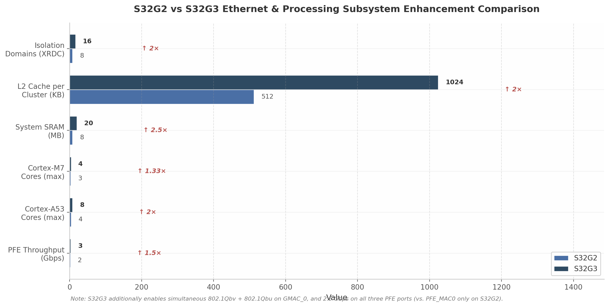

## 3. NXP S32 Ethernet模块架构深度分析

NXP S32系列处理器在汽车以太网架构中占据独特地位：S32G2/G3面向中央网关与服务导向架构（Service-Oriented Architecture, SOA），通过GMAC+PFE双引擎实现高吞吐路由与TSN确定性通信的分离；S32K3则面向域控制器与区域节点，采用EMAC/GMAC双IP策略在成本与性能之间提供梯度选择。两条产品线的Ethernet子系统设计理念截然不同，却又共享同一PHY生态体系，这种架构分层策略使NXP得以覆盖从车身域到中央计算平台的完整网络需求谱系。

### 3.1 S32G2/G3处理器Ethernet子系统

#### 3.1.1 双引擎架构：GMAC_0与PFE的分工设计

S32G2/G3的Ethernet子系统由两个在架构上相互独立的引擎组成：专用TSN端点GMAC_0与可编程包转发引擎PFE（Packet Forwarding Engine）。GMAC_0基于Synopsys DesignWare Ethernet MAC（DWMAC）5.10/5.20 IP，Linux内核中通过`dwmac-s32.c`平台适配层与标准`stmmac`驱动栈对接 [^255^]，其设计目标是提供具备完整TSN硬件能力（802.1Qbv/Qbu/AS-Rev）的高确定性以太网端点。PFE则是一个固件驱动的混合硬件-软件包处理器，核心功能是在无主机CPU干预的情况下完成L2/L3/L4层的高速分类、路由与桥接 [^235^]。这一双引擎架构的深层含义在于：GMAC_0负责与时间严格绑定的控制流量，PFE负责大吞吐量的数据平面转发，两者通过独立的AXI主接口接入系统互联，避免了流量类型混排导致的资源争用。

从系统拓扑视角审视，GMAC_0与PFE的分离还体现在时钟域与中断体系上。GMAC_0拥有独立的PTP硬件时间戳引擎，可在MII边界捕获64位时间戳 [^117^]；PFE则通过固件实现gPTP/802.1AS-Rev协议状态机，时间同步精度依赖固件调度而非纯硬件逻辑 [^53^]。这种"硬件精确+固件灵活"的组合使S32G既能满足亚微秒级时间同步需求，又能通过固件更新适配不断演进的TSN标准修订。

#### 3.1.2 GMAC_0规格：多速率与TSN硬件端点

GMAC_0作为Synopsys DWMAC第四代/第五代IP的实例化，在物理层接口与速率支持上具备高度灵活性。GMAC Subsystem Reference Manual明确列出其对MII（10/100 Mbps）、RMII（10/100 Mbps）、RGMII（100/1000 Mbps）的支持，同时通过内部GMII-to-SGMII桥接实现1000/2500 Mbps的SerDes连接 [^117^]。具体规格汇总如表1所示。

| 参数项 | 规格值 | 说明 |
| :--- | :--- | :--- |
| **核心IP** | Synopsys DWMAC 5.10/5.20 | 第四代/第五代GMAC [^255^] |
| **速率支持** | 10/100/1000/2500 Mbps | 实际速率取决于所选PHY接口 [^258^] |
| **PHY接口** | MII, RMII, RGMII, SGMII | SGMII通过SerDes实现2.5 Gbps [^117^] |
| **FIFO深度** | 20,480 Bytes（Tx/Rx各20 KB） | 吸收突发流量，缓解总线拥塞 [^255^] |
| **DMA接口** | AXI4 Master，64-bit数据/32-bit地址 | 支持Scatter-Gather与多通道 [^117^] |
| **PTP时间戳** | 64-bit，IEEE 1588-2002/2008 | MII边界wire-side捕获，支持one-step/two-step [^117^] |
| **TSN: 802.1Qbv** | 硬件TAS（Time-Aware Shaper） | Gate Control List驱动队列门控 [^117^] |
| **TSN: 802.1Qbu** | 硬件Frame Preemption | Express/Preemptable队列分类 [^117^] |
| **TSN: 802.1Qav** | 硬件CBS（Credit-Based Shaper） | AVB流量带宽保障 [^117^] |
| **TSN: 802.1AS-Rev** | 硬件gPTP时间同步 | 支持GrandMaster/Slave/Boundary Clock [^117^] |
| **卸载功能** | IP/TCP/UDP/ICMP校验和，TSO | L3/L4校验和全自动计算 [^255^] |
| **DMA通道** | 5 Tx + 5 Rx | 独立通道映射不同流量优先级 [^117^] |

*表1：S32G GMAC_0核心规格汇总*

表1揭示了一个关键设计权衡：GMAC_0的20 KB FIFO与5通道DMA在多队列TSN场景下具备充足的缓冲深度，可同时承载时间触发流量（TT traffic）与尽力而为流量（BE traffic）而不产生头阻塞（Head-of-Line Blocking）。RGMII接口在千兆模式下的典型时钟周期$T_{cyc}$为8 ns [^256^]，这意味着硬件TAS的门控切换必须在纳秒级精度内完成——这正是GMAC_0将Gate Control List（GCL）执行引擎固化在硬件中的根本原因。相比之下，若TAS调度依赖软件中断驱动，操作系统调度抖动将直接破坏802.1Qbv的确定性时隙保障。

#### 3.1.3 PFE架构：固件可编程的包转发引擎

PFE是S32G Ethernet子系统中区别于传统MCU MAC的最大差异化模块。其架构采用"专用硬件块+可编程固件"的混合范式：硬件提供线速DMA、包解析、表查找与缓冲区管理，固件则在内部Processing Engine（PE）上执行转发决策、状态维护与协议处理 [^235^]。PFE内部包含五大功能块：Host Interface（HIF）、Buffer Management Unit（BMU）、Traffic Management Unit（TMU）、Classification Processing Engine（CLASS PE）与Utility Processing Engine（UTIL PE） [^96^]。设备树显示PFE子系统被分配16 MB专用内存区域（`0x46000000–0x46ffffff`），并拥有独立的HIF、BMU与安全中断线 [^96^]，这表明PFE在SoC内部被视为一个半自治的网络处理器。

| 组件 | 数量/规格 | 功能描述 |
| :--- | :--- | :--- |
| **CLASS PE** | 8核 | 包解析与L2/L3/L4分类，线速Header Inspection [^235^] |
| **UTIL PE** | 2+核 | 复杂状态操作、IPsec代理、NAT会话管理、HSE交互 [^235^] |
| **TMU** | 8队列 / 2调度器 / 4整形器 | 出向QoS调度：WRR、DWRR、Strict Priority [^235^] |
| **BMU** | 双池（SRAM+DDR） | 包缓冲区分配/回收，支持内部SRAM与外部DDR分层 [^96^] |
| **HIF** | 多通道（hif0/hif1/hif2） | 与主机CPU的数据/控制通路，支持多核并行 [^96^] |
| **EMAC** | 3 × PFE_MAC（内置） | 支持10/100/1000/2500 Mbps，各EMAC独立PHY时钟域 [^96^] |
| **聚合吞吐** | 2 Gbps（S32G2）/ 3 Gbps（S32G3） | 64字节小包线速路由/桥接 [^235^][^53^] |

*表2：S32G PFE内部架构组件*

PFE的固件架构赋予了其独特的灵活性。NXP以二进制固件_blob形式提供`s32g_pfe_class.fw`与`s32g_pfe_util.fw`，在系统启动时由内核通过`request_firmware()`加载至PFE内部存储器 [^241^]。这种固件驱动模式意味着PFE的转发逻辑——包括L2桥接、L3路由、NAT、VLAN处理、IPsec流识别——均可通过固件更新迭代演进，无需硅片改版。然而，这也引入了供应链依赖：OEM的PFE功能边界实际上由NXP固件版本决定，而非纯粹由硬件寄存器定义。

从数据通路角度分析，PFE的CLASS PE执行"有状态分类"（Stateful Classification）的能力是其性能核心。当首包（first packet）到达时，CLASS PE解析L2/L3/L4头部并建立流表项；后续同流包可直接匹配硬件加速的流表，实现"Fast Path"零CPU干预转发 [^235^]。UTIL PE则处理需要维持会话状态或调用外部加速器的操作——典型场景为IPsec包触发后，UTIL PE将加解密任务代理至HSE（Hardware Security Engine），并在HSE返回后继续完成路由或桥接 [^235^]。TMU的8队列与多调度器架构使PFE可在出口侧实施精细的QoS策略，WRR（Weighted Round Robin）与DWRR（Deficit Weighted Round Robin）算法支持按字节级精度分配带宽，而非简单的包计数轮询 [^235^]。

#### 3.1.4 S32G3代际升级：吞吐量与TSN并发能力的跃迁

S32G3在保持与S32G2引脚兼容的前提下，对Ethernet子系统实施了多维度增强。图1以量化方式呈现了代际间的关键指标差异。

*图1：S32G2与S32G3 Ethernet及处理子系统关键指标对比*

图1中最具网络架构意义的改进并非CPU核心数的翻倍，而是三项Ethernet-specific升级：第一，PFE聚合吞吐量从2 Gbps提升至3 Gbps（64字节小包条件），增幅达50% [^235^][^53^]，这意味着S32G3可在维持线速的同时处理更复杂的分类规则或更多的并发流；第二，S32G3的全部三个PFE MAC端口均支持2.5 Gbps [^81^]，而S32G2仅PFE_MAC0可通过SerDes达到2.5 Gbps，其余两端口限制在1 Gbps——这一改变使S32G3可构建对称的多2.5G骨干网拓扑，避免单端口带宽瓶颈；第三，S32G3的GMAC_0可同时启用802.1Qbv（TAS）与802.1Qbu（Frame Preemption） [^81^]，而S32G2两者互斥。TAS与帧抢占的并发支持在控制论意义上至关重要：TAS提供周期级的宏观时隙调度，帧抢占则在时隙内部为最高优先级express traffic提供微秒级的中断-恢复机制，两者叠加可将最坏-case传输延迟进一步压缩。

### 3.2 S32K3 Ethernet模块

#### 3.2.1 双IP策略：EMAC与GMAC的差异化定位

S32K3系列在Ethernet IP选择上采取了与S32G截然不同的策略：不在片内集成复杂包处理器，而是提供两种独立的MAC IP——EMAC（10/100 Mbps）与GMAC（Gigabit）——由用户根据目标应用与成本约束选择。NXP官方文档将EMAC归类于Reference Manual第75章、GMAC归类于第76章 [^151^]，且NXP社区工程师确认EMAC为Synopsys IP [^214^]。S32K3xx Data Sheet Rev.14的订购信息以字母编码标识Ethernet能力：N=无Ethernet，E=100 Mbps EMAC（无SAI），G=1 Gbps GMAC+SAI，H=双1 Gbps GMAC+SAI [^18^]。这一编码体系直接反映了NXP以Ethernet能力作为产品差异化的核心维度。从架构演进视角看，S32K3 EMAC相较于前代S32K1的ENET模块实现了全面升级：发送/接收队列从1条增至2条，FIFO从2048字节扩展至8192字节，新增了硬件TSN特性、L3/L4层地址过滤与接收帧解析器——这些功能在S32K1上完全缺失 [^87^]。

| 特性 | EMAC（S32K344等） | GMAC（S32K388/389等） |
| :--- | :--- | :--- |
| **速率** | 10/100 Mbps + 200 Mbps MAC-to-MAC [^87^] | 10/100/1000 Mbps [^151^] |
| **PHY接口** | MII, RMII | MII, RMII, RGMII（3.3V限定） [^151^] |
| **TSN: 802.1Qbv** | 硬件TAS，2 Tx队列 [^87^] | 硬件TAS [^151^] |
| **TSN: 802.1Qbu/802.3br** | 硬件Frame Preemption [^87^] | 硬件Frame Preemption [^151^] |
| **FIFO** | 8192 Bytes Tx/Rx [^87^] | 未公开详细值 |
| **校验和卸载** | IPv4/IPv6/TCP/UDP/ICMP [^87^] | IPv4/IPv6/TCP/UDP/ICMP [^503^] |
| **VLAN处理** | Rx检测+删除，Tx插入/替换/删除 [^87^] | 完整VLAN Tag支持 |
| **1588时间戳** | 支持 [^87^] | 支持 [^151^] |
| **安全功能** | ECC保护，奇偶校验，超时检测 [^87^] | ECC保护，HSE-B协同 [^85^] |
| **实例数（顶级variant）** | 1（多数型号） | 2（S32K388/389） [^18^] |

*表3：S32K3 EMAC与GMAC核心特性对比*

表3清晰呈现了两种IP的能力梯度：EMAC面向100 Mbps车载以太网（100BASE-T1）主流应用，GMAC面向需要千兆骨干带宽的域控制器或网关。值得注意的是，EMAC不支持RGMII与SGMII，这意味着若需千兆连接，设计者必须选择搭载GMAC的S32K358/S32K388/S32K389型号，而不能在标准S32K344上通过外部接口升级实现。

#### 3.2.2 S32K3 EMAC细节：200 Mbps MAC-to-MAC与RMII时钟特殊要求

S32K3 EMAC在标准10/100 Mbps之外提供了一个独特的200 Mbps MAC-to-MAC模式 [^87^]。该模式通过精简的MII-Lite接口实现片内或板级MAC直连，绕过PHY层的编码开销与自动协商延迟，在100BASE-T1无法满足带宽需求的板级互联场景中提供低成本高速通道。WPI等技术文章确认此模式在S32K3事实表中被列为标准能力 [^213^]。然而，MAC-to-MAC模式仅适用于同一PCB上的MAC直连或经过短距离连接器的高速互联，无法替代标准PHY进行长距离车载电缆通信。

更为关键的是，S32K3 EMAC存在一个显著的时钟配置特殊要求：即使在标准RMII模式下（外部PHY提供50 MHz REF_CLK），EMAC的`MII_RX_CLK`输入仍必须配置为25 MHz [^214^]。NXP工程师解释此约束源自IP提供商（Synopsys）的硬性规定——EMAC内部逻辑始终期望25 MHz（100 Mbps模式）或2.5 MHz（10 Mbps模式）的接收时钟，与RMII的50 MHz REF_CLK无关 [^214^]。设计者在时钟树规划中必须预留分频器，将外部50 MHz RMII时钟二分频后馈入`MII_RX_CLK`，否则将导致数据异常 [^216^]。这一非标准时钟需求增加了PCB时钟分配网络的复杂度，也限制了某些低成本时钟发生器的直接适用性。

#### 3.2.3 硬件TSN支持：802.1Qbv与802.1Qbu/802.3br

S32K3内部EMAC/GMAC在硬件层面支持IEEE 802.1Qbv时间感知调度器（Time-Aware Shaper, TAS）与IEEE 802.1Qbu/802.3br帧抢占（Frame Preemption） [^87^]。与S32G GMAC_0相比，S32K3 EMAC的TSN实现更为精简：其仅配置2个发送队列与2个接收队列用于TSN调度 [^87^]，而S32G GMAC_0拥有5通道DMA与更深的FIFO。这种精简源于S32K3的目标应用场景——区域节点通常只需区分高优先级控制流量与普通数据流量，无需中央网关级别的多类别QoS分层。

在帧抢占实现上，S32K3 EMAC遵循802.1Qbu标准将发送队列划分为express（不可抢占）与preemptable（可中断）两类。当express队列中存在待发帧时，硬件可在当前preemptable帧的传输间隙插入express帧，从而降低关键控制报文的最坏-case排队延迟 [^87^]。这一机制在S32K3上由硬件自动完成，无需软件介入帧片段化与重组，确保了抢占过程的确定性时序。然而，S32K3 EMAC的TSN能力止步于端点（Endpoint）功能——即对单端口出向流量进行整形与抢占——不具备多端口交换级TSN调度能力，后者必须依赖外部SJA1110B Switch实现。

#### 3.2.4 外部TSN扩展：SJA1110B Switch的桥接角色

S32K3的内部EMAC/GMAC仅提供单端口（或双端口）TSN端点能力，多端口TSN交换、流过滤与帧复制消除必须依赖外部器件。NXP官方参考设计S32K3-T-BOX RDB中采用SJA1110B作为外部TSN Switch，通过RMII与S32K3互联 [^212^]。SJA1110B集成了5路100BASE-T1（车载以太网）、1路100BASE-TX（RJ45）与1路SGMII（SABRE连接器），并内置Arm Cortex-M7内核实现可编程Switch固件 [^212^]。从系统架构角度，SJA1110B的引入使S32K3从"单端口TSN节点"升级为"多端口TSN网关"，但两者的时钟域、TSN调度表与gPTP状态机需要跨芯片协同，增加了系统级集成复杂度。

SJA1110在TSN协议支持上的深度超越了S32K3内部MAC：其硬件支持802.1AS-2020、802.1Qav（信用整形器）、802.1Qbv（时间感知整形器，最多256条调度项，25 byte-time粒度）、802.1Qci（每流过滤/管制，最多1024条流）以及802.1CB（帧复制/消除） [^99^]。值得注意的是，SJA1110的802.1Qbv实现拥有256项GCL，而S32K3内部EMAC的GCL深度未在公开文档中明确——这暗示在多端口复杂调度场景下，SJA1110可能比内部MAC更适合担任TSN调度主节点。此外，SJA1110已通过AVnu认证且达到ASIL-B功能安全等级 [^217^]，但低于S32K3本身的ASIL-D能力，这意味着在最高安全完整性等级的通信路径中，需通过系统级冗余或安全监控机制弥补Switch的安全等级差距。

### 3.3 NXP Ethernet PHY生态系统

汽车以太网PHY与Switch的选型直接决定了MAC端口的物理层能力与拓扑扩展性。NXP围绕S32系列构建了从百兆到千兆、从单端口到多端口交换的完整PHY生态，表4汇总了核心器件的规格。

| 器件 | 类型 | 速率 | MAC接口 | 关键特性 | 安全等级 |
| :--- | :--- | :--- | :--- | :--- | :--- |
| **TJA1103** | 100BASE-T1 PHY | 100 Mbps | MII/RMII/RGMII（A版）; SGMII（B版） [^60^] | IEEE 1588v2/802.1AS-Rev 2步时间戳，OPEN Alliance TC-10睡眠/唤醒，rev-RMII模式（PHY产生50 MHz REF_CLK） [^60^] | ASIL-B |
| **TJA1120** | 1000BASE-T1 PHY | 1000 Mbps | RGMII, SGMII [^217^] | 千兆车载以太网，SABRE评估板支持 [^154^] | ASIL-B |
| **SJA1110** | TSN Switch | 100M/1G混合 | RMII/RGMII/SGMII上行 | 5×100BASE-T1 + 1×100BASE-TX + SGMII，集成Cortex-M7，AVnu认证，802.1Qbv（256 GCL项）/802.1Qci/802.1CB硬件支持 [^99^][^217^] | ASIL-B |

*表4：NXP S32系列核心Ethernet PHY与Switch生态*

TJA1103的rev-RMII模式对S32K3设计具有特殊价值：在该模式下，PHY自身生成50 MHz REF_CLK供MAC使用，解决了部分场景下MAC侧时钟源不足的布线问题 [^60^]。这与S32K3 EMAC的25 MHz `MII_RX_CLK`要求结合时，设计者需确保时钟分频链路的抖动容限满足EMAC内部逻辑需求。TJA1120作为NXP当前唯一的千兆车载以太网PHY（1000BASE-T1），填补了S32K3 GMAC与S32G PFE在千兆单对双绞线物理层的空白，其ASIL-B等级与S32G/S32K3的ASIL-D形成互补，在系统级安全分析中需将PHY纳入故障模式考量。

SJA1110的Cortex-M7内核使其不仅仅是一个固定功能交换芯片，而是一个可编程网络节点。其启动模式支持外部Flash（NVM Boot）或S32K3通过SPI_HOST加载固件（SDL Boot），当外部Flash无有效固件时自动切换至SDL模式 [^212^]。这一设计使OEM可通过更新SJA1110固件增加新的TSN功能或修补协议漏洞，但同样意味着Switch的行为依赖于NXP固件生命周期支持。从拓扑设计角度，SJA1110靠近连接器放置可减少车载以太网差分对（100BASE-T1）在PCB上的走线长度，降低EMC风险，这是将Switch外置于MCU而非全集成的重要工程优势。

### 3.4 硬件卸载与安全

#### 3.4.1 PFE卸载能力：从校验和到状态防火墙

PFE的卸载范畴远超传统MAC的L3/L4校验和计算。NXP S32G2 Product Brief明确列出PFE可在数据平面自主处理"Forwarding, NAT, VLAN, L2 bridge, IPsec and QoS" [^55^]，其底层机制是PFE固件在CLASS PE与UTIL PE上实现的流表驱动Fast Path。具体而言，PFE可执行以下卸载：L2/L3/L4包分类（基于MAC、VLAN、IP地址、协议类型、端口号的组合匹配）、NAT头部改写（源/目的IP与端口号替换）、IPSec AH/ESP协议识别与HSE代理、状态防火墙（Stateful Firewall）会话跟踪、以及入向/出向QoS策略（流计量、队列映射、优先级标记） [^314^][^375^]。

状态防火墙是PFE区别于普通L2/L3交换引擎的高级能力。与无状态包过滤（Stateless Filtering）仅依据静态ACL规则丢弃报文不同，PFE的状态防火墙可跟踪TCP会话的三次握手状态与UDP伪会话生命周期，仅允许已建立连接的回包通过 [^375^]。这种能力在中央网关场景中至关重要：当车辆通过TCU（Telematics Control Unit）连接外部网络时，PFE可在硬件层面阻断未经请求的入向连接，将DoS攻击流量消化在Fast Path内，避免其冲击主机CPU。S32G PFE Demo文档进一步展示了通过FCI（Flexible Communication Interface）API动态配置灵活路由器、灵活解析器、L2L3 VLAN桥接、NAT、端口镜像与出入QoS规则的能力 [^482^]，这验证了PFE固件的可编程性并非仅限于NXP预定义功能集。

#### 3.4.2 HSE安全引擎：与PFE的协同安全通信

Hardware Security Engine（HSE）是S32G与S32K3共有的独立安全子系统，在物理与逻辑上与主CPU隔离，作为整个SoC的信任根（Root of Trust）运行 [^372^]。HSE的首要职责是安全启动链：上电后HSE从内部ROM执行首段代码，逐阶段验证后续Bootloader与操作系统镜像的数字签名，确保仅可信代码得以运行 [^372^]。在网络安全语境下，HSE与PFE形成"分类-加密"流水线：PFE的UTIL PE识别出属于IPSec安全关联（Security Association, SA）的数据包后，通过高速内部接口将包转发至HSE；HSE执行AES-GCM、AES-CCM或SHA-256等密码运算后，将处理完的包返回PFE继续路由 [^314^][^372^]。整个过程中明文数据与密钥不暴露于主CPU内存空间，实现了"Bump-in-the-Wire"级别的安全隔离。

HSE固件明确支持AUTOSAR SecOC（Secure Onboard Communication）所需的AES-CMAC消息认证码生成与验证 [^372^]，这与PFE的流量分类能力结合后，可在网关处实现SecOC PDU级安全加速：PFE识别特定CAN/Ethernet路由路径上的SecOC流量，HSE执行Freshness Value验证与CMAC计算，双方协同完成AUTOSAR标准要求的端到端安全通信。S32G的HSE Product Brief还提及"Network services"为SSL/TLS提供组合密码/哈希加速 [^372^]，这意味着HSE不仅服务于传统的IPsec VPN场景，也可为SOA架构中的HTTPS服务通信提供密码学卸载。

#### 3.4.3 GMAC卸载：标准协议加速与时间戳

相较于PFE的L2-L4全栈卸载，GMAC_0的卸载能力聚焦于标准以太网端点所需的协议加速。其核心包括：IPv4/IPv6头部校验和、TCP/UDP/ICMP载荷校验和的自动生成与验证 [^255^]；TCP Segmentation Offload（TSO），允许协议栈向GMAC提交最大64 KB的超大缓冲区，由硬件切分为MTU尺寸段并自动生成各段头部 [^117^]；以及IEEE 1588 PTP硬件时间戳（含one-step自动修正域插入与two-step时间戳回传） [^117^]。这些卸载功能通过`stmmac`驱动栈对Linux网络子系统透明启用，应用程序无需修改即可获得硬件加速收益。

 GMAC_0的DMA引擎通过AXI4主接口以64位数据宽度访问系统内存，支持最多5个独立发送与接收DMA通道，每个通道可映射至不同优先级的系统内存区域 [^117^]。这种多通道架构在TSN应用中的价值在于：高优先级TSN队列可绑定至低延迟的SRAM缓冲区，而普通流量使用DDR缓冲区，通过物理内存分层实现流量隔离。此外，GMAC的AXI主接口支持AxQOS信号注入 [^117^]，使其DMA事务可携带4位QoS标识参与系统互联仲裁，确保高优先级以太网数据在通往内存控制器的路径中不会被低优先级总线主设备（如DMA外设或图形加速器）阻塞。

将GMAC_0与PFE的卸载能力并置对比，可清晰看出NXP的架构设计意图：GMAC_0承担"精确端点"角色，提供亚微秒级TSN确定性与标准协议卸载；PFE承担"高性能转发面"角色，提供多Gbps吞吐量的L2-L4包处理与网络安全卸载。两者不存在功能重叠，而是形成互补——这一设计哲学与将Bridge+TSN+MACsec全部集成于单一MAC模块的TC4x方案形成鲜明对比，也决定了S32G在SOA中央网关场景中的独特优势：通过固件更新持续扩展网络功能，而非受限于硅片固化逻辑。
