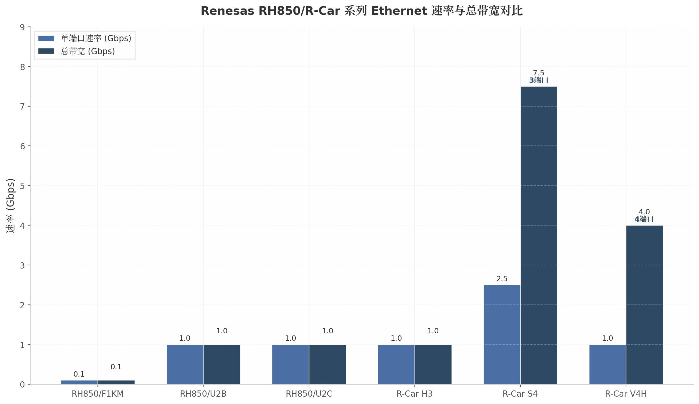
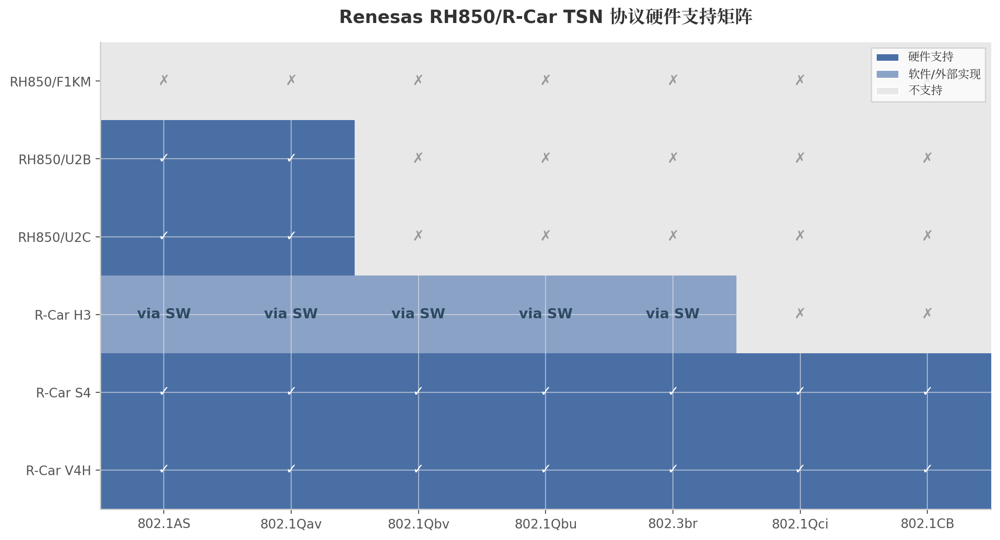

Renesas的Ethernet模块架构呈现出鲜明的两级分化：RH850 MCU家族以传统车身/舒适域控制为目标，提供从10/100Mbps基础MAC到1Gbps TSN端点的渐进式扩展；R-Car MPU/SoC家族则面向车载信息娱乐、中央网关和ADAS/自动驾驶域，提供AVB 1.0兼容MAC乃至完整集成TSN Switch的高级网络方案。这种分化反映了Renesas对汽车E/E架构演进的判断——MCU聚焦确定性实时控制，MPU承担高带宽网络枢纽与计算密集型任务。本章将逐层解析RH850与R-Car的Ethernet硬件架构差异、TSN协议支持边界以及Renesas独有的AVB感知与开源生态优势。

上图展示了Renesas产品线从RH850/F1KM的100Mbps单端口到R-Car S4的3端口7.5Gbps总带宽的跨度。R-Car V4H虽然单端口速率保持在1Gbps，但4端口设计使其总带宽达到4Gbps，满足ADAS域多摄像头/雷达传感器的并发数据接入需求。

## 4.1 RH850 MCU Ethernet能力

### 4.1.1 F1KM/F1KH系列：基础EtherMAC架构

RH850/F1KM与F1KH系列是Renesas面向汽车车身电子应用的主力MCU，其集成的EtherMAC控制器提供10/100Mbps Fast Ethernet能力[^2^]。该模块通过RMII（Reduced Media Independent Interface，精简媒体独立接口）或MII（Media Independent Interface，媒体独立接口）与外部PHY（Physical Layer，物理层）芯片连接，其中RMII采用50MHz参考时钟、仅需8–9根信号线（TX_EN、TXD[1:0]、RXD[1:0]、CRS_DV、REF_CLK、MDC/MDIO），在引脚受限的车身ECU中更具优势；MII则使用25MHz时钟、4位并行数据路径（TXD[3:0]、RXD[3:0]），兼容更广泛的 legacy PHY 生态[^1^][^20^]。F1KM-S4产品页明确将其定位为"single-chip microcontrollers designed for automotive electrical body applications"[^2^]，即车身电器应用的单芯片微控制器，这意味着Ethernet在此类器件中的角色并非主干通信接口，而是诊断（DoIP，Diagnostic over IP）和OTA（Over-the-Air）刷写的辅助通道。从公开资料来看，F1KM/F1KH系列未声明任何TSN（Time-Sensitive Networking，时间敏感网络）或AVB（Audio Video Bridging，音视频桥接）硬件加速能力，其EtherMAC仅支持标准IEEE 802.3帧收发，不包含信用整形器（Credit-Based Shaper）、时间感知整形器（Time-Aware Shaper）或帧抢占（Frame Preemption）等TSN核心硬件模块。

RH850/P1M-C系列作为面向车身域控制器、底盘和安全应用的高端MCU，最高运行频率160MHz，虽然产品页列出其具备Ethernet接口[^7^]，但公开文档未披露该系列EtherMAC的具体速率或TSN能力。基于Renesas的产品定位逻辑推断，P1M-C的Ethernet模块大概率与F1KM处于同一技术世代，即以100Mbps速率服务诊断/刷写需求，而非承担实时音视频或传感器数据流的主干传输任务。

### 4.1.2 U2B/U2C系列升级：千兆TSN与10BASE-T1S

RH850/U2B是Renesas跨域MCU系列的以太网能力分水岭。该系列集成了千兆以太网TSN控制器（ETN，Ethernet TSN），明确支持TSN功能，用于处理汽车以太网实时通信需求[^3^]。官方应用笔记R01AN7074EJ0100详细描述了U2B的Gigabit Ethernet通信架构，涵盖MFWDA（Multi-Frame Window DMA Access）、GWCAA（Gigabit Window Controlled AXI Access）、ETHAA（Ethernet Application Accelerator）、RMAC（Reduced MAC）系统和SGMII接口[^4^]。U2B通过SGMII（Serial Gigabit Media Independent Interface，串行千兆媒体独立接口）和BroadR-Reach接口连接Gigabit PHY[^21^]，这标志着RH850家族从引脚密集型的MII/RMII演进到了高速串行接口。

RH850/U2C作为最新一代28nm汽车MCU，将U2B的以太网能力进一步扩展：官方新闻稿明确列出其支持"Ethernet 10base-T1S, Ethernet TSN (1Gbps/100Mbps), CAN-XL"[^5^][^6^]。10BASE-T1S（IEEE 802.3cg）是车载多点总线拓扑的关键技术，支持多点总线（Multi-Drop）连接，允许通过单根双绞线以10Mbps半双工模式挂接最多8个节点，极大降低了线束成本和重量。U2C对10BASE-T1S的原生支持使其在Zonal（区域化）E/E架构中具备直接连接低成本传感器网络的能力，而无需外部10BASE-T1S PHY之外的附加控制器。U2C还具备四个最高320MHz的RH850内核、双核lock-step结构、ISO 26262 ASIL D功能安全和ISO/SAE 21434（EVITA Full）网络安全认证[^6^]，这表明其 Ethernet TSN 模块的设计同样遵循了最高等级的功能安全与信息安全标准。

| 特性 | RH850/F1KM | RH850/U2B | RH850/U2C | RH850/P1M-C |
|------|-----------|-----------|-----------|--------------|
| 最大速率 | 100Mbps [^1^] | 1Gbps [^3^] | 1Gbps/100Mbps [^5^] | 未公开（~100Mbps）[^7^] |
| MAC类型 | EtherMAC | ETN (TSN) | ETN (TSN) | EtherMAC |
| PHY接口 | MII/RMII [^20^] | SGMII/BroadR-Reach [^21^] | SGMII/BroadR-Reach | MII/RMII |
| 10BASE-T1S | 不支持 | 不支持 | **支持** [^5^] | 不支持 |
| 802.1AS (gPTP) | 不支持 | 支持 [^3^] | 支持 | 不支持 |
| 802.1Qav (CBS) | 不支持 | 支持 [^3^] | 支持 | 不支持 |
| 802.1Qbv (TAS) | 不支持 | 不支持 | 不支持 | 不支持 |
| 硬件时间戳 | 不支持 | 支持 | 支持 | 不支持 |
| 目标应用 | 车身ECU | 跨域控制 | 区域/域控制器 | 车身域控制器 |
| 功能安全 | ASIL B–D | ASIL D | ASIL D | ASIL D |

上表清晰呈现了RH850家族内部Ethernet能力的代际跃迁。从F1KM到U2B的跨越不仅体现在速率从100Mbps提升至1Gbps，更关键的是引入了TSN硬件支持（802.1AS时间同步与802.1Qav信用整形），使U2B/U2C具备了承载确定性实时数据流的能力。然而，即使在最先进的U2C中，802.1Qbv（Time-Aware Shaper，时间感知整形器）、802.1Qbu（Frame Preemption，帧抢占）等更复杂的TSN调度功能仍未集成，这表明RH850 MCU系列的TSN定位是"基础端点"（Basic Endpoint），而非全功能TSN节点。U2C的10BASE-T1S支持是其独特亮点，对于需要在区域控制器中直接接入低成本传感器总线的设计极具吸引力。

### 4.1.3 EtherTSU：IEEE 1588 PTP硬件时间戳支持

EtherTSU（Ethernet Time Stamp Unit，以太网时间戳单元）是Renesas实现精确时间同步的关键硬件模块。尽管F1KM/F1KH系列未集成该单元，但从U2B开始，EtherTSU为PTP（Precision Time Protocol，精确时间协议）/gPTP（generalized PTP，通用精确时间协议）操作提供硬件级时间戳捕获能力[^4^]。EtherTSU的工作原理是在MAC层对收发帧进行时间戳标记：当帧的SFD（Start Frame Delimiter，帧起始定界符）到达发送或接收接口时，EtherTSU捕获当前系统时钟的纳秒级值，并将其附加到DMA描述符或专用时间戳寄存器中。这一机制消除了软件中断处理的抖动误差，将时间同步精度从毫秒级（纯软件方案）提升至亚微秒级。

对于需要gPTP（IEEE 802.1AS）时间同步的车身域或跨域MCU应用，EtherTSU的存在意味着U2B/U2C可以作为时间同步域中的从节点（Slave）或对等透明时钟（P2P Transparent Clock），与车载主干网络中的主时钟（Grandmaster）保持同步。需要注意的是，RH850系列并未公开支持完整的Boundary Clock（边界时钟）或多端口Transparent Clock架构，其PTP能力更适合作为端点时钟（Ordinary Clock）运行，这与RH850作为终端控制节点的产品定位一致。

### 4.1.4 RH850定位：诊断与刷写接口，非主干总线

综合以上分析，RH850 MCU家族的Ethernet模块在汽车网络中的角色可以被精确定义：它是传统Body/Comfort（车身/舒适）域MCU上的诊断和固件更新接口，而非承担主通信总线职责。CAN和CAN-FD仍然是RH850控制应用的主干通信协议，Ethernet仅在需要高速诊断通道（如DoIP协议定义的ISO 13400）或OTA刷写时启用。Renesas的产品策略也印证了这一判断——所有RH850公开参考设计和应用笔记中，Ethernet章节均与"diagnostic communication"和"flash programming"紧密关联，而非像R-Car那样将Ethernet作为"AVB/TSN backbone"（AVB/TSN主干）来营销。

这种定位并非技术落后，而是对车身域需求的务实响应。车身ECU的实时控制循环通常在10–100ms级别，CAN-FD的2–5Mbps已足以满足；Ethernet的引入更多是为了满足现代车辆诊断规范和OTA更新对带宽的需求。U2B/U2C的TSN升级则是面向Zonal架构演进的前瞻布局，当区域控制器需要与中央计算单元进行确定性数据交换时，U2B/U2C的1Gbps TSN能力提供了从传统车身域向新一代E/E架构平滑过渡的桥梁。

## 4.2 R-Car系列MPU Ethernet架构

### 4.2.1 R-Car H3/H3e：AVB 1.0 MAC与外部R-Switch2扩展

R-Car H3是Renesas Gen3代MPU的旗舰产品，其内置的EtherAVB MAC明确声明为"Ethernet AVB 1.0-compatible"[^8^]。该MAC通过RGMII（Reduced Gigabit Media Independent Interface，精简千兆媒体独立接口）接口连接外部PHY，支持1Gbps全双工通信，并在硬件层面实现了IEEE 802.1BA（AVB系统配置）、IEEE 802.1AS（gPTP时间同步）、IEEE 802.1Qav（AVB信用整形）和IEEE 1722（AVTP音视频传输协议）标准[^8^]。H3的EtherAVB架构还包含专用的2.5V电源域[^9^]，为AVB PHY提供稳定的模拟供电。R-Car H3e（R8A779M0）及H3e-2G变体继承了相同的AVB MAC能力[^10^][^11^]，其中H3e-2G将CPU性能提升至2GHz四核Cortex-A57，但Ethernet架构未发生本质变化。

H3的AVB 1.0 MAC设计体现了Renesas对车载信息娱乐（IVI，In-Vehicle Infotainment）和集成座舱（Integrated Cockpit）市场的深度理解。802.1Qav的硬件信用整形器确保AVB Class A（2ms延迟预算）和Class B（50ms延迟预算）音视频流不会受到背景流量（如文件传输、系统日志）的干扰。EtherAVB还具备"reception filtering"（接收过滤）能力，可基于流标识符将来自不同Talker（发送端）的音视频流分离到独立缓冲区[^4^]，这对多路摄像头输入或分布式音响系统至关重要。

然而，H3的TSN能力存在明确边界。作为AVB 1.0时代的产物，H3原生MAC不支持802.1Qbv（TAS）、802.1Qbu（Frame Preemption）和802.1CB（Frame Replication）等后续TSN标准。若需在H3平台上实现完整的TSN Switch功能，必须外接R-Switch2芯片[^28^]。Renesas官方博客介绍的Vehicle Computer 3（VC3）概念验证板即采用"R-Car H3 SoC + R-Switch2 TSN以太网交换机"的组合，通过R-Switch2提供802.1Qbv时间感知整形和802.1Qbu/802.3br帧抢占[^29^]。这种SoC+外部Switch的架构灵活性较高——R-Switch2可放置于PCB边缘靠近连接器的位置，优化信号完整性；但代价是BOM成本增加和供应链复杂度上升。

### 4.2.2 R-Car S4（Gen4）：3端口集成TSN Switch

R-Car S4标志着Renesas以太网架构的重大跃迁。作为Gen4代中央网关（Central Gateway）MPU，S4集成了3端口2.5Gbps Ethernet TSN Switch（即RSwitch2 IP的片内实现）[^12^]，每端口最高支持2.5Gbps速率，并具备Layer 2/3交换能力[^12^]。这一集成度在当时的汽车MPU市场中处于领先地位。S4的TSN Switch已通过Spirent C1测试系统的TSN一致性验证[^27^]，确保了与标准协议的严格兼容。

S4的PHY接口同样保持RGMII[^22^]，但协议支持范围显著扩展：涵盖10BASE-T1S、100BASE-T1、1000BASE-T1、1000BASE-RH（光学）和2.5GBASE-T1[^13^]。这意味着S4可作为中央网关同时连接低速传感器总线（10BASE-T1S）、传统车载以太网（100BASE-T1/1000BASE-T1）和高速骨干链路（2.5GBASE-T1/光学）。在处理器架构上，S4配置了八个1.2GHz Cortex-A55应用核心、一个1.0GHz Cortex-R52实时核心以及RH850 G4MH lock-step核心，并集成8MB内部SRAM用于低延迟代码执行[^14^]，这种异构多核设计使其既能运行Linux网关协议栈，又能执行硬实时任务。

| 特性 | R-Car H3 | R-Car H3e-2G | R-Car S4 | R-Car V4H |
|------|----------|--------------|----------|-----------|
| 世代 | Gen3 | Gen3 | Gen4 | Gen4 |
| 最大端口速率 | 1Gbps [^8^] | 1Gbps [^11^] | **2.5Gbps** [^12^] | 1Gbps [^16^] |
| Ethernet端口数 | 1 | 1 | **3端口集成Switch** [^12^] | 4 [^16^] |
| PHY接口 | RGMII [^22^] | RGMII | RGMII | RGMII (4x) [^23^] |
| AVB 1.0 MAC | EtherAVB [^8^] | EtherAVB | TSN Switch | TSN End-station |
| 802.1AS/AS-rev | 支持 [^8^] | 支持 | **支持 (rev)** [^26^] | **支持 (rev)** [^19^] |
| 802.1Qav (CBS) | 硬件支持 [^8^] | 硬件支持 | 硬件支持 [^26^] | 硬件支持 [^15^] |
| 802.1Qbv (TAS) | 需R-Switch2 [^28^] | 需R-Switch2 | **硬件集成** [^26^] | **硬件集成** [^15^] |
| 802.1Qbu (FP) | 需R-Switch2 [^28^] | 需R-Switch2 | **硬件集成** [^26^] | **硬件集成** [^15^] |
| 802.1Qci (PSFP) | 不支持 | 不支持 | **支持** [^26^] | **支持** [^15^] |
| 802.1CB (FRER) | 不支持 | 不支持 | **支持** [^26^] | **支持** [^15^] |
| Layer 2/3交换 | 不支持 | 不支持 | **硬件支持** [^12^] | 不支持 |
| 目标应用 | IVI/座舱 | IVI/座舱 | 中央网关 | ADAS/自动驾驶 |
| 功能安全 | ASIL B | ASIL B | ASIL D | ASIL D |

上表揭示了Renesas R-Car系列从Gen3到Gen4的架构升级路径。H3/H3e作为IVI域处理器，以单端口AVB 1.0 MAC满足座舱内音视频流传输需求；而S4和V4H则分别面向中央网关和ADAS域，前者通过集成TSN Switch提供网络级交换和路由能力，后者通过多端口设计（4x RGMII）满足传感器数据汇聚需求。值得注意的是，S4是Renesas产品线中唯一在片内集成Layer 2/3交换功能的器件，这一特性使其在中央计算架构中可直接充当网络中枢，无需外部Switch芯片。

### 4.2.3 R-Car V4H：多端口TSN端站与ADAS适配

R-Car V4H面向ADAS（Advanced Driver Assistance Systems，高级驾驶辅助系统）和自动驾驶应用，其Ethernet架构围绕"TSN End-station"（TSN端站）定位展开。V4H提供4个RGMII接口[^23^]，每个接口支持1Gbps全双工通信[^15^]，总带宽达4Gbps。这种多端口设计并非用于Layer 2/3交换（V4H无集成Switch），而是为同时接入多个高分辨率摄像头、毫米波雷达和激光雷达传感器提供独立的Ethernet管道。Linux内核从6.11版本开始引入`rtsn`驱动（Renesas Ethernet-TSN End-station driver），为V4H提供上游支持[^17^]。

V4H的TSN端站能力包括硬件时间戳、RX校验和卸载（checksum offload）以及对IEEE 802.1AS-rev（gPTP最新修订版）的支持[^15^][^19^]。作为ADAS域处理器，V4H的Ethernet模块需要与ISP（Image Signal Processor，图像信号处理器）和深度学习加速器紧密协同——传感器原始数据通过Ethernet到达后，经DMA直接进入ISP或DDR内存，避免CPU介入数据搬运。V4H的4x RGMII架构可独立配置为TSN Talker（如将处理后的感知数据发送至中央域控制器）或Listener（接收原始传感器数据流），每个端口可独立启用或禁用TSN调度策略。

### 4.2.4 集成TSN Switch规格：协议完整性与虚拟化

R-Car S4的集成TSN Switch（RSwitch2 IP）在协议覆盖度上达到了Renesas产品线的顶峰。硬件层面支持IEEE 802.1AS-rev（时间同步修订版）、802.1Qav（信用整形）、802.1Qbv（时间感知调度）、802.1Qbu/802.3br（帧抢占/交错式快速报文）、802.1Qci（逐流过滤与监管，Per-Stream Filtering and Policing）以及802.1CB（帧复制与消除，Frame Replication and Elimination for Reliability）[^26^]。这一协议矩阵几乎覆盖了当前汽车TSN应用所需的全部标准化功能。

从架构实现角度看，S4的TSN Switch采用硬件加速的转发引擎，支持基于MAC地址的Layer 2交换和基于IP地址的Layer 3路由[^12^]。对于时间同步，RSwitch2不仅充当gPTP桥接（Bridge/Relay Instance），还支持双PHC（PTP Hardware Clock，PTP硬件时钟）架构[^662^]。双PHC的设计允许系统同时维护两个独立的时间域（Time Domain），例如一个域用于ADAS传感器同步，另一个域用于信息娱乐音视频同步，两个域之间通过软件配置实现时钟隔离或映射。在虚拟化环境中，dom0（特权域）可直接访问PHC进行时钟同步，而domU（非特权域）通过Xen IO环以只读方式访问虚拟PHC（vPHC）[^662^]。这种设计对采用Hypervisor架构的软件定义汽车（SDV）平台至关重要，确保了不同虚拟机之间的时间同步既安全又高效。

上图以可视化方式呈现了各型号对核心TSN标准的硬件支持差异。Gen3的H3系列在TSN协议支持上存在明显缺口，需依赖外部R-Switch2或软件实现来补齐；而Gen4的S4和V4H则实现了完整覆盖，其中S4因集成Switch还额外具备Layer 2/3交换能力。RH850 U2B/U2C仅支持802.1AS和802.1Qav两项基础TSN功能，对于需要严格时间调度的应用场景，其能力边界需要设计者格外关注。

## 4.3 Renesas独特功能

### 4.3.1 AVB硬件意识：IEEE 1722 AVTP感知与Talker/Listener辅助

Renesas R-Car系列在AVB实现上有一项区别于竞品的特性：部分型号在硬件层面声明了对IEEE 1722 AVTP（Audio Video Transport Protocol，音视频传输协议）的支持。R-Car E2用户手册明确列出其Ethernet AVB模块"Supports IEEE802.1BA, IEEE802.1AS, IEEE802.1Qav and IEEE1722 functions"[^3^]，Gen3的H3/M3产品页也强调"Reception Filtering to separate streaming frames from different sources"[^4^]。在Linux内核的`ravb`（Renesas AVB driver）代码中，驱动通过`gptp=1`标志位识别AVB-DMAC的gPTP支持能力，并通过扩展RX描述符携带硬件时间戳元数据[^19^][^20^]。

需要客观指出的是，行业内的AVTP实现方式存在技术分歧。AVTP帧本质上是以太网帧载荷中的封装协议，其打包/解包（packetization/depacketization）过程在所有汽车MCU/MPU上均以软件为主——NXP社区论坛中NXP工程师明确指出"HW doesn't support 1722 frame offload, just think it is normal vlan frame"[^7^]。Renesas R-Car的独特之处不在于AVTP的完全硬件卸载，而在于AVB-DMAC的设计具备"AVTP感知"（AVTP-awareness）：硬件可以识别AVB流的VLAN标签和PCP（Priority Code Point，优先级代码点），并通过专用DMA通道将AVTP流与普通网络流量分离。Linux `ravb`驱动维护了一个硬件时间戳列表，用于将发送的PTP帧与其传输时间戳相关联[^20^]，这对AVB Talker的presentation time（呈现时间）生成至关重要。

从Talker/Listener角色实现角度分析，R-Car Gen3的EtherAVB MAC同时支持两种角色的硬件辅助：Talker侧通过TX队列的信用整形器确保AVB Class A/B流量获得预留带宽；Listener侧通过RX流过滤器和扩展描述符实现多路AVTP流的并行接收与时间戳标记。CETITEC等第三方AVB栈供应商已基于R-Car H2/E2平台实现完整的AVB参考信息娱乐系统，验证了Renesas硬件在AVB生态中的成熟度[^31^]。

| 独特功能 | 实现型号 | 技术细节 | 竞争优势 |
|---------|--------|--------|---------|
| IEEE 1722 AVTP感知 | R-Car Gen3 (H3/M3/E2) [^3^] | AVB-DMAC支持AVTP流识别与RX分离 | MAC层具备AVB流感知，减少CPU过滤开销 |
| 双PHC虚拟化 | R-Car S4 [^662^] | 两个独立PHC支持多时间域 | dom0/domU Xen虚拟化场景下时间隔离 |
| 集成TSN Switch | R-Car S4 [^12^] | 3端口2.5Gbps Layer 2/3交换 | 省去外部Switch，降低网关BOM复杂度 |
| 防火墙IP | R-Car S4 [^35^] | Region ID + SPID访问保护 | 多VM环境网络流量隔离 |
| IDS/IPS参考软件 | R-Car S4 Starter Kit [^36^] | 入侵检测/防护参考实现 | 加速安全网关软件开发 |
| Linux主线驱动 | R-Car全系列 [^19^][^17^] | ravb/rtsn上游内核驱动 | 开源生态最成熟，社区维护活跃 |
| 10BASE-T1S原生支持 | RH850/U2C [^5^] | MAC层直接支持802.3cg | MCU级别接入低成本传感器总线 |

上表汇总了Renesas在车载Ethernet领域的差异化能力。其中R-Car S4的双PHC虚拟化与集成TSN Switch组合，在中央计算平台的Hypervisor场景下具有显著架构优势；而RH850/U2C的10BASE-T1S原生支持则是MCU级别独有的低成本传感器网络接入方案。

### 4.3.2 防火墙IP与IDS/IPS：安全网关硬件基础

R-Car S4的网络安全架构是其作为中央网关处理器的核心差异化要素。S4集成多个HSM（Hardware Security Module，硬件安全模块）实例，支持安全启动（Secure Boot）、加密和认证功能[^35^]。在访问控制层面，S4实现了"Freedom from Interference"（FFI，免于干扰）机制，通过Region ID（区域标识）和SPID（System Peripheral ID，系统外设标识）进行硬件级访问保护[^35^]。这意味着不同安全域或虚拟机对Ethernet DMA和寄存器的访问可被硬件强制隔离，即使某个域的代码被攻破，攻击者也无法直接操作网络控制器向其他域注入恶意流量。

更进一步，R-Car S4 Starter Kit提供了IDS/IPS（Intrusion Detection/Prevention System，入侵检测/防护系统）参考软件[^36^]，使开发者能够在网关层面实现网络流量异常检测和实时阻断。这一安全能力在ISO/SAE 21434（汽车网络安全工程标准）合规框架下尤为重要——S4的硬件安全基础（多HSM、防火墙IP、ASIL D功能安全）与IDS/IPS参考软件的结合，为OEM构建符合EVITA Full等级的安全网关提供了近乎完整的平台。

### 4.3.3 Linux生态成熟度：开源驱动的长期价值

在三家主要汽车半导体供应商中，Renesas R-Car拥有最为成熟和活跃的开源Ethernet/TSN/AVB驱动生态。Linux主线内核从v4.x时代起即包含`ravb`驱动（Renesas AVB driver），该驱动由Renesas工程师持续维护，支持Gen3系列（H3/M3/E2）的AVB-DMAC硬件，实现gPTP、PTP时钟、硬件时间戳和流过滤等功能[^19^][^20^]。2024年，Linux 6.11内核进一步引入`rtsn`驱动（Renesas TSN End-station driver），原生支持Gen4 V4H的TSN端站功能[^17^][^625^]。

这种上游化（upstreaming）策略为Renesas带来了显著的生态系统优势。首先，开发者无需依赖封闭的BSP（Board Support Package，板级支持包）或二进制驱动，可直接从kernel.org获取经过社区代码审查的驱动源码；其次，Yocto Project、Debian Automotive等主流嵌入式Linux发行版对R-Car的原生支持度最高，降低了系统集成的适配成本；最后，`ravb`/`rtsn`驱动的公开可审查性增强了安全关键应用的可信度——安全研究人员可以直接审计驱动代码中与DMA描述符管理、时间戳处理和网络过滤相关的安全敏感逻辑。

对比而言，NXP S32G的`stmmac_dwmac_s32`驱动虽然也在积极上游化过程中[^627^]，但其PFE（Packet Forwarding Engine）固件仍属闭源二进制；Infineon TC4x的Ethernet驱动则主要面向AUTOSAR MCAL生态，Linux支持相对有限。Renesas的Linux-first策略使R-Car成为软件定义汽车原型开发的首选硬件平台，这一生态优势在OEM加速SDV转型的当下具有战略意义。

从技术演进视角审视，Renesas R-Car的开源生态成熟度与RH850 MCU的封闭AUTOSAR生态形成了互补。R-Car作为MPU运行Linux处理复杂网络协议栈（TSN Switch管理、防火墙规则、IDS/IPS分析），RH850作为MCU运行Classic AUTOSAR执行硬实时控制任务，两者通过Ethernet TSN或CAN-FD互联，构成了Renesas完整的车载计算平台组合。这一产品矩阵使Renesas能够覆盖从传感器节点到中央网关的全E/E架构链路，尽管在不同层级上Ethernet能力的深度和广度存在显著差异。
