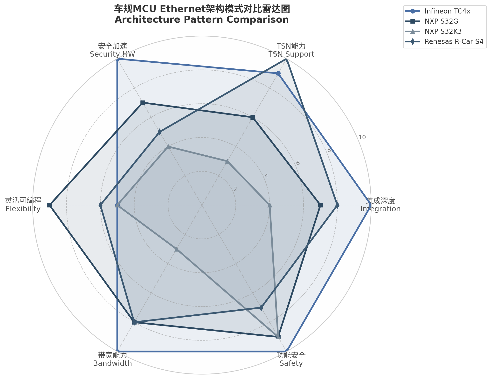

# 9. Ethernet模块功能划分与设计参考框架

本章作为整份报告的核心设计参考章节，综合前文对Infineon TC4x、NXP S32G/S32K3以及Renesas R-Car系列MCU Ethernet模块的逐层分析，提出一套可指导工程实践的模块化架构模板、协议映射关系与硬件/软件决策框架。前述章节的分析揭示了三条截然不同的车规Ethernet架构演化路线——集成深度优先、灵活可编程优先与成本优化优先——这三种路线并非简单的性能高低之分，而是面向不同E/E架构（Electrical/Electronic Architecture，电气电子架构）需求的根本性设计哲学差异[^1^][^13^]。本章将把这些发现转化为可直接指导选型和设计的决策工具。

## 9.1 模块化Ethernet IP架构模板

### 9.1.1 标准模块划分

基于对四家主流MCU平台Ethernet子系统的解构分析，车规MCU的Ethernet IP可抽象为八个标准功能模块。这一分层模型兼顾了OSI参考模型的层次性与汽车电子对功能安全、信息安全、确定性延迟的特殊需求。各模块的职责边界如下：

**PHY接口层（PHY Interface Layer）**：负责MAC与物理层收发器之间的介质无关接口，支持MII、RMII、RGMII、SGMII、USXGMII等标准。TC4x GETH在该层提供了最广泛的接口覆盖，包括业界罕见的USXGMII（最高5Gbps）与10BASE-T1S原生支持[^1^][^2^]；S32G GMAC覆盖RGMII与SGMII[^3^]；S32K3 ENET仅支持MII/RMII[^4^]。

**MAC核心层（MAC Core Layer）**：实现IEEE 802.3标准规定的帧封装/解封装、地址过滤、VLAN标签处理与流控。该层是各平台差异最小的部分，TC4x采用Synopsys XGMAC 10G IP，S32G采用DesignWare EMAC/DWC_ether_qos，二者均支持32条完美地址过滤与哈希多播过滤[^6^][^9^]。

**DMA/Buffer层（DMA and Buffer Management Layer）**：管理描述符环、Scatter-Gather操作与缓存一致性。TC4x提供8通道独立DMA（每通道含独立Tx/Rx引擎），配合32KB MTL FIFO，显著提升了突发流量吸收能力[^7^][^8^]；S32G GMAC使用标准eDMA引擎[^25^]。

**TSN/AVB加速层（TSN/AVB Acceleration Layer）**：实现时间敏感网络的关键整形与调度功能，包括802.1Qbv（TAS，Time-Aware Shaper，时间感知整形器）门控列表执行、802.1Qbu帧抢占、802.1Qav（CBS，Credit-Based Shaper，基于信用的整形器）信用计算、802.1Qci（PSFP，Per-Stream Filtering and Policing，逐流过滤和策略）流过滤与802.1CB帧复制消除。TC4x将该层功能深度集成于GETH与LETH MAC内部[^12^]；R-Car S4则将其置于集成TSN Switch中。

**时间同步层（Time Synchronization Layer）**：提供IEEE 1588 PTP与IEEE 802.1AS gPTP所需的时间戳采集、时钟校正与透明时钟（Transparent Clock）/边界时钟（Boundary Clock）转发。该层通常以"硬件时间戳单元（TSU）+ 软件协议栈"的混合方式实现[^27^][^29^]。

**安全层（Security Layer）**：涵盖MACsec（802.1AE）链路加密、IPSec（AH/ESP）网络层加密、SecOC（Secure Onboard Communication，安全车载通信）PDU级认证以及L2/L3/L4访问控制列表。TC4x通过CSS（Cyber Security Satellite，网络安全卫星）模块实现MACsec硬件加速（763MB/s）与ASIL-D安全MAC比较器[^31^][^32^]；S32G依赖PFE安全引擎与HSE（Hardware Security Engine，硬件安全引擎）协处理器实现IPSec卸载[^33^]。

**Bridge/Switch层（Bridge/Switch Layer）**：实现L2帧转发、MAC地址学习、VLAN隔离与IGMP Snooping。TC4x在该层提供了片内集成Bridge，支持最多4个GETH端口间的线速转发[^34^]；S32G通过PFE固件实现L2 Bridge功能[^36^]；S32K3则依赖外部SJA1110 Switch[^37^]。

**功能安全层（Functional Safety Layer）**：通过ECC、Lockstep核、SMU（Safety Management Unit，安全管理单元）与Safe DMA等机制确保Ethernet数据通路满足ISO 26262 ASIL等级要求。TC4x在除少数模块外的绝大多数硬件电路上均实现了ASIL-D设计目标[^38^][^39^]。

基于上述八层模型，可构建以下模块化架构模板，作为不同应用场景下Ethernet子系统设计的直接参考：

```
┌─────────────────────────────────────────────────────────────────────┐
│                    模块化Ethernet IP架构模板                           │
├─────────────────────────────────────────────────────────────────────┤
│  APPLICATION LAYER (ADAS/网关/域控/车身/传感器)                      │
│       │                                                            │
│       ▼                                                            │
│  ┌─────────────────┐  ┌─────────────────┐  ┌─────────────────┐      │
│  │  AUTOSAR STACK  │  │  AUTOSAR STACK  │  │  AUTOSAR STACK  │      │
│  │ Eth/EthIf/SoAd  │  │ Eth/EthIf/SoAd  │  │ Eth/EthIf/Com   │      │
│  │ EthTSyn/StbM    │  │ EthTSyn/StbM    │  │ (CAN priority)  │      │
│  └────────┬────────┘  └────────┬────────┘  └────────┬────────┘      │
│           │                    │                    │               │
│           ▼                    ▼                    ▼               │
│  ┌─────────────────┐  ┌─────────────────┐  ┌─────────────────┐      │
│  │ COMPLEX DRIVER  │  │ COMPLEX DRIVER  │  │ COMPLEX DRIVER  │      │
│  │ (PFE Firmware/  │  │ (Bridge/CSS/    │  │ (SJA1110 SPI/   │      │
│  │  LLCE/IPCF)     │  │  TSN Driver)    │  │  Ethernet Drv)  │      │
│  └────────┬────────┘  └────────┬────────┘  └────────┬────────┘      │
│           │                    │                    │               │
│           ▼                    ▼                    ▼               │
│  ┌─────────────────┐  ┌─────────────────┐  ┌─────────────────┐      │
│  │   MAC + DMA     │  │   MAC + DMA     │  │   MAC + DMA     │      │
│  │  + MTL FIFO     │  │  + MTL FIFO     │  │  + MTL FIFO     │      │
│  │  XGMAC (5-10G)  │  │  XGMAC (5G)     │  │  ENET (10/100M) │      │
│  └────────┬────────┘  └────────┬────────┘  └────────┬────────┘      │
│           │                    │                    │               │
│           ▼                    ▼                    ▼               │
│  ┌─────────────────┐  ┌─────────────────┐  ┌─────────────────┐      │
│  │ SWITCH/BRIDGE   │  │  BRIDGE/TSN HW  │  │ EXTERNAL SWITCH │      │
│  │ PFE L2/L3 Router│  │ Internal Bridge │  │ SJA1110/R-Switch│      │
│  │ + IPSec Engine  │  │ + TSN Scheduler │  │ + TSN HW        │      │
│  └────────┬────────┘  └────────┬────────┘  └────────┬────────┘      │
│           │                    │                    │               │
│           ▼                    ▼                    ▼               │
│  ┌─────────────────┐  ┌─────────────────┐  ┌─────────────────┐      │
│  │    SECURITY     │  │    SECURITY     │  │    SECURITY     │      │
│  │ HSE-B / PFE SE  │  │ CSS / CSRM      │  │ HSE-B / HSM SW  │      │
│  └────────┬────────┘  └────────┬────────┘  └────────┬────────┘      │
│           │                    │                    │               │
│           ▼                    ▼                    ▼               │
│  ┌─────────────────┐  ┌─────────────────┐  ┌─────────────────┐      │
│  │  PHY INTERFACES │  │  PHY INTERFACES │  │  PHY INTERFACES │      │
│  │ RGMII/SGMII/    │  │ USXGMII/RGMII/  │  │ RMII/MII/       │      │
│  │ 100BASE-T1/     │  │ 10BASE-T1S/     │  │ 100BASE-T1      │      │
│  │ 2.5GBASE-T1     │  │ 100BASE-T1      │  │                 │      │
│  └─────────────────┘  └─────────────────┘  └─────────────────┘      │
│                                                                     │
│      NXP S32G              Infineon TC4x            NXP S32K3+SJA1110│
│   (网关/中央计算)          (区域控制器/ADAS)          (车身域/低成本ECU)│
└─────────────────────────────────────────────────────────────────────┘
```

该模板展示了三种典型配置的模块堆叠方式。左侧S32G配置强调网络处理卸载与L3路由能力，中央TC4x配置突出集成Bridge与TSN硬件加速，右侧S32K3+SJA1110配置体现最小MCU与外部扩展的结合。工程实践中，各模块可根据需求裁剪：例如传感器节点可省略Bridge/Switch层与安全层中的MACsec子模块，仅保留基础MAC与PHY接口。

### 9.1.2 协议到功能模块映射

汽车Ethernet涉及的标准协议超过20项，但工程实现中需重点关注12个核心协议。下表将这些协议映射至9.1.1节定义的八个功能模块，并标注各映射关系在实际芯片中的实现状态。

| 协议/标准 | 归属功能模块 | 硬件实现 | 软件实现 | 典型芯片实例 |
|:---|:---|:---|:---|:---|
| IEEE 802.3 (MAC/PHY) | MAC核心层 + PHY接口层 | 帧封装/解封装、CRC校验、地址过滤 | MCAL Eth驱动配置 | 全部平台 |
| IEEE 802.1AS/gPTP | 时间同步层 | 时间戳采集（TSU）[^27^] | BMCA状态机、伺服算法[^29^] | TC4x, S32G, SJA1110 |
| IEEE 802.1Qav (CBS) | TSN/AVB加速层 | 信用整形器硬件[^12^] | 带宽参数配置 | TC4x, SJA1110 |
| IEEE 802.1Qbv (TAS) | TSN/AVB加速层 | 门控列表（GCL）硬件执行[^12^] | 调度表编排、Gate Driver | TC4x, SJA1110 |
| IEEE 802.1Qbu (FP) | TSN/AVB加速层 | Express/Preemptable MAC分离[^12^] | 抢占配置管理 | TC4x GETH, SJA1110 |
| IEEE 802.1Qci (PSFP) | TSN/AVB加速层 | FFP流过滤 + PC策略计数器[^13^] | 流规则下发（受限于8 gateway ID）[^14^] | TC4x, SJA1110 |
| IEEE 802.1CB (FRER) | TSN/AVB加速层 | 序列编号与复制消除 | 冗余路径管理 | TC4x (部分), SJA1110 |
| IEEE 1722 (AVTP) | TSN/AVB加速层 | 无硬件卸载 | 完整软件协议栈 | 全部平台 |
| IEEE 802.1AE (MACsec) | 安全层 | CSS AES-GCM硬件加速[^31^] | 密钥管理（802.1X）[^32^] | TC4x (独有) |
| IPSec (AH/ESP) | 安全层 | PFE安全引擎/CSS加密通道[^33^] | SA管理、IKE协商 | S32G, TC4x |
| AUTOSAR SecOC | 安全层 | HSM/CSRM AES-CMAC | PDU freshness验证 | S32G, S32K3, TC4x |
| L2/L3/L4 Firewall | 安全层 + Bridge/Switch层 | TCAM规则匹配、PFE分类表 | 规则配置与更新 | S32G PFE, SJA1110 |

上表的映射关系揭示了两项关键设计启示。第一，TSN协议族（Qav/Qbv/Qbu/Qci/CB）几乎全部落在TSN/AVB加速层，但其硬件实现深度差异显著：TC4x在MAC核心内部通过GCL、FFP和PC实现完整的TSN数据面，而S32G仅GMAC_0支持Qbv/Qbu，PFE完全不支持TSN整形[^16^]。这意味着若设计需求包含多端口TSN调度，TC4x的集成方案或R-Car的集成Switch方案在系统复杂度上优于S32G的GMAC+PFE分离架构。第二，安全协议呈现"硬件孤岛"特征——MACsec仅在TC4x CSS中有硬件加速实现，IPSec在S32G PFE中最完整，SecOC则依赖各平台HSM/CSRM软件实现。没有任何单一平台能同时以硬件加速全部三种安全机制，这一约束将直接影响跨安全域的MCU选型策略。

### 9.1.3 共享模块与专用模块分析

在多协议并发的汽车Ethernet系统中，模块复用程度直接影响硅片面积、功耗与软件复杂度。基于对TC4x、S32G和SJA1110架构的分析，八层模型中的模块可按下述原则分类：

**可共享模块**包括时间戳单元（TSU）、安全加密引擎与Bridge转发表。TC4x的CSS模块提供20+1条独立对称加密通道，可同时服务MACsec会话、IPSec SA与SecOC PDU验证[^31^]，实现跨协议的加密硬件资源共享。Bridge层的MAC/VLAN转发表天然为多端口共享——TC4x集成Bridge的转发表为所有GETH端口公用[^34^]。时间戳单元在理论上可服务gPTP与AVTP（1722）两种时间同步需求，但TC4x的已知errata限制了多端口透明时钟操作，仅支持成对菊链拓扑[^26^]，这一硬件约束实际上削弱了TSU的共享灵活性。

**必须专用模块**包括MAC核心、DMA通道与MTL FIFO。每个物理端口需要独立的MAC核心实例——TC4x的双XGMAC即为双端口独立实例[^6^]。DMA通道虽支持多通道复用（TC4x提供8通道），但在高带宽场景下，为单个端口分配多条专用通道比跨端口共享更能保证确定性延迟[^8^]。MTL FIFO按方向（Tx/Rx）与端口严格绑定，TC4x为每方向配置32KB FIFO[^7^]，不存在跨端口共享机制。

介于两者之间的"条件共享模块"是TSN调度器。802.1Qbv的GCL（Gate Control List，门控列表）按队列实例化，同一端口内的多个队列可共享GCL执行引擎，但不同端口的GCL必须独立维护——因为各端口的链路速率与拓扑位置不同，其门控周期不可通用。SJA1110作为外部Switch，其GCL资源按端口分配，跨端口调度需通过Switch固件协调[^15^]。

## 9.2 硬件/软件划分决策准则

汽车Ethernet子系统的硬件/软件边界并非固定不变，而是受吞吐量、确定性、安全等级与成本四项核心指标的动态约束。下表建立了12项关键功能在硬件实现与软件实现之间的决策准则。

| 功能/协议 | 硬件实现准则（必须满足任一） | 软件实现准则（必须满足任一） | 混合实现最佳实践 |
|:---|:---|:---|:---|
| TSN整形（Qbv/Qav/Qbu） | 速率>1Gbps；确定性抖动<10μs；ASIL-D要求 | 速率<100Mbps；QM等级；抖动>100μs可接受 | GCL硬件执行 + 调度表软件编排 |
| gPTP时间同步 | 同步精度<1μs；多端口透明时钟 | 精度>10μs；单端口端节点 | 硬件时间戳采集 + BMCA软件状态机 |
| MACsec加密 | 线速率>100Mbps；ASIL-D/ISO 21434强制 | 吞吐量<10Mbps；非关键数据域 | CSS硬件加密 + 802.1X密钥管理软件 |
| IPSec处理 | 多隧道并发>10条；网关V2X/云连接 | 单隧道或低吞吐量 | PFE硬件卸载 + IKE/SAD软件管理 |
| L3路由（IPv4/IPv6） | 吞吐量>500Mbps；多接口网关 | 单接口；低吞吐量；简单拓扑 | PFE硬件路由表 + 控制面软件 |
| L2 Bridge/Switch | 多端口（>2）；聚合带宽>100Mbps | 单端口；低聚合带宽 | 片内Bridge硬件 + Spanning Tree软件 |
| Checksum卸载 | 始终建议硬件（成本极低） | 仅当硬件缺失时 | MAC硬件自动计算 |
| DMA数据传输 | 始终建议硬件 | 仅资源极度受限的8位MCU | 描述符环硬件自主轮询 |
| AVTP（1722）流媒体 | 无硬件卸载可用 | 所有场景 | 纯软件实现，依赖CPU负载评估 |
| PSFP流过滤 | >8条并发流；DoS防护需求 | <4条流；非安全关键 | FFP硬件匹配 + 流规则软件配置 |
| 防火墙/ACL | L2/L3/L4全层过滤；线速执行 | 仅L2 MAC过滤 | TCAM硬件匹配 + 规则库软件更新 |
| 功能安全监控 | ASIL-C/D；ECC/Lockstep/Safe DMA | ASIL-B及以下；标准DMA | SMU硬件监控 + 安全栈软件响应 |

上表中的准则可通过量化指标快速定位实现策略。以TSN整形为例，当应用需要5Gbps骨干网传输且要求时间敏感流的端到端抖动小于10μs时，硬件实现是必要条件——软件整形器在Gbps速率下的中断延迟与缓存不确定性无法满足该指标。TC4x的GETH在硬件中执行GCL，门控切换精度由MAC发送时钟域保证[^12^]；相比之下，纯软件实现的TAS门控依赖操作系统调度，在100Mbps以上速率时抖动通常超过50μs。

当协议状态机复杂度超过硬件可表达范围时，软件实现成为更优选择。gPTP的BMCA（Best Master Clock Algorithm，最佳主时钟算法）涉及多状态转换与多端口比较逻辑，AUTOSAR EthTSyn明确在软件层实现该算法，仅将时间戳采集交给硬件TSU[^29^][^30^]。这一混合模式已在业界形成共识：数据面（时间戳、门控执行、帧抢占）硬件化以保证确定性，控制面（状态机、参数协商、故障恢复）软件化以保证灵活性。

混合实现的最佳实践在安全层体现得最为充分。MACsec的数据面加密（AES-GCM）必须在硬件中完成以达线速——TC4x CSS以763MB/s的吞吐量为GETH提供无阻塞MACsec保护[^31^]。但密钥管理（MKA会话、SA轮换、802.1X认证）涉及复杂的协议状态机与证书链验证，更适合在软件中实现。同样，S32G的IPSec卸载依赖PFE安全引擎处理ESP封装与反重放[^33^]，但IKEv2协商、SA生命周期管理与策略路由更新由主机CPU软件负责。这种"硬件加速数据面 + 软件管理控制面"的分割模式，是当前车规网络安全实现的主流架构。

## 9.3 设计决策矩阵

### 9.3.1 内部Switch vs 外部Switch选择

MCU是否集成Bridge/Switch功能是影响BOM成本、PCB面积与系统拓扑灵活性的关键决策。TC4x通过片内Bridge实现了零额外芯片成本的L2转发[^34^]；S32G通过PFE固件实现等效功能但依赖NXP提供的二进制固件[^36^]；S32K3则必须搭配外部SJA1110 Switch才能获得多端口TSN能力[^37^]。

选择内部Switch（集成Bridge或PFE L2 Bridge）的适用场景包括：端口数不超过4个；PCB面积极度受限（如域控制器内嵌于机械结构件中）；所有端口归属同一ASIL等级且同一MCU管理；TSN功能需求在MCU硬件能力范围内。TC4x的内部Bridge直接连接SRI交叉开关，DMA访问延迟低于任何外部SPI/Ethernet接口方案[^8^]。

选择外部Switch的适用场景则涵盖：端口数超过4个或需要6条以上100BASE-T1链路（SJA1110原生集成6个100BASE-T1 PHY[^5^]）；物理拓扑要求Switch靠近连接器以减少差分对走线长度；不同端口需要独立ASIL等级（如SJA1110为ASIL-B，可与ASIL-D MCU组合实现混级系统）；需要802.1Qcr（ATS，Asynchronous Traffic Shaper，异步流量整形器）等MCU不支持的高级TSN功能[^15^]。外部Switch方案的真正价值并不在于纯芯片成本——S32K3 + SJA1110的总成本可能接近S32G2单芯片——而在于物理分布灵活性、功能隔离与供应商解耦：Switch故障不直接影响MCU运行，且Switch供应商可更换而无需改动MCU选型。

### 9.3.2 单MAC vs 双MAC vs Switch

端口数量与拓扑类型决定了MAC配置策略。单MAC适用于单一网络域的端节点，如连接至区域控制器的传感器ECU或执行器节点。此类场景下总流量低于100Mbps，且无跨域隔离需求，S32K3的单个ENET或GMAC即可满足[^4^]。

双MAC架构服务于两类需求：网络域隔离与速率域桥接。安全关键型应用常采用"红/黑"双网隔离架构——双MAC分别连接至安全域与非安全域，通过MCU内部防火墙实现受控跨域通信。TC4x的双XGMAC天然支持该拓扑[^6^]。速率域桥接则涉及100Mbps传感器域与1Gbps/5Gbps骨干域之间的网关功能，S32G的GMAC_0（1Gbps TSN端点）与PFE端口（2.5Gbps路由）即构成事实上的双速率引擎[^255^]。

多MAC + Switch架构是中央网关与区域控制器的标准配置。TC4x的2×5Gbps GETH + 4×100Mbps LETH在片内形成6端口异构网络，通过Bridge实现L2转发[^2^]。R-Car S4的集成3端口TSN Switch配合多GMAC提供更高阶的交换能力，适合需要复杂TSN调度的中央计算平台。设计者在评估多MAC方案时，必须考虑跨芯片gPTP的限制：TC4x的多端口透明时钟受限于成对菊链拓扑[^26^]，S32G的PFE端口完全不支持TC功能，这意味着多端口gPTP relay需求将优先指向R-Car S4或外部SJA1110方案。

### 9.3.3 PHY接口选择决策

PHY接口类型决定了单链路成本、传输距离与电磁兼容特性。当前车规Ethernet的四种主要物理层选项各有其最优应用区间：

**100BASE-T1（IEEE 802.3bw）**是当前最成熟的汽车Ethernet PHY标准，单线对传输100Mbps，传输距离可达15米，PHY芯片成本已降至2美元以下。该接口适用于车身域、底盘域中距离通信以及非ADAS域控制器互联。S32K3与S32G均通过外部PHY（如TJA1103）支持该标准[^4^]。

**1000BASE-T1（IEEE 802.3bp）**提供1Gbps速率，是ADAS域骨干与区域控制器上行链路的主流选择。TC4x GETH通过USXGMII/RGMII连接外部1000BASE-T1 PHY；S32G GMAC通过SGMII支持2.5Gbps速率，向下兼容1Gbps[^3^]。该接口的PHY成本约为100BASE-T1的3-4倍，PCB布线要求也更严格。

**10BASE-T1S（IEEE 802.3cg）**以多点总线（Multi-Drop）拓扑和极低成本为特征，速率10Mbps，支持最多8节点共享同一总线。TC4x是目前唯一在MCU级原生集成10BASE-T1S MAC的架构——其LETH模块直接支持该标准，无需外部MAC控制器[^2^]。对于需要连接大量低成本传感器（如门控开关、环境光传感器、座椅压力传感器）的区域控制器，LETH + 10BASE-T1S可显著减少PHY数量和线束重量。

**Multi-Gig（2.5G/5G/10G）**面向下一代ADAS中央计算平台与高分辨率传感器融合。TC4x GETH的USXGMII接口已支持5Gbps[^1^]，为当前车规MCU中最高速率。10G车载Ethernet标准（IEEE 802.3ch）的PHY正在逐步成熟，但当前功耗与成本仍限制其仅用于最高端中央计算单元。

## 9.4 三家架构对标总结

### 9.4.1 架构模式对比

综合前文八个维度的逐层分析，可将四家MCU平台的Ethernet架构归纳为四种典型模式。下表从架构哲学、核心差异化、最佳应用场景与关键权衡四个维度进行对比。

| 对比维度 | Infineon TC4x | NXP S32G | NXP S32K3 | Renesas R-Car S4 |
|:---|:---|:---|:---|:---|
| **架构哲学** | 垂直集成深度优先 | 异构双引擎灵活可编程 | 极简MAC + 外部扩展 | 网络中心集成Switch |
| **核心MAC** | 双XGMAC 5Gbps | GMAC_0 + PFE三EMAC | EMAC 10/100 + GMAC 1G | 多GMAC + 集成TSN Switch |
| **Bridge/Switch** | 片内Bridge（4端口）[^34^] | PFE L2/L3 Bridge固件[^36^] | 外部SJA1110（11端口）[^37^] | 片内3端口TSN Switch |
| **TSN实现位置** | MAC内嵌（GETH+LETH）[^12^] | 仅GMAC_0；PFE不支持 | 内部MAC基础 + SJA1110高级 | Switch内完整TSN |
| **安全差异化** | CSS硬件MACsec（独有）[^31^] | PFE IPSec 2Gbps + HSE | HSE-B基础加密 | HSM + 防火墙IP |
| **DMA能力** | 8通道 × 32KB FIFO[^7^][^8^] | 2通道 + PFE独立通道 | 1通道（ENET）/ 2通道（GMAC） | 多通道 |
| **功能安全** | 近乎全模块ASIL-D[^38^] | ASIL-D + 专用SPD[^40^] | ASIL-D MCU + ASIL-B Switch | ASIL-B/D混合 |
| **AUTOSAR映射** | MCAL R20-11/R21-11[^46^] | 标准MCAL + PFE CDD | 标准MCAL + EthSwt CDD | Complex Driver |
| **最佳应用** | 区域控制器、ADAS域 | 中央网关、SOA架构 | 车身域、传统ECU升级 | 信息娱乐、ADAS骨干 |
| **关键权衡** | 灵活性受限；CSS锁定 | PFE固件二进制依赖[^49^] | 高级功能依赖外部芯片 | 成本与功耗较高 |

四种架构模式在雷达图中的投影如图9-1所示。TC4x在集成深度、安全加速、带宽与功能安全四个维度形成"尖顶"优势，但在灵活可编程维度明显弱于S32G。S32G的灵活可编程得分最高，这得益于PFE固件架构允许NXP通过固件更新增加新协议支持[^235^]，但这也意味着OEM的长期维护与NXP固件路线图深度绑定。S32K3在除功能安全外的所有维度均处于基础水平，其设计意图明确——以最低硅片成本满足车身域的基本连接需求，将高级功能外包给SJA1110。R-Car S4在TSN能力维度得分最高，其集成3端口TSN Switch提供了最完整的时间敏感网络数据面，但安全硬件加速与功能安全等级不及TC4x。



*图9-1 车规MCU Ethernet架构模式对比雷达图（数据来源：基于各厂商官方datasheet与参考手册的逐项评估，评分范围1-10）*

雷达图的可视化对比揭示了一个关键洞察：没有" universally best"（普适最优）的架构，只有与目标应用特征最匹配的架构。若应用需求同时要求高带宽（5Gbps）、高安全（MACsec硬件加速）与高功能安全（ASIL-D），则TC4x是当前唯一无需外部协处理器即可满足全三项的MCU。若应用需要长期协议可扩展性（如中央网关需通过OTA支持未来TSN协议），S32G的PFE固件架构提供了其他平台不具备的升级路径，但该路径伴随着对NXP固件支持的长期依赖[^49^]。

### 9.4.2 基于应用类型的MCU选型决策树

基于上述架构对比，可建立面向五种典型汽车应用场景的MCU选型决策路径。下表中的推荐并非绝对——同一应用场景可能因OEM的供应链策略、软件栈成熟度或功能安全分解方式而选择不同路径——但提供了工程实践中的初始筛选逻辑。

| 应用类型 | 核心需求特征 | 首选架构 | 次选架构 | 关键排除因素 |
|:---|:---|:---|:---|:---|
| ADAS/自动驾驶域控 | >2Gbps传感器数据融合；ASIL-D；MACsec | **TC4x** (GETH 5Gbps + CSS) | S32G3 (PFE 3Gbps + HSE) | S32K3带宽不足；无MACsec |
| 区域控制器（Zonal） | 多端口异构（高速骨干+低速传感器）；TSN桥接 | **TC4x** (GETH+LETH+Bridge) | S32G (GMAC+PFE) | TC4x gPTP菊链限制需验证拓扑[^26^] |
| 中央网关/SDV | L3路由、NAT、IPSec、协议可升级 | **S32G** (PFE L2/L3/L4 + 固件可编程) | TC4x + 外部路由芯片 | S32G2 Qbv+Qbu不能同时启用 |
| 车身域/舒适域 | 成本敏感；100Mbps足够；ASIL-B/D混合 | **S32K3 + SJA1110** | TC4x LETH (若需10BASE-T1S) | 纯S32K3无TSN Switching |
| 信息娱乐/座舱 | 多屏视频流；AVB/TSN；高带宽 | **R-Car S4** (集成TSN Switch) | S32G (PFE QoS) | R-Car安全加速较弱 |
| 传感器/执行器节点 | 极简；10-100Mbps；成本最低 | **S32K3 ENET** | TC4x LETH (10BASE-T1S) | 任何>1G方案均属过度设计 |

上表决策逻辑需结合系统级TCO（Total Cost of Ownership，总体拥有成本）评估，而非仅比较MCU单品价格。S32K3 + SJA1110方案的MCU单价可能低于TC4x，但加上外部Switch、额外PHY与更复杂的PCB布线后，系统级成本差距显著缩小。更重要的是，外部Switch方案引入了额外的供应链节点与固件依赖——SJA1110的TSN功能需通过Switch固件配置，该固件的更新节奏与NXP的发布周期绑定[^15^]，与S32G PFE固件依赖具有相似的供应商锁定风险。

对于区域控制器应用，TC4x的GETH+LETH+Bridge集成方案在BOM复杂度上具有结构性优势：一片TC4x即可实现2×5Gbps高速链路 + 4×100Mbps低速链路 + 片内桥接，而S32G实现同等端口数需搭配外部Switch或额外PHY。但TC4x的gPTP多端口透明时钟限制[^26^]意味着复杂星型拓扑中的时间同步可能需要外部辅助——若区域控制器需同时向4个以上传感器域提供gPTP relay，则R-Car S4的集成Switch或SJA1110外部方案在时钟转发能力上更干净。

### 9.4.3 未来演进趋势

汽车Ethernet MCU架构正在经历五个方向的并行演进，这些趋势将进一步影响本章提出的设计框架。

**10G车载Ethernet的MCU集成**：IEEE 802.3ch标准定义的10Gbps Multi-Gig PHY已开始出现在高端中央计算平台中。当前TC4x GETH的XGMAC IP本身为10G MAC，实际运行被限制在5Gbps以匹配当前PHY生态[^6^]。下一代AURIX或竞品将 likely 解锁完整10G能力，届时DMA/Buffer层的32KB MTL FIFO可能需要进一步扩容以吸收10G速率下的突发流量。

**TSN over 10BASE-T1S**：10BASE-T1S的多点总线拓扑与TSN的确定性调度存在天然张力——总线仲裁的CSMA/CD机制与Qbv的严格时隙分配难以直接共存。IEEE正在制定10BASE-T1S与TSN的共存规范，预计将通过混合周期/事件触发调度解决该问题。TC4x LETH的原生10BASE-T1S支持[^2^]使其在该演进方向上占据先发优势，但需关注LETH不支持802.1Qbu帧抢占的限制——这意味着在10BASE-T1S总线上无法实现Express帧对Preemptable帧的抢占打断。

**MACsec强制化**：随着UNECE R155（网络安全管理系统）与ISO/SAE 21434标准在量产车型中的强制执行，MACsec正从"可选安全增强"转变为"默认链路保护"。TC4x是目前唯一在片内集成MACsec硬件加速的车规MCU[^31^]，这一差异化优势将随MACsec渗透率提升而放大。NXP与Renesas的未来一代产品 likely 将跟进集成MACsec引擎，否则将被迫依赖外部PHY（如TJA1121）实现链路加密，增加BOM成本与功耗。

**AI加速与Ethernet数据面的融合**：下一代ADAS域控制器要求Ethernet子系统与NPU/AI加速器之间实现零拷贝数据路径——摄像头原始流经Ethernet MAC直接进入ISP（Image Signal Processor，图像信号处理器）与NPU的共享内存区域，避免CPU干预。TC4x的64位SRI交叉开关与独立的LCB2SRI读写通道为这种零拷贝架构提供了硬件基础[^8^]，但完整的软件栈（Linux DMA-BUF、AUTOSAR复杂设备驱动）仍需OEM与Tier-1联合开发。

**AUTOSAR与硬件能力的鸿沟弥合**：当前AUTOSAR标准Ethernet栈（Eth/EthIf/EthSwt/EthTSyn）仅能覆盖MCU硬件能力的60%-70%。TC4x的8通道DMA在标准AUTOSAR MCAL中通常仅使用1-2个队列[^46^]；S32G PFE的L2/L3/L4分类能力远超EthSwt规范范围；R-Car的TSN Switch能力在AUTOSAR环境下需大量Complex Driver开发。这一"硬件能力透支"现象意味着高端MCU的选型决策不能仅基于AUTOSAR标准功能清单——OEM需评估非标准驱动（CDD，Complex Device Driver，复杂设备驱动）的开发投入与长期维护成本，才能释放硬件的全部潜力。
