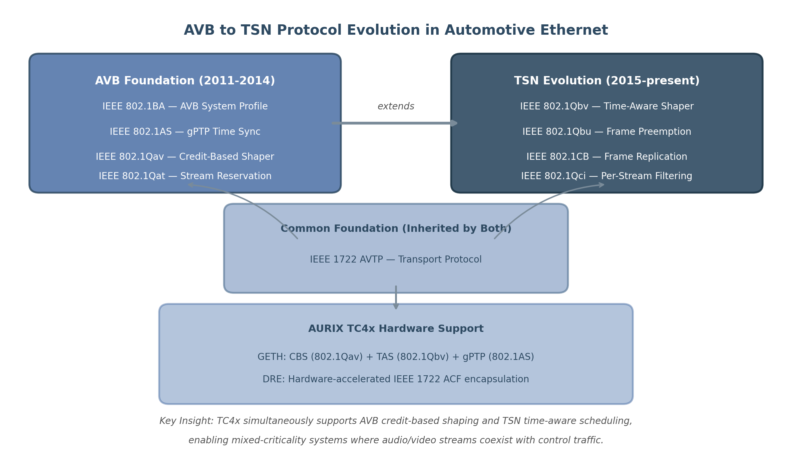
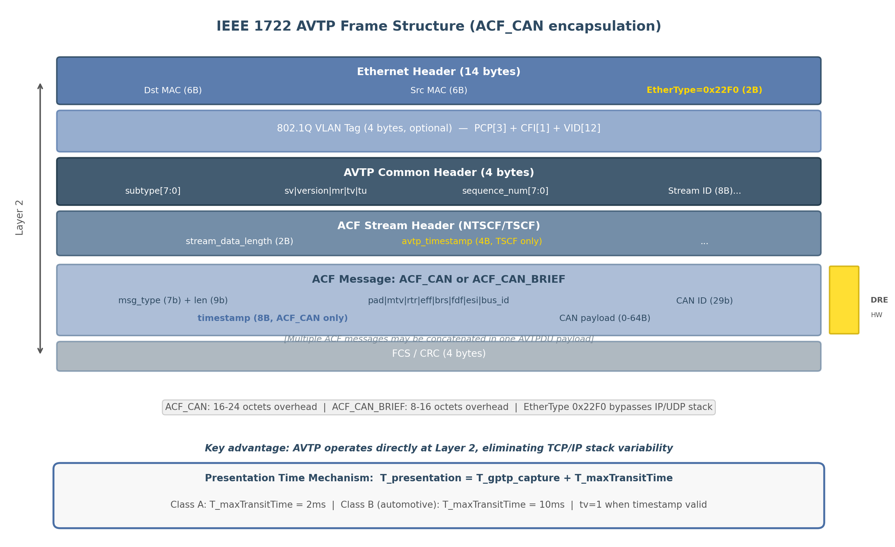
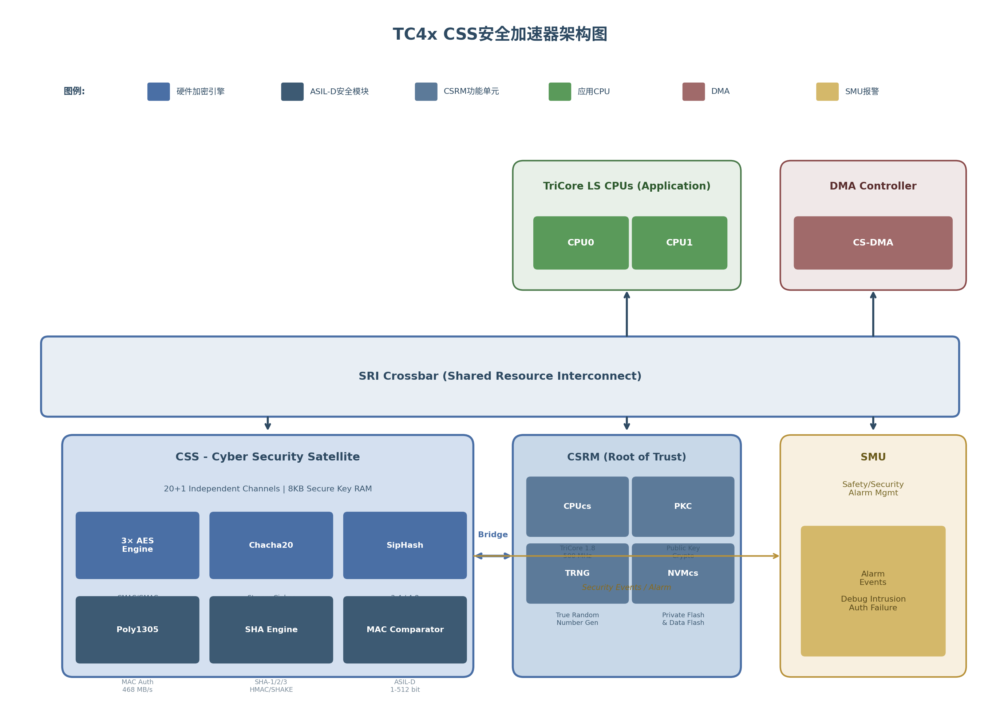
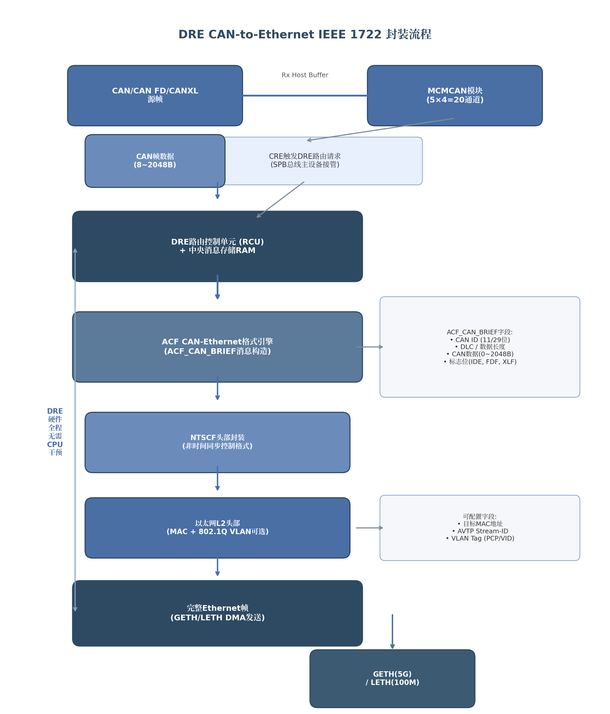

## 1. TC4x Ethernet整体架构概览

Infineon AURIX TC4x微控制器家族重新定义了车载以太网的集成方式。与TC3xx仅提供单端口千兆以太网MAC不同，TC4x将GETH（Gigabit Ethernet，千兆以太网）、LETH（Lite Ethernet，轻量以太网）、CSS（Cyber Security Satellite，网络安全加速器）和DRE（Data Routing Engine，数据路由引擎）四大模块整合为统一的网络通信子系统 [^19^][^20^]。这一架构并非简单堆叠MAC端口，而是以64位SRI（Shared Resource Interconnect）交叉开关为核心，构建了一个覆盖物理层到应用层的完整Ethernet通信矩阵，直接服务于区域架构（Zonal Architecture）下Zone Controller的通信枢纽需求。本章从模块组成、车载定位和特性矩阵三个维度，为后续各章的深度解析建立整体认知框架。

### 1.1 TC4x网络模块组成

#### 1.1.1 GETH、LETH、CSS、DRE四大模块的功能定位与协同关系

TC4x Ethernet子系统的四个模块在功能上形成明确的分层协作关系。下图以文字形式描述了TC4x Ethernet系统架构的整体布局：

```
+========================================================================================+
|                        TC4x Ethernet System Architecture                               |
+========================================================================================+
|                                                                                        |
|  +------------------------+        64-bit SRI Crossbar        +------------------------+ |
|  |   GETH (Gigabit        |<===============================>|   LETH (Lite Ethernet)  | |
|  |    Ethernet)           |     Dual LCB2SRI Channels        |                         | |
|  |                        |     ECC | 250 MHz                |                         | |
|  |  [XGMAC0] [XGMAC1]     |                                  | [MAC0][MAC1][MAC2][MAC3] | |
|  |   5G MAC   5G MAC      |                                  |  10/100M 10/100M ...    | |
|  |       |     Bridge     |                                  |       |                 | |
|  |  MTL:32KB TX/RX FIFO   |                                  |  16KB TX / 8KB RX FIFO  | |
|  |  8 DMA Channels        |                                  |  4 DMA Channels         | |
|  |       |                |                                  |       |                 | |
|  |  HSPHY: MII/RGMII/     |                                  |  10BASE-T1S Int. PHY    | |
|  |  SGMII/USXGMII         |                                  |  TC14 Interface         | |
|  +-------|----------------+                                  +-------|-----------------+ |
|          |                                                          |                   |
|          v                                                          v                   |
|    RGMII/SGMII/USXGMII                                        MII/RMII/10BASE-T1S       |
|          |                                                          |                   |
|          +==========================+=================================+                   |
|                                     |                                                  |
|  +------------------------+         |         +------------------------+                |
|  |   CSS (Cyber Security  |<--------|-------->|   DRE (Data Routing    |                |
|  |    Satellite)          |                  |    Engine)             |                |
|  |                        |                  |                        |                |
|  |  3x AES (CMAC/GMAC/    |                  |  ACF Format Engine     |                |
|  |       GCM)             |                  |  (IEEE 1722 Encap)     |                |
|  |  Chacha20 | Poly1305   |                  |  Forwarding Engine     |                |
|  |  SHA-1/2/3 | SipHash   |                  |  (1:6 Multicast)       |                |
|  |                        |                  |                        |                |
|  |  8KB Key RAM | ASIL-D  |                  |  Message RAM | Routing  |                |
|  |  MAC Comparator        |                  |  Table | Forward Table  |                |
|  |  21 Channels (20+1)    |                  |  SPB/SRI Master        |                |
|  +------------------------+                  +------------------------+                |
|                                                                                        |
+========================================================================================+
```

**GETH**是TC4x的高速骨干网络接口，包含最多两个XGMAC（10 Gigabit Media Access Control）实例和一个Bridge模块 [^39^][^75^]。每个XGMAC支持IEEE 802.3-2015标准，数据速率覆盖10M/100M/1G/2.5G/5G全双工模式 [^77^]。GETH通过HSPHY（High Speed PHY）模块对外提供MII、RMII、RGMII、SGMII和USXGMII五种物理层接口 [^115^]。MTL（MAC Transaction Layer）为TX和RX方向各配置了32KB FIFO，配合8路独立DMA通道（较TC3x的4路翻倍），满足多队列并发传输的缓冲区需求 [^28^][^44^]。Bridge模块实现两个XGMAC之间的硬件级帧转发，支持菊花链拓扑和IEEE 802.1CB FRER（Frame Replication and Elimination for Reliability）帧复制消除机制 [^34^]。

**LETH**面向低速边缘节点通信，集成4个独立MAC实例，每个支持10M和100M两种速率 [^19^]。其核心差异化特性是内建10BASE-T1S数字PHY，通过OPEN Alliance TC14 3引脚接口直接连接外部PMD（Physical Medium Dependent）收发器 [^41^][^114^]。LETH配置16KB TX FIFO和8KB RX FIFO，4路DMA通道，支持IEEE 802.1Qav CBS（Credit-Based Shaper）和802.1Qbv TAS（Time-Aware Shaper），但不支持802.1Qbu帧抢占 [^30^]。该模块的目标应用是将传统CAN/LIN域的传感器、执行器和小型ECU接入统一Ethernet网络。

**CSS**是TC4x新增的网络安全硬件加速器，直接挂载于SRI交叉开关上以降低数据传输延迟 [^21^]。CSS提供20+1个独立通道（20个应用通道加1个CSRM独占通道），内部集成3路AES引擎（支持CMAC、GMAC、GCM模式）、Chacha20、Poly1305、SipHash和SHA-1/2/3硬件加速单元 [^5^][^21^]。8KB内部安全RAM用于密钥存储，配合ASIL-D等级的MAC比较器实现安全消息认证。CSS为GETH和LETH提供MACsec（IEEE 802.1AE）帧加密的底层AES-GCM运算加速，是实现车载网络安全通信的核心基础设施 [^20^]。

**DRE**是专用于CAN与Ethernet之间数据路由的硬件加速器，支持CAN-to-Ethernet、CAN-to-CAN、CAN-to-Memory和Ethernet-to-Ethernet四类路由路径 [^219^]。DRE将CAN帧封装为IEEE 1722-2016 AVTP/ACF（AVTP Control Format）格式以便在Ethernet骨干上传输，封装开销仅为8-16字节 [^216^]。该模块提供4种发送触发模式（帧计数、缓冲区填充度、时间触发、软件触发），并支持1:6多播转发 [^455^]。相较于TriCore软件路由方案，DRE可降低70-80%的路由延迟与抖动 [^429^]。

四模块的协同逻辑清晰：GETH端口连接其他Zone Controller或中央HPC（High Performance Computer）构建高速骨干；LETH端口连接本区域内的边缘设备；CSS为所有Ethernet流量提供统一的安全加速；DRE负责将 legacy CAN/CAN-FD 网络无缝桥接到Ethernet骨干，无需CPU介入 [^25^][^484^]。

#### 1.1.2 从TC3x到TC4x的架构演进：新增Bridge、扩展DMA通道、新增CSS

TC3xx的GETH模块基于Synopsys DWC_ether_qos IP，仅包含单GMAC，最高支持1Gbps速率，TX/RX FIFO分别为4KB和8KB，配置4路DMA通道 [^92^]。这一设计在域控制器（Domain Controller）时代足以满足单一功能的网络需求，但面对区域架构下的多端口、高带宽、低延迟通信需求则显得捉襟见肘。

TC4x在架构层面实现了四项关键演进。第一，**端口数量与速率双升级**：GETH从1个GMAC扩展为最多2个XGMAC，单端口峰值速率从1G提升至5Gbps（通过USXGMII接口），总交换容量达到10Gbps级别 [^5^][^77^]。第二，**新增硬件Bridge模块**：TC3x不支持MAC-to-MAC直接转发，所有跨端口流量须经CPU处理；TC4x的Bridge模块在硬件层面完成XGMAC0与XGMAC1之间的帧转发，配合32KB FIFO吸收突发流量，为菊花链和环网拓扑提供原生支持 [^75^]。第三，**DMA与缓冲区大幅扩展**：DMA通道从4路增至8路，MTL TX/RX FIFO从4KB/8KB统一升级至32KB [^28^][^44^]。新增双通道LCB2SRI（Local Cross Bar to SRI）架构允许TX与RX流量在物理上分离——一条LCB2SRI专用于读取传输，另一条专用于写入传输，避免全双工场景下的总线争用 [^36^]。第四，**新增CSS安全子系统**：TC3x依赖单通道HSM（Hardware Security Module）处理所有加密操作，难以满足5Gbps速率下MACsec的实时加解密需求；CSS的21独立通道和3路AES引擎将GMAC吞吐率提升至763MB/s，足以覆盖2x5Gbps端口的线速MACsec处理 [^21^]。

### 1.2 汽车E/E架构中的TC4x定位

#### 1.2.1 区域控制器(Zone Controller)通信枢纽角色

在区域架构（Zonal E/E Architecture）中，车辆被划分为多个物理区域（如前左Zone、前右Zone、后Zone），每个Zone由一台Zone Controller统一管理。TC4x的Ethernet子系统正是为这一角色量身设计：GETH的5Gbps端口提供与车辆中央HPC或其他Zone Controller的高速互联，LETH的4个10/100M端口将Ethernet延伸至本区域内数十个边缘ECU、传感器和执行器 [^110^][^484^]。

这种"高速上行 + 低速下行"的端口配置与区域架构的拓扑需求精确匹配。以Marelli与Infineon联合开发的Zone Control Unit为例，单一TC4x需要同时处理照明、车身控制、音频、配电、推进、热管理和底盘控制等多个域的数据汇聚，DRE模块在此过程中确保CAN帧以极低延迟封装后进入Ethernet骨干 [^484^]。CSS则为跨域安全通信提供硬件级MACsec加速，使得不同ASIL等级的功能域在网络上实现Freedom of Interference（免于干扰）[^5^]。

#### 1.2.2 从域架构到区域架构的网络需求演变

传统域架构（Domain Architecture）按功能划分网络——动力域、底盘域、车身域各自独立，域间通信通过中央网关转发。这种架构下，单个ECU通常只需连接一条CAN或一条100Mbps Ethernet即可满足需求。随着ADAS/AD（Advanced Driving Assistance Systems / Automated Driving）传感器数据量和OTA（Over-The-Air）更新带宽需求的指数级增长，域架构面临线束复杂度高、网关瓶颈和扩展性差等问题。

区域架构将通信组织从"功能导向"转为"空间导向"，对MCU的Ethernet能力提出了全新要求。首先，**带宽需求分层化**：Zone之间需要1Gbps以上的骨干连接以传输摄像头、激光雷达等传感器原始数据；Zone内部则仅需10-100Mbps连接门控、座椅、气候控制等ECU [^302^]。TC4x的GETH+LETH双速架构天然适配这种分层需求。其次，**拓扑结构从星型向菊花链演变**：FRER（IEEE 802.1CB）允许Zone Controller以菊花链方式串接，减少线束总长度和重量；GETH Bridge的MAC-to-MAC转发功能是实现这一拓扑的硬件基础 [^34^]。第三，**TSN（Time-Sensitive Networking）成为刚性需求**：区域架构中，传感器数据流、控制指令和诊断流量共享同一物理网络，必须通过802.1AS时间同步、802.1Qbv门控调度和802.1Qbu帧抢占等机制保障确定性延迟。TC4x的GETH端口支持完整的TSN协议栈，LETH端口支持CBS+TAS+gPTP的子集，覆盖不同速率域的实时通信需求 [^30^]。第四，**安全边界从网关下放到端口**：区域架构中每个Zone都是潜在的网络攻击入口，CSS的21独立MACsec通道允许为每个逻辑网络分区配置独立的安全关联（SA），实现"默认安全"（Secure-by-Default）的网络设计 [^20^][^21^]。

### 1.3 TC4x Ethernet Feature矩阵

#### 1.3.1 速度等级对照表：GETH(10M-5G) vs LETH(10M-100M)支持的速度与接口

| 参数项 | GETH (Gigabit Ethernet) | LETH (Lite Ethernet) |
|:---|:---|:---|
| MAC实例数 | 最多2个XGMAC [^39^] | 4个独立MAC [^19^] |
| 最大数据速率 | 5 Gbps（USXGMII/SGMII）[^5^] | 100 Mbps（MII/RMII）[^114^] |
| 10M支持 | 是（全/半双工，MII/RMII）[^77^] | 是（10BASE-T1S / MII / RMII）[^41^] |
| 100M支持 | 是（全双工，MII/RMII/RGMII）[^77^] | 是（全双工，MII/RMII）[^114^] |
| 1G支持 | 是（RGMII/SGMII）[^77^] | 否 |
| 2.5G支持 | 是（SGMII）[^5^] | 否 |
| 5G支持 | 是（SGMII/USXGMII）[^5^] | 否 |
| MII接口 | 是 [^75^] | 是 [^114^] |
| RMII接口 | 是 [^75^] | 是 [^114^] |
| RGMII接口 | 是（通过HSPHY）[^115^] | 否 |
| SGMII接口 | 是（通过HSPHY）[^125^] | 否 |
| USXGMII接口 | 是（通过HSPHY）[^125^] | 否 |
| 10BASE-T1S | 否 | 是（集成数字PHY，TC14接口）[^41^] |
| TX FIFO容量 | 32 KB（每XGMAC）[^44^] | 16 KB（共享）[^114^] |
| RX FIFO容量 | 32 KB（每XGMAC）[^44^] | 8 KB（共享）[^114^] |
| DMA通道数 | 8路 [^28^] | 4路 [^114^] |
| Ethernet Bridge | 是（硬件MAC-MAC转发）[^75^] | 否 |

上表揭示了一个精心设计的速度分层策略。GETH覆盖10M至5G的完整速率范围，通过HSPHY模块的3个MP8G PHY实现串行接口（SGMII/USXGMII）与5Gbps速率 [^115^][^125^]。在100M速率下，GETH与LETH均支持MII和RMII接口，为开发者提供了在两种MAC之间灵活选择的余地——当应用场景需要Bridge功能或未来可能升级至千兆速率时选择GETH，当成本敏感且仅需10/100M速率时选择LETH。LETH独有的10BASE-T1S集成数字PHY是其最关键的价值主张：通过TC14 3引脚接口（TX、RX、ED）直接驱动外部PMD收发器，支持PLCA（Physical Layer Collision Avoidance）机制实现最多8个节点、25米总线长度的多点总线拓扑 [^41^][^388^]。这一特性使Ethernet能够直接替代传统CAN/LIN网络，无需为每个节点配备独立PHY芯片，显著降低了系统成本。

#### 1.3.2 协议支持总览：TSN/AVB/安全/路由协议完整列表

| 协议/标准 | 标准名称 | GETH支持 | LETH支持 | 负责模块/说明 |
|:---|:---|:---:|:---:|:---|
| IEEE 802.3-2015 | Ethernet MAC | 是 [^44^] | 是 [^114^] | XGMAC/MAC Core |
| IEEE 802.1AS-2020 | gPTP时间同步 | 是 [^30^] | 是 [^114^] | 硬件时间戳单元 |
| IEEE 802.1Qav | 信用整形器（CBS） | 是 [^30^] | 是 [^114^] | 4个CBS整形器 |
| IEEE 802.1Qbv | 时间感知整形器（TAS） | 是 [^30^] | 是 [^114^] | 门控列表调度 |
| IEEE 802.1Qbu | 帧抢占（Preemption） | **是** [^30^] | **否** [^30^] | **仅GETH支持** |
| IEEE 802.1Qci | 逐流过滤与策略（PSFP） | 部分 [^48^] | 部分 | FFP/GCL/PC |
| IEEE 802.1CB | 帧复制消除（FRER） | SW [^34^] | SW | 依赖Bridge转发 |
| IEEE 802.1AE | MACsec（Layer 2安全） | 加速 [^19^] | 有限 | CSS提供AES-GCM加速 |
| IEEE 1588-2008 | PTP精确时钟同步 | 是 [^44^] | 是 [^114^] | v1/v2双版本支持 |
| IEEE 1722-2016 | AVTP/ACF传输 | 是 [^219^] | 是 [^219^] | DRE封装/解封装 |
| IEEE 1722.1 | AVTP控制 | 是 [^455^] | 是 [^455^] | DRE路由表支持 |
| IEEE 802.1Q | VLAN标记 | 是 [^44^] | 是 [^114^] | 硬件VLAN插入/过滤 |
| IEEE 802.3az | 节能以太网（EEE） | 是 [^28^] | — | 低功耗PHY模式 |
| TCP/UDP/IP | 校验和卸载 | 是 [^77^] | 是 [^114^] | 硬件IP/TCP/UDP校验和 |
| IPsec | 网络层安全 | 加速 [^5^] | — | CSS AES-GCM加速ESP |
| D/TLS | 传输层安全 | 加速 [^5^] | — | CSS Chacha20-Poly1305 |
| SecOC | PDU级安全 | 加速 [^5^] | — | CSS SipHash/CMAC |
| 802.3cg / 10BASE-T1S | 单对多点以太网 | 否 | 是 [^41^] | LETH集成数字PHY |
| PLCA | 物理层碰撞避免 | 否 | 是 [^388^] | 10BASE-T1S多点总线 |

上述协议矩阵覆盖了TC4x Ethernet子系统从Layer 1到Layer 4的完整协议栈。在TSN协议族方面，GETH提供了完整的硬件支持（802.1AS/802.1Qav/802.1Qbv/802.1Qbu），LETH则通过CBS和TAS实现了确定性通信的核心能力，但不具备帧抢占功能——这一差异意味着在LETH连接的10BASE-T1S网络中，设计人员必须依赖更精确的TAS门控配置和更大的保护带（Guard Band）来避免低优先级帧阻塞高优先级流 [^30^]。在安全协议层面，CSS的21独立通道架构使得每个GETH/LETH端口或虚拟网络分区均可拥有独立的安全关联和密钥空间，配合ASIL-D MAC比较器为功能安全相关通信提供安全认证保障 [^21^]。DRE通过IEEE 1722 ACF_CAN_BRIEF格式实现CAN帧到Ethernet帧的高效封装，使 legacy CAN网络中的传感器和执行器成为Ethernet骨干上的"一等公民"，CPU无需参与协议转换即可获得比TriCore软件方案快50%的路由性能 [^25^][^429^]。
# 2. GETH模块架构与核心机制

Gigabit Ethernet（GETH）模块是AURIX TC4x系列微控制器中实现高速网络通信的核心功能单元。该模块不仅承载了从10 Mbps到5 Gbps全双工速率范围内的数据链路层处理，还通过硬件集成的TSN（Time-Sensitive Networking）功能、Bridge转发能力和多层安全机制，为汽车电子域控架构提供了完整的以太网骨干网解决方案。本章将从整体结构出发，逐层剖析XGMAC核心、MTL传输层、DMA引擎的工作机理，并深入解析DMA描述符体系与硬件卸载特性的实现细节。

## 2.1 GETH模块整体结构

### 2.1.1 双XGMAC+Bridge架构

TC4x的GETH模块在顶层结构上采用了"双MAC+桥接"的复合架构设计。每个GETH功能块内部包含最多两个XGMAC（10 Gigabit Media Access Controller）模块和一个Bridge模块，通过64位SRI（Shared Resource Interconnect）主从接口与芯片内部总线系统相连[^94^][^39^]。从功能划分角度，GETH模块由三大部分组成：Host Interface（包含64位Master数据接口和32位Slave配置接口）、Bridge模块（仅存在于支持以太网桥接功能的产品型号中）以及XGMAC Core（负责协议处理、帧过滤与转发规则、以太网帧缓冲等核心功能）[^75^]。

图2-1展示了GETH模块的整体架构。Host Interface的64位Master接口负责以太网帧数据在GETH与主机系统内存之间的高速搬运，而32位Slave接口通过SFR（Special Function Register）特殊功能寄存器组向应用层暴露配置接口。Bridge模块位于两个XGMAC之间以及XGMAC与Host之间，支持三类数据转发路径：从Host到XGMAC的下行帧发送、从两个XGMAC到Host的上行帧接收、以及两个XGMAC之间的侧向帧转发（MAC-to-MAC forwarding）[^75^][^36^]。侧向转发功能是实现菊花链拓扑以太网网络的关键硬件基础——后文将论述，该能力结合IEEE 802.1CB FRER（Frame Replication and Elimination for Reliability）协议，可在无外接TSN交换机的条件下构建安全关键通信路径。


**图2-1 GETH模块整体架构图（含双XGMAC、Bridge、HSPHY及系统集成关系）**

TC4x GETH支持的标准与速率范围体现了其面向未来汽车网络的前瞻性设计。MAC层完全符合IEEE 802.3-2008/2015行业标准，物理层接口覆盖MII、RMII、RGMII、SGMII和USXGMII五种类型，数据速率支持10M/100M/1G/2.5G/5G全双工模式，10M和100M下 additionally 支持半双工操作[^77^][^44^]。在AVB/TSN协议栈方面，GETH硬件实现了IEEE 802.1Qav（Credit-Based Shaper）、IEEE 802.1AS-2020（gPTP时间同步）、IEEE 802.1Qbu（帧抢占）和IEEE 802.1Qbv（时间感知调度）等关键标准[^77^]。此外，XGMAC遵循AMBA4 AXI/ACE协议规范，通过AXI4主控接口与SRI系统总线交互[^28^]。

表2-1从代际演进角度对比了TC4x GETH与其前代TC3xx GETH的关键参数差异，量化展示了架构升级的幅度。

**表2-1 TC4x GETH与TC3xx代际关键参数对比**

| 参数项 | TC4x GETH | TC3xx GETH | 提升倍数 |
|:---|:---|:---|:---|
| MAC实例数 | 最多2个XGMAC | 1个GMAC | 2x |
| Bridge模块 | 有（双端口产品） | 无 | 新增 |
| 最高速率 | 5 Gbps (USXGMII/SGMII) | 1 Gbps | 5x |
| 支持接口 | MII/RMII/RGMII/SGMII/USXGMII | MII/RMII/RGMII | 新增SGMII/USXGMII |
| DMA通道数 | 8个独立通道 | 4个独立通道 | 2x |
| MTL TX FIFO | 32 KB | 4 KB | 8x |
| MTL RX FIFO | 32 KB | 8 KB | 4x |
| 总线位宽 | 64位SRI | 32位SRI | 2x |
| LCB2SRI通道 | 2条（支持TX/RX分离） | 无 | 新增 |
| TSN支持 | 802.1Qav/802.1AS/802.1Qbu/802.1Qbv | 有限 | 显著增强 |
| 帧抢占（802.1Qbu） | 支持 | 不支持 | 新增 |
| 安全特性 | ECC/FSM Parity/CSR Timeout | 基础 | 增强 |

TC4x GETH相较于前代产品在数据通量能力上的提升是全方位的：DMA通道数从4条倍增至8条，使得多队列QoS调度具备独立的硬件通道支撑；MTL（MAC Transaction Layer）发送和接收FIFO分别扩大8倍和4倍至32 KB，显著增强了突发流量吸收能力；64位SRI总线配合双LCB2SRI通道设计，为持续高吞吐应用场景提供了充足的片上带宽[^92^][^44^][^77^]。从系统架构角度看，Bridge模块的引入使TC4x从单纯的终端节点MAC升级为主干网转发节点，这一变化与汽车EE架构从星型向域控/区域拓扑演进的趋势高度契合。

### 2.1.2 与HSPHY、IR中断、SMU的集成关系

GETH模块并非独立运作的孤岛，其通过多条接口与TC4x芯片的物理层、中断系统和安全监控子系统深度耦合。

与HSPHY（High Speed Physical Layer）的接口关系是GETH数据通往物理媒介的唯一通道。GETH本身不具备直接连接I/O引脚的能力（PPS输出除外），所有MAC数据信号均经HSPHY中转后到达PORTS模块的实际引脚[^75^]。HSPHY内部集成最多三个MP8G PHY（Multi Protocol 8 Gigabit PHY），每个MP8G PHY由PCS（Physical Coding Sublayer）和PMA（Physical Medium Attachment）构成，支持0.125 Gbit/s至8 Gbit/s的串行线速率[^115^][^117^]。对于以太网应用，HSPHY中的XPCS模块完成MAC与PHY之间的编码适配，支持USXGMII、SGMII等多种模式，使用25 MHz参考时钟[^115^]。TC4x的HSPHY同时提供RGMII接口（10/100/1000 Mbps）和SerialGMII接口（100/1000/2500/5000 Mbps），并通过DLL（Delay Lock Loop）模块为RGMII提供精确的时钟-数据偏斜控制，精度达138.88 ps[^389^]。

与IR（Interrupt Router）中断模块的连接为GETH提供了灵活的中断分发机制。DMA通道的发送和接收中断是应用层最常使用的以太网中断源，每对TX/RX DMA通道的中断事件由`DMA_CH(#i)_Status`寄存器统一捕获，中断使能由`DMA_CH(#i)_Interrupt_Enable`寄存器控制[^28^][^35^]。通道中断进一步划分为正常中断（NIS，bit 15，包括TI发送中断、RI接收中断等）和异常中断（AIS，bit 14），通过写1清除中断标志。IR模块将这些中断路由至目标CPU，支持多核场景下的中断负载均衡。

与SMU（Safety Management Unit）的集成构成了GETH功能安全防护的根基。TC4x的SMU是一个集中式硬件模块，收集来自所有安全机制和安全机制的告警信号，其核心域包含SMU_CS（网络安全）、SMU_SAFE0/SMU_SAFE1（双独立安全告警处理）和SMU_GCC（全局控制）四个子模块[^82^][^83^]。GETH向SMU报告的告警来源包括： memories的ECC（Error Correction Code）错误、FSM（Finite State Machine）状态机的parity校验和超时保护故障、以及应用层/CSR接口的访问超时[^77^][^76^]。当SMU检测到严重安全故障时，可触发NMI不可屏蔽中断、中断请求、系统/模块组复位等多种响应动作。HSPHY additionally 集成了紧急停止安全机制，在CPU锁步错误等故障场景下立即屏蔽对外数据发送，满足ASIL-D安全完整性等级要求[^115^]。

## 2.2 XGMAC核心组件

XGMAC是GETH模块实现链路层功能的核心IP，每个XGMAC内部由XGMAC-CORE（MAC核心）、MTL（MAC Transaction Layer）和DMA引擎三大功能块组成，通过标准化总线接口与外部系统交互[^39^]。以下分三个层次详细阐述。

### 2.2.1 XGMAC-CORE：IEEE 802.3 MAC实现

XGMAC-CORE严格遵循IEEE 802.3-2008/2015标准实现了完整的MAC层功能，并提供XGMII/GMII/MII/RGMII/RMII全双工接口用于与物理编码子层通信[^44^]。MAC发送路径包含三个关键子模块：TBU（Transmit Bus Interface）负责对发送帧进行VLAN标签和源地址（SA）的灵活操作；TFC（Transmit Frame Controller）采用两级寄存器结构实现发送帧的流水线控制；TPE（Transmit Protocol Engine）内置严格遵循IEEE 802.3/802.3z规范的发送状态机，是以太网帧发送的核心控制单元[^44^]。

在接收方向，地址过滤模块（AFM, Address Filtering Module）对每个输入帧的目的MAC地址（DA）和/或源MAC地址（SA）进行检测。XGMAC的接收数据包过滤机制具备三大核心能力：AFM实现的DA/SA检测、基于多VLAN标签的扩展过滤及VLAN哈希过滤、以及网络层（源/目的IP地址）和传输层（源/目的端口）的双层级匹配过滤器[^44^]。这些过滤能力为实现TSN中的PSFP（Per-Stream Filtering and Policing）功能提供了硬件基础——具体而言，FFP（Flexible Frame Parser）模块可将识别到的数据流ID映射至8个网关ID之一，GCL（Gate Control List）定义流闸门控制规则，PC（Police Counter）实现流量计量[^48^][^13^]。

XGMAC additionally 支持XGMII和GMII模式下的环回调试功能，可通过`MAC_Rx_Configuration`寄存器的环回位使能，但仅限全双工模式使用[^44^]。

### 2.2.2 MTL传输层：32KB TX/RX FIFO与8队列QoS

MTL（MAC Transaction Layer）在应用系统内存与XGMAC IP之间提供FIFO缓冲和帧数据调节功能，确保两个异步时钟域之间的可靠同步。在TC4x的64位系统中，MTL异步FIFO的位宽为68位——64位数据位加4位控制位。MTL通过ATI（Application Transmit Interface）、ARI（Application Receive Interface）和MCI（XGMAC Control Interface）三条内部总线与应用系统通信[^44^]。

相较于前代TC3xx产品（TX FIFO 4 KB，RX FIFO 8 KB），TC4x的MTL缓冲容量实现了跨越式提升：TX和RX FIFO均达到32 KB[^44^][^28^]。这一扩容对于TSN场景下的突发流量吸收至关重要——当帧抢占（802.1Qbu）或帧复制（802.1CB FRER）导致瞬时流量倍增时，充足的FIFO深度可有效防止因缓冲区溢出引发的帧丢弃。

MTL支持最多8个发送队列和8个接收队列，每个队列可独立配置服务质量参数。发送操作中，应用通过TX DMA通道将数据包推入对应队列；当队列达到预设阈值（阈值模式，threshold mode）或完整数据包已存入队列（存储转发模式，store-and-forward mode）时，数据包被提取并传输至MAC层。接收操作方向相反：MAC层接收的数据包被存入对应RX队列，当队列填充等级超过`MTL_RxQ(#i)_Operation_Mode`寄存器位[1:0]配置的阈值（阈值模式）或完整数据包已接收（存储转发模式）时，DMA被触发执行预配置的突发传输至AXI接口[^44^]。

阈值模式与存储转发模式的选择涉及延迟与效率的权衡。阈值模式下，MTL在数据量达到阈值即开始转发，可降低端到端传输延迟，但可能因分包导致总线效率下降；存储转发模式下，必须等待完整帧存入FIFO后才启动转发，延迟较高但DMA突发传输效率最优。对于汽车AVB/TSN应用，通常推荐发送方向使用存储转发模式以确保整帧完整性，接收方向根据实时性要求灵活选择。

### 2.2.3 DMA引擎：8独立通道与3级流水线

TC4x GETH的DMA引擎包含8个独立通道，较前代TC3xx的4通道实现翻倍扩容。每个通道拥有独立的Tx Engine和Rx Engine：Tx Engine负责从系统内存向MTL发送队列搬运数据，Rx Engine负责从MTL接收队列向系统内存搬运数据[^28^][^36^]。所有DMA通道通过统一的AXI4主控接口发起总线传输请求。

DMA采用3级流水线架构以最大化数据吞吐效率[^28^]：第1级为描述符预取（Descriptor Fetch），引擎从系统内存或预取缓存中读取有效描述符（OWN=1）；第2级为数据传输（Data Transfer），AXI主控制器接收并执行传输请求；第3级为描述符回写（Descriptor Write-Back），DMA将传输完成状态和时间戳信息写回描述符。这三级操作在时间上相互重叠——当第N个数据包处于传输阶段时，第N+1个数据包的描述符预取和第N-1个数据包的描述符回写可同时执行，有效缩短了包间传输间隔。

每个DMA通道支持独立的可编程突发长度（PBL, Programmable Burst Length），可选值为4、8、16、32、64、128、256 beats，默认32 beats； additionally 提供8xPBL模式，可将突发长度扩展至8至2048 beats范围[^67^][^100^]。仲裁模式方面，`DMA_Mode`寄存器的DA位控制两种策略：DA=0时为加权轮询（WRR），DA=1时为固定优先级。固定优先级模式下Rx DMA默认优先于Tx DMA（TXPR=0），描述符读取优先级可通过TDRP位配置[^66^][^52^]。

TC4x针对高吞吐场景引入了LCB（Local Cross Bar）优化设计，配备两条LCB2SRI连接通道。在TX/RX分离配置中，TX帧数据Buffer置于第一条主控端寻址的地址空间，RX帧数据Buffer置于第二条主控端寻址的地址空间，从而使单条LCB2SRI通道的完整Buffer深度完全服务于单向帧数据流[^44^][^28^]。这一设计避免了收发数据在总线上的互锁竞争，对于5Gbps全速率场景尤为重要。

## 2.3 DMA描述符机制

DMA描述符是连接软件协议栈与硬件DMA引擎的核心数据结构，定义了数据缓冲区的位置、长度和控制属性。TC4x GETH采用16字节（4个32位字）的固定长度描述符，所有描述符在系统内存中以环形缓冲区（ring buffer）形式组织[^28^][^64^]。

### 2.3.1 描述符结构：常规描述符与增强描述符

GETH支持两种描述符格式：常规描述符（Normal Descriptor）用于标准数据包传输，增强描述符（Context Descriptor）提供时间戳校正、VLAN标签和TSO（TCP Segmentation Offload）等扩展功能的控制信息[^48^][^44^]。

常规描述符分为读格式（Read-Format，由软件在DMA处理前写入）和回写格式（Write-Back Format，由DMA在传输完成后更新）。表2-2详细列出了发送常规描述符（TDES0-TDES3）的字段映射。

**表2-2 DMA发送常规描述符（TDES）字段映射**

| 字偏移 | 字段名 | 位域 | 读格式功能 | 回写格式功能 |
|:---|:---|:---|:---|:---|
| TDES0 [31:0] | BUF1AP | [31:0] | Buffer 1物理地址指针 | TTSL：发送时间戳低32位 |
| TDES1 [31:0] | BUF2AP | [31:0] | Buffer 2物理地址指针（可选） | TTSH：发送时间戳高32位 |
| TDES2 [31] | IOC | [31] | 完成中断使能（发送结束触发TI） | — |
| TDES2 [30] | TTSE | [30] | 发送时间戳捕获使能 | — |
| TDES2 [29:16] | B2L | [29:16] | Buffer 2数据长度（字节） | — |
| TDES2 [15:14] | VTIR | [15:14] | VLAN标签插入/替换控制（00=无/01=删除/10=插入/11=替换） | — |
| TDES2 [13:0] | B1L | [13:0] | Buffer 1数据长度（字节） | — |
| TDES3 [31] | OWN | [31] | **所有权位**：1=DMA所有，0=CPU所有 | 清零至0 |
| TDES3 [30] | CTXT | [30] | 0=常规描述符 | 描述符类型指示 |
| TDES3 [29] | FD | [29] | **首描述符**标记（数据包第一片） | 同读格式 |
| TDES3 [28] | LD | [28] | **末描述符**标记（数据包最后一片） | 同读格式 |
| TDES3 [27:26] | CPC | [27:26] | CRC填充控制（00=插入CRC并填充/11=无CRC无填充） | — |
| TDES3 [25:23] | SAIC | [25:23] | 源地址插入控制（001=插入MAC_Address0/010=替换SA） | — |
| TDES3 [17:16] | CIC | [17:16] | 校验和插入控制（见2.4.1节） | — |

OWN（Ownership）位是描述符状态机的核心控制位。当软件准备好数据缓冲区并将OWN置1时，描述符所有权移交至DMA；DMA处理完成后将OWN清零，标志描述符可再次被软件使用[^39^][^27^]。FD（First Descriptor）和LD（Last Descriptor）位用于支持数据包拆分——当数据包跨越多个描述符时，首描述符FD=1，末描述符LD=1。接收描述符（RDES）结构与此对称，RDES0/RDES1承载Buffer地址，RDES3的PL字段[14:0]记录接收帧长度，ES位（Error Summary）汇总所有错误状态[^103^]。

增强描述符（Context Descriptor）在常规描述符之前提供附加控制信息。发送上下文描述符的TDES3中，OSTC位（One-Step Timestamp Correction Enable）使能一步式时间戳校正，TCMSSV位标记时间戳校正值或MSS（Maximum Segment Size）的有效性，TDES0/TDES1分别承载TTSL/TTSH校正值，TDES2的IVT字段承载内层VLAN标签[^68^]。该描述符类型对当前数据包及后续所有数据包生效，直到出现新的上下文描述符为止[^48^]。

### 2.3.2 环形缓冲区管理：描述符链与尾指针机制

描述符在系统内存中以环形缓冲区形式组织，每个DMA通道拥有独立的发送描述符环和接收描述符环。环形结构的四个关键参数由一组专用寄存器维护[^44^][^100^]：`DMA_CHx_TxDesc_List_LAddress`和`DMA_CHx_RxDesc_List_LAddress`分别定义TX/RX描述符环的基地址（低32位）；`DMA_CHx_TxDesc_Ring_Length`和`DMA_CHx_RxDesc_Ring_Length`定义环中描述符数量（最大64K个）；`DMA_CHx_TxDesc_Tail_Pointer`和`DMA_CHx_RxDesc_Tail_Pointer`指向最后一个有效描述符之后的那个位置，作为软件与DMA的"握手信号"；`DMA_CHx_Current_App_TxDesc_L`和`DMA_CHx_Current_App_RxDesc_L`则反映DMA当前正在处理的描述符地址[^56^]。

环形缓冲区的操作遵循精确的协同协议。初始化阶段，软件为每个描述符分配数据缓冲区，按序填入描述符环，将OWN位置1，最后更新Tail Pointer寄存器告知DMA新的描述符已就绪。运行阶段，DMA从Current位置开始轮询，遇到OWN=1的描述符即开始处理；处理完成后将OWN清零并写回状态。软件则定期检查OWN=0的描述符，回收缓冲区并重新填充新数据[^64^]。DMA处理到最后一个描述符后自动跳转回环首地址，形成无限循环。

描述符存放位置对性能有显著影响。由于描述符回写涉及单字传输（如DMA清除OWN位或写回时间戳），理想情况下描述符应存放于本地缓冲RAM中，以避免在LCB2SRI通道上产生因小粒度访问导致的总线效率损失[^36^]。

### 2.3.3 发送/接收流程：从CPU准备到DMA完成的完整数据流

**发送流程**遵循以下五步序列[^44^][^74^]：第一步，描述符获取引擎从系统内存或预取缓存中读取OWN=1的有效描述符；第二步，引擎解析描述符控制位和缓冲区长度，依据`TxPBL`寄存器计算传输量，并检查目标MTL TxQ是否有足够空间；第三步，AXI主控制器接受传输请求，引擎立即计算下一次传输量并发起新请求——任意时刻最多允许两个未完成的数据传输请求并行处理；第四步，当请求数据被提取并写入MTL对应TxQ后该请求视为完成；第五步，写回引擎将时间戳（若TTSE=1）写入TDES0/TDES1，状态信息写入TDES3并清除OWN位，若IOC=1则触发发送中断。

DMA additionally 支持OSF（Operate on Second Frame）模式——在未关闭前一个数据包末描述符的情况下，引擎即开始获取下一个描述符。这种重叠处理机制进一步提升了吞吐能力，但要求描述符链中至少存在三个不同描述符以保证正确操作[^74^]。

**接收流程**是发送流程的镜像[^44^]：描述符获取引擎读取OWN=1的接收描述符后，数据引擎根据缓冲区大小和`RxPBL`计算突发长度并向MTL Rx队列读控制器发出就绪信号；读控制器选择接收队列并触发RxDMA；RxDMA通过AXI写通道将数据搬运至系统内存缓冲区；若传输结束但数据包未完成（EOP标志未置位），引擎返回就绪状态等待下一批数据；若EOP在最后突发中传输，引擎获取最终包状态并推送至写回引擎。对于启用增强状态和时间戳功能的配置，DMA在完成常规描述符回写后 additionally 写入接收上下文描述符（RDES0=RTSL，RDES1=RTSH），承载PTP时间戳信息[^68^]。

值得注意的是，CPU与GMAC DMA之间存在时钟域差异（CPU运行于300 MHz，GMAC DMA运行于150 MHz或更低），存在极小概率的数据竞态风险：OWN位已被置1但DMA读取到旧的TDES2值（如length=0），导致传输异常[^39^]。软件设计应通过适当的内存屏障或延时操作规避此风险。

## 2.4 硬件卸载特性

GETH模块内置多项硬件卸载引擎，旨在将计算密集型的协议处理任务从CPU转移至专用硬件执行，从而释放CPU算力用于上层应用逻辑。

### 2.4.1 TCP/IP校验和卸载：IP/TCP/UDP硬件计算

TCP/IP协议栈要求每个数据包的IP头部和传输层头部均携带校验和字段。软件计算这些校验和需要逐字节遍历整个数据包，对于高吞吐场景消耗大量CPU周期。GETH的硬件校验和卸载引擎在发送和接收两个方向上自动完成这些计算[^78^][^93^]。

发送方向上，校验和计算通过描述符TDES3中的CIC（Checksum Insertion Control）字段按帧控制。CIC=00时禁用校验和插入；CIC=01时仅计算并插入IPv4头部校验和；CIC=10时计算IP头部校验和以及TCP/UDP/ICMP的完整校验和（包含伪头部）。CIC=11为保留值[^27^]。当CIC使能时，硬件自动识别数据包中的IP头部和传输层头部，计算校验和并填入对应位置，无需软件干预。

接收方向上，硬件解析入站帧的Length/Type字段（0x0800表示IPv4，0x86DD表示IPv6），验证IP版本与封装类型匹配，计算IPv4头部校验和（结果0xFFFF表示正确），并计算IP载荷（TCP/UDP段）校验和。校验结果通过接收描述符RDES1中的多个状态位上报：IPHE（IP Header Error，bit 3）指示IP头部校验和错误，IPCE（IP Payload Error，bit 7）指示TCP/UDP校验和错误，IPCB（IP Checksum Bypassed，bit 6）表示该校验被跳过，PT字段[2:0]标识载荷类型（000=UDP/001=TCP/010=ICMP）[^103^]。

### 2.4.2 VLAN处理：标签插入/替换/删除与QinQ支持

GETH的VLAN处理引擎集成于MAC发送路径的TBU模块中，支持基于每帧或全局范围的VLAN标签动态操作[^44^]。`MAC_VLAN_Incl`寄存器的VLT位域定义全局VLAN标签值，而描述符TDES2的VTIR字段则允许对单个数据包进行精细化控制：VTIR=00时不操作VLAN标签；VTIR=01时删除已有VLAN标签；VTIR=10时插入新标签；VTIR=11时替换已有标签[^68^]。

VLAN标签的插入/替换值来源有两种途径：描述符中直接指定的标签值（通过上下文描述符TDES3的VT字段[17:0]），或`MAC_VLAN_Incl`寄存器配置的默认标签值[^44^]。源地址（SA）操作方面，TBU可通过SAIC字段自动完成SA的插入或替换——SAIC=001时从`MAC_Address0_High/Low`寄存器读取MAC地址并插入，SAIC=010时用该地址替换原帧中的SA字段，无需上层协议栈修改帧内容[^27^][^28^]。

对于双层VLAN（QinQ，802.1ad）场景，接收描述符RDES0在回写时同时携带外层VLAN标签（OVT，bit [31:16]）和内层VLAN标签（IVT，bit [15:0]），前提是RS0V位表明RDES0内容有效[^103^]。发送方向上，内层VLAN标签通过上下文描述符的IVT字段设置，外层标签通过常规描述符的VT字段设置，硬件按序完成双层标签插入。

### 2.4.3 时间戳功能：PTP硬件时间戳捕获

GETH的IEEE 1588硬件时间戳模块是实现TSN时间同步（IEEE 802.1AS gPTP）的基础能力。XGMAC同时支持IEEE 1588-2002（v1，PTP over UDP/IP）和IEEE 1588-2008（v2，PTP over Ethernet）两种标准[^44^]。

时间戳捕获的关键精度点位于MII总线的SFD（Start Frame Delimiter）位置——当SFD被置于发送或接收总线上时，硬件精确捕获当前系统时间[^44^]。这一设计确保了时间戳反映的是数据真正离开或到达MAC层的时刻，而非软件处理时刻，消除了协议栈处理延迟引入的测量误差。硬件支持四种PTP时钟类型的快照：普通时钟（Ordinary Clock）、边界时钟（Boundary Clock）、端到端透明时钟（E2E Transparent Clock）和点到点透明时钟（P2P Transparent Clock），并提供数字/二进制两种子秒测量格式[^44^][^34^]。

**表2-3 硬件卸载特性控制字段汇总**

| 特性类别 | 控制字段 | 所在寄存器/描述符 | 取值定义 |
|:---|:---|:---|:---|
| 校验和插入 | CIC | TDES3 [17:16] | 00=禁用/01=仅IP头/10=IP+TCP/UDP/ICMP/11=保留 |
| CRC与填充 | CPC | TDES3 [27:26] | 00=CRC+Pad/01=仅Pad/10=仅CRC/11=无CRC无Pad |
| 源地址操作 | SAIC | TDES3 [25:23] | 000=禁用/001=插入/010=替换 |
| VLAN标签操作 | VTIR | TDES2 [15:14] | 00=无操作/01=删除/10=插入/11=替换 |
| VLAN标签值 | VT | TDES3 [17:0]（上下文描述符） | 18位VLAN标签值（含PCP/DEI/VID） |
| 发送时间戳 | TTSE | TDES2 [30] | 1=使能该帧发送时间戳捕获 |
| 一步式校正 | OSTC | TDES3 [27]（上下文描述符） | 1=使能一步式PTP时间戳校正 |
| 接收校验状态 | IPHE/IPCE/IPCB | RDES1 [3]/[7]/[6] | IP头错误/载荷错误/校验跳过 |
| 接收载荷类型 | PT | RDES1 [2:0] | 000=UDP/001=TCP/010=ICMP |
| 接收时间戳标志 | TSA | RDES1 [14] | 1=后续上下文描述符含有效时间戳 |

时间戳通过描述符机制与软件交互。发送方向上，软件在首描述符中设置TTSE=1，DMA在SFD发送时刻捕获时间戳，传输完成后将64位时间戳（TTSL低32位+TTSH高32位）回写至TDES0/TDES1[^65^][^68^]。接收方向上，正常描述符回写时TSA位（RDES1[14]）置1表示时间戳可用，后续的接收上下文描述符RDES0/RDES1分别承载RTSL/RTSH；若TD位（RDES1[15]）置1则表示时间戳因溢出丢失[^68^][^103^]。

对于一步式PTP操作（将时间戳直接嵌入Sync消息中发送），软件在数据包描述符之前放置一个发送上下文描述符，设置OSTC=1和TCMSSV=1，在TDES0/TDES1中提供时间戳校正值，DMA使用该值完成一步式时间戳校正[^68^]。这一机制在gPTP主时钟节点中尤为关键——Sync消息携带的 precise 时间戳使从时钟能够计算并补偿链路传播延迟，实现亚微秒级的网络时间同步。

## 3. TSN协议深度解析

时间敏感网络（Time-Sensitive Networking, TSN）是一组IEEE 802.1标准的集合，旨在以太网上提供确定性、低延迟、高可靠的数据传输。AURIX TC4x通过GETH与LETH双模块架构，在硬件层面实现了对核心TSN协议的全面支持。本章将逐条解析TC4x支持的六个TSN协议——IEEE 802.1AS、802.1Qav、802.1Qbv、802.1Qbu、802.1Qci和802.1CB——深入剖析各协议的工作原理、硬件实现细节，以及GETH与LETH在功能支持上的关键差异。

### 3.1 IEEE 802.1AS-2020 时间同步

#### 3.1.1 gPTP基本原理

IEEE 802.1AS-2020定义了广义精确时间协议（generalized Precision Time Protocol, gPTP），它是IEEE 1588-2019的TSN优化配置文件，为以太网中的所有设备提供亚微秒级时钟同步 [^30^][^183^]。gPTP与通用PTP的关键区别在于其严格限定于二层运行：所有PTP消息直接封装在以太网帧中，使用Ethertype 0x88F7，不经过IP层转发，从而消除了IP协议栈引入的抖动不确定性 [^154^]。

gPTP采用Peer-to-Peer（P2P）延迟测量机制替代了端到端（E2E）方案。在P2P模式下，每个端口独立测量与直连邻居的链路延迟（meanLinkDelay），公式为 $D = \frac{1}{2} \times [r \times (t_4 - t_1) - (t_3 - t_2)]$，其中 $r$ 为neighborRateRatio，$t_1$~$t_4$ 为Pdelay_Req/Pdelay_Resp交换过程捕获的四个时间戳 [^146^][^148^]。P2P机制的优势在于链路延迟变化可本地感知，无需等待主时钟重新计算整条路径的累积延迟。

BMCA（Best Master Clock Algorithm，最佳主时钟算法）负责自动选举网络中的Grandmaster（GM）。在汽车应用中，GM选择通常采用静态配置而非动态BMCA，以减少拓扑变化带来的时钟切换抖动。TC4x的BMCA实现遵循802.1AS-2020规范，支持通过Announce消息交换时钟质量参数（clockClass、clockAccuracy、offsetScaledLogVariance），优先级最高的节点成为GM [^188^]。

#### 3.1.2 TC4x硬件实现

TC4x的GETH模块基于Synopsys DesignWare XGMAC IP核，在时间戳捕获精度上达到了SFD（Start-of-Frame Delimiter）级——即硬件在MII总线上检测到SFD出现在TX/RX总线的瞬间捕获系统时间 [^28^]。这一触发点代表了帧开始在物理介质上传输的精确时刻，消除了MAC内部处理流水线引入的延迟误差。

系统时间的维护依赖于一组64位寄存器：MAC_System_Time_Seconds（偏移0xD08，32位秒计数器）和MAC_System_Time_Nanoseconds（偏移0xD0C，32位纳秒计数器）。当TSCTRLSSR位（bit 9）置1时，纳秒寄存器在0x3B9A_C9FF（999,999,999 ns）处回滚，实现严格纳秒分辨率 [^198^]。时钟频率精调通过Addend寄存器（MAC_Timestamp_Addend，偏移0xD18）完成，其计算公式为 $Addend = 2^{32} / (ClockFreq \times PeriodInSeconds)$。以100 MHz PTP参考时钟为例，Addend值配置为 $2^{32} / (100 \times 10^6 \times 10^{-9}) = 0x028F5C28$ [^66^]。软件通过设置TSADDREG位（bit 5）触发Addend值的原子加载，实现平滑的频率漂移补偿，避免粗调带来的时间跳变。

发送描述符（TDES）中的TTSE位（bit 30）控制单帧时间戳使能，完成传输后DMA将时间戳回写到TDES0/TDES1字段。接收路径采用上下文描述符机制——当RDES3的CTXT位置位时，RDES0/RDES1承载捕获的接收时间戳 [^28^]。

#### 3.1.3 多域支持

802.1AS-2020相较于2011版最显著的增强是引入了多域（Multi-Domain）支持。TC4x支持Common Mean Link Delay Service（CMLDS），允许不同gPTP域共享同一组链路延迟测量结果，避免多域场景下重复的Pdelay消息交换带来的带宽开销 [^200^]。CMLDS在大型网络中的效率优势尤为明显：假设网络中存在$N$个时间域，传统模式下每个端口需要进行$N$次独立的Pdelay测量，而CMLDS模式下仅需一次测量，所有域共享结果。

外部端口配置（External Port Configuration）是另一项关键增强，允许管理员通过管理接口直接指定端口角色（Master/Slave/Passive），绕过BMCA自动选举过程。这在汽车网络中具有重要实用价值——GM通常固定为中央计算节点（如中央网关或HPC），静态配置消除了BMCA收敛期间的时钟不确定性。

**表3-1 gPTP关键特性与TC4x硬件支持对照**

| 特性 | 规范要求 | GETH实现 | LETH实现 | 技术影响 |
|------|----------|----------|----------|----------|
| 时间戳触发点 | SFD级精度 | SFD硬件捕获 [^28^] | SFD硬件捕获 [^114^] | 消除MAC处理抖动 |
| 时钟精调 | sub-ns级频率调整 | Addend寄存器32位精度 [^66^] | Addend寄存器32位精度 | 平滑漂移补偿 |
| 同步模式 | 两步/一步可选 | 两步为主，支持一步 [^46^] | 两步为主 | 两步模式兼容性最佳 |
| CMLDS多域 | 802.1AS-2020新增 | 支持 [^200^] | 支持 | 多域共享延迟测量 |
| PTP Offload | 可选硬件加速 | 支持自动Sync生成 [^47^] | 有限支持 | 降低CPU协议处理负载 |
| PPS输出 | 外部时钟同步 | 4路PPS输出 [^46^] | 有限 | GPS等外部时间源对齐 |

表3-1的对比揭示了一个重要的设计权衡：GETH与LETH在时间戳精度层面基本持平，均支持SFD级硬件捕获和Addend寄存器精调，但在PTP Offload和PPS输出能力上GETH显著领先。对于仅需时钟从属（Slave）功能的边缘节点，LETH的gPTP实现已完全满足需求；然而，对于承担Grandmaster角色的中央节点，GETH的PPS输出和多路能力使其成为更可靠的选择。

### 3.2 IEEE 802.1Qav — 基于信用的整形器（CBS）

#### 3.2.1 CBS工作原理

IEEE 802.1Qav定义了基于信用的整形器（Credit-Based Shaper, CBS），其核心机制可类比为"带储蓄功能的信用卡"模型 [^30^]。每个流量类别（Traffic Class, TC）拥有独立的credit计数器，该计数器可在正负区间内浮动，受hiCredit（储蓄上限）和loCredit（债务下限）两个边界约束。

credit的动态变化遵循以下规则：当队列为空或等待传输时，credit以idleSlope速率线性增长；当队列正在传输帧时，credit以sendSlope速率线性下降。sendSlope的计算公式为 $sendSlope = idleSlope - portTransmitRate$。由于idleSlope始终小于portTransmitRate，sendSlope为负值，即credit在传输期间递减。传输决策门限为credit $\geq$ 0：仅当credit非负时，队列中的帧才被允许发送至MAC。若credit在传输过程中降至零以下，当前帧仍允许继续传输至完成（进入"债务"状态），但下一帧必须等待credit回升至非负区域 [^33^]。

hiCredit和loCredit的设定与物理层参数直接相关：$hiCredit = maxInterferenceSize \times (idleSlope / portTransmitRate)$，$loCredit = maxFrameSize \times ((idleSlope / portTransmitRate) - 1)$。这两个边界防止了credit无限累积或债务无限扩张，确保了各流量类别之间的公平性。

#### 3.2.2 SR Class A/B流量类别与硬件队列映射

802.1Qav定义了两类流预留（Stream Reservation, SR）流量：SR Class A要求端到端延迟上限为2 ms，默认映射至Priority 3；SR Class B要求50 ms延迟上限，默认映射至Priority 2 [^30^]。TC4x GETH为每个发送队列提供独立的CBS硬件实例，通过MTL层寄存器组进行配置：portj_MTL_TCnA_CBS_CONTROL控制CBS使能，CBSISQ配置idleSlope，CBSSSLOPE配置sendSlope，CBSHICREDIT和CBSLOCREDIT分别设定credit上下边界 [^111^]。GETH最多支持8个队列的并行CBS运算，LETH则支持4个队列 [^114^]。

#### 3.2.3 已知Errata分析

TC4x GETH和LETH模块存在一个影响CBS精度的已知缺陷（GETH_AI.029 / LETH_AI.005）：标准规定credit递减应覆盖完整的帧开销——包括前导码（Preamble）、帧校验序列（FCS）以及帧间间隔（IPG，最小12字节）。然而实际硬件实现中，credit仅递减至FCS的最后一个字节，随后在IPG期间以idleSlope速率反向递增 [^41^]。

该缺陷导致的额外带宽消耗可通过定量分析估算。假设编程带宽为30%（idleSlope/portTransmitRate = 0.3），每帧有效载荷128字节，传输100帧：额外带宽 = $30\% \times (100 \times 12) / (100 \times (8 + 128)) \approx 2.65\%$，实际有效带宽从编程的30%上升至约32.65% [^41^]。在工程实践中，开发人员应将目标带宽下调约2.5%~3%以补偿此偏差。对于SR Class A等高优先级流量，该误差的累积效应可能导致低优先级流量的传输窗口被意外压缩，需在系统设计阶段纳入裕量计算。

**表3-2 CBS参数配置与Errata影响量化**

| 参数 | 寄存器/字段 | 计算公式/典型值 | GETH范围 | LETH范围 |
|------|-------------|-----------------|----------|----------|
| idleSlope | MTL_TCnA_CBSISQ | 带宽比例×线速 | 0~5Gbps等效 | 0~100Mbps等效 |
| sendSlope | MTL_TCnA_CBSSSLOPE | idleSlope − portTransmitRate | 负值，硬件计算 | 负值，硬件计算 |
| hiCredit | MTL_TCnA_CBSHICREDIT | maxInterferenceSize×(idleSlope/线速) | 32位有符号 | 32位有符号 |
| loCredit | MTL_TCnA_CBSLOCREDIT | maxFrameSize×(idleSlope/线速−1) | 32位有符号 | 32位有符号 |
| IPG Errata影响带宽 | — | ~2.65%（128B帧@30%BW）[^41^] | GETH_AI.029 | LETH_AI.005 |
| 队列数量 | — | — | 8路独立CBS | 4路独立CBS |

表3-2的数据揭示了CBS配置的关键工程约束。idleSlope直接决定了为特定流量类别预留的带宽比例，在千兆速率下其寄存器值可达数百万量级，要求开发人员精确计算以避免配置溢出。IPG Errata的影响虽仅为2.65%，但在严格的带宽预留场景中（如SR Class A要求保证2 ms延迟），这一偏差可能导致帧调度提前，破坏下游交换机的整形预期。建议在系统中为CBS配置保留3%~5%的带宽裕量。

### 3.3 IEEE 802.1Qbv — 时间感知整形器（TAS）

#### 3.3.1 门控列表（GCL）机制

IEEE 802.1Qbv定义的时间感知整形器（Time-Aware Shaper, TAS）是实现确定性传输的核心机制。TAS将时间轴划分为重复的周期（Cycle），每个周期进一步细分为多个时段（Time Slot），通过门控列表（Gate Control List, GCL）精确控制每个发送队列的开启（Open）与关闭（Closed）状态 [^30^][^33^]。

每个GCL条目（Gate Control Entry, GCE）包含两个字段：gate_state位掩码（8位，每位对应一个TC队列的开关状态）和time_interval时长（以纳秒为单位）。GCL的执行与gPTP时间基严格同步——Base Time寄存器定义调度启动的绝对时间点，Cycle Time寄存器定义周期的重复间隔（有效范围256 ns至999,999,999 ns）[^111^]。

TC4x GETH通过MTL层的Enhanced Scheduling Traffic（EST）引擎实现TAS。MTL_EST_CTRL寄存器的EEST位（bit 0）全局使能TAS功能；SSWL位（bit 1）触发软件侧GCL列表的原子切换；PTOV字段配置PTP时间偏移补偿；TILS字段控制时间间隔的左移精度 [^111^]。EST引擎内部维护与gPTP时间基同步的周期计数器，在每个GCL转换点同步更新所有队列的门控状态。

#### 3.3.2 双银行配置与无中断更新

TC4x GETH和LETH均支持双银行（Dual-Bank）GCL架构，这是实现hitless（无中断）配置更新的关键。硬件同时维护Bank 0和Bank 1两组GCL存储器，EST引擎执行当前激活银行的同时，软件可安全地写入另一银行 [^28^]。配置更新通过MTL_EST_CTRL.SSWL位触发，硬件在当前周期结束后原子切换到新银行。MTL_EST_STATUS寄存器的SWOL位指示当前激活银行编号，SWLC位（Switch Complete）标识切换完成状态，BTRE位（Base Time Error）则报告Base Time编程错误（如设定时间已过）[^111^]。

这一机制对于动态调度场景至关重要。例如，在汽车网络中，正常驾驶模式与自动驾驶模式可能拥有完全不同的流量调度需求——前者以传感器数据为主，后者以融合决策数据为主。双银行GCL允许两种模式配置预先写入不同银行，模式切换仅需一次寄存器操作即可在下一个周期边界生效，不会造成传输中断或帧丢失。

#### 3.3.3 GCL深度与确定性保障

GCL深度直接决定了调度方案的时间粒度与复杂度。TC4x GETH的GCL容量由GMAC_HW_FEATURE3寄存器的ESTDEP字段标识：值为5时对应1024个条目 [^111^]。这一容量在车载网络中具有显著的工程意义——假设Cycle Time为1 ms，1024个条目允许将每个周期细分为平均约0.98 μs的时段，或构造包含数百个不同模式的复杂调度序列。对于典型的汽车应用，可将GCL组织为多层结构：顶层保留严格的时间关键窗口（如SR Class A的2 ms deadline保障），中层分配中等优先级流量，底层开放尽力而为（Best-Effort）传输。

TAS同样存在已知Errata（GETH_AI.032 / LETH_AI.008）：当EST使能时，发送调度器在当前帧完全转发至MAC发送器之前延迟下一帧调度，导致额外IPG。最坏情况下额外延迟为12个时钟周期（以fGETH和MAC Transmitter时钟中较慢者计），换算为位时间后需纳入Guard Band尺寸计算 [^41^]。Guard Band的基本计算公式为 $T_{guard} = (L_{max} \times 8) / R_{line} + T_{margin}$（无抢占模式）或 $T_{guard} = (L_{frag,max} \times 8) / R_{line} + T_{margin}$（启用帧抢占模式）[^119^]。

### 3.4 IEEE 802.1Qbu — 帧抢占

#### 3.4.1 pMAC/eMAC双MAC架构

IEEE 802.1Qbu定义了帧抢占（Frame Preemption）机制，允许快速（Express）帧中断可抢占（Preemptable）帧的传输，从而将时间关键流量的等待延迟从完整最大帧传输时间降低至一个片段传输时间。该机制在物理MAC内部引入了两个虚拟MAC实体：eMAC（Express MAC）处理不可抢占的时间关键流量，pMAC（Preemptable MAC）处理可被中断的尽力而为流量 [^29^]。

eMAC在仲裁上始终优先于pMAC。当eMAC有待发帧而pMAC正在传输时，MAC Merge层向pMAC发出hold请求；pMAC在当前片段边界（64字节的整数倍）处暂停传输，追加mCRC（修改的CRC）后释放介质；eMAC帧立即发送；eMAC完成后pMAC通过release信号恢复剩余片段的传输 [^126^]。这一hold/release机制在物理层通过IEEE 802.3br定义的SMD（Start/Modify Delimiter）码实现：SMD-S标记可抢占帧起始，SMD-C标记片段延续，SMD-E标记快速帧。

#### 3.4.2 帧分段与重组流程

帧抢占的分段过程遵循严格的协议规范。原始帧被分割为多个片段，每个片段（除最后一个外）长度必须是64字节的整数倍，并以mCRC结尾。接收端通过SMD码识别片段序列，将片段缓冲并重组为完整帧，最终对重组后的帧执行完整CRC验证 [^29^]。

MAC Merge层在链路建立时执行验证（Verification）流程：两端交换verify mPacket确认彼此支持帧抢占功能。验证状态机包含INITIAL、SUCCEEDED、FAILED、DISABLED四个状态，仅当状态为SUCCEEDED时抢占功能激活。TC4x提供MACMERGE_SUPPORT、MACMERGE_ENABLE、MACMERGE_ACTIVE、MACMERGE_VERIFY_STATUS等状态指示，以及MACMergeFrameAssOkCount、MACMergeFragCountTx/Rx、MACMergeHoldCount等统计计数器，便于开发调试 [^28^]。

#### 3.4.3 GETH-only限制与架构影响

**帧抢占是GETH与LETH之间最关键的功能差异。** GETH完整支持IEEE 802.1Qbu和802.3br MAC Merge，而LETH完全不支持帧抢占 [^30^]。这一限制的架构影响需从两个层面分析。

在功能层面，缺少帧抢占意味着LETH端口上的时间关键流量必须等待当前正在传输的任何帧完成——最坏情况下需等待一个1518字节帧的完整传输时间（100 Mbps下约122 μs，10BASE-T1S下约1.2 ms）。这一等待时间远超SR Class A的2 ms延迟预算，使得LETH无法独立承载严格的时间关键流量路径。

在补偿层面，开发人员可通过精细化TAS配置部分弥补该缺陷。具体策略是：在GCL中为时间关键流量预留足够大的保护窗口，Guard Band尺寸按完整最大帧计算（而非抢占模式下的片段尺寸），确保在该窗口内不会有低优先级帧开始传输。然而，这种方法以牺牲链路利用率为代价——Guard Band期间介质空闲等待，有效带宽下降。

### 3.5 IEEE 802.1Qci — 过滤与监管（PSFP）

#### 3.5.1 流过滤器：灵活帧解析器（FFP）

IEEE 802.1Qci定义了逐流过滤与监管（Per-Stream Filtering and Policing, PSFP），在交换机入端口处隔离故障流和恶意流量，防止其影响网络中其他正常流量 [^30^][^33^]。PSFP管道由三个级联组件构成：流过滤器（Stream Filter）、流门控（Stream Gate）和流量计（Flow Meter）。

TC4x的流过滤器通过Flexible Frame Parser（FFP）实现。FFP是可编程的帧解析引擎，支持基于目的MAC+VLAN ID、源MAC+VLAN ID、IP首部字段等多种模式识别数据流 [^13^][^34^]。识别出的流被映射至最多8个gate ID之一，每个gate ID对应一条独立的PSFP处理通道。8个gate ID的限制是TC4x PSFP实现的关键约束——在大型网络中，若并发流数量超过8条，软件需负责流聚合或分时分组处理。

#### 3.5.2 流门控：基于GCL的开关控制

流门控在FFP识别的流基础上施加时间维度的开关控制。每个gate ID对应一个独立的门控状态（Open/Closed），该状态可由专用GCL或全局TAS GCL共同驱动。当门控处于Closed状态时，属于该gate ID的所有帧被丢弃或标记为低优先级。流门控还支持每流最大SDU（Service Data Unit）长度检查，以及因超限或无效接收而强制关闭门控的选项 [^30^]。

#### 3.5.3 流量计：Police Counter令牌桶监管

流量计通过Police Counter（PC）实现双速率三色标记（RFC 2698）算法。PC为每个流维护两个令牌桶：CIR（Committed Information Rate，承诺信息速率）桶和EIR（Excess Information Rate，超额信息速率）桶。帧到达时，若CIR桶有足够令牌标记为Green（正常转发）；若CIR不足但EIR充足标记为Yellow（可转发但DEI位置位）；若两者皆不足标记为Red（丢弃）[^30^][^33^]。

**表3-3 PSFP三阶段流水线与TC4x硬件实现**

| 组件 | 标准功能 | TC4x实现方式 | GETH能力 | LETH能力 | 关键限制 |
|------|----------|-------------|----------|----------|----------|
| 流过滤器（FFP） | 识别数据流，映射gate ID | 硬件灵活帧解析器 [^13^] | 8 gate ID | 少于8 gate ID | 并发流数受限 |
| 流门控（Stream Gate） | Open/Close控制，SDU检查 | GCL驱动的硬件门控 | 完整支持 | 有限支持 | GCL需与TAS协调 |
| 流量计（PC） | 双速率三色标记（RFC 2698） | 硬件Police Counter [^33^] | CIR/EIR双桶 | 有限 | 令牌桶精度依赖时钟 |
| PSFP整体 | 入端口故障隔离 | 硬件+软件混合 [^30^] | Partial | Partial | 高级策略需软件辅助 |

表3-3展示了PSFP在TC4x上的混合实现架构。三个核心组件（FFP、Stream Gate、Flow Meter）均具备硬件加速，这是TC4x相较于纯软件PSFP方案的显著优势——每个数据包的过滤决策在纳秒级硬件流水线中完成，无需CPU介入。然而，"Partial"支持评级意味着部分高级PSFP特性（如复杂的流识别规则、动态门控策略）仍依赖软件层实现。8个gate ID的限制对汽车网络的实际影响需结合具体拓扑评估：在典型的区域控制器（Zone Controller）场景中，入端口通常仅需隔离3~5个关键流（如制动指令、转向信号、传感器融合数据），8个gate ID的容量基本满足需求。

### 3.6 IEEE 802.1CB — 帧复制与消除（FRER）

#### 3.6.1 R-TAG格式与序列号管理

IEEE 802.1CB通过帧复制与消除实现可靠性（Frame Replication and Elimination for Reliability, FRER），为不能容忍丢包的控制应用提供主动无缝冗余。FRER在发送端（Talker或Relay）为关键帧生成一个或多个副本，每个副本通过不同的冗余路径传输；在接收端（Listener或Relay），通过序列号识别并消除重复帧 [^13^][^30^]。

FRER使用R-TAG（Redundancy Tag）承载序列号信息。R-TAG共6字节：2字节Reserved（固定0x0000）、2字节Sequence Number（0~65535循环）、2字节Encapsulated Protocol（原始Ethertype）。R-TAG的Ethertype为0xF1C1，接收端通过该值识别FRER帧 [^50^]。序列号空间GenSeqSpace = 65536，每发送一帧递增1（模65536运算）。

#### 3.6.2 向量恢复与匹配恢复算法

TC4x支持两种序列恢复算法。向量恢复（Vector Recovery）算法维护一个序列历史位向量，记录最近接收的序列号集合。新到达帧的序列号若在历史窗口内且已被标记为接收，则判定为重复帧并丢弃；若不在窗口内或为首次接收，则更新向量并转发。向量恢复适用于批量流传输，其历史长度可通过frerSeqRcvyHistoryLength参数配置 [^50^][^138^]。

匹配恢复（Match Recovery）算法采用更简单的逐帧匹配策略：维护最近接收的序列号，新帧序列号与之比较，若相同则丢弃，不同则更新并转发。匹配恢复适用于间歇性流传输（逐帧发送模式），内存开销低于向量恢复 [^50^]。两种算法均配备定时器机制，在长时间无流量时自动重置恢复状态，避免 stale 状态导致的误判。

#### 3.6.3 Bridge-based MAC-to-MAC转发实现

**TC4x不提供专用FRER硬件加速器**，FRER功能通过软件实现， leveraging GETH硬件Bridge的MAC-to-MAC转发能力 [^13^][^30^]。软件栈负责R-TAG的插入/解析、序列号生成/恢复、以及冗余路径选择。硬件Bridge在两个GETH端口之间提供线速帧转发，消除CPU转发瓶颈。

FRER的软件实现架构分为发送路径和接收路径。发送路径中，应用层帧到达FRER模块后，序列号生成器分配递增序列号，R-TAG编码模块封装R-TAG，流分割（Stream Split）模块创建两份副本并通过不同端口送出。接收路径中，来自不同冗余路径的帧汇聚至流合并（Stream Merge）模块，序列号提取后进行向量或匹配恢复算法处理，首次到达的唯一帧被转发至上层，后续重复帧被静默丢弃。潜伏错误检测（Latent Error Detection）模块持续监控各路径的到达状态，若某路径长时间无帧到达则上报路径故障告警 [^50^]。

**表3-4 TSN协议完整支持矩阵：GETH vs LETH**

| IEEE标准 | 协议名称 | GETH支持 | LETH支持 | 实现方式 | 关键差异分析 |
|----------|----------|----------|----------|----------|-------------|
| 802.1AS-2020 | gPTP时间同步 | 完整支持 [^30^] | 完整支持 [^114^] | 硬件SFD时间戳 | GETH PPS输出更丰富 |
| 802.1Qav | 基于信用的整形器 | 8队列CBS [^111^] | 4队列CBS [^114^] | 硬件信用计数器 | GETH队列粒度更细 |
| 802.1Qbv | 时间感知整形器 | 1024条目GCL [^111^] | 有限条目GCL | 硬件EST引擎 | GETH调度复杂度更高 |
| 802.1Qbu | 帧抢占 | **支持** [^29^] | **不支持** [^30^] | pMAC/eMAC硬件 | **最关键差异** |
| 802.1Qci | PSFP过滤监管 | Partial [^13^] | Partial | FFP+PC硬件 | 均限8 gate ID |
| 802.1CB | FRER冗余 | 软件实现 [^30^] | 软件实现 | SW+HW Bridge | GETH Bridge加速转发 |

表3-4的六维对比揭示了TC4x TSN架构的核心设计哲学：GETH定位为高性能TSN中枢，承载严格确定性要求的时间关键流量；LETH定位为成本优化的边缘接入点，满足软实时和尽力而为通信需求。帧抢占（802.1Qbu）的有无是影响最大的单一因素——它决定了端口能否满足最严格的确定性延迟约束。对于要求ASIL-D等级的安全关键通信路径（如线控制动、线控转向），GETH是必选方案；而对于车身控制、环境传感器等低带宽、软实时场景，LETH的CBS+TAS组合已能提供足够的QoS保障。

FRER的软件实现方式虽然在吞吐率上不如专用硬件，但结合GETH Bridge的线速MAC-to-MAC转发能力，仍可为菊花链拓扑提供有效的1+1冗余保护 [^13^][^33^]。在典型的区域控制器互联场景中，TC4x通过XGMAC0和XGMAC1两个端口构建冗余路径，软件FRER模块管理序列号，硬件Bridge负责帧转发，32 KB发送FIFO吸收冗余事件期间的突发流量。这种软硬件协同方案在消除外部TSN交换机成本的同时，以适度的CPU开销换取了系统级可靠性。开发人员需重点关注FRER软件路径的延迟预算——序列生成与恢复的处理时间直接累加到端到端延迟中，在高频控制循环（如1 kHz周期）中需确保软件处理时间远小于周期时间。
## 4. AVB与IEEE 1722协议支持

### 4.1 AVB与TSN的关系

#### 4.1.1 AVB作为TSN基础：802.1Qav、802.1AS的演进关系

音频视频桥接（Audio Video Bridging, AVB）是IEEE于2011至2014年间制定的一组标准集合，旨在为以太网提供时间同步和带宽预留机制，以支持音视频流的确定性传输 [^206^]。AVB协议栈的核心组件包括：IEEE 802.1AS（通用精确时间协议，gPTP），提供亚微秒级时间同步；IEEE 802.1Qav（基于信用的整形器，Credit-Based Shaper, CBS），保障时间敏感流的带宽分配；IEEE 802.1Qat（流预留协议，SRP），在传输路径上动态预留带宽；以及IEEE 802.1BA（AVB系统配置文件），定义完整的系统级要求 [^206^]。

时间敏感网络（Time-Sensitive Networking, TSN）在AVB的基础上进行了显著扩展。TSN保留了AVB的核心机制——gPTP时间同步和基于信用的整形——同时引入了更全面的流量调度能力 [^206^]。具体而言，TSN增加了IEEE 802.1Qbv时间感知整形器（Time-Aware Shaper, TAS），通过门控调度实现微秒级精度的时隙分配；IEEE 802.1Qbu帧抢占机制，允许高优先级帧中断低优先级帧的传输；IEEE 802.1CB帧复制与消除（FRER），提供1+1路径冗余；以及IEEE 802.1Qci逐流过滤与监管，防止错误流量源干扰网络 [^206^]。在同步层面，TSN将802.1AS演进为802.1AS-2020，增强了容错能力和多域支持。TC4x的GETH模块在硬件层面同时实现了CBS和TAS两种整形机制，使得单个芯片即可支持从AVB到TSN的完整流量管理谱系 [^133^]。



#### 4.1.2 汽车应用中的AVB场景：信息娱乐、音频分布、摄像头流

在汽车电子领域，AVB/TSN协议主要服务于以下三类应用场景。第一类是信息娱乐（In-Vehicle Infotainment, IVI）系统，涵盖后座娱乐、多屏互动等功能。AVB通过IEEE 1722 AVTP协议传输压缩或非压缩音视频流，利用呈现时间机制（Presentation Time Mechanism）确保多个扬声器或显示屏的同步渲染精度低于1微秒 [^209^]。第二类是多通道音频分布，典型配置采用AAF（AVTP Audio Format）子类型，以48 kHz采样率、32位位深、每帧6个采样的参数在125微秒的Class A观测间隔内传输，实现跨扬声器的相位同步 [^239^]。第三类是摄像头流传输，ADAS系统需要将多个摄像头的原始视频数据（通过RVF子类型）或压缩视频流（通过CVF子类型）传输至中央计算单元，AVB的带宽预留机制保障了这些高带宽流的可预测传输 [^214^]。

随着区域式（Zonal）E/E架构的普及，AVB的应用范围进一步扩展至传统总线隧穿——即将CAN/CAN FD帧封装为IEEE 1722 ACF消息，通过以太网骨干网传输。Excelfore的技术分析指出："TSN在此基础上增加了精确调度、时间同步和流量整形能力，使以太网能够在同一网络基础设施中同时支持高带宽传感器数据和实时控制流量" [^207^]。TC4x通过DRE（Data Routing Engine）硬件加速器实现CAN帧到ACF格式的自动封装，无需CPU介入即可完成协议转换 [^216^]。

### 4.2 IEEE 1722 AVTP协议详解

#### 4.2.1 AVTP帧格式：EtherType 0x22F0、通用头、呈现时间机制

IEEE 1722定义了音频视频传输协议（Audio Video Transport Protocol, AVTP），其在以太网Layer 2直接运行，EtherType字段值为**0x22F0**，无需经过IP/UDP协议栈，从而避免了TCP/IP处理引入的不可预测延迟 [^208^][^37^]。AVTP协议数据单元（AVTPDU）的帧结构如图4-2所示，由Ethernet Header（14字节，含6字节目的MAC地址、6字节源MAC地址和2字节EtherType）、可选的802.1Q VLAN Tag（4字节，其中PCP字段标识SR优先级类别）、AVTP通用头（Common Header，4字节起）、子类型特定头（Stream-Specific Header）以及变长Payload组成 [^208^]。



AVTP通用头的字节0包含7位的`subtype`字段，定义了Payload的格式类型；字节1包含控制/数据标志（cd，在1722-2016版本中已移除）；字节2包含`sv`（stream_id有效位）、`version`（通常为0）以及类型特定标志位，包括`mr`（media clock restart，媒体时钟重启）、`tv`（timestamp valid，时间戳有效）和`tu`（timestamp uncertain，时间戳不确定，当gPTP同步异常时置位）。字节3起为64位的`stream_id`，由48位的Talker MAC地址和16位的唯一流标识符拼接而成，在全局网络范围内唯一标识一条AVTP流 [^37^][^214^]。

呈现时间机制是AVTP实现跨设备媒体同步的核心。Talker在生成媒体采样时捕获当前gPTP全局时间 $T_{\text{currentGlobalTime}}$，叠加最大传输时间 $T_{\text{maxTransitTime}}$ 得到呈现时间 $T_{\text{avtpPresentationTime}}$，计算公式为：

$$T_{\text{avtpPresentationTime}} = T_{\text{currentGlobalTime}} + T_{\text{maxTransitTime}}$$

该值被写入32位的`avtp_timestamp`字段（`tv=1`表示有效）。Listener在接收到AVTPDU后，将数据缓冲至本地gPTP时间达到呈现时间时才传递给上层时间敏感应用，从而补偿网络传输时间的抖动，确保所有Listener同时渲染媒体 [^38^][^275^]。AUTOSAR IEEE1722Tp模块对此的定义为："AVTP呈现时间表示AVTPDU载荷中指定数据被转移至流数据消费者的时间敏感应用的gPTP时间" [^38^]。SR Class A的默认最大传输时间为2 ms（需向上取整至媒体时钟周期的整数倍），SR Class B在汽车应用中被缩短为10 ms（标准值为50 ms），以适应车载网络对低延迟的严格要求 [^275^][^280^]。

#### 4.2.2 支持的子类型：AAF/RVF/61883_IDC/CRF/TSCF/NTSCF

IEEE 1722-2016标准定义了多种AVTPDU子类型（标准中表6），TC4x通过AUTOSAR IEEE1722Tp模块支持其中与汽车应用密切相关的子类型，如表4-1所示。

**表4-1 TC4x支持的AVTP子类型及汽车应用场景**

| 子类型值 | 名称 | 功能描述 | 汽车应用场景 | AUTOSAR R24-11支持 |
|:---:|:---|:---|:---|:---:|
| 0x00 | 61883_IIDC | IEC 61883/IIDC over AVTP | 工业相机视频、MPEG2-TS容器传输 | 是 |
| 0x02 | AAF | AVTP音频格式 | 多通道PCM/AES3音频分布、跨扬声器同步 | 是 |
| 0x03 | CRF | 时钟参考格式 | 媒体时钟恢复、PLL锁相 | 是 |
| 0x04 | CVF | 压缩视频格式 | H.264/H.265压缩视频流传输 | 部分 |
| 0x05 | TSCF | 时间同步控制格式 | 时间敏感控制命令（底盘、转向、制动） | 是 |
| 0x07 | RVF | 原始视频格式 | 摄像头原始像素数据、ADAS传感器流 | 是 |
| 0x82 | NTSCF | 非时间同步控制格式 | CAN/LIN帧隧穿、非关键控制消息 | 是 |

AAF（ subtype 0x02，IEEE 1722-2016 Clause 7）专为非压缩数字音频设计，支持PCM和AES3两种封装格式。AAF PCM头字段包含`nsr`（标称采样率，范围8 kHz至192 kHz）、`sp`（稀疏时间戳模式标志）、`channels_per_frame`（每帧通道数）和`bit_depth`（16/24/32位）。在Avnu Milan规范中，AAF的典型配置为：48 kHz采样率下每帧6个采样，帧周期125 μs（Class A），可承载1至8个32位通道 [^239^][^240^]。

RVF（subtype 0x07，Clause 12）用于原始视频流传输，其头字段包含`active_pixels`（每行有效像素）、`total_lines`（总行数）、`pixel_depth`（像素位深）、`pixel_format`（像素格式码）和`colorspace`（色彩空间标识）。RVF允许将一帧视频分割为多个AVTPDU传输，解决了标准以太网MTU（1500字节）不足以承载完整视频帧的问题 [^214^][^283^]。CRF（subtype 0x03，Clause 10）是媒体时钟重建的关键机制，将在4.2.3节详细论述。TSCF（0x05）和NTSCF（0x82）作为AVTP控制格式（ACF）的两种头变体，是CAN over AVTP封装的基础，将在4.3节展开分析。

表4-1所列子类型覆盖了汽车电子从音视频娱乐到ADAS传感器数据传输再到控制命令隧穿的全谱系需求。AUTOSAR R24-11规范在R23-11基础上完成了对TSCF和NTSCF子类型的完整支持，实现了"在AUTOSAR通信栈中完成IEEE 1722规定的传统通信（CAN和LIN）隧穿过程"的目标 [^274^]。值得注意的是，IEEE1722Tp模块在R23-11中仅支持通过复杂设备驱动（CDD）进行音视频流交互，无法与COM或LdCom等标准BSW模块交换数据 [^38^]；R24-11通过ACF机制弥补了这一缺口，使CAN/LIN帧能够经由标准AUTOSAR栈在以太网上隧穿。

#### 4.2.3 媒体时钟重建：基于802.1AS时间戳的跨时间戳同步

尽管gPTP（802.1AS）为网络中的所有设备提供了统一的绝对时间基准，但各设备的本地媒体时钟（如48 kHz音频采样时钟）仍然存在漂移差异。长期来看，这种漂移会导致Listener端缓冲区上溢或下溢，破坏播放连续性 [^37^][^217^]。

CRF（Clock Reference Format）子类型专门用于解决这一问题。其工作机制如下：媒体时钟提供者（Media Clock Provider，作为Talker）发送CRF包，其中包含与媒体时钟速率相关的gPTP时间戳序列；媒体时钟消费者（Media Clock Consumer，作为Listener）接收CRF流后，通过锁相环（Phase-Locked Loop, PLL）将本地媒体时钟锁定到CRF流中的参考频率 [^209^]。CRF头中的`type`字段标识时钟类型（AUDIO_SAMPLE=0x00、VIDEO_FRAME_SYNC=0x02），`base_frequency`（29位）定义基准频率，`pull`（3位）提供分频/倍频系数以支持非整数倍频率关系（如1.001倍速的NTSC视频），`timestamp_interval`（16位）指定相邻时间戳之间的间隔 [^278^]。以48 kHz音频时钟为例，典型配置为`base_frequency=48000`、`timestamp_interval=96`，对应500 Hz（2 ms间隔）的CRF时间戳频率 [^278^]。

对于不具备PLL硬件的ECU，可采用基于时间戳差值平均的软件恢复方法：计算相邻CRF包时间戳的差值序列，取平均值后推导出主时钟的恢复频率 [^222^]。TC4x的DRE硬件加速器在接收到CRF流后，可将时间戳直接路由至GPT12模块辅助PLL锁相，进一步降低CPU负载 [^216^]。

### 4.3 CAN over AVTP封装(ACF)

#### 4.3.1 ACF_CAN与ACF_CAN_BRIEF格式差异与选择

AVTP控制格式（AVTP Control Format, ACF）定义于IEEE 1722-2016 Clause 9，为传统车载总线帧（CAN/CAN FD、LIN、FlexRay）的以太网隧穿提供了标准化的封装机制 [^214^][^229^]。在ACF消息类型中，`ACF_CAN`（0x01）和`ACF_CAN_BRIEF`（0x02）是汽车应用中最常用的两种格式，二者的字段构成差异如表4-2所示。

**表4-2 ACF_CAN与ACF_CAN_BRIEF格式对比**

| 字段 | ACF_CAN (0x01) | ACF_CAN_BRIEF (0x02) | 说明 |
|:---|:---:|:---:|:---|
| `msg_type` + `payload_length` | 2字节 | 2字节 | 消息类型(7b) + 载荷长度(9b) |
| `pad`（填充长度） | 3位 | 3位 | 32位对齐填充 |
| `mtv`（消息时间戳有效） | 1位 | 1位 | ACF_CAN_BRIEF中固定为0 |
| `rtr`（远程传输请求） | 1位 | 1位 | CAN RTR标志 |
| `eff`（扩展帧格式） | 1位 | 1位 | 0=11-bit ID, 1=29-bit ID |
| `brs`（位速率切换） | 1位 | 1位 | CAN FD BRS标志 |
| `fdf`（FD格式） | 1位 | 1位 | 0=CAN 2.0, 1=CAN FD |
| `esi`（错误状态指示） | 1位 | 1位 | 主动/被动错误状态 |
| `can_bus_id` | 5位 | 5位 | CAN总线标识符(0-31) |
| `message_timestamp` | 8字节 | **无** | gPTP同步时间(仅ACF_CAN) |
| `can_identifier` | 29位 | 29位 | CAN帧标识符 |
| `can_msg_payload` | 0-64字节 | 0-64字节 | CAN 2.0最多8B, CAN FD最多64B |
| **总载荷长度(Classic CAN)** | **16-24字节** | **8-16字节** | ACF_CAN_BRIEF节省8字节 |

两种格式的核心差异在于`message_timestamp`字段的有无。ACF_CAN包含64位的gPTP同步时间戳（`mtv=1`时有效），适用于需要精确时间关联的应用场景，如诊断日志记录或时间敏感控制命令的回溯。ACF_CAN_BRIEF省略该字段（`mtv`固定为0），以8字节的开销代价换取更小的封装 overhead，适用于对时间戳无需求的普通CAN帧隧穿 [^38^][^214^]。在Classic CAN帧（8字节数据）场景下，ACF_CAN的总载荷为16-24字节，而ACF_CAN_BRIEF仅为8-16字节，带宽效率提升约33%至50%。

在TC4x平台上，ACF格式选择需综合考虑以下因素。若应用场景需要记录CAN帧的精确接收时间（如用于端到端延迟分析或故障诊断），应选用ACF_CAN；若追求最大带宽效率且时间戳信息可由上层协议补充，则ACF_CAN_BRIEF更为适合。值得注意的是，TC4x的DRE硬件加速器主要支持ACF_CAN_BRIEF格式 [^216^]，这是因为DRE的设计目标是以最小开销实现高速CAN到以太网的无CPU路由，ACF_CAN_BRIEF的精简结构与此目标高度匹配。对于需要完整时间戳的应用，则需通过IEEE1722Tp软件模块以ACF_CAN格式进行处理。

#### 4.3.2 收集模式：帧计数、缓冲区填充、超时触发

ACF协议允许将多个ACF消息拼接在单个AVTPDU载荷中传输，这一聚合机制显著提升了以太网带宽利用率，避免了为每个CAN帧单独发送一个以太网帧所带来的开销（前导码、IFG等共计至少20字节）[^209^]。IEEE1722Tp模块和DRE硬件均支持ACF消息的收集与聚合，触发条件包括以下三种模式。

**帧计数触发（Frame Count）**：当收集到配置的CAN帧数量时触发以太网传输。该模式适用于流量稳定、周期性强的CAN总线，可确保固定的聚合粒度。DRE硬件支持对此模式的直接配置 [^216^]。

**缓冲区填充触发（Buffer Fill Level）**：当聚合缓冲区的填充量达到配置阈值时触发传输。AUTOSAR IEEE1722Tp模块通过`AcfCollectionThreshold`参数配置此阈值，典型值为1500字节（接近以太网MTU）[^209^]。该模式最大化单个以太网帧的载荷效率，适用于高负载CAN总线。

**超时触发（Timeout）**：当自首个收集帧起的时间超过配置的超时值时强制传输。`AcfCollectionTimeout`参数定义此超时时间，典型配置为1 ms [^209^]。该模式作为保底机制，防止低流量场景下CAN帧在缓冲区中无限等待，牺牲了部分带宽效率以换取 bounded latency。

上述三种触发模式可组合使用，形成"任一条件满足即触发"的语义。例如，配置`threshold=1500 bytes`且`timeout=1 ms`时，只要填充量达到1500字节或已等待1毫秒，即刻发送聚合的AVTPDU。这种组合策略在高负载时通过填充阈值保证效率，在低负载时通过超时保证延迟上限。

TC4x的DRE在此流程中实现了硬件级加速。当CAN帧到达源CAN接口时，CRE（CAN Routing Engine）检测到匹配帧并触发DRE；DRE从接收主机缓冲区读取CAN帧，将其封装为ACF_CAN_BRIEF格式，添加以太网头（MAC地址和可选的802.1Q VLAN Tag），然后将完整帧写入以太网发送缓冲区；最终由GETH MAC完成以太网帧的物理传输 [^216^]。整个过程中CPU零介入，仅在网络配置阶段由软件设定过滤规则（ classical CAN ID filter或mask-based range filter）和触发参数。DRE还支持将同一CAN帧路由至多达4个多播目的地，实现CAN到以太网的扇出（fan-out）分发 [^216^]。

从系统架构角度看，CAN over AVTP封装与DRE硬件加速的协同，使TC4x能够在保持整个CAN协议栈投资的同时，无缝迁移至以以太网为核心的区域式架构。CAN帧作为ACF消息在以太网骨干网上获得"一等公民"地位，其确定性时序通过TSCF子类型的呈现时间戳或多播分发的时间触发模式得以保留 [^209^]。这一机制在软件定义汽车（SDV）时代具有重要的现实意义：域控制器和区域控制器无需为CAN设备部署单独的协议网关，仅需通过IEEE1722Tp配置流参数即可实现CAN与以太网之间的透明桥接。
## 5. LETH模块——轻量级以太网

AURIX TC4x在集成两路5 Gbps GETH用于高速骨干通信的同时，还配置了四路轻量级以太网（Lite Ethernet，LETH）MAC，专门面向车身控制、传感器网络等传统低速ECU领域。LETH并非GETH的简单降速版本，而是一款针对成本、功耗与引脚数量进行重新平衡的独立MAC设计，其集成的10BASE-T1S数字PHY更是直接将以太网的触角延伸至原先由CAN和LIN主导的边沿节点[^19^][^110^]。本章从架构差异、10BASE-T1S物理层支持以及TSN能力三个维度，系统剖析LETH模块的技术特征与适用边界。

### 5.1 LETH架构与特性

#### 5.1.1 四路独立10/100 M MAC：面向低速边沿节点的成本优化设计

TC4x芯片内部包含一个LETH功能块，该功能块实现四路完全独立的10/100 Mbps Ethernet MAC[^114^]。每路MAC均可通过标准MII（4位数据、25 MHz时钟）或RMII（2位数据、50 MHz参考时钟）接口连接外部PHY，也可切换至集成的10BASE-T1S数字PHY模式，通过OPEN Alliance TC14三引脚接口直接驱动外部PMD收发器[^41^]。四路独立实例的编排方式使单颗TC4x能够同时服务多个低速网段——例如，两路RMII连接100BASE-T1外部PHY作为域内星型接口，另外两路通过TC14连接10BASE-T1S总线覆盖传感器簇——从而在无需外部交换芯片的情况下构建完整的区域控制器通信子系统。

LETH的DMA引擎采用多通道架构，最多支持4路Tx队列与4路Rx队列，Tx方向共享16 KB FIFO，Rx方向共享8 KB FIFO[^114^]。队列到CPU的映射灵活可配，任何队列均可绑定至任意CPU核心，配合TC4x的多核Lockstep架构，可在不同安全等级（ASIL-B至ASIL-D）的软件分区之间实现流量隔离。每队列同时配备独立的CBS（Credit-Based Shaper）和TAS（Time-Aware Shaper），可在硬件层面对流量进行整形与调度，显著降低CPU在实时数据预处理中的负载[^114^]。

#### 5.1.2 与GETH的架构差异：FIFO大小、队列数量、DMA能力对比

LETH与GETH的差异并非仅限于线速降额，而是贯穿FIFO容量、队列规模、桥接能力与TSN特性的系统性架构权衡。表5-1从关键硬件参数层面给出两者的定量对比。

**表5-1 LETH与GETH架构参数对比**

| 参数 | GETH (XGMAC) | LETH | 设计含义 |
|:---|:---|:---|:---|
| 端口数量 | 2路 | 4路 | LETH以端口密度换取边沿连接能力 |
| 最大线速 | 5 Gbps (USXGMII) | 100 Mbps (MII/RMII) | 覆盖不同带宽需求域 |
| Tx队列数 | 8路 | 4路 | GETH支持更细粒度的流量分类 |
| Rx队列数 | 8路 | 4路 | — |
| Tx FIFO容量 | 32 KB | 16 KB (共享) | GETH可吸收更大的突发流量 |
| Rx FIFO容量 | 32 KB | 8 KB (共享) | LETH对连续突发容忍度较低 |
| DMA位宽 | 64-bit | 32-bit | GETH适配高吞吐量SRI主接口 |
| 以太网桥接 | 支持 (MAC-to-MAC转发) | 不支持 | GETH可实现两端口间无CPU转发 |
| 10BASE-T1S | 不支持 | 集成数字PHY | LETH独占边沿总线能力 |
| 帧抢占 (802.1Qbu) | 支持 | 不支持 | GETH可实现表达帧抢占 |
| 目标功耗 | 较高 | 较低 | LETH适合常开型低速节点 |

LETH的设计哲学可以概括为"以功能裁剪换取端口密度与成本优势"。GETH配备64-bit DMA主接口、32 KB/32 KB收发FIFO以及8路队列，旨在承载ADAS传感器融合、骨干网高速转发等高吞吐场景[^44^][^77^]；而LETH采用32-bit数据通路、16 KB/8 KB共享FIFO与4路队列，已将硬件资源精确校准至100 Mbps及以下流量的处理需求。这种裁剪最直接的收益体现在硅片面积与功耗上——对于车门控制器、座椅模块、环境传感器等常开型边沿节点，LETH提供了"刚好够用"的以太网能力，避免了GETH高性能硬件在低速场景中的空转开销。

一个值得关注的架构级缺失是LETH不具备GETH所拥有的Ethernet Bridge功能[^75^]。这意味着LETH端口之间无法实现MAC-to-MAC的硬件层帧转发，任何跨端口通信必须经过CPU或GETH桥接模块的介入。在典型的区域架构中，这一限制并不构成实质障碍：LETH端口各自连接独立的边沿子网，子网间的汇聚与转发天然由上层GETH或DRE（Data Routing Engine）完成，LETH本身仅需维护本地单段通信即可。

### 5.2 10BASE-T1S支持

#### 5.2.1 IEEE 802.3cg标准：单对非屏蔽双绞线与PAM3编码

10BASE-T1S（10 Megabit per second Ethernet over a Single twisted pair, Short reach）由IEEE 802.3cg-2019（Clause 147）定义，是首个面向汽车multidrop拓扑的以太网物理层规范[^301^]。表5-2汇总了其核心技术参数。

**表5-2 10BASE-T1S物理层关键技术参数**

| 参数 | 规格 |
|:---|:---|
| 数据速率 | 10 Mbps |
| 编码方式 | 差分曼彻斯特编码 (DME) + 4B/5B线路码 |
| 符号速率 | 25 MHz |
| 传输介质 | 单对非屏蔽/屏蔽双绞线 (UTP/STP) |
| 点对点线长 | ≤ 15 m |
| Multidrop节点数 | 最多8个节点 (含协调器) |
| Multidrop总线长度 | ≤ 25 m |
| 节点桩线长度 | ≤ 0.3 m (建议最小化) |
| 总线终端电阻 | 100 Ω (总线两端各一个) |
| 介质访问方式 | CSMA/CD (回退) / PLCA (首选) |
| MAC接口 | OPEN Alliance TC14 三引脚 (TX/RX/ED) |

TC4x LETH内部集成的10BASE-T1S数字PHY直接输出至TC14三引脚接口：TX线传输RZI编码的5位符号（每比特时长80 ns），RX线接收RZI编码数据，ED线提供能量检测与碰撞指示[^41^]。TC14在TX线上采用脉宽调制命令集——短低脉冲（20 ns）触发数据传输，TX持续低电平超过200 ns触发收发器复位，超过20 μs请求低功耗模式[^306^]。这种极简的3线接口相比标准MII的12条信号线大幅降低了引脚占用，使10 Mbps以太网在引脚受限的低成本MCU上得以实现。

#### 5.2.2 PLCA机制：协调器与跟随者模式、碰撞避免与突发模式

10BASE-T1S multidrop操作的核心是PLCA（Physical Layer Collision Avoidance，物理层碰撞避免）机制。PLCA完全运行在协调子层（Reconciliation Sublayer, RS）内，与上层CSMA/CD MAC（Clause 4）协同工作，其本质是一种时分复用的总线访问协议[^388^]。

在PLCA总线上，每个节点被分配一个唯一的节点ID，从0递增至节点总数减一。ID为0的节点充当协调器（Coordinator），负责在每个网络周期起始处发送BEACON符号，标志一个Transmit Opportunity（TO）轮询周期的开始[^388^]。BEACON发出后，协调器获得第一个TO；若其无数据发送，总线在TO_TIMER（典型值约2.4–3.2 μs）超时后自动将TO传递给节点1，依此类推，直至最高ID节点完成其发送机会，协调器随后发送下一个BEACON开启新周期。每个TO窗口内的数据流以COMMIT符号起始，随后是SSD（Start of Stream Delimiter）、以太网帧数据、FCS以及ESD（End of Stream Delimiter）。由于任意时刻仅有一个节点拥有TO，PLCA从物理层消除了碰撞的可能性，无需CSMA/CD的回退重传机制[^392^]。

PLCA还定义了一种可选的突发模式（Burst Mode），允许单个节点在其TO内连续发送最多255个附加帧[^388^]。突发模式的第一帧以ESDBRS（而非普通ESD）结尾，后续帧以新的COMMIT起始，最后一帧以正常ESD/ESDOK终止。该机制对非对称流量场景尤为重要——例如，一个48 kHz采样率的音频流节点需要每20 μs发送一个数据包，可能超出常规PLCA周期的容纳能力，突发模式允许该节点在一次TO内集中发送多个采样缓冲，从而维持等时流的完整性。

#### 5.2.3 多节点总线拓扑：最多8节点、25 m线长、适用于传感器网络

10BASE-T1S multidrop总线的物理层设计遵循严格的拓扑规则[^386^]：单条总线段最多挂载8个节点（含协调器），总线缆长度不得超过25 m，每个节点的桩线（stub）长度建议不超过0.3 m并应尽可能最小化，总线两端各接100 Ω终端电阻，非发送状态下所有从节点呈现高阻抗。这些规则确保了DME信号在共享介质上的完整性与抗干扰裕量。

从系统架构视角审视，10BASE-T1S为传统汽车网络提供了一条从CAN/LIN向以太网生态过渡的平滑路径。其10 Mbps的线速是CAN-FD（8 Mbps）的1.25倍，且基于单对双绞线的multidrop拓扑在布线复杂度上与CAN总线相当[^302^]。然而，10BASE-T1S的最大优势在于协议栈的统一：边沿节点可直接运行完整的TCP/IP、SOME/IP、DoIP协议栈，无需CAN↔Ethernet的网关转换；MACsec（Layer 2加密）可为敏感传感器数据提供原生安全保护，而CAN/LIN不具备等效能力；从10BASE-T1S（10 Mbps）到100BASE-T1（100 Mbps）再到1000BASE-T1（1 Gbps）的速率升级路径，为系统架构提供了清晰的纵向扩展路线。

### 5.3 LETH的TSN能力

#### 5.3.1 支持：IEEE 802.1AS、CBS与TAS

尽管定位为轻量级MAC，LETH在TSN（Time-Sensitive Networking）支持方面并未做过多妥协。其硬件时间戳单元完整实现了IEEE 802.1AS-2020（gPTP）协议，支持主/从两种模式，采用1步时间戳（1-step timestamp）机制，在帧发送的同时将精确时间值嵌入PTP报文，避免了2步模式的额外软件开销[^114^]。捕获的时间戳通过DMA上下文描述符回写至系统内存，供上层gPTP协议栈进行时钟偏移计算与同步调整。需要指出的是，TC4Dx勘误表记录了一项已知限制：LETH0的多MAC端口之间缺乏PTP时间同步概念（LETH_TC.010），跨端口时间戳关联需由软件层额外管理[^41^]。

在流量整形方面，LETH为每路队列配备了独立的CBS和TAS硬件。CBS（IEEE 802.1Qav）通过信用计数器机制限制高优先级队列的带宽占用：队列空闲时信用以IdleSlope速率累积，发送时以sendSlope（等于端口速率减去IdleSlope）速率消耗，仅当信用值为正时才允许传输[^52^]。LETH提供4路独立的CBS实例，分别对应4个Tx队列，开发人员可为AVB流量类（通常为SR Class A/B）配置精确的带宽预留。需注意的一项硬件缺陷是LETH的CBS信用在IPG（Inter-Packet Gap）阶段不递减，导致实际消耗带宽比编程值高约2.65%（以128字节帧、30%编程带宽为例），系统设计时应预留此裕量[^41^]。

TAS（IEEE 802.1Qbv，增强型调度流量）则通过门控列表（Gate Control List, GCL）实现时间触发传输。GCL精确指定每个队列在时间轴上的开启/关闭窗口，关键流量仅在所属队列门打开期间获得发送授权，从而实现亚微秒级的确定性抖动控制[^114^]。LETH的4路TAS同样独立可配，支持每队列单独使能或禁用。勘误表另记录一项TAS相关限制：在连续背对背传输时，由于fLETH时钟域与MAC发送时钟域之间的CDC延迟，可能产生最多12个慢时钟周期的额外IPG（LETH_AI.008）[^41^]。该额外间隙对大部分应用影响有限，但在GCL门窗口宽度接近临界值时需纳入计算。

#### 5.3.2 不支持帧抢占（802.1Qbu）：设计权衡与影响分析

LETH与GETH在TSN能力上的唯一实质性差距在于帧抢占（Frame Preemption，IEEE 802.1Qbu）。帧抢占允许表达（express，时间关键）帧中断并抢占可抢占（preemptable，尽力交付）帧的传输，将高优先级流量的最大等待时间从完整帧传输周期缩短至仅数个碎片时长[^30^]。GETH通过pMAC+eMAC双MAC架构完整支持该特性，而LETH由于MAC设计简化未实现抢占功能。

这一缺失对LETH应用场景的实时性边界产生了可量化的影响。在未启用抢占的网络中，一个最大长度（1522字节）的尽力交付帧在100 Mbps线速下的传输耗时为 $T_{max} = 1522 \times 8 / 100\,\text{Mbps} \approx 121.8\,\mu\text{s}$；若该帧开始传输的瞬间一个时间关键帧到达，则后者必须等待完整帧结束后方可发送。启用抢占后，表达帧可在任何前导码边界中断可抢占帧，最坏情况等待时间降至 $T_{fragment} \approx 64 \times 8 / 100\,\text{Mbps} = 5.12\,\mu\text{s}$（以最小碎片长度为64字节计）。

对于LETH主导的低带宽边沿网络，上述差距的绝对数值较小（百微秒级），且可通过精细的TAS门控配置予以补偿——为关键流量预留足够宽的保护带（guard band），确保在门窗口开启期间不会有低优先级帧占用发送介质。在10BASE-T1S总线上，PLCA的TO轮询机制本身已将各节点的发送时段严格隔离，碰撞避免而非抢占成为保障确定性的首要手段。因此，帧抢占的缺失并不削弱LETH在传感器网络、车身控制等软实时场景中的适用性；但对于需要混合承载硬实时控制流量与大数据块传输的LETH端口，系统设计人员应在GCL规划阶段为最坏情况预留完整的非抢占帧传输时间裕量[^30^]。
## 6. CSS安全加速器

汽车E/E架构向zonal拓扑演进的过程中，车载网络面临的安全威胁呈现指数级增长。区域控制器（Zonal Controller）作为连接传感器、执行器与中央计算单元的关键枢纽，必须同时满足高吞吐通信、功能安全（ISO 26262 ASIL-D）与网络安全（ISO/SAE 21434）三重约束。AURIX TC4x系列集成的Cyber Security Satellite（CSS）模块正是为解决这一矛盾而设计的分布式硬件安全加速引擎。CSS直接挂载于SRI（Shared Resource Interconnect）交叉总线，提供20+1条独立加密通道、3组AES引擎及完整的哈希加速阵列，可在不占用应用CPU算力的前提下，为MACsec、IPsec、DTLS/TLS 1.3和SecOC等车载网络安全协议提供硬件级加速[^21^]。

### 6.1 CSS模块架构

#### 6.1.1 SRI总线上的分布式安全引擎：20+1独立通道

CSS是TC4x中全新设计的硬件模块，其最显著的架构特征是直接部署于SRI交叉总线，与应用CPU（TriCore LS）、DMA控制器及非易失性存储共享同一互连平面[^21^]。这一位置选择具有关键意义：相比传统外设通过次级总线（如SPB）连接到CPU的架构，SRI挂载使CSS能够以最低延迟与所有总线主设备交换数据，避免了多级桥接引入的额外时延。



CSS提供**20+1条独立通道**，每条通道均可独立执行对称加密或哈希运算[^21^]。其中20条通道供应用CPU、DMA及其他总线主设备使用，剩余1条由CSRM（Cyber Security Real-time Module）独占[^5^]。每条通道在硬件级别实现隔离，拥有独立的密钥存储区、中断路径和报警阈值，满足mixed-criticality系统对"干扰自由"（Freedom of Interference）的严格要求[^21^]。CSRM通过配置接口为每条通道独立设定访问权限，包括数据读写许可、配置修改权限以及通道优先级级别[^21^]。这种通道级隔离机制意味着，即使某一通道因攻击流量过载或密钥泄露而触发安全事件，其余20条通道仍可继续正常运行，不会被波及。

#### 6.1.2 与CSRM的信任链：CSRM配置、CSS执行的安全模型

CSS的安全模型遵循"CSRM配置、CSS执行"的分层原则。系统复位后，CSRM对CSS拥有独占访问权，负责完成所有通道的初始化配置[^21^]。CSRM自身是一个完整的安全子系统，集成了TriCore 1.8 CPU（CPUcs，最高500 MHz）、公钥加密引擎（PKC）、真随机数生成器（TRNG）、私有Flash（NVMcs）以及CSBCU总线控制单元。CSS与CSRM之间通过桥接器在同一SRI交叉总线上通信，CSRM可远程配置CSS的通道分配、密钥写入、失败认证阈值及密钥锁定策略[^21^]。

CSS支持三种运行模式，覆盖从最高安全性到最高性能的不同需求场景[^21^]：

**模式一（向后兼容模式）**：CSRM负责密钥更新并执行所有加密操作，应用CPU通过CSRM间接访问CSS。此模式与TC3x HSM的使用模式最为接近，安全性最高但延迟较大。

**模式二（安全与性能平衡模式）**：CSRM仅负责密钥更新，应用CPU直接通过SRI总线访问CSS执行加密运算。该模式显著降低了短帧处理的关键路径延迟，尤其适合CAN和Ethernet控制帧的实时加解密[^21^]。

**模式三（纯硬件加速器模式）**：应用CPU同时拥有密钥更新和加密运算的完全访问权限，CSRM仅在初始化阶段介入。此模式实现最大吞吐量和最低延迟，适用于高带宽数据面处理。

### 6.2 硬件加密引擎

CSS集成了6类专用硬件加速引擎，覆盖现代密码学的核心算法族。各引擎可在不同通道上并行运行，实现真正的多流并发处理。

| 加速引擎 | 数量 | 支持算法/模式 | 关键参数 | 车载安全协议映射 |
|:---------|:----:|:-------------|:---------|:----------------|
| AES Engine | 3 | CMAC, GMAC, GCM, GHASH | 128/192/256-bit密钥 | MACsec (GCM), IPsec (ESP), SecOC (CMAC) |
| Chacha20 | 1 | Stream cipher, 256-bit key, 96-bit nonce | 30 cycles/64B, 856 MB/s | DTLS 1.3 / TLS 1.3 (V2X通信) |
| SipHash | 1 | 2-4 variant, 4-8 variant | 20/40 cycles/64B, 1280/640 MB/s | SecOC PDU认证 (CAN/Ethernet) |
| Poly1305 | 1 | MAC algorithm | 55 cycles/64B, 468 MB/s | ChaCha20-Poly1305 AEAD |
| SHA Engine | 1 | SHA-1/224/256/384/512, HMAC, SHA3-224/256/384/512 | 27-88 cycles/块 | 证书链验证、密钥派生 |
| SHAKE | 1 | SHAKE128/256 | 27 cycles/块, 2492/2016 MB/s | XOF扩展输出、密钥派生 |

上表呈现了CSS加密引擎矩阵的完整视图。三组AES引擎是CSS设计的核心创新——相比TC3x HSM仅有单一AES实例，3x AES并行架构使CSS能够同时处理多个独立的数据流。在车载网络场景中，这一能力直接映射为多端口MACsec并发处理：TC4x的2个5 Gbps GETH端口与4个10/100 Mbps LETH端口可能同时接收加密流量，3组AES引擎可动态分配给不同端口对应的CSS通道，避免加密处理成为网络吞吐的瓶颈[^21^]。

#### 6.2.1 对称加密：3x AES引擎、Chacha20

CSS的三组AES引擎完整支持CMAC、GMAC、GCM和GHASH四种操作模式，密钥长度覆盖128位、192位和256位[^21^]。CMAC模式主要用于SecOC和消息认证场景，GMAC/GCM模式服务于MACsec和IPsec的AEAD（Authenticated Encryption with Associated Data）需求，GHASH作为GCM模式的认证组件可独立调用。Chacha20流密码引擎采用256位密钥和96位nonce，在400 MHz时钟下每64字节数据仅需30个时钟周期，等效吞吐率达到856 MB/s[^21^]。Chacha20与Poly1305组合形成的ChaCha20-Poly1305 AEAD方案是TLS 1.3标准 cipher suite 之一，在V2X（Vehicle-to-Everything）通信中具有重要应用价值。

#### 6.2.2 Hash引擎：SHA-1/SHA-2/SHA-3、HMAC、SHAKE128/256

CSS的哈希引擎实现了对三代SHA标准的完整覆盖。SHA-1和SHA-2系列（SHA-224/256/384/512）以88或72个时钟周期处理64字节或128字节输入块[^21^]。SHA-3系列基于Keccak算法，以固定的27个时钟周期处理不同大小的输入块——由于SHA-3的内部状态更大（1600位），其每周期有效吞吐显著优于SHA-2：SHAKE128在400 MHz下达到2492 MB/s，是CSS所有算法中吞吐率最高的[^21^]。HMAC模式在基础哈希运算基础上仅增加少量周期用于密钥处理，吞吐率与底层哈希算法基本持平。SHAKE128/256作为可扩展输出函数（XOF），可生成任意长度的输出，适用于密钥派生和掩码生成等需要变长输出的密码学场景。

#### 6.2.3 专用引擎：SipHash、Poly1305

SipHash和Poly1305是CSS针对轻量级认证需求而引入的两款专用引擎。SipHash引擎支持SipHash-2-4和SipHash-4-8两种参数变体：2-4变体以20个周期/64字节达到1280 MB/s的峰值吞吐，适合对延迟极度敏感的PDU认证场景；4-8变体以40个周期/64字节提供640 MB/s吞吐，在安全性与性能之间取得更高平衡[^21^]。SipHash在AUTOSAR SecOC规范中被推荐用于CAN/CAN-FD帧的Freshness Value和Authenticator计算，其短输入高性能的特性与车载控制帧（通常8-64字节）的长度分布高度匹配。Poly1305引擎作为ChaCha20-Poly1305 AEAD方案的认证组件，以55个周期/64字节提供468 MB/s吞吐[^21^]，与Chacha20引擎配合实现完整的AEAD处理流程。

### 6.3 密钥管理

#### 6.3.1 8KB安全RAM：密钥存储、IV与属性

CSS内部集成8KB专用RAM用于安全密钥存储，支持128位、192位和256位三种密钥长度，同时容纳初始化向量（IV）和密钥属性元数据[^21^]。该RAM在架构上具有一个关键安全特征：**不存在任何软件可访问的读取接口**，密钥一旦写入便无法被任何总线主设备（包括应用CPU和调试器）回读[^21^]。这种"只写不读"的设计从根本上消除了密钥泄露的软件攻击面。

8KB RAM按通道进行分区，每个通道被分配独立的基地址和存储大小[^21^]。同一密钥可在多个通道间共享，减少了重复存储的内存开销。密钥属性（Attribute）机制为每把密钥附加访问控制元数据，包括写保护标志——被标记为写保护的密钥将永久不可修改，适用于根密钥和长期会话密钥的存储。

#### 6.3.2 密钥锁定机制：安全事件触发自动锁定

CSS实现了与SMU（Safety Management Unit）紧密集成的安全事件响应框架。每个通道独立维护一个失败认证计数器，当验证失败次数超过CSRM配置的阈值时，CSS自动触发以下响应链[^21^]：首先，该通道的密钥被立即锁定，禁止后续加密操作使用；其次，CSS向SMU发送安全报警信号；最终，SMU根据预设策略执行系统级响应（如复位、中断通知或故障记录）。

密钥锁定行为可针对每条通道独立配置，CSRM在初始化阶段设定各通道的响应策略[^21^]。这种细粒度的 per-channel 安全事件管理，与通道级隔离架构共同构成了CSS的纵深防御体系：攻击者即使通过某一网络端口注入恶意流量，其影响也被严格限制在该端口对应的CSS通道内，无法扩散至其他通道或访问其他通道的密钥材料。

### 6.4 Ethernet安全应用

#### 6.4.1 MACsec加速：CSS执行AES-GCM，SW驱动处理SecTAG/ICV

MACsec（IEEE 802.1AE）为Ethernet链路层提供逐跳加密和完整性保护，是车载骨干网络（5 Gbps GETH端口）安全通信的核心协议。TC4x的MACsec实现采用"硬件加速+软件编排"的协同模型[^19^]：CSS硬件负责AES-GCM加解密和GMAC认证运算，软件驱动负责SecTAG插入/解析、ICV（Integrity Check Value）验证以及MACsec密钥协商协议（MKA）的状态管理[^5^]。

具体处理流程如下：待发送的Ethernet帧首先由软件驱动添加SecTAG（包含EtherType 0x88E5、TCI、SL和PN字段），随后通过SRI总线将帧体和关联数据（AAD）提交至CSS通道。CSS内部的AES-GCM引擎使用预配置的SAK（Secure Association Key）计算密文和ICV，运算完成后将加密帧返回DMA描述符链。接收方向执行逆向流程：CSS验证ICV并解密封装数据，将完整性验证结果通过通道状态寄存器报告给软件驱动。得益于3组AES引擎的并行能力，CSS可同时为多个MACsec安全关联（SA）提供服务，每个SA绑定至独立的CSS通道[^21^]。

#### 6.4.2 IPsec/DTLS：ESP/AH加密套件、TLS 1.3现代密码套件

CSS对IPsec协议族的加速覆盖ESP（Encapsulating Security Payload）和AH（Authentication Header）两种模式[^5^]。ESP模式采用AES-GCM提供加密与认证双重保护，AH模式则使用AES-GMAC实现纯认证。对于需要前后向保密（Perfect Forward Secrecy）的场景，CSS支持ChaCha20-Poly1305作为AES-GCM的替代方案（RFC 7634），在侧信道攻击防护要求更高的环境中提供等价的安全保障。

在TLS 1.3协议栈中，CSS可加速的核心cipher suite包括TLS_AES_128_GCM_SHA256、TLS_AES_256_GCM_SHA384以及TLS_CHACHA20_POLY1305_SHA256。哈希引擎的SHA-2/SHA-3支持覆盖TLS握手阶段的消息哈希需求（CertificateVerify和Finished消息计算），HMAC加速服务于TLS记录层的完整性校验。

#### 6.4.3 SecOC：PDU级认证，CAN/Ethernet统一安全

SecOC（Secure Onboard Communication）是AUTOSAR定义的车载网络PDU级安全机制，为CAN、CAN-FD和Ethernet帧提供 freshness 和 authenticity 保障。CSS通过AES-CMAC和SipHash两种引擎加速SecOC运算[^5^]：AES-CMAC用于生成和验证Full Authenticator（完整认证码），SipHash用于计算Truncated Authenticator（截断认证码，通常32-64位），以适应CAN帧严格的负载长度限制（每帧最多8-64字节有效载荷）。

CSS的 per-channel 密钥分配机制天然适配SecOC的"每PDU独立密钥"需求——每个SecOC受保护的PDU可分配至独立CSS通道，其Freshness Value（FV）和密钥存储于该通道对应的8KB RAM分区中[^21^]。这种架构使得区域控制器可在单一CSS实例上并发处理数百个SecOC PDU的认证运算，而无需应用CPU介入逐帧计算。更重要的是，CSS的ASIL-D MAC Comparator（详见6.5.2节）为SecOC认证结果提供了功能安全级别的验证保障，满足制动、转向等安全关键信号链的ASIL-D要求。

### 6.5 性能数据

#### 6.5.1 吞吐量对比：从AES-CMAC到SHAKE的完整性能谱

下表汇总了CSS在400 MHz系统时钟下的主要算法吞吐量实测数据。所有数据来源于Infineon官方仿真平台，反映CSS硬件引擎的实际处理性能[^21^]。

| 算法 | 周期数/数据块 | 块大小 | 吞吐率 @400 MHz (MB/s) | 典型应用场景 |
|:-----|:------------:|:------:|:----------------------:|:-----------|
| AES-CMAC-128 | — | — | **555** | SecOC认证、HMAC替代 |
| AES-CMAC-256 | — | — | **407** | 高安全级消息认证 |
| AES-GMAC-128 | — | — | **763** | MACsec ICV计算 |
| AES-GMAC-256 | — | — | **763** | MACsec高安全模式 |
| Chacha20 | 30 cycles | 64 B | **856** | TLS 1.3流加密 |
| Poly1305 | 55 cycles | 64 B | **468** | AEAD消息认证 |
| SipHash-2-4 | 20 cycles | 64 B | **1280** | SecOC快速PDU认证 |
| SipHash-4-8 | 40 cycles | 64 B | **640** | 高安全级PDU认证 |
| SHA-1 | 88 cycles | 64 B | **292** | 遗留系统兼容 |
| SHA-256 | 72 cycles | 64 B | **356** | 证书验证、TLS握手 |
| SHA-512 | 88 cycles | 128 B | **584** | IPsec HMAC-SHA-512 |
| SHA3-256 | 27 cycles | 136 B | **2016** | 后量子迁移准备 |
| SHAKE128 | 27 cycles | 168 B | **2492** | 密钥派生、XOF输出 |
| SHAKE256 | 27 cycles | 136 B | **2016** | 高安全性密钥扩展 |

上表数据揭示了CSS性能设计中的几个关键工程决策。首先，GMAC-128与GMAC-256的吞吐率相同（763 MB/s），表明GCM模式的性能瓶颈在于GHASH认证组件而非AES加密本身——这是GCM模式的结构特性决定的，因为无论密钥长度如何，GHASH的128位乘法运算量保持不变。其次，SHAKE128以2492 MB/s位居所有算法之首，这得益于Keccak-f[1600]置换的高并行度和较大的168字节输入块处理效率[^21^]。与SHA-256的356 MB/s相比，SHAKE128的吞吐率高出约7倍，使CSS在执行密钥派生和掩码生成等需要长输出的密码学任务时具有显著优势。

从车载网络工程角度审视这些数据，GMAC的763 MB/s吞吐率意味着CSS可在单通道上满足5 Gbps Ethernet端口MACsec处理的带宽需求（5 Gbps = 625 MB/s有效载荷层吞吐），且仍留有约22%的性能裕量用于处理帧开销和协议元数据。对于双5 Gbps GETH端口的并发MACsec保护，两组AES-GCM引擎分别绑定至对应CSS通道即可实现无阻塞处理。SipHash-2-4的1280 MB/s吞吐使其成为SecOC场景的理想选择：即使在最坏情况下，数百个CAN-FD和Ethernet PDU的并发认证请求也不会形成CSS层面的性能瓶颈。

#### 6.5.2 ASIL-D安全MAC比较器：恒定时间比较，1-512位可配置

CSS集成的Safe MAC Comparator是其在功能安全维度上的核心差异化特性。该比较器通过ASIL-D认证，支持1至512位任意长度的MAC值比较[^21^]。其关键安全机制是**恒定时间比较（Constant-Time Comparison）**：无论两个MAC值在何处出现差异，比较操作的执行时间都严格保持一致，比较结果不会提前返回[^21^]。这一设计消除了定时侧信道攻击的可能性——攻击者无法通过测量比较时间来推断MAC值的不匹配位置或逐字节暴力破解认证码。

MAC比较器支持两种输入模式：硬件MAC模式由CSS内部AES/哈希引擎直接生成计算MAC值，适用于高吞吐的在线认证场景；软件MAC模式由CPUcs计算MAC值后写入CHx_MAC_VALUEi特殊功能寄存器（SFR），适用于需要算法灵活性的场景[^21^]。两种模式下的比较操作均在恒定时间内完成，比较结果通过通道状态寄存器报告，失败事件自动计入该通道的失败认证计数器并触发SMU报警链[^21^]。

在车载网络的实际部署中，MAC比较器的ASIL-D等级使其可直接服务于安全关键信号路径——例如制动踏板位置传感器通过Ethernet传输的SecOC认证PDU，其认证结果由CSS MAC Comparator验证后，可直接作为ASIL-D安全链路的输入信号，无需额外的软件验证层。这种硬件级的安全认证路径不仅降低了端到端延迟，还通过消除软件比较代码的潜在bug面，提升了整体系统的功能安全完整性。
## 7. DRE数据路由引擎

在现代汽车E/E架构向域集中和区域化（Zonal）演进的过程中，不同通信协议之间的数据转发已成为网关和区域控制器的核心功能。传统基于TriCore软件实现的路由方案在处理CAN与Ethernet异构网络间的协议转换时，CPU负载高达30-40%，且路由延迟受任务调度影响呈现显著抖动[^25^]。Infineon AURIX TC4x系列集成的**数据路由引擎（Data Routing Engine, DRE）**作为独立硬件加速器，通过专用硬件电路实现CAN帧与Ethernet帧之间的 autonomous routing，在无需CPU干预的情况下完成协议封装、解封装和帧转发，成为TC4x异构网络架构的关键使能模块[^219^][^399^]。

### 7.1 DRE架构与定位

#### 7.1.1 硬件路由加速器：减少CPU负载50%，降低延迟70-80%

DRE是TC4x中独立的硬件加速器模块，其设计目标是接管所有数据平面（Data Plane）路由操作，将应用处理器从频繁的协议转换和中断处理中解放出来。根据Infineon官方技术文档和实测数据，DRE相较TriCore软件路由方案可实现以下性能指标[^25^][^429^][^449^]：

| 性能指标 | 数值 | 说明 |
|:---------|:-----|:-----|
| 相较TriCore性能提升 | 最高50% | 硬件卸载路由与协议转换[^25^] |
| 延迟与抖动降低 | 70-80% | 确定性硬件处理替代软件轮询[^429^] |
| 关键路径延迟改善 | 最高700% | 特定高频路由场景优化[^449^] |
| CPU负载降低 | 显著（硬件级卸载） | 路由全程无需CPU介入[^5^] |

上述性能提升的根本原因在于DRE采用**非饥饿仲裁（Non-Starving Arbitration）**机制处理多路径并发路由请求，消除了软件任务调度带来的上下文切换开销和优先级反转风险。DRE通过SPB总线主设备接口直接访问MCMCAN模块的Rx Host Buffer，经由SRI总线主设备接口读写内部存储器，路由操作在总线层面完成，数据不经过CPU数据缓存[^455^]。

DRE的核心硬件组件包括以下六个功能单元[^399^]：**中央消息存储RAM（Central Message RAM）**提供CAN帧与Ethernet帧的共享缓冲空间，支持跨时钟域数据同步；**路由控制单元（Routing Control Unit, RCU）**协调从MCMCAN接收数据并向目标接口转发；**ACF CAN-Ethernet格式引擎**执行IEEE 1722 ACF格式封装与解封装；**CAN发送路由引擎**依据用户配置的路由表决定目标CAN接口；**Ethernet描述符处理器（Ethernet Descriptor Handler, EDH）**自动管理GETH和LETH的DMA发送/接收描述符；**转发引擎（Forwarding Engine）**依据转发表实现Ethernet-to-Ethernet帧转发。这六个单元协同工作，构成完整的数据平面处理流水线。

#### 7.1.2 与CANXL、GETH、LETH的交互关系

DRE在TC4x网络子系统中处于数据汇聚与分发的枢纽位置。其上游连接**5个MCMCAN模块**（共计20个CAN节点）和独立的**CANXL模块**；下游连接**GETH**（5Gbps高速以太网MAC）和**LETH**（100Mbps低速以太网MAC，支持10BASE-T1S）[^402^][^413^][^465^]。

DRE与这些模块的交互通过四种总线接口实现[^216^]：作为**SPB Master**从MCMCAN模块获取待路由的CAN帧；作为**SRI Master**访问内部存储器进行CAN-to-Memory路由；作为**SRI Slave**允许软件直接监控Message RAM状态；通过**CRE Interface**接收CAN路由引擎（CRE）的触发信号。当CRE检测到同一MCMCAN模块内部的CAN-to-CAN路由请求时，直接处理；当目标CAN接口属于不同MCMCAN模块时，CRE通过专用信号线触发DRE执行跨模块路由[^216^]。这种分工使得CRE专注于模块内部快速转发，DRE负责跨模块和跨协议的复杂路由，两者形成层次化路由体系。

### 7.2 路由功能详解

DRE支持四类核心路由模式：CAN-to-CAN、CAN-to-Ethernet、CAN-to-Memory和Ethernet-to-Ethernet[^216^][^399^]。以下逐一分析各模式的技术实现。

#### 7.2.1 CAN-to-CAN路由：跨20个CAN通道的帧转发

TC4x内置5个MCMCAN模块，每个模块包含4个CAN节点，总计支持20个独立CAN通道[^402^][^413^]。CAN-to-CAN路由分为两个层次：同一MCMCAN模块内部的帧转发由CRE直接处理，延迟最小；跨MCMCAN模块的帧转发则由CRE触发DRE完成。

具体而言，当CRE在Rx Host Buffer中发现需要路由至其他MCMCAN模块的CAN帧时，通过CRE Interface向DRE发出触发信号。DRE以SPB Master身份从源CAN接口的Rx Host Buffer读取完整CAN帧（含标识符、控制场和数据场），将其写入中央消息RAM进行缓冲，随后依据CAN发送路由引擎查询用户配置的**路由表（Routing Table）**，确定目标CAN接口，再将帧数据写入目标MCMCAN模块对应CAN节点的Tx Host Buffer[^216^]。整个过程帧数据不经过CPU或系统主存储器，完全在DRE硬件流水线中完成。路由表支持基于CAN-ID的目的地搜索，用户可通过MCAL DRE驱动在EB tresos中配置路由规则[^455^]。

#### 7.2.2 CAN-to-Ethernet路由：IEEE 1722 AVTP/ACF/NTSCF封装

CAN-to-Ethernet路由是DRE最重要的功能，其技术核心在于将CAN帧封装为符合**IEEE 1722-2016**标准的AVTP（Audio Video Transport Protocol）控制帧格式[^219^]。IEEE 1722标准定义了在汽车以太网中传输非AVB/TSN敏感控制数据的机制，ACF（AVTP Control Format）子格式专门用于承载CAN帧数据。

DRE采用的封装层次如下：首先，ACF CAN-Ethernet格式引擎将单个CAN帧转换为**ACF_CAN_BRIEF**消息格式，该精简格式包含CAN标识符（11位标准ID或29位扩展ID）、数据长度码（DLC）、CAN数据（0-2048字节）以及标志位（IDE指示扩展帧、FDF指示CAN FD、XLF指示CANXL）[^216^]。随后，多个ACF_CAN_BRIEF消息可聚合并附加**NTSCF（Non-Time-Synchronous Control Format）**头部，形成完整的NTSCF帧。NTSCF头部包含序列号、时间戳和载荷长度等控制信息，用于接收端的数据重组与同步检测。最后，DRE的Ethernet描述符处理器自动构建Ethernet L2头部（含可配置的目标MAC地址、可选的802.1Q VLAN Tag和AVTP Stream-ID），将NTSCF帧封装为标准Ethernet帧，通过GETH或LETH的DMA通道发送[^455^]。



**图7-1：DRE CAN-to-Ethernet IEEE 1722封装流程图**。从MCMCAN接收CAN帧开始，经CRE触发、RCU调度、ACF格式引擎封装、NTSCF头部添加，最终形成完整Ethernet帧并通过GETH/LETH DMA发送，全程无需CPU介入。

上述封装流程的关键技术优势在于**协议开销极小**：ACF_CAN_BRIEF格式仅需8-16字节控制开销即可承载完整CAN帧信息[^402^]，对比传统UDP/IP隧道方案（28字节IP/UDP头部 + 应用层头部），带宽利用率提升3-4倍。此外，DRE支持对封装后的Ethernet帧配置**802.1Q VLAN Tag**，使得CAN数据流可映射到不同的TSN流量类别（Traffic Class），在GETH端口上获得差异化的服务质量保障[^455^]。

#### 7.2.3 CAN-to-Memory路由：28个目标区域，灵活存储

CAN-to-Memory路由模式将接收的CAN帧直接写入用户配置的内存区域，适用于数据记录、诊断缓冲和软件协议栈深度处理场景。DRE在该模式下支持以下特性[^216^]：

- **最多28个独立目标内存区域**，每个区域可配置独立的缓冲策略
- **循环缓冲区（Circular Buffer）**机制，自动地址递增与回卷
- **可配置水印中断**，当缓冲区填充达到设定阈值时触发CPU中断
- **可选时序头部**，包含入侵检测信息和硬件时间戳

每个虚拟CAN缓冲区由三部分组成：目标内存状态信息（可选，供软件监控缓冲区状态）、时序头部（包含64位时间戳和入侵检测信息）、CAN帧及其有效载荷数据[^216^]。这种灵活的结构允许系统架构师根据应用需求选择存储格式——对于高性能数据记录，可省略状态信息和时序头部以最小化存储开销；对于安全关键应用，可启用完整时序信息以支持事后追溯分析。

下表汇总DRE四类路由模式的技术规格对比：

| 路由模式 | 源接口 | 目标接口 | 核心机制 | 关键参数 |
|:---------|:-------|:---------|:---------|:---------|
| CAN-to-CAN | MCMCAN (20通道) | MCMCAN (跨模块) | CRE触发 + SPB Master传输 | CAN-ID路由表，RCU调度[^216^] |
| CAN-to-Ethernet | MCMCAN/CANXL | GETH/LETH | IEEE 1722 ACF封装 + NTSCF头部 | ACF_CAN_BRIEF, VLAN Tag[^219^] |
| CAN-to-Memory | MCMCAN | 内部存储器 | SRI Master直接写入 | 28区域，循环缓冲，水印中断[^216^] |
| Ethernet-to-Ethernet | GETH/LETH | GETH/LETH | 转发引擎查询FTCFG | 1:6多播，FID索引[^455^] |

从架构设计角度分析，这四类路由模式覆盖了汽车网关和区域控制器的全部核心数据通路。CAN-to-CAN路由保留传统CAN网络内部通信的低延迟特性；CAN-to-Ethernet路由实现异构网络间的无缝桥接，是将CAN数据引入以太网骨干网的关键机制；CAN-to-Memory路由为软件协议栈（如SOME/IP、DDS）提供零拷贝数据接入点；Ethernet-to-Ethernet路由则支持以太网帧在GETH与LETH端口间的快速转发，适用于区域控制器内部的数据汇聚。四类路由共享DRE的中央消息RAM和非饥饿仲裁器，确保并发场景下的资源公平分配[^455^]。

### 7.3 高级特性

#### 7.3.1 多播：Ethernet-to-CAN 1:4，Ethernet-to-Ethernet 1:6

DRE支持硬件级多播路由，无需CPU参与即可完成单帧到多目的地的复制与分发[^455^]。

在**Ethernet-to-CAN方向**，DRE支持**1:4多播**，即单个Ethernet帧（含多个ACF_CAN_BRIEF消息）可解封装后分发至最多4个不同的CAN接口。这一功能在区域控制器架构中极具实用价值：例如，来自中央计算平台的传感器配置指令通过Ethernet到达后，DRE可自动将其同时分发至该区域控制的4个独立CAN子网络，实现配置的一键同步下发[^455^]。

在**Ethernet-to-Ethernet方向**，DRE转发引擎支持更广泛的**1:6多播**，即单个接收的Ethernet帧可同时转发至最多6个目标Ethernet接口[^455^]。转发引擎依据用户配置的**转发表（Forwarding Table, FTCFG）**中的转发标识符（Forwarding ID, FID）进行目标接口解析。FID由源Ethernet接口索引（EIF）、DMA通道号（DMACH）和MAC地址匹配结果（MADRM）组合构造，在配置阶段通过EB tresos生成[^41^]。

多播功能的硬件实现依赖于DRE中央消息RAM的帧引用机制：帧数据在Message RAM中仅保存单一副本，多播时各目标通道获取该副本的只读引用并独立执行发送描述符提交，避免了数据冗余拷贝带来的带宽浪费。

#### 7.3.2 触发模式：帧计数、缓冲区填充、时间触发、软件触发

DRE为CAN-to-Ethernet路由提供四种发送触发模式，允许系统架构师根据流量特性选择最优的路由策略[^216^]：

| 触发模式 | 触发条件 | 适用场景 | 延迟特性 |
|:---------|:---------|:---------|:---------|
| 帧计数模式（Frame Count） | 累积至配置的帧数N后触发发送 | 周期性批量数据上报 | 累积延迟，带宽效率高 |
| 缓冲区填充模式（Buffer Fill） | 缓冲区填充达到设定阈值后触发 | 突发性CAN流量聚合 | 自适应延迟，抗突发 |
| 时间触发模式（Time-Triggered） | 到达配置的绝对时间点触发 | 确定性实时数据流传输 | 严格定时，抖动<1μs |
| 软件触发模式（Software） | CPU通过寄存器写入显式触发 | 诊断/标定等按需操作 | 立即响应，延迟可控 |

时间触发模式是DRE最具特色的功能之一。该模式与TC4x的**GTM（Generic Timer Module）**或**STM（System Timer）**硬件同步，在配置的绝对时间点触发Ethernet帧发送[^216^]。这意味着CAN数据从接收、封装到Ethernet发送的整个流水线可在亚微秒级精度上同步到全局时间基准，对于ADAS传感器融合、底盘控制闭环等严格时序要求的应用场景至关重要。Marelli在其基于TC4x的区域控制单元设计中明确指出，DRE的极低延迟CAN-Ethernet桥接能力是整合照明、车身、音频、动力总成等多个域控制单元至单一硬件的关键使能因素[^484^]。

四种触发模式可混合配置于不同的DRE路由通道，实现异构流量在同一硬件平台上的差异化处理。例如， chassis CAN数据配置为时间触发模式以确保确定性延迟，body CAN数据配置为帧计数模式以优化带宽利用率，diagnostic CAN数据配置为软件触发模式以支持按需查询。

#### 7.3.3 CANXL支持：2048字节载荷，20Mbps速率

TC4x的DRE从硬件层面支持**CANXL（CAN Extra Long）**协议，该协议将CAN帧数据场扩展至**2048字节**，通信波特率提升至**20 Mbps**，较CAN FD的64字节/8 Mbps规格实现数量级提升[^465^]。CANXL-to-Ethernet路由沿用与CAN/CAN FD相同的IEEE 1722 ACF封装机制，ACF_CAN_BRIEF消息格式可容纳完整的2048字节CANXL载荷[^472^][^473^]。

对于超大载荷场景，DRE需要处理CANXL帧封装后可能超过标准Ethernet MTU（1500字节）的情况。此时，DRE与GETH/Leth的Jumbo Frame（巨型帧）支持协同工作：GETH端口最大支持16KB帧长，LETH端口支持最大4KB帧长，均可轻松承载封装后的CANXL帧[^465^]。CANXL模块内置的集成DMA与DRE联动，实现从CANXL接收缓冲区到DRE Message RAM的零拷贝传输，进一步降低了大数据量场景下的CPU负载[^465^]。

从协议演进视角审视，CANXL代表了传统CAN总线向更高数据速率发展的方向，其2048字节载荷可满足新一代汽车传感器（如高分辨率雷达、激光雷达点云数据预处理单元）的带宽需求。DRE将CANXL帧无缝映射到IEEE 1722 AVTP格式并注入高速以太网骨干，实质上构建了一条从边缘CANXL传感器到中央计算平台的**全硬件数据高速公路**，为下一代自动驾驶数据架构提供了物理层保障。

## 8. PHY接口与HSPHY模块

TC4x以太网子系统的物理层实现围绕HSPHY（High Speed Physical Layer，高速物理层）模块展开。HSPHY基于MP8G PHY（Multi-Protocol 8 Gigabit PHY，多协议8G物理层）通用架构，可配置支持0.125 Gbit/s至8 Gbit/s的串行线速率[^115^]，同时通过并行接口支持MII、RMII、RGMII等传统以太网物理层规范[^75^][^35^]。本章解析TC4x支持的全部PHY接口类型、HSPHY内部架构及其初始化流程，并针对汽车以太网特有的10BASE-T1S物理层与PLCA（Physical Layer Collision Avoidance，物理层冲突避免）机制进行阐述。

### 8.1 支持的PHY接口

#### 8.1.1 MII/RMII：100M传统接口

MII（Media Independent Interface，媒体独立接口）是IEEE 802.3定义的基础性MAC-to-PHY接口，采用4位半字节并行传输。100 Mbps模式下，PHY提供25 MHz的TX_CLK与RX_CLK，有效吞吐率为 $25\,\text{MHz} \times 4\,\text{bit} = 100\,\text{Mbps}$[^422^]。接口信号包含TXD[3:0]、TX_EN、TX_ER、RXD[3:0]、RX_DV、RX_ER及时钟信号，半双工模式下还需CRS与COL信号，总引脚数超过16个[^470^]。

RMII（Reduced MII，精简MII）将引脚数缩减约50%[^422^]：数据宽度从4位压缩至2位，以50 MHz REF_CLK同步收发，满足 $50\,\text{MHz} \times 2\,\text{bit} = 100\,\text{Mbps}$[^465^]；同时取消独立收发时钟，将CRS与RX_DV复用为CRS_DV信号。**关键约束**：所有RMII引脚必须映射至同一Port组，可选Port 11、Port 16或Port 20与Port 21的组合[^115^][^117^]。该约束源于HSPHY内部时钟路由的物理限制，跨Port组布线将导致建立/保持时间违例。

#### 8.1.2 RGMII：1Gbps与DLL偏斜控制

RGMII（Reduced Gigabit MII，精简千兆MII）通过DDR（Double Data Rate，双倍数据速率）机制在4位数据线上实现1 Gbps： $125\,\text{MHz} \times 4\,\text{bit} \times 2 = 1000\,\text{Mbps}$[^422^][^389^]。TX_CTL与RX_CTL信号采用边沿复用设计——上升沿分别携带TX_EN与RX_DV，下降沿分别携带TX_ER与RX_ER。

RGMII接收端需在时钟路径上引入偏斜（skew）以确保数据采样时序。TC4x HSPHY集成DLL（Delay Lock Loop，延迟锁定环）模块，通过DLL_CFG寄存器实现精确偏斜注入，控制精度达138.88 ps（200 MHz发送时钟下），相位调节步进10度[^115^][^389^]。该片上能力消除了对PCB走线长度匹配的依赖，DLL使用CCU提供的Fxspi时钟作为参考源[^389^]。RGMII支持10/100/1000 Mbps三速自适应，对应时钟频率分别为2.5 MHz、25 MHz和125 MHz，均以DDR方式传输[^389^]。

#### 8.1.3 SGMII/USXGMII：SerDes接口

SGMII（Serial Gigabit MII，串行千兆MII）采用LVDS差分对通信，仅需2对差分信号（4引脚），时钟通过8B/10B编码嵌入数据流[^422^]。TC4x支持SGMII 100M（125 Mbps线速率）、1G（1.25 Gbps）和2.5G（3.125 Gbps）三档速率[^389^][^41^]。

USXGMII（Universal Serial 10GE MII，通用串行10G MII）在单接口内实现100M/1G/2.5G/5G无缝切换[^389^][^467^]。TC4x的5G模式采用5.15625 Gbps线速率，配合64B/66B PCS编码（IEEE 802.3 Clause 49），速率选择通过USXGMII_SPEED字段配置：3'b010对应1G、3'b100对应2.5G、3'b101对应5G[^468^]。

下表对五种PHY接口进行系统对比：

| 接口 | 最高速率 | 数据宽度 | 时钟机制 | 引脚数 | 典型应用场景 |
|:---|:---|:---|:---|:---|:---|
| MII | 100 Mbps | 4位并行 | 25 MHz（PHY提供） | 16+ | 传统10/100M设备兼容[^422^] |
| RMII | 100 Mbps | 2位并行 | 50 MHz REF_CLK | 8+ | 低成本车载边缘节点[^422^] |
| RGMII | 1 Gbps | 4位 DDR | 125 MHz | 12+ | 主流千兆以太网主链路[^422^] |
| SGMII | 2.5 Gbps | 1对LVDS差分 | 嵌入数据流 | 4 | 紧凑型板级PHY互联[^422^] |
| USXGMII | 5 Gbps | 4对LVDS差分 | 嵌入数据流 | 16 | 高速骨干网与区域控制器[^389^] |

上表揭示了接口设计从并行走向串行的演进逻辑。MII以16引脚实现100 Mbps，单位引脚带宽约6.25 Mbps/引脚；RGMII借助DDR技术将效率提升至83.3 Mbps/引脚；USXGMII以16引脚承载5 Gbps，效率达312.5 Mbps/引脚。对于引脚资源受限的汽车MCU，SGMII的4引脚设计在板级空间受限场景中具有不可替代的优势。HSPHY通过统一的MP8G PHY架构同时支持并行与串行接口，使开发人员可在同一硬件平台上根据外围PHY器件的可用性灵活选型[^115^]。

### 8.2 HSPHY模块

#### 8.2.1 MP8G PHY架构：3x PHY实例，2x XPCS，8Gbps线速率

HSPHY模块内部包含三个MP8G PHY实例、两个XPCS（Gigabit Physical Coding Sublayer，千兆物理编码子层）模块、DLL与偏斜控制单元[^115^][^117^]。每个MP8G PHY实例包含完整的PCS与PMA（Physical Medium Attachment，物理介质附加）子层：PCS负责8B/10B或64B/66B编解码、扰码/解扰及时钟速率补偿；PMA执行SerDes、CDR（Clock Data Recovery，时钟数据恢复）和发送均衡[^115^]。

两个XPCS模块专用于以太网协议适配。发送路径包含GMII速率适配逻辑（RAL）、TX字编码器和8B/10B编码器；5G USXGMII模式下通过64/66B编码器与扰码器处理。接收路径对称地包含解码器、解扰器和时钟速率补偿单元，消除时钟抖动与频漂[^115^]。XPCS使用25 MHz参考时钟。

MP8G PHY的线速率覆盖0.125 Gbit/s至8 Gbit/s[^115^]。每个实例配备自适应CTLE（Continuous Time Linear Equalizer，连续时间线性均衡器）、DFE（Decision Feedback Equalizer，判决反馈均衡器）及可编程发送均衡，支持独立TX/RX功耗控制和PRBS生成与校验[^115^]。

#### 8.2.2 初始化序列：时钟→复位→线速率→XPCS→DLL→MAC

HSPHY初始化遵循严格的时序依赖，标准流程如下：

| 步骤 | 操作内容 | 关键寄存器 | 注意事项 |
|:---|:---|:---|:---|
| 1 | 使能HSPHY时钟 | CLC.DISR = 0 | 轮询CLC.DISS确认时钟稳定 |
| 2 | 释放模块复位 | CTRL1.RSTx = 0 | 复位前须确保时钟已使能[^41^] |
| 3 | 配置MP8G PHY线速率 | 线速率配置寄存器 | 按模式选择125M/1.25G/3.125G/5.156G |
| 4 | 配置RX自适应参数 | AFE_DFE_EN_CTRL | SGMII模式须将AFE_EN_0与DFE_EN_0清0[^41^] |
| 5 | 配置XPCS以太网模式 | XPCS控制寄存器 | **跳过**SGMII模式下RX_RST_0断言步骤[^41^] |
| 6 | 配置RX_MISC温度补偿 | RX_MISC_CTRL0 | 100M→177, 1G→161, 2.5G→96, 5G→163（十进制）[^41^] |
| 7 | 配置DLL偏斜（RGMII/xSPI） | DLL_CFG | 精度138.88 ps，参考源为Fxspi时钟[^389^] |
| 8 | 配置引脚模式与驱动能力 | Port寄存器 | RMII引脚须位于同一Port组[^115^] |
| 9 | 初始化GETH/LETH MAC | MAC配置寄存器 | 必须在HSPHY就绪后执行 |

上表步骤4至6包含针对已知芯片勘误的纠正措施。勘误[HSPHY_TC.H007]要求SGMII模式禁用AFE与DFE自适应，USXGMII 5G模式保留默认值[^41^]。勘误[HSPHY_TC.H008]明确禁止在SGMII初始化中操作RX_RST_0位，否则将导致接收状态机异常[^41^]。勘误[HSPHY_TC.005]按线速率给出RX_MISC修正值以补偿温度漂移[^41^]。这些纠正反映了8 Gbps级SerDes链路在自适应均衡、时钟恢复与温度敏感性方面的工程挑战。系统复位前，软件须先将CTRL1.RSTx置1复位所有业务PHY实例，方可执行应用复位[^41^]。

### 8.3 10BASE-T1S物理层

#### 8.3.1 外部收发器接口

10BASE-T1S是IEEE 802.3cg定义的汽车专用10 Mbps以太网标准，采用半双工多分支总线拓扑，单段支持至少8个节点[^458^][^460^]。TC4x通过LETH（Lite Ethernet）模块的MII接口连接外部收发器[^40^][^41^]，物理连接仅需TXD、RXD和TX_EN三个信号。10BASE-T1S采用差分曼彻斯特编码在单一对双绞线上传输，节点共享介质访问。与CSMA/CD不同，10BASE-T1S引入PLCA机制实现确定性介质访问[^458^]。

#### 8.3.2 PLCA配置

PLCA的工作机制如下：协调器节点（节点ID = 0）周期性发送BEACON信号同步所有跟随者（节点ID = 1–254），各节点在BEACON后的特定时刻获得发送机会（TO）[^460^]。若某节点在其TO窗口内无数据待发，则立即将发送权传递给下一节点，从而消除碰撞与退避延迟。

PLCA参数通过MDIO访问Open Alliance TC14规范寄存器配置[^41^][^460^]：PLCA_NODE_ID（0为协调器，255禁用PLCA）、PLCA_NODE_COUNT（2–255，默认8）、PLCA_TO_TIMER（1–255 BT，默认32 BT）、PLCA_BURST_COUNT（0–255，默认0禁用突发）和PLCA_BURST_TIMER（0–255 BT，默认128 BT）。所有节点必须保持相同的TO_TIMER和BURST_TIMER值，节点ID必须在总线范围内唯一[^391^][^460^]。

TC4x LETH在10BASE-T1S操作中存在若干功能性偏差：跟随者发送延迟约1.24 µs超出规范、COMMIT定时器30 µs长于规定的28.8 µs、PLCA周期时间约32 µs超出预期的29 µs上限[^41^]。这些偏差在多节点网络设计时需纳入时序预算。从架构角度看，10BASE-T1S与LETH的组合使TC4x能够将以太网连接性延伸至传统CAN总线所在的传感器/执行器层面。PLCA的确定性访问特性保证了每个节点在固定周期内必然获得发送机会，相较CSMA/CD的随机退避，这一特性对需要周期性数据上报的传感器节点具有重要价值。
## 9. Ethernet桥接与报文处理

AURIX TC4x的GETH模块在上一代TC3x基础上引入了硬件Ethernet Bridge，将两个XGMAC核心与主机接口整合为统一的网络交换结构。该架构使TC4x能够在无需外部交换芯片的情况下实现端口间帧转发，直接支撑车载域控制器间的菊花链拓扑与冗余通信需求[^75^]。与此同时，TC4x在报文分类与过滤能力上实现了从固定规则到可编程解析的跨越——通过灵活帧解析器（Flexible Frame Parser, FFP）与多层过滤硬件的协同，实现了对报文头部任意字段的深度检测与精准路由。

### 9.1 硬件桥接

#### 9.1.1 Bridge架构：三条转发路径

TC4x GETH模块内部的硬件Bridge连接两个XGMAC核心（XGMAC0与XGMAC1）以及主机接口（64位SRI主端口+32位SPB从端口），构成三条并行的帧转发路径[^75^][^77^]。第一条路径为**Host→XGMAC**，CPU通过DMA描述符生成的帧经Bridge路由至指定MAC端口发出；第二条路径为**XGMAC→Host**，接收端MAC将帧通过多通道DMA写入主机内存；第三条路径为**XGMAC↔XGMAC**，实现两个物理端口之间的直接帧交换，全程无需主机CPU介入[^75^]。

这三条路径的并行运作意味着TC4x可同时执行"终端节点"与"中继节点"两种角色：一方面通过DMA接口终结任一端口的流量至主机系统进行处理，另一方面在两个端口间执行线速数据转发[^28^]。Bridge内部维护一张静态转发配置表（Forwarding Table Configuration, FTCFG），用于定义帧的出站端口选择策略，开发者可基于VLAN ID、MAC地址或FFP解析结果配置转发规则[^41^]。

#### 9.1.2 MAC-to-MAC转发：零CPU参与的快速转发

MAC-to-MAC转发是TC4x Bridge的核心能力，其设计目标是在域控制器级联场景中消除每跳转发对CPU资源的消耗[^48^][^36^]。当XGMAC0接收到目的地址指向远端节点的单播帧时，Bridge根据FTCFG中的静态条目直接将帧转发至XGMAC1的TX FIFO，整个过程不涉及描述符获取、内存写入或中断触发等主机侧操作。

这一机制的关键性能参数体现在延迟确定性与吞吐量保障两个方面。Bridge内部采用32 KB TX/RX FIFO缓冲架构（较TC3x的4 KB TX/8 KB RX有数量级提升），可在端口间突发流量场景下吸收瞬时拥塞[^44^][^28^]。对于需要严格时间确定性的控制类流量，MAC-to-MAC转发路径与IEEE 802.1Qbv时间感知门控（TAS）协同工作，确保桥接流量在预定时间窗口内完成交换而不受主机侧调度影响。

#### 9.1.3 菊花链/环形拓扑：车载网络冗余设计

硬件Bridge的设计首要目标即支撑车载以太网中日益普及的菊花链（Daisy-Chain）与环形拓扑[^5^]。在传统的星型拓扑中，每个域控制器需独立连接至中央交换机，线缆总长与连接器数量随节点数线性增长。菊花链拓扑通过将相邻域控制器依次串联，显著减少线束总长度与重量——这对于整车轻量化具有直接的工程价值[^28^]。

在菊花链基础上，TC4x结合IEEE 802.1CB帧复制和消除可靠性协议（Frame Replication and Elimination for Reliability, FRER）实现安全关键通信路径的1+1冗余保护[^48^][^13^]。FRER机制在每个发送节点复制数据帧并通过两条物理不相交的路径同时传输，接收侧通过序列号识别并消除重复帧，从而为无法容忍丢包的控制应用提供无缝冗余[^33^]。Bridge的MAC-to-MAC转发能力为FRER提供了底层硬件支撑——复制帧可直接从一个端口转发至另一端口，无需经过主机内存[^48^]。

### 9.2 报文分类与过滤

TC4x的报文分类体系采用"固定硬件过滤器+可编程解析器"的两级架构，覆盖从L2到应用层的报文字段检测需求。所有过滤结果最终汇聚至转发决策逻辑，决定帧的丢弃、接收或桥接转发行为。

#### 9.2.1 L2过滤：32个DA+31个SA精确匹配，64位Hash

地址过滤模块（Address Filtering Module, AFM）对所有接收帧执行L2层检测[^28^]。精确匹配过滤器提供32个目的地址（DA）条目与31个源地址（SA）条目，每个条目支持按字节掩码配置——这意味着开发者可对MAC地址的特定位域进行通配匹配，例如仅匹配OUI字段以识别特定厂商设备[^78^]。对于组播地址场景，AFM提供64位Hash过滤器，通过哈希算法将大量组播组映射至64位位图，在硬件资源与过滤精度之间取得平衡[^78^][^28^]。

VLAN过滤方面，XGMAC支持最多32个VLAN ID的精确匹配与哈希过滤，并支持基于外层或内层VLAN标签的选择性检测——这对运营商桥接（QinQ）场景尤为重要[^133^]。扩展VLAN过滤提供8种筛选选项，可将特定VLAN流量定向至指定队列或执行丢弃处理。所有L2过滤结果通过接收描述符的状态字段上报软件栈，便于上层进行精细的流量统计与策略执行。

#### 9.2.2 L3/L4过滤：16个TCP/UDP over IPv4/IPv6匹配

在L3/L4层，TC4x集成了最多16个匹配过滤器，每个过滤器可同时检测IP地址与传输层端口号[^78^][^79^]。过滤条件覆盖TCP、UDP及ICMP over IPv4/IPv6的全部组合，支持源IP/目的IP、源端口/目的端口的独立或联合匹配。接收描述符的状态字中携带L3/L4过滤命中指示，使网络栈可在不解析报文头部的情况下快速识别流量类别——例如将目的端口为17220的IEEE 1722 AVTP流量直接路由至AVB专用处理通道。

#### 9.2.3 灵活帧解析器（FFP）：256条目可编程指令表

灵活帧解析器（Flexible Frame Parser, FFP）是TC4x报文处理架构中最具区分度的特性。FFP以256条指令的 programmable rule-set 对报文头部前64/124字节内的任意字段执行深度检测，支持现有协议及自定义/未来协议的解析[^508^]。每条指令可定义匹配类型（L2 DA/SA、L3源/目的IP、L4源/目的端口、VLAN标签等）、匹配操作（等于/不等于/掩码匹配）以及匹配成功后的动作（接收并路由、丢弃、链接至下一规则、反向匹配）[^508^]。

FFP的核心价值在于其**流识别与定向能力**。当启用FFP路由时，MAC地址过滤、RSS散列与IP过滤等传统机制将被旁路，FFP的解析结果独占决定报文的DMA通道选择[^508^]。这意味着开发者可基于报文头部任意位置的特征字段（如TSN流标识符、SOME/IP报文ID等）将流量精准分流至独立DMA通道，从根本上避免不同流量类别之间的Head-of-Line阻塞。在IEEE 802.1Qci逐流过滤与策略（PSFP）框架下，FFP承担流过滤器（Stream Filter）的角色——识别流ID并将其映射至8个网关ID之一，后续由门控列表（GCL）与策略计数器（PC）完成门控决策与带宽管控[^33^][^13^]。

**表1**汇总了TC4x报文过滤能力的完整规格。

| 过滤层级 | 机制类型 | 条目数量 | 匹配字段 | 动作类型 |
|:---:|:---:|:---:|:---|:---|
| L2 | DA精确匹配 | 32 | 6字节MAC DA + 字节掩码 | 接收/丢弃/路由 |
| L2 | SA精确匹配 | 31 | 6字节MAC SA + 字节掩码 | 接收/丢弃/路由 |
| L2 | Hash过滤器 | 64位 | 组播/单播DA | 通过/拒绝 |
| L2 | VLAN精确匹配 | 32 | 12位VLAN ID | 接收/丢弃/定向队列 |
| L2 | VLAN扩展过滤 | 8种筛选模式 | 外层/内层VLAN标签 | 多策略组合 |
| L3/L4 | 联合匹配 | 16 | IP地址 + TCP/UDP端口 + 协议类型 | 状态上报 + 路由 |
| L2-L7 | FFP指令表 | 256 | 报文前64/124字节任意字段 | 接收/丢弃/链接/反向 |

表1的分析揭示了TC4x过滤架构的层次化设计哲学：固定硬件过滤器（DA/SA/VLAN/L3/L4）针对最常见场景提供零延迟的线速检测，而FFP可编程解析器则为复杂或新兴协议提供灵活的补充能力。对于标准TSN/AVB流量，固定过滤器已足以完成分类；对于SOME/IP、DDS或自定义车载协议，FFP的256条指令表则提供了必要的可扩展性。两级架构的协同使TC4x能够在不牺牲转发性能的前提下，适应车载网络协议栈的持续演进。

### 9.3 QoS与队列管理

#### 9.3.1 8队列优先级映射：UP到队列的灵活映射

TC4x在队列资源上较TC3x实现了翻倍扩展。如**表2**所示，DMA通道从4个增至8个，TX/RX队列各从4个扩展至8个，MTL层FIFO容量从TX 4 KB/RX 8 KB统一提升至32 KB[^36^][^44^]。

| 资源参数 | TC3x GETH | TC4x GETH | 提升倍数 |
|:---:|:---:|:---:|:---:|
| DMA通道数 | 4 | 8 | 2× |
| TX队列数 | 4 | 8 | 2× |
| RX队列数 | 4 | 8 | 2× |
| TX FIFO容量 | 4 KB | 32 KB | 8× |
| RX FIFO容量 | 8 KB | 32 KB | 4× |
| CBS整形器 | — | 4/端口 | 新增 |
| TAS整形器 | — | 4/端口 | 新增 |

队列资源的倍增直接对应IEEE 802.1Q的8个优先级（User Priority, UP 0-7），使每个UP值可独立映射至一个硬件队列。MTL层的MTL_TXQ_OMR与MTL_RXQ_OMR寄存器组提供UP到队列的可编程映射配置，开发者可根据流量类别重新定义优先级与队列的对应关系——例如将UP 6/7（通常用于时间关键流量）映射至配备TAS门控的队列，而将UP 0/1（尽力而为流量）映射至纯严格优先级调度的队列[^77^]。每个队列可独立连接至任意DMA通道，这意味着8个队列可分配给单一DMA通道以简化描述符管理，也可分散至多个通道以最大化并行吞吐。

FIFO容量的8倍提升对桥接场景尤为关键。在FRER冗余配置下，同一帧的两个副本可能几乎同时到达Bridge的RX端口，32 KB RX FIFO可有效吸收这种瞬时速率峰值而不触发丢包[^28^]。对于AVB音视频流量，更大的TX FIFO允许积累更多时间敏感帧以配合TAS门控的周期调度，减少因FIFO下溢导致的门控窗口利用率不足。

#### 9.3.2 基于CBS/TAS的队列调度机制

TC4x每个端口支持4个基于信用的整形器（Credit Based Shaper, CBS）与4个时间感知整形器（Time Aware Shaper, TAS），二者分别对应IEEE 802.1Qav与IEEE 802.1Qbv标准[^114^][^29^]。

CBS通过IdleSlope与SendSlope两个可编程参数控制AVB类流量的带宽分配。当某流量类别（Traffic Class, TC）的信用值累积为零或正值时，该队列中的报文方可获得调度授权；信用在报文发送期间以SendSlope速率递减，在队列非空且其他TC占用端口时以IdleSlope速率递增[^41^]。这种机制确保了AVB流量（如CAMERA视频流）始终获得预分配的带宽份额，不受尽力而为流量的突发冲击影响。

TAS则提供更为严格的时间确定性保障。每个TAS整形器维护一个门控列表（Gate Control List, GCL），在GCL定义的特定时间窗口内打开对应队列的传输门，允许时间关键帧（如刹车控制指令）在预定时隙独占端口[^29^]。当TAS与CBS同时启用时，调度器首先检查TAS门控状态——若门关闭则无论信用值如何均禁止发送；若门打开则进一步检查CBS信用值，仅当信用非负时才授权传输。这种级联决策机制确保了时间关键流量的严格时隙隔离与AVB流量的带宽保障互不冲突[^41^]。

在严格优先级（Strict Priority, SP）模式下，队列编号较高者享有较高优先级，当所有整形器均禁用时作为默认调度策略生效。实际工程部署中，推荐采用混合调度模型：队列7配置为TAS门控（gPTP/控制流量），队列5-6配置为CBS整形（AVB流量），队列0-4采用严格优先级（尽力而为流量），从而在单端口上同时满足三种不同确定性等级的传输需求。
## 10. 软件生态与驱动开发

AURIX TC4x的Ethernet功能通过完整的软件生态栈向开发人员开放，涵盖从寄存器级的iLLD到符合AUTOSAR标准的MCAL驱动，再到 upper-layer 通信协议栈。本章系统分析TC4x Ethernet软件生态的四个核心维度：MCAL驱动架构、AUTOSAR Ethernet协议栈、iLLD初始化流程以及开发工具链。

### 10.1 MCAL驱动架构

#### 10.1.1 TC4x MCAL包概述

英飞凌为AURIX TC4x系列提供的MC-ISAR（Microcontroller Independent Software Abstraction Layer）MCAL驱动包基于AUTOSAR R20-11规范（内存驱动对齐至R21-11），包含35个驱动模块，其中17个持有ASIL-D安全声明[^313^]。相较于TC3x的33个驱动和9个ASIL-D模块，TC4x在驱动覆盖度和功能安全等级上均有显著扩展。

TC4x MCAL的开发流程通过ISO 26262:2018、ISO 21434网络安全标准以及ASPICE v3.1 Level 3认证，源代码遵循MISRA C:2012与SEI CERT-C:2016编码规范[^560^]。关键架构特性包括对多核与虚拟化的原生支持——TriCore v1.8在每个核内部署HRHV、HRA、HRB三组虚拟机管理寄存器，MCAL驱动可在裸机、多核或虚拟化核心上无缝运行[^542^]。ASIL分区功能允许将不同安全等级的驱动分配到独立的分区中执行，简化了系统级安全论证。

#### 10.1.2 Ethernet驱动栈：GETH/LETH/DRE/CSS驱动模块

在35个MCAL驱动中，与Ethernet直接相关的驱动模块分布于多个功能类别中。表10-1汇总了TC4x Ethernet相关的MCAL驱动及其分类。

**表10-1 TC4x Ethernet相关MCAL驱动模块一览**

| 驱动模块 | 功能类别 | 安全等级 | 核心功能描述 |
|:---|:---|:---|:---|
| GETH | Comm Enhanced | ASIL B | 千兆以太网MAC，支持10M/100M/1G/2.5G/5G全双工，8通道DMA，硬件桥接 |
| LETH | Comm Enhanced | ASIL B | 精简以太网，最多4端口10/100M，支持10BASE-T1S，桥接功能 |
| DRE | Connectivity | ASIL B | 数据路由引擎，硬件加速CAN↔Ethernet协议转换，支持IEEE 1722 ACF格式 |
| CSS | Secured | ASIL D/B | 网络安全卫星，21通道硬件加速MACsec/AES/SHA，ASIL-D安全MAC比较器 |
| DMA | Complex MCD | ASIL D | 多通道DMA控制器，支持Ethernet描述符环管理 |
| HSPHY | Comm Enhanced | ASIL B | 高速PHY接口，支持MII/RMII/RGMII/SGMII/USXGMII |

[^313^] [^77^] [^216^] [^20^]

上表所列驱动并非独立工作，而是构成一个协同的Ethernet数据平面。GETH与LETH作为MAC层驱动，分别覆盖高速主干网（5Gbps）与低速边缘网（10BASE-T1S）的场景；DRE作为协议转换加速器，在CAN总线与Ethernet之间建立零CPU干预的硬件桥接；CSS则为通过Ethernet传输的安全关键数据提供MACsec加解密加速。DMA驱动为GETH和LETH提供多通道描述符管理，ASIL-D的安全声明使其能够满足最高功能安全等级的数据传输需求。HSPHY驱动负责配置外部PHY接口的时钟与引脚模式——值得注意的是，GETH的DMA复位操作依赖于HSPHY提供的参考时钟，因此HSPHY的初始化必须在GETH DMA配置之前完成[^492^]。

GETH MCAL驱动提供的标准AUTOSAR Eth接口包括`Eth_Init()`、`Eth_ControllerInit()`、`Eth_Transmit()`、`Eth_Receive()`等核心API，同时扩展支持时间同步相关的`Eth_GetCurrentTime()`、`Eth_EnableEgressTimeStamp()`等函数，为上层gPTP协议栈提供硬件时间戳访问能力[^313^]。

### 10.2 AUTOSAR Ethernet协议栈

#### 10.2.1 核心模块：EthIf/EthTSyn/SoAd/TcpIp/IEEE1722Tp

在AUTOSAR经典平台架构中，TC4x的Ethernet通信通过分层协议栈实现。图10-1描述了各模块的层次关系与数据流向。

**EthIf（Ethernet Interface）** 位于MCAL驱动之上，提供硬件无关的统一接口。它抽象了GETH与LETH控制器的差异，管理多个Ethernet控制器的并发访问，同时负责VLAN标记处理和硬件时间戳的协调[^313^]。

**EthTSyn（Time Synchronization over Ethernet）** 实现IEEE 802.1AS（gPTP）协议，提供纳秒级时间同步精度。它支持多时间域管理、主/从时钟角色切换以及周期性与立即同步两种模式[^163^] [^170^]。

**SoAd（Socket Adapter）** 提供基于TCP/UDP的套接字通信服务，负责PduR与TcpIp模块之间的PDU路由。SoAd通过Vector DaVinci或EB tresos等工具进行配置，支持客户端与服务端两种连接模式[^526^]。

**TcpIp** 模块实现完整的TCP/IP协议栈，包括IP寻址与分片、TCP可靠传输、UDP无连接传输，以及ARP/ICMP/DHCP等辅助协议[^535^]。

**IEEE1722Tp** 模块支持IEEE 1722 AVTP流在Ethernet上的传输，包括AAF（AVTP Audio Format）、CRF（Clock Reference Format）、NTSCF（Non-Time-Sensitive Control Format）等子类型。该模块通过ACF_CAN_BRIEF格式实现CAN帧的Ethernet封装，是DRE硬件路由功能在AUTOSAR栈中的软件补充[^214^]。

#### 10.2.2 时间同步栈：StbM→EthTSyn→GETH HW Timestamp

时间同步是汽车Ethernet网络的核心能力。TC4x的时间同步栈采用三级架构：StbM（Synchronized Time-Base Manager）作为最高层时基管理器，EthTSyn作为总线特定的同步协议实现层，GETH硬件时间戳作为物理层时间捕获机制[^167^] [^169^]。

同步流程遵循gPTP标准：时间主节点（Time Master）以配置周期发送Sync消息，从节点在Sync消息到达时记录本地虚拟时间T2vLT；主节点随后发送Follow_Up消息，其中包含精确的原始时间戳T0与发送时刻的虚拟时间T2vLT。从节点根据以下公式计算时钟偏移并调整本地时基[^553^]：

$$\text{preciseOriginTimestamp} = T_0 - (T_{3vLT} - T_{2vLT}) + (T_{4vLT} - T_{0vLT})$$

其中 $T_{3vLT}$ 为获取的Ethernet硬件计数器当前时间，$T_{4vLT}$ 为调用时的虚拟本地时间。路径延迟测量采用P2P（Peer-to-Peer）机制，通过Pdelay_Req/Pdelay_Resp/Pdelay_Resp_Follow_Up三组消息交换计算：

$$\text{Delay} = \frac{t_4 - t_1 - (t_3 - t_2)}{2}$$

[^167^]

硬件时间戳的支持至关重要。当`EthTSynHardwareTimestampSupport`配置为TRUE时，GETH MAC在SFD（Start of Frame Delimiter）发出或到达时刻自动捕获时间戳，通过`EthIf_GetIngressTimeStamp`和`EthIf_GetEgressTimeStamp`接口上报给EthTSyn，实现 wire-level 的纳秒级精度[^163^]。

### 10.3 iLLD与初始化流程

#### 10.3.1 标准7步初始化：时钟→输入引脚→DMA复位→MAC配置→MTL配置→DMA启动→输出引脚

iLLD（Infineon Low Level Driver）提供寄存器级的硬件访问能力，当前版本V2.5.0开源发布于GitHub[^520^]。GETH模块的iLLD初始化遵循严格的7步时序，任何步骤的错位都可能导致DMA挂起或时钟锁定失败。

**步骤1：模块时钟使能。** 通过`IfxGeth_enableModule()`清除CLC寄存器的DISR位，使能GETH模块时钟[^28^]。

**步骤2：HSPHY输入引脚配置。** 在DMA复位之前，必须通过`IfxHsphy_Geth_setupRmiiInputPins()`（或RGMII/SGMII对应函数）配置PHY输入引脚。此步骤的关键性在于DMA软件复位需要外部PHY提供的GREFCLK参考时钟才能正常完成[^44^] [^492^]。

**步骤3：DMA软件复位与描述符初始化。** `IfxGeth_Eth_configureDMA()`执行以下操作：置位DMA_MODE.SWR发起软件复位，等待4个$f_{SPB}$周期后确认SWR自动清零；初始化TX/RX描述符环缓冲区；配置DMA通道的PBL（Programmable Burst Length）与中断参数[^536^]。

**步骤4：MAC核心配置。** `IfxGeth_Eth_configureMacCore()`配置MAC地址（MAC_Address0_High/Low寄存器）、PHY接口模式（RGMII/RMII/SGMII/USXGMII）、帧过滤规则、流控策略以及IP/TCP/UDP硬件校验和卸载[^35^]。

**步骤5：MTL层配置。** `IfxGeth_Eth_configureMTL()`配置发送/接收队列的工作模式（threshold或store-forward）、队列大小分配以及队列到DMA通道的映射。TC4x的MTL TX FIFO扩展至32KB（TC3x为4KB），RX FIFO扩展至32KB（TC3x为8KB），以256字节块为单位分配，每队列至少1块[^128^]。

**步骤6：DMA通道启动。** 先启动RX DMA通道（`IfxGeth_startRxDma()`），再启动TX DMA通道（`IfxGeth_startTxDma()`），确保接收通路就绪后再开启发送[^28^]。

**步骤7：HSPHY输出引脚配置。** 最后通过`IfxHsphy_Geth_setupRmiiOutputPins()`配置输出引脚，使MAC能够驱动数据到物理层[^44^]。

#### 10.3.2 关键注意事项：HSPHY输入引脚必须在DMA复位前配置

TC4x GETH初始化中最常见的故障模式是DMA复位挂起，根本原因几乎均为输入引脚配置时序错误。GETH的DMA模块在软件复位（DMA_MODE.SWR）期间需要外部PHY通过HSPHY提供的GREFCLK时钟信号来完成内部状态机同步。如果HSPHY输入引脚未在复位前配置完成，GREFCLK无法到达GETH模块，DMA将永远停留在复位等待状态[^492^] [^552^]。

对于TC3x到TC4x的迁移项目，还需注意MTL FIFO的容量变化。TC4x的32KB FIFO虽然提供了更大的突发吸收能力，但队列分配策略需重新评估——以256字节为粒度的分配方式意味着最大可配置128个队列块，开发应根据实际流量模式合理分配TX/RX队列比例[^128^]。

此外，iLLD已知的Errata包括：`IfxEth_wakeupTransmitter()`与`IfxEth_wakeupReceiver()`在STOPPED状态下无法正常启动收发器；RMII模式下SMI（MDC/MDIO）引脚配置可能缺失；以及描述符和缓冲区无cache一致性处理等[^519^]。在多核环境中，必须将CPUx_PMA0配置为0x100（仅cache PFLASH segment 8），而非默认的0x300，以避免DMA与CPU核之间的cache一致性问题。

### 10.4 开发工具链

#### 10.4.1 配置工具：EB tresos/ConfigWizard/DaVinci

TC4x Ethernet软件栈的配置依赖三类工具，覆盖从MCAL到BSW全栈。表10-2比较了各工具的功能定位与适用场景。

**表10-2 TC4x Ethernet开发配置工具比较**

| 工具 | 供应商 | 适用对象 | 核心功能 | 版本要求 |
|:---|:---|:---|:---|:---|
| EB tresos Studio | ETAS | MCAL层 | 35个MCAL模块GUI配置、代码自动生成、错误检查验证 | v29.2.1及以上[^313^] |
| ConfigWizard | Infineon (ADS) | iLLD层 | iLLD模块可视化配置、初始化代码自动生成、示例集成 | 随ADS分发[^115^] |
| DaVinci Configurator | Vector | BSW全栈 | EthIf/EthTSyn/SoAd/TcpIp/IEEE1722Tp完整配置、MICROSAR集成 | 适配TC4x MCAL[^537^] |
| ORIENTAIS Configurator | iSOFT | BSW全栈 | 国产替代方案，BSW定制化配置、SWC设计 | v2.2及以上[^408^] |

[^313^] [^115^] [^537^] [^408^]

上表所列工具在实际项目中通常组合使用。EB tresos作为MCAL层的标准配置工具，是TC4x MCAL Starterkit Bundle的核心组件，该套件还包含HighTec LLVM安全认证编译器、IDE以及Ready-to-Go示例项目[^571^]。对于非AUTOSAR的裸机或RTOS项目，Infineon AURIX Development Studio（ADS）内置的ConfigWizard提供了iLLD层的图形化配置能力，可直接生成10.3节所述的7步初始化代码。Vector DaVinci Configurator则是完整AUTOSAR项目的首选，其MICROSAR Classic栈与TC4x MCAL深度集成，支持CSS/CSRM的HSM固件配置以及网络安全协议栈部署[^537^]。ORIENTAIS Configurator作为国产 toolchain 的代表，在DRIVECORE Bundle中与Infineon MCAL和TASKING SmartCode编译器协同工作，为本土OEM提供了完整的替代方案[^408^]。

#### 10.4.2 调试工具：Lauterbach/iSYSTEM/PLS

TC4x Ethernet应用的调试面临多核并发、硬件加速器协同以及时间同步精度等多重挑战。主要调试解决方案包括：

**Lauterbach TRACE32** 支持TC4x多核调试（最多6个TriCore v1.8核心），提供MCDS（Multi-Core Debug Solution）片上跟踪能力。Ethernet相关的调试特性包括描述符环缓冲区的内存视图、DMA/MTL/MAC寄存器实时查看以及报文流跟踪分析[^193^]。

**iSYSTEM winIDEA** 与AURIX Development Studio捆绑发布，支持TC4x的前景引导（Foreground Boot）模式调试。其双MCDS状态机支持功能适用于复杂的多核Ethernet数据流调试场景[^547^]。

**PLS UDE（Universal Debug Engine）** 提供了TC4x的全面调试支持，版本演进体现了对TC4x的支持深化：2023.0.4版本引入初始TC4x跟踪支持，2023.0.6版本增加TC4D量产设备调试，2025.0.3版本新增双MCDS交叉触发路由功能[^356^]。对于Ethernet开发，UDE的多核同步运行控制和MCDS片上跟踪能力尤为关键——它们允许开发者捕获多个TriCore核心在Ethernet报文收发时的精确时序关系，诊断时间同步偏差和DMA竞争条件。

## 11. 架构设计指导与实践建议

前10章对TC4x Ethernet各功能模块进行了系统性技术分析，本章站在系统架构视角，将这些技术要素整合为可落地的设计指导。目标读者为汽车电子嵌入式架构师和软件开发人员，核心议题涵盖模块协同模式、协议选型决策、典型场景架构及性能优化实践。

### 11.1 模块协同设计模式

#### 11.1.1 GETH+LETH+CSS+DRE的协同工作模型

TC4x的Ethernet子系统并非独立MAC控制器的简单堆砌，而是一个围绕SRI（Shared Resource Interconnect）交叉总线构建的集成网络处理架构[^75^]。图11-1展示了四大核心模块的协同工作模型。


**图11-1** TC4x Ethernet模块协同架构：GETH+LETH+CSS+DRE区域控制器工作模型

在该模型中，GETH模块作为高速骨干网接口，集成2个XGMAC核心（各支持5Gbps）与硬件Bridge，通过8路DMA通道和32KB TX/RX FIFO实现高吞吐数据交换[^77^]。LETH模块承担边缘设备接入职责，提供4个10/100M端口及10BASE-T1S支持，通过PLCA（Physical Layer Collision Avoidance）机制将Ethernet延伸至传感器/执行器节点[^19^]。CSS通过SRI交叉总线直接挂载，以21个独立通道和3组AES引擎为MACsec/IPsec/SecOC提供硬件加速[^21^]。DRE作为专用硬件路由器，在不占用CPU资源的前提下完成CAN↔Ethernet协议转换，实现IEEE 1722 ACF封装与解封装[^219^]。

四个模块的协同遵循清晰的数据流分工：GETH的XGMAC0/XGMAC1通过Bridge实现MAC-to-MAC转发，构建区域控制器间的菊花链拓扑；LETH的本地端口汇聚边缘设备数据后，同样经SRI总线与GETH骨干口交换；DRE将5个MCMCAN模块（共20路CAN通道）及CANXL接口的传统CAN帧封装为IEEE 1722格式注入Ethernet网络；CSS则对所有需安全保护的流量执行AES-GCM/CMAC运算，其ASIL-D级MAC比较器为安全认证提供硬件级安全保障[^21^]。这一协同模型使TC4x得以实现完整的区域控制通信子系统，而无需外接TSN交换机或安全加速器。

#### 11.1.2 基于桥接的菊花链冗余架构设计

TC4x GETH集成的硬件Bridge支持XGMAC0↔XGMAC1之间的MAC-to-MAC帧转发，这一能力是构建菊花链和环形拓扑的关键使能因素[^48^]。在菊花链架构中，每个区域控制器通过GETH Port 0接收来自上游节点的流量，经Bridge硬件转发至Port 1下发至下游，无需CPU介入中继路径，从而确保转发的确定性时延[^28^]。

对于安全关键通信路径，Bridge与IEEE 802.1CB FRER（Frame Replication and Elimination for Reliability）协同工作：发送节点通过FRER生成两份相同序列号的帧副本，分别经两条物理不相交路径传输；接收端Bridge根据序列标识消除重复帧并合并流量[^13^]。32KB FIFO深度为冗余事件期间的突发流量提供了充足的缓冲空间[^44^]。Bridge还集成FFP（Flexible Frame Parser）和静态转发表（FTCFG），可在硬件层面实现L2/L3/L4过滤与环路预防[^41^]。

菊花链架构相较于传统星型拓扑的优势在于显著减少线缆总长度与重量——这对线束密集的汽车E/E架构具有直接的物料成本效益。但需注意的是，FRER的软件实现属性意味着冗余路径的帧复制与消除由驱动层完成，吞吐量影响需在具体应用场景中评估[^48^]。

### 11.2 协议选型决策树

#### 11.2.1 TSN协议选择：何时使用CBS vs TAS vs 抢占

TSN协议的选择取决于流量特征的确定性等级与时延预算。表11-1提供了TC4x支持的核心TSN整形/调度机制的决策矩阵。

**表11-1** TSN协议选型决策矩阵

| 决策维度 | CBS (802.1Qav) | TAS (802.1Qbv) | 抢占 (802.1Qbu) |
|:---------|:---------------|:---------------|:----------------|
| **时延保证等级** | 有界时延（软实时） | 确定性时延（硬实时） | 超低时延（硬实时+） |
| **适用流量类型** | AVB音频视频流、批量数据 | 控制指令、传感器同步 | 安全关键控制（制动、转向） |
| **GETH支持** | 4个shaper/端口 | 4个GCL/端口 | 支持（ express/preempt ） |
| **LETH支持** | 4个shaper/端口 | 4个GCL/端口 | **不支持** [^30^] |
| **带宽利用率** | 60-75%（guard band开销） | 85-95%（精确门控） | >95%（抢占消除guard band） |
| **配置复杂度** | 低（idle/sendslope） | 高（GCL周期设计） | 中（preempt优先级划分） |
| **典型guard band** | N/A | 需预留最大帧传输时间 | 仅需预留抢占碎片时间 |

CBS（Credit Based Shaper）通过idleSlope和sendSlope参数控制AVB类流量的带宽分配，适用于对时延有统计性要求但无需严格确定性的场景[^41^]。当流量类别需要硬实时保障时，TAS（Time Aware Shaper）通过Gate Control List（GCL）精确控制各队列的传输窗口，但配置GCL时必须预留guard band以应对帧传输边界条件[^114^]。帧抢占（Frame Preemption）则允许express帧中断低优先级preemptable帧的传输，将guard band从最大帧传输时间缩减至抢占碎片时间，从而获得最高的链路利用率[^30^]。**关键约束**：LETH不支持802.1Qbu抢占，因此严格确定性低时延流量应优先部署于GETH端口，LETH上的混合关键流量需依赖TAS门控并增大guard band裕量。

#### 11.2.2 安全协议选择：MACsec vs IPsec vs SecOC的适用场景

TC4x通过CSS硬件加速器支持三种不同层次的网络安全协议。三者的适用场景取决于保护层级、性能需求和系统架构。

**表11-2** 安全协议适用场景对比

| 对比维度 | MACsec | IPsec | SecOC |
|:---------|:-------|:------|:------|
| **OSI层级** | Layer 2（以太网帧级） | Layer 3（IP包级） | Layer 7（PDU级，AUTOSAR） |
| **保护范围** | 所有以太网流量 | IP层及以上协议 | 特定AUTOSAR PDU |
| **CSS加速** | AES-GCM-128/256 | AES-GCM/AES-CBC | AES-CMAC/SipHash |
| **性能影响** | 最低（线速处理） | 低（硬件加速） | 极低（短PDU高效） |
| **密钥管理** | MKA（802.1X） | IKEv2/手工配置 | 基于Freshness Value |
| **CPU负载** | 接近零（CSS硬件） | <5%（CSS卸载加密） | <3%（认证码验证） |
| **适用场景** | 骨干网链路加密、区域间通信 | 端到端安全、V2X通信 | 车内ECU间认证、CAN信号保护 |

MACsec在Layer 2对所有以太网流量进行加密和完整性保护，CSS的3组AES引擎可并行处理多路MACsec通道的AES-GCM运算，实现接近线速的加解密性能[^20^]。MACsec的SecTAG（16字节）和ICV（16字节）带来固定的协议开销，但硬件处理使其对端到端时延影响可忽略。IPsec运行于Layer 3，适用于需要跨子网或V2X通信的端到端安全场景，CSS同样提供AES-GCM硬件加速[^21^]。SecOC（Secure Onboard Communication）是AUTOSAR标准定义的PDU级认证机制，通过CSS的SipHash（1280 MB/s@400MHz）或AES-CMAC引擎对信号PDU进行快速认证，特别适合保护从CAN经DRE路由至Ethernet的短帧控制信号[^21^]。在区域控制器架构中，推荐组合使用：区域间GETH链路启用MACsec，V2X网关使用IPsec，内部CAN/Ethernet信号路由启用SecOC。

#### 11.2.3 路由方案选择：DRE硬件路由 vs CPU软件路由的权衡

DRE硬件路由相比TriCore软件路由提供高达50%的性能提升和70-80%的时延抖动降低[^25^][^429^]。DRE支持4种以太网发送触发模式（帧计数、缓存填充度、时间触发、软件触发），允许架构师根据实时性需求灵活配置路由策略[^216^]。然而，DRE的路由功能聚焦于CAN↔Ethernet协议转换和CAN-CAN帧中继，对于需要复杂L3/L4决策的流量（如基于IP地址的ACL规则），仍需CPU软件处理[^399^]。推荐采用混合路由架构：CAN/CANXL至Ethernet的确定性路由由DRE硬件处理，复杂过滤与策略路由由CPU软件实现，两者通过DMA描述符环协同工作。

### 11.3 典型应用场景架构

#### 11.3.1 区域控制器：GETH互联+LETH本地+DRE CAN聚合+CSS安全

区域控制器（Zonal Controller）是TC4x Ethernet架构的核心应用载体。在此场景中，GETH的两个5G端口分别连接上游和下游区域控制器形成菊花链骨干，LETH的4个10/100M端口连接本地边缘ECU和10BASE-T1S传感器/执行器[^39^]。DRE将本地CAN/CAN FD总线（最多20通道）的帧封装为IEEE 1722 ACF格式注入骨干网，实现CAN消息的"一等公民"待遇[^219^]。CSS通过独立通道为不同安全域的通信流提供MACsec加密——例如动力域流量使用通道0-4、底盘域使用通道5-9、车身域使用通道10-14，各通道密钥独立存储于8KB密钥RAM的不同分区，实现功能安全意义上的freedom from interference[^21^]。Bridge的FFP在硬件层面对入站流量执行L2/L3/L4过滤，防止区域间未授权访问[^508^]。

#### 11.3.2 ADAS域控制器：TSN时间同步+FRER冗余+高带宽传感器数据

ADAS域控制器面临高带宽传感器数据（摄像头、激光雷达、4D毫米波雷达）的实时传输挑战。GETH的5Gbps端口为传感器聚合提供充足带宽，802.1AS-2020（gPTP）时间同步在所有GETH端口实现纳秒级时钟对齐，确保多传感器数据的时间一致性[^30^][^44^]。关键控制指令（如AEB紧急制动信号）通过TAS门控获取确定性传输窗口，并启用FRER双路径冗余保障ASIL-D通信路径的可靠性[^13^]。CBS为视频流分配保障带宽，防止突发流量挤占控制信道[^41^]。DMA描述符的双缓冲设计支持报头/载荷分离，上层协议栈可直接访问传感器数据载荷而无需额外拷贝[^28^]。

#### 11.3.3 动力域控制器：10BASE-T1S传感器+CBS整形+确定性控制

动力域（Powertrain）控制器需在成本敏感的传感器网络中实现确定性控制。10BASE-T1S通过PLCA机制在单对非屏蔽双绞线上支持最多8个节点的总线型拓扑，将物理层成本降至最低[^19^]。LETH端口启用CBS整形为动力控制帧分配保障带宽，TAS门控为发动机同步信号预留固定时间窗口。由于LETH不支持帧抢占[^30^]，TAS的guard band需按最大帧长（约1.5kb@100Mbps ≈ 12μs）设计，在百兆速率下该开销对1ms控制周期影响可控（<1.2%）。DRE将传统CAN动力传感器信号封装后经GETH上传至中央计算单元，保持对CAN生态的完全兼容[^472^]。

**表11-3** 三种典型应用场景架构对比

| 架构维度 | 区域控制器（Zonal ECU） | ADAS域控制器 | 动力域控制器 |
|:---------|:----------------------|:-------------|:-------------|
| **核心GETH用途** | 菊花链骨干互联（2x5G） | 传感器聚合+骨干上行 | 动力总线上行网关 |
| **核心LETH用途** | 边缘ECU/传感器本地接入 | 辅助低速调试接口 | 10BASE-T1S传感器总线 |
| **TSN主协议** | 802.1AS + CBS + TAS | 802.1AS + FRER + TAS | 802.1AS + CBS |
| **安全协议组合** | MACsec（区域间）+ SecOC（内部） | MACsec全链路 | SecOC + MACsec |
| **DRE核心功能** | CAN↔Ethernet路由聚合 | CAN信号路由 | 动力传感器封装上传 |
| **Bridge功能** | MAC-to-MAC转发+FFP过滤 | FRER冗余路径 | 本地流量隔离 |
| **CSS通道分配** | 按安全域分区（5+5+5） | 统一MACsec加速 | 动力域专用（3-5通道） |
| **关键设计约束** | LETH无抢占，TAS guard band裕量 | FRER吞吐量需验证 | 10BASE-T1S节点数≤8 |

该对比表揭示了三种场景在架构重心上的显著差异：区域控制器强调多协议聚合与区域间互联，ADAS域控制器聚焦高带宽与功能安全冗余，动力域控制器则在成本约束下追求确定性控制。架构师应根据具体功能需求、成本预算和安全等级，从表中选取匹配的模块配置与协议组合。

### 11.4 性能优化与最佳实践

#### 11.4.1 DMA优化：描述符缓存、TX/RX Buffer分离、环形缓冲区大小

GETH的8路DMA通道支持每通道最多64K个描述符，每个描述符16字节（4 x 32-bit words）[^28^]。为最大化吞吐量，推荐采用以下优化策略：

**描述符缓存与预取**：DMA以3级流水线（描述符获取→数据传输→描述符回写）运行，使连续包的处理间隔最小化[^28^]。建议将描述符环置于紧耦合内存（TCM）区域以降低SRI总线竞争，并启用描述符预取功能使DMA提前获取下一个描述符。

**TX/RX Buffer分离与对齐**：发送和接收缓冲区应位于独立的内存区域以避免缓存冲突。每个缓冲区起始地址需按缓存行大小（通常64字节）对齐，描述符的BUF1AP字段（TDES0/RDES0 bits[31:0]）直接指向物理地址[^27^]。报头/载荷分离功能适用于TCP/IP栈场景——描述符的Buffer 1保存报头（频繁修改），Buffer 2保存载荷（原地不动），减少数据拷贝开销。

**环形缓冲区大小**：环大小直接影响突发吸收能力与CPU中断频率。对于高吞吐传感器数据（如摄像头流），推荐RX环配置256-512个描述符；对于低速控制帧，64-128个描述符即可平衡延迟与内存占用。TX环因由CPU主动填充，通常可配置较小（64-128个描述符）。

**仲裁模式选择**：DMA_Mode寄存器的DA位控制仲裁策略。在单队列/单DMA配置中，加权轮询（WRR）模式可能无法满足QoS需求，此时推荐固定优先级模式（DA=1）并设置RX DMA高于TX（TXPR=0），同时TX缓冲区以Store-and-Forward模式运行避免下溢/上溢[^52^]。

**PBL（Programmable Burst Length）调优**：每通道的PBL值（支持4/5/16/32/64/128/256 beats）影响总线效率。对大包流（>1KB）使用较大PBL（128或256）提高SRI总线利用率；对小控制帧使用较小PBL（16或32）降低延迟[^100^]。

#### 11.4.2 安全优化：CSS通道分配、密钥分区、MAC比较器使用

CSS的21个独立通道是TC4x安全架构的核心资源。合理的通道分配策略应遵循以下原则：

**通道隔离与分区**：按功能安全域划分通道组，例如通道0-6分配给ASIL-D动力域、通道7-13分配给ASIL-B底盘域、通道14-20分配给QM信息娱乐域。CSRM（Cyber Security Real-time Module）在复位后拥有对CSS的独占配置权，负责设定各通道的访问权限和密钥写入权[^21^]。这种硬件级隔离确保不同安全等级流量之间的freedom from interference。

**密钥分区管理**：8KB密钥RAM需按通道分配方案进行分区。每个MACsec安全关联（SA）通常需要256-bit密钥 + 256-bit哈希密钥，约64字节。按每个活跃SA消耗128字节保守估算，8KB可存储约64组密钥，满足多端口多VLAN场景需求。建议将长期密钥（由CSRM从NVMcs加载）与短期会话密钥分置于不同RAM分区，会话密钥更新时不触及长期密钥区域。

**MAC比较器安全监控**：CSS的ASIL-D安全MAC比较器用于验证认证结果（如MACsec ICV或SecOC认证码）。比较失败事件通过SMU_CS（Security Management Unit）触发安全警报，架构师应将此类警报映射至SMU的ALMx配置，在安全监控代码中定义相应的故障响应策略[^21^]。

**三种工作模式选择**：CSS支持后向兼容、安全与性能、纯硬件加速器三种模式。在需要最低时延的场景（如CAN控制帧认证），推荐"Pure HW Accelerator"模式，由应用CPU直接管理密钥和使用CSS密码运算，绕过CSRM中介环节减少关键路径延迟[^21^]。

#### 11.4.3 已知Errata汇总与规避策略

基于Infineon TC4x Errata Sheet和相关技术文档，以下列出Ethernet子系统已知的关键问题及规避策略：

**DMA仲裁问题**：在单队列/单DMA配置下，WRR仲裁模式（DA=0）可能导致TX/RX同时请求时无法满足QoS要求[^52^]。**规避策略**：切换至固定优先级模式（DMA_Mode.DA=1），设置RX优先级高于TX（TXPR=0），TX缓冲区以Store-and-Forward模式运行。

**GETH-to-LETH转发帧丢失**：当持续突发流量从GETH经转发路径至LETH出口时，入站MAC处可能发生帧丢失[^41^]。**规避策略**：配置入站/出站DMA为最大突发长度，增大RXQ FIFO深度，并确保系统运行于最高时钟频率。

**LETH Bridge配置顺序**：LETH Bridge的PORTj_CTRL_REG必须在PORTj_RXC_MAP和PORTj_TXQ_MAP之后编程，否则可能导致转发路径异常[^41^]。**规避策略**：严格遵循"先映射后使能"的初始化顺序。

**CBS credit计算**：当CBS使能时，数据包仅在对应TC的credit为零或正时才被调度发送，credit的idleSlope/sendSlope参数配置错误将导致带宽分配偏离设计值[^41^]。**规避策略**：使用公式 $idleSlope = (\text{分配带宽百分比}) \times portRate$ 精确计算参数，并在集成测试中验证实际带宽分配。

**帧抢占Express/Preempt分类**：仅GETH支持802.1Qbu帧抢占，且需正确配置每个流量类别的express/preempt属性[^30^]。**规避策略**：安全关键流量分配至express类别，非关键批量数据分配至preemptable类别，避免抢占关键帧。

以上架构设计指导与优化建议综合了前10章的全部技术分析结论。TC4x的Ethernet子系统通过GETH、LETH、CSS、DRE四大模块的深度集成与协同，为软件定义汽车（SDV）提供了覆盖物理层至应用层的完整通信平台。架构师在设计阶段应充分评估各模块的能力边界与约束条件（如LETH不支持抢占、FRER的软件实现属性等），通过合理的协议选型与资源分配，在确定性、带宽、安全和成本之间取得最佳平衡。
