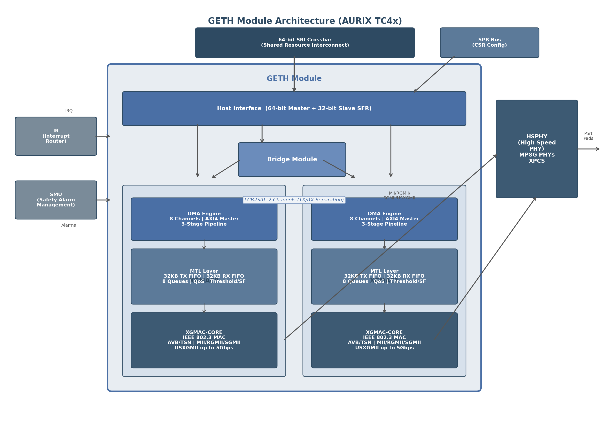

# 2. GETH模块架构与核心机制

Gigabit Ethernet（GETH）模块是AURIX TC4x系列微控制器中实现高速网络通信的核心功能单元。该模块不仅承载了从10 Mbps到5 Gbps全双工速率范围内的数据链路层处理，还通过硬件集成的TSN（Time-Sensitive Networking）功能、Bridge转发能力和多层安全机制，为汽车电子域控架构提供了完整的以太网骨干网解决方案。本章将从整体结构出发，逐层剖析XGMAC核心、MTL传输层、DMA引擎的工作机理，并深入解析DMA描述符体系与硬件卸载特性的实现细节。

## 2.1 GETH模块整体结构

### 2.1.1 双XGMAC+Bridge架构

TC4x的GETH模块在顶层结构上采用了"双MAC+桥接"的复合架构设计。每个GETH功能块内部包含最多两个XGMAC（10 Gigabit Media Access Controller）模块和一个Bridge模块，通过64位SRI（Shared Resource Interconnect）主从接口与芯片内部总线系统相连[^94^][^39^]。从功能划分角度，GETH模块由三大部分组成：Host Interface（包含64位Master数据接口和32位Slave配置接口）、Bridge模块（仅存在于支持以太网桥接功能的产品型号中）以及XGMAC Core（负责协议处理、帧过滤与转发规则、以太网帧缓冲等核心功能）[^75^]。

图2-1展示了GETH模块的整体架构。Host Interface的64位Master接口负责以太网帧数据在GETH与主机系统内存之间的高速搬运，而32位Slave接口通过SFR（Special Function Register）特殊功能寄存器组向应用层暴露配置接口。Bridge模块位于两个XGMAC之间以及XGMAC与Host之间，支持三类数据转发路径：从Host到XGMAC的下行帧发送、从两个XGMAC到Host的上行帧接收、以及两个XGMAC之间的侧向帧转发（MAC-to-MAC forwarding）[^75^][^36^]。侧向转发功能是实现菊花链拓扑以太网网络的关键硬件基础——后文将论述，该能力结合IEEE 802.1CB FRER（Frame Replication and Elimination for Reliability）协议，可在无外接TSN交换机的条件下构建安全关键通信路径。

**图2-1 GETH模块整体架构图（含双XGMAC、Bridge、HSPHY及系统集成关系）**

TC4x GETH支持的标准与速率范围体现了其面向未来汽车网络的前瞻性设计。MAC层完全符合IEEE 802.3-2008/2015行业标准，物理层接口覆盖MII、RMII、RGMII、SGMII和USXGMII五种类型，数据速率支持10M/100M/1G/2.5G/5G全双工模式，10M和100M下 additionally 支持半双工操作[^77^][^44^]。在AVB/TSN协议栈方面，GETH硬件实现了IEEE 802.1Qav（Credit-Based Shaper）、IEEE 802.1AS-2020（gPTP时间同步）、IEEE 802.1Qbu（帧抢占）和IEEE 802.1Qbv（时间感知调度）等关键标准[^77^]。此外，XGMAC遵循AMBA4 AXI/ACE协议规范，通过AXI4主控接口与SRI系统总线交互[^28^]。

表2-1从代际演进角度对比了TC4x GETH与其前代TC3xx GETH的关键参数差异，量化展示了架构升级的幅度。

**表2-1 TC4x GETH与TC3xx代际关键参数对比**

| 参数项 | TC4x GETH | TC3xx GETH | 提升倍数 |
|:---|:---|:---|:---|
| MAC实例数 | 最多2个XGMAC | 1个GMAC | 2x |
| Bridge模块 | 有（双端口产品） | 无 | 新增 |
| 最高速率 | 5 Gbps (USXGMII/SGMII) | 1 Gbps | 5x |
| 支持接口 | MII/RMII/RGMII/SGMII/USXGMII | MII/RMII/RGMII | 新增SGMII/USXGMII |
| DMA通道数 | 8个独立通道 | 4个独立通道 | 2x |
| MTL TX FIFO | 32 KB | 4 KB | 8x |
| MTL RX FIFO | 32 KB | 8 KB | 4x |
| 总线位宽 | 64位SRI | 32位SRI | 2x |
| LCB2SRI通道 | 2条（支持TX/RX分离） | 无 | 新增 |
| TSN支持 | 802.1Qav/802.1AS/802.1Qbu/802.1Qbv | 有限 | 显著增强 |
| 帧抢占（802.1Qbu） | 支持 | 不支持 | 新增 |
| 安全特性 | ECC/FSM Parity/CSR Timeout | 基础 | 增强 |

TC4x GETH相较于前代产品在数据通量能力上的提升是全方位的：DMA通道数从4条倍增至8条，使得多队列QoS调度具备独立的硬件通道支撑；MTL（MAC Transaction Layer）发送和接收FIFO分别扩大8倍和4倍至32 KB，显著增强了突发流量吸收能力；64位SRI总线配合双LCB2SRI通道设计，为持续高吞吐应用场景提供了充足的片上带宽[^92^][^44^][^77^]。从系统架构角度看，Bridge模块的引入使TC4x从单纯的终端节点MAC升级为主干网转发节点，这一变化与汽车EE架构从星型向域控/区域拓扑演进的趋势高度契合。

### 2.1.2 与HSPHY、IR中断、SMU的集成关系

GETH模块并非独立运作的孤岛，其通过多条接口与TC4x芯片的物理层、中断系统和安全监控子系统深度耦合。

与HSPHY（High Speed Physical Layer）的接口关系是GETH数据通往物理媒介的唯一通道。GETH本身不具备直接连接I/O引脚的能力（PPS输出除外），所有MAC数据信号均经HSPHY中转后到达PORTS模块的实际引脚[^75^]。HSPHY内部集成最多三个MP8G PHY（Multi Protocol 8 Gigabit PHY），每个MP8G PHY由PCS（Physical Coding Sublayer）和PMA（Physical Medium Attachment）构成，支持0.125 Gbit/s至8 Gbit/s的串行线速率[^115^][^117^]。对于以太网应用，HSPHY中的XPCS模块完成MAC与PHY之间的编码适配，支持USXGMII、SGMII等多种模式，使用25 MHz参考时钟[^115^]。TC4x的HSPHY同时提供RGMII接口（10/100/1000 Mbps）和SerialGMII接口（100/1000/2500/5000 Mbps），并通过DLL（Delay Lock Loop）模块为RGMII提供精确的时钟-数据偏斜控制，精度达138.88 ps[^389^]。

与IR（Interrupt Router）中断模块的连接为GETH提供了灵活的中断分发机制。DMA通道的发送和接收中断是应用层最常使用的以太网中断源，每对TX/RX DMA通道的中断事件由`DMA_CH(#i)_Status`寄存器统一捕获，中断使能由`DMA_CH(#i)_Interrupt_Enable`寄存器控制[^28^][^35^]。通道中断进一步划分为正常中断（NIS，bit 15，包括TI发送中断、RI接收中断等）和异常中断（AIS，bit 14），通过写1清除中断标志。IR模块将这些中断路由至目标CPU，支持多核场景下的中断负载均衡。

与SMU（Safety Management Unit）的集成构成了GETH功能安全防护的根基。TC4x的SMU是一个集中式硬件模块，收集来自所有安全机制和安全机制的告警信号，其核心域包含SMU_CS（网络安全）、SMU_SAFE0/SMU_SAFE1（双独立安全告警处理）和SMU_GCC（全局控制）四个子模块[^82^][^83^]。GETH向SMU报告的告警来源包括： memories的ECC（Error Correction Code）错误、FSM（Finite State Machine）状态机的parity校验和超时保护故障、以及应用层/CSR接口的访问超时[^77^][^76^]。当SMU检测到严重安全故障时，可触发NMI不可屏蔽中断、中断请求、系统/模块组复位等多种响应动作。HSPHY additionally 集成了紧急停止安全机制，在CPU锁步错误等故障场景下立即屏蔽对外数据发送，满足ASIL-D安全完整性等级要求[^115^]。

## 2.2 XGMAC核心组件

XGMAC是GETH模块实现链路层功能的核心IP，每个XGMAC内部由XGMAC-CORE（MAC核心）、MTL（MAC Transaction Layer）和DMA引擎三大功能块组成，通过标准化总线接口与外部系统交互[^39^]。以下分三个层次详细阐述。

### 2.2.1 XGMAC-CORE：IEEE 802.3 MAC实现

XGMAC-CORE严格遵循IEEE 802.3-2008/2015标准实现了完整的MAC层功能，并提供XGMII/GMII/MII/RGMII/RMII全双工接口用于与物理编码子层通信[^44^]。MAC发送路径包含三个关键子模块：TBU（Transmit Bus Interface）负责对发送帧进行VLAN标签和源地址（SA）的灵活操作；TFC（Transmit Frame Controller）采用两级寄存器结构实现发送帧的流水线控制；TPE（Transmit Protocol Engine）内置严格遵循IEEE 802.3/802.3z规范的发送状态机，是以太网帧发送的核心控制单元[^44^]。

在接收方向，地址过滤模块（AFM, Address Filtering Module）对每个输入帧的目的MAC地址（DA）和/或源MAC地址（SA）进行检测。XGMAC的接收数据包过滤机制具备三大核心能力：AFM实现的DA/SA检测、基于多VLAN标签的扩展过滤及VLAN哈希过滤、以及网络层（源/目的IP地址）和传输层（源/目的端口）的双层级匹配过滤器[^44^]。这些过滤能力为实现TSN中的PSFP（Per-Stream Filtering and Policing）功能提供了硬件基础——具体而言，FFP（Flexible Frame Parser）模块可将识别到的数据流ID映射至8个网关ID之一，GCL（Gate Control List）定义流闸门控制规则，PC（Police Counter）实现流量计量[^48^][^13^]。

XGMAC additionally 支持XGMII和GMII模式下的环回调试功能，可通过`MAC_Rx_Configuration`寄存器的环回位使能，但仅限全双工模式使用[^44^]。

### 2.2.2 MTL传输层：32KB TX/RX FIFO与8队列QoS

MTL（MAC Transaction Layer）在应用系统内存与XGMAC IP之间提供FIFO缓冲和帧数据调节功能，确保两个异步时钟域之间的可靠同步。在TC4x的64位系统中，MTL异步FIFO的位宽为68位——64位数据位加4位控制位。MTL通过ATI（Application Transmit Interface）、ARI（Application Receive Interface）和MCI（XGMAC Control Interface）三条内部总线与应用系统通信[^44^]。

相较于前代TC3xx产品（TX FIFO 4 KB，RX FIFO 8 KB），TC4x的MTL缓冲容量实现了跨越式提升：TX和RX FIFO均达到32 KB[^44^][^28^]。这一扩容对于TSN场景下的突发流量吸收至关重要——当帧抢占（802.1Qbu）或帧复制（802.1CB FRER）导致瞬时流量倍增时，充足的FIFO深度可有效防止因缓冲区溢出引发的帧丢弃。

MTL支持最多8个发送队列和8个接收队列，每个队列可独立配置服务质量参数。发送操作中，应用通过TX DMA通道将数据包推入对应队列；当队列达到预设阈值（阈值模式，threshold mode）或完整数据包已存入队列（存储转发模式，store-and-forward mode）时，数据包被提取并传输至MAC层。接收操作方向相反：MAC层接收的数据包被存入对应RX队列，当队列填充等级超过`MTL_RxQ(#i)_Operation_Mode`寄存器位[1:0]配置的阈值（阈值模式）或完整数据包已接收（存储转发模式）时，DMA被触发执行预配置的突发传输至AXI接口[^44^]。

阈值模式与存储转发模式的选择涉及延迟与效率的权衡。阈值模式下，MTL在数据量达到阈值即开始转发，可降低端到端传输延迟，但可能因分包导致总线效率下降；存储转发模式下，必须等待完整帧存入FIFO后才启动转发，延迟较高但DMA突发传输效率最优。对于汽车AVB/TSN应用，通常推荐发送方向使用存储转发模式以确保整帧完整性，接收方向根据实时性要求灵活选择。

### 2.2.3 DMA引擎：8独立通道与3级流水线

TC4x GETH的DMA引擎包含8个独立通道，较前代TC3xx的4通道实现翻倍扩容。每个通道拥有独立的Tx Engine和Rx Engine：Tx Engine负责从系统内存向MTL发送队列搬运数据，Rx Engine负责从MTL接收队列向系统内存搬运数据[^28^][^36^]。所有DMA通道通过统一的AXI4主控接口发起总线传输请求。

DMA采用3级流水线架构以最大化数据吞吐效率[^28^]：第1级为描述符预取（Descriptor Fetch），引擎从系统内存或预取缓存中读取有效描述符（OWN=1）；第2级为数据传输（Data Transfer），AXI主控制器接收并执行传输请求；第3级为描述符回写（Descriptor Write-Back），DMA将传输完成状态和时间戳信息写回描述符。这三级操作在时间上相互重叠——当第N个数据包处于传输阶段时，第N+1个数据包的描述符预取和第N-1个数据包的描述符回写可同时执行，有效缩短了包间传输间隔。

每个DMA通道支持独立的可编程突发长度（PBL, Programmable Burst Length），可选值为4、8、16、32、64、128、256 beats，默认32 beats； additionally 提供8xPBL模式，可将突发长度扩展至8至2048 beats范围[^67^][^100^]。仲裁模式方面，`DMA_Mode`寄存器的DA位控制两种策略：DA=0时为加权轮询（WRR），DA=1时为固定优先级。固定优先级模式下Rx DMA默认优先于Tx DMA（TXPR=0），描述符读取优先级可通过TDRP位配置[^66^][^52^]。

TC4x针对高吞吐场景引入了LCB（Local Cross Bar）优化设计，配备两条LCB2SRI连接通道。在TX/RX分离配置中，TX帧数据Buffer置于第一条主控端寻址的地址空间，RX帧数据Buffer置于第二条主控端寻址的地址空间，从而使单条LCB2SRI通道的完整Buffer深度完全服务于单向帧数据流[^44^][^28^]。这一设计避免了收发数据在总线上的互锁竞争，对于5Gbps全速率场景尤为重要。

## 2.3 DMA描述符机制

DMA描述符是连接软件协议栈与硬件DMA引擎的核心数据结构，定义了数据缓冲区的位置、长度和控制属性。TC4x GETH采用16字节（4个32位字）的固定长度描述符，所有描述符在系统内存中以环形缓冲区（ring buffer）形式组织[^28^][^64^]。

### 2.3.1 描述符结构：常规描述符与增强描述符

GETH支持两种描述符格式：常规描述符（Normal Descriptor）用于标准数据包传输，增强描述符（Context Descriptor）提供时间戳校正、VLAN标签和TSO（TCP Segmentation Offload）等扩展功能的控制信息[^48^][^44^]。

常规描述符分为读格式（Read-Format，由软件在DMA处理前写入）和回写格式（Write-Back Format，由DMA在传输完成后更新）。表2-2详细列出了发送常规描述符（TDES0-TDES3）的字段映射。

**表2-2 DMA发送常规描述符（TDES）字段映射**

| 字偏移 | 字段名 | 位域 | 读格式功能 | 回写格式功能 |
|:---|:---|:---|:---|:---|
| TDES0 [31:0] | BUF1AP | [31:0] | Buffer 1物理地址指针 | TTSL：发送时间戳低32位 |
| TDES1 [31:0] | BUF2AP | [31:0] | Buffer 2物理地址指针（可选） | TTSH：发送时间戳高32位 |
| TDES2 [31] | IOC | [31] | 完成中断使能（发送结束触发TI） | — |
| TDES2 [30] | TTSE | [30] | 发送时间戳捕获使能 | — |
| TDES2 [29:16] | B2L | [29:16] | Buffer 2数据长度（字节） | — |
| TDES2 [15:14] | VTIR | [15:14] | VLAN标签插入/替换控制（00=无/01=删除/10=插入/11=替换） | — |
| TDES2 [13:0] | B1L | [13:0] | Buffer 1数据长度（字节） | — |
| TDES3 [31] | OWN | [31] | **所有权位**：1=DMA所有，0=CPU所有 | 清零至0 |
| TDES3 [30] | CTXT | [30] | 0=常规描述符 | 描述符类型指示 |
| TDES3 [29] | FD | [29] | **首描述符**标记（数据包第一片） | 同读格式 |
| TDES3 [28] | LD | [28] | **末描述符**标记（数据包最后一片） | 同读格式 |
| TDES3 [27:26] | CPC | [27:26] | CRC填充控制（00=插入CRC并填充/11=无CRC无填充） | — |
| TDES3 [25:23] | SAIC | [25:23] | 源地址插入控制（001=插入MAC_Address0/010=替换SA） | — |
| TDES3 [17:16] | CIC | [17:16] | 校验和插入控制（见2.4.1节） | — |

OWN（Ownership）位是描述符状态机的核心控制位。当软件准备好数据缓冲区并将OWN置1时，描述符所有权移交至DMA；DMA处理完成后将OWN清零，标志描述符可再次被软件使用[^39^][^27^]。FD（First Descriptor）和LD（Last Descriptor）位用于支持数据包拆分——当数据包跨越多个描述符时，首描述符FD=1，末描述符LD=1。接收描述符（RDES）结构与此对称，RDES0/RDES1承载Buffer地址，RDES3的PL字段[14:0]记录接收帧长度，ES位（Error Summary）汇总所有错误状态[^103^]。

增强描述符（Context Descriptor）在常规描述符之前提供附加控制信息。发送上下文描述符的TDES3中，OSTC位（One-Step Timestamp Correction Enable）使能一步式时间戳校正，TCMSSV位标记时间戳校正值或MSS（Maximum Segment Size）的有效性，TDES0/TDES1分别承载TTSL/TTSH校正值，TDES2的IVT字段承载内层VLAN标签[^68^]。该描述符类型对当前数据包及后续所有数据包生效，直到出现新的上下文描述符为止[^48^]。

### 2.3.2 环形缓冲区管理：描述符链与尾指针机制

描述符在系统内存中以环形缓冲区形式组织，每个DMA通道拥有独立的发送描述符环和接收描述符环。环形结构的四个关键参数由一组专用寄存器维护[^44^][^100^]：`DMA_CHx_TxDesc_List_LAddress`和`DMA_CHx_RxDesc_List_LAddress`分别定义TX/RX描述符环的基地址（低32位）；`DMA_CHx_TxDesc_Ring_Length`和`DMA_CHx_RxDesc_Ring_Length`定义环中描述符数量（最大64K个）；`DMA_CHx_TxDesc_Tail_Pointer`和`DMA_CHx_RxDesc_Tail_Pointer`指向最后一个有效描述符之后的那个位置，作为软件与DMA的"握手信号"；`DMA_CHx_Current_App_TxDesc_L`和`DMA_CHx_Current_App_RxDesc_L`则反映DMA当前正在处理的描述符地址[^56^]。

环形缓冲区的操作遵循精确的协同协议。初始化阶段，软件为每个描述符分配数据缓冲区，按序填入描述符环，将OWN位置1，最后更新Tail Pointer寄存器告知DMA新的描述符已就绪。运行阶段，DMA从Current位置开始轮询，遇到OWN=1的描述符即开始处理；处理完成后将OWN清零并写回状态。软件则定期检查OWN=0的描述符，回收缓冲区并重新填充新数据[^64^]。DMA处理到最后一个描述符后自动跳转回环首地址，形成无限循环。

描述符存放位置对性能有显著影响。由于描述符回写涉及单字传输（如DMA清除OWN位或写回时间戳），理想情况下描述符应存放于本地缓冲RAM中，以避免在LCB2SRI通道上产生因小粒度访问导致的总线效率损失[^36^]。

### 2.3.3 发送/接收流程：从CPU准备到DMA完成的完整数据流

**发送流程**遵循以下五步序列[^44^][^74^]：第一步，描述符获取引擎从系统内存或预取缓存中读取OWN=1的有效描述符；第二步，引擎解析描述符控制位和缓冲区长度，依据`TxPBL`寄存器计算传输量，并检查目标MTL TxQ是否有足够空间；第三步，AXI主控制器接受传输请求，引擎立即计算下一次传输量并发起新请求——任意时刻最多允许两个未完成的数据传输请求并行处理；第四步，当请求数据被提取并写入MTL对应TxQ后该请求视为完成；第五步，写回引擎将时间戳（若TTSE=1）写入TDES0/TDES1，状态信息写入TDES3并清除OWN位，若IOC=1则触发发送中断。

DMA additionally 支持OSF（Operate on Second Frame）模式——在未关闭前一个数据包末描述符的情况下，引擎即开始获取下一个描述符。这种重叠处理机制进一步提升了吞吐能力，但要求描述符链中至少存在三个不同描述符以保证正确操作[^74^]。

**接收流程**是发送流程的镜像[^44^]：描述符获取引擎读取OWN=1的接收描述符后，数据引擎根据缓冲区大小和`RxPBL`计算突发长度并向MTL Rx队列读控制器发出就绪信号；读控制器选择接收队列并触发RxDMA；RxDMA通过AXI写通道将数据搬运至系统内存缓冲区；若传输结束但数据包未完成（EOP标志未置位），引擎返回就绪状态等待下一批数据；若EOP在最后突发中传输，引擎获取最终包状态并推送至写回引擎。对于启用增强状态和时间戳功能的配置，DMA在完成常规描述符回写后 additionally 写入接收上下文描述符（RDES0=RTSL，RDES1=RTSH），承载PTP时间戳信息[^68^]。

值得注意的是，CPU与GMAC DMA之间存在时钟域差异（CPU运行于300 MHz，GMAC DMA运行于150 MHz或更低），存在极小概率的数据竞态风险：OWN位已被置1但DMA读取到旧的TDES2值（如length=0），导致传输异常[^39^]。软件设计应通过适当的内存屏障或延时操作规避此风险。

## 2.4 硬件卸载特性

GETH模块内置多项硬件卸载引擎，旨在将计算密集型的协议处理任务从CPU转移至专用硬件执行，从而释放CPU算力用于上层应用逻辑。

### 2.4.1 TCP/IP校验和卸载：IP/TCP/UDP硬件计算

TCP/IP协议栈要求每个数据包的IP头部和传输层头部均携带校验和字段。软件计算这些校验和需要逐字节遍历整个数据包，对于高吞吐场景消耗大量CPU周期。GETH的硬件校验和卸载引擎在发送和接收两个方向上自动完成这些计算[^78^][^93^]。

发送方向上，校验和计算通过描述符TDES3中的CIC（Checksum Insertion Control）字段按帧控制。CIC=00时禁用校验和插入；CIC=01时仅计算并插入IPv4头部校验和；CIC=10时计算IP头部校验和以及TCP/UDP/ICMP的完整校验和（包含伪头部）。CIC=11为保留值[^27^]。当CIC使能时，硬件自动识别数据包中的IP头部和传输层头部，计算校验和并填入对应位置，无需软件干预。

接收方向上，硬件解析入站帧的Length/Type字段（0x0800表示IPv4，0x86DD表示IPv6），验证IP版本与封装类型匹配，计算IPv4头部校验和（结果0xFFFF表示正确），并计算IP载荷（TCP/UDP段）校验和。校验结果通过接收描述符RDES1中的多个状态位上报：IPHE（IP Header Error，bit 3）指示IP头部校验和错误，IPCE（IP Payload Error，bit 7）指示TCP/UDP校验和错误，IPCB（IP Checksum Bypassed，bit 6）表示该校验被跳过，PT字段[2:0]标识载荷类型（000=UDP/001=TCP/010=ICMP）[^103^]。

### 2.4.2 VLAN处理：标签插入/替换/删除与QinQ支持

GETH的VLAN处理引擎集成于MAC发送路径的TBU模块中，支持基于每帧或全局范围的VLAN标签动态操作[^44^]。`MAC_VLAN_Incl`寄存器的VLT位域定义全局VLAN标签值，而描述符TDES2的VTIR字段则允许对单个数据包进行精细化控制：VTIR=00时不操作VLAN标签；VTIR=01时删除已有VLAN标签；VTIR=10时插入新标签；VTIR=11时替换已有标签[^68^]。

VLAN标签的插入/替换值来源有两种途径：描述符中直接指定的标签值（通过上下文描述符TDES3的VT字段[17:0]），或`MAC_VLAN_Incl`寄存器配置的默认标签值[^44^]。源地址（SA）操作方面，TBU可通过SAIC字段自动完成SA的插入或替换——SAIC=001时从`MAC_Address0_High/Low`寄存器读取MAC地址并插入，SAIC=010时用该地址替换原帧中的SA字段，无需上层协议栈修改帧内容[^27^][^28^]。

对于双层VLAN（QinQ，802.1ad）场景，接收描述符RDES0在回写时同时携带外层VLAN标签（OVT，bit [31:16]）和内层VLAN标签（IVT，bit [15:0]），前提是RS0V位表明RDES0内容有效[^103^]。发送方向上，内层VLAN标签通过上下文描述符的IVT字段设置，外层标签通过常规描述符的VT字段设置，硬件按序完成双层标签插入。

### 2.4.3 时间戳功能：PTP硬件时间戳捕获

GETH的IEEE 1588硬件时间戳模块是实现TSN时间同步（IEEE 802.1AS gPTP）的基础能力。XGMAC同时支持IEEE 1588-2002（v1，PTP over UDP/IP）和IEEE 1588-2008（v2，PTP over Ethernet）两种标准[^44^]。

时间戳捕获的关键精度点位于MII总线的SFD（Start Frame Delimiter）位置——当SFD被置于发送或接收总线上时，硬件精确捕获当前系统时间[^44^]。这一设计确保了时间戳反映的是数据真正离开或到达MAC层的时刻，而非软件处理时刻，消除了协议栈处理延迟引入的测量误差。硬件支持四种PTP时钟类型的快照：普通时钟（Ordinary Clock）、边界时钟（Boundary Clock）、端到端透明时钟（E2E Transparent Clock）和点到点透明时钟（P2P Transparent Clock），并提供数字/二进制两种子秒测量格式[^44^][^34^]。

**表2-3 硬件卸载特性控制字段汇总**

| 特性类别 | 控制字段 | 所在寄存器/描述符 | 取值定义 |
|:---|:---|:---|:---|
| 校验和插入 | CIC | TDES3 [17:16] | 00=禁用/01=仅IP头/10=IP+TCP/UDP/ICMP/11=保留 |
| CRC与填充 | CPC | TDES3 [27:26] | 00=CRC+Pad/01=仅Pad/10=仅CRC/11=无CRC无Pad |
| 源地址操作 | SAIC | TDES3 [25:23] | 000=禁用/001=插入/010=替换 |
| VLAN标签操作 | VTIR | TDES2 [15:14] | 00=无操作/01=删除/10=插入/11=替换 |
| VLAN标签值 | VT | TDES3 [17:0]（上下文描述符） | 18位VLAN标签值（含PCP/DEI/VID） |
| 发送时间戳 | TTSE | TDES2 [30] | 1=使能该帧发送时间戳捕获 |
| 一步式校正 | OSTC | TDES3 [27]（上下文描述符） | 1=使能一步式PTP时间戳校正 |
| 接收校验状态 | IPHE/IPCE/IPCB | RDES1 [3]/[7]/[6] | IP头错误/载荷错误/校验跳过 |
| 接收载荷类型 | PT | RDES1 [2:0] | 000=UDP/001=TCP/010=ICMP |
| 接收时间戳标志 | TSA | RDES1 [14] | 1=后续上下文描述符含有效时间戳 |

时间戳通过描述符机制与软件交互。发送方向上，软件在首描述符中设置TTSE=1，DMA在SFD发送时刻捕获时间戳，传输完成后将64位时间戳（TTSL低32位+TTSH高32位）回写至TDES0/TDES1[^65^][^68^]。接收方向上，正常描述符回写时TSA位（RDES1[14]）置1表示时间戳可用，后续的接收上下文描述符RDES0/RDES1分别承载RTSL/RTSH；若TD位（RDES1[15]）置1则表示时间戳因溢出丢失[^68^][^103^]。

对于一步式PTP操作（将时间戳直接嵌入Sync消息中发送），软件在数据包描述符之前放置一个发送上下文描述符，设置OSTC=1和TCMSSV=1，在TDES0/TDES1中提供时间戳校正值，DMA使用该值完成一步式时间戳校正[^68^]。这一机制在gPTP主时钟节点中尤为关键——Sync消息携带的 precise 时间戳使从时钟能够计算并补偿链路传播延迟，实现亚微秒级的网络时间同步。

