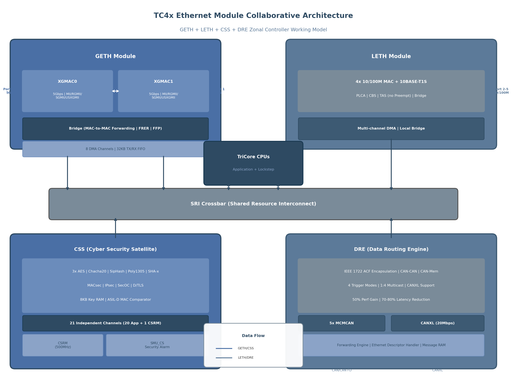

## 11. 架构设计指导与实践建议

前10章对TC4x Ethernet各功能模块进行了系统性技术分析，本章站在系统架构视角，将这些技术要素整合为可落地的设计指导。目标读者为汽车电子嵌入式架构师和软件开发人员，核心议题涵盖模块协同模式、协议选型决策、典型场景架构及性能优化实践。

### 11.1 模块协同设计模式

#### 11.1.1 GETH+LETH+CSS+DRE的协同工作模型

TC4x的Ethernet子系统并非独立MAC控制器的简单堆砌，而是一个围绕SRI（Shared Resource Interconnect）交叉总线构建的集成网络处理架构[^75^]。图11-1展示了四大核心模块的协同工作模型。

**图11-1** TC4x Ethernet模块协同架构：GETH+LETH+CSS+DRE区域控制器工作模型

在该模型中，GETH模块作为高速骨干网接口，集成2个XGMAC核心（各支持5Gbps）与硬件Bridge，通过8路DMA通道和32KB TX/RX FIFO实现高吞吐数据交换[^77^]。LETH模块承担边缘设备接入职责，提供4个10/100M端口及10BASE-T1S支持，通过PLCA（Physical Layer Collision Avoidance）机制将Ethernet延伸至传感器/执行器节点[^19^]。CSS通过SRI交叉总线直接挂载，以21个独立通道和3组AES引擎为MACsec/IPsec/SecOC提供硬件加速[^21^]。DRE作为专用硬件路由器，在不占用CPU资源的前提下完成CAN↔Ethernet协议转换，实现IEEE 1722 ACF封装与解封装[^219^]。

四个模块的协同遵循清晰的数据流分工：GETH的XGMAC0/XGMAC1通过Bridge实现MAC-to-MAC转发，构建区域控制器间的菊花链拓扑；LETH的本地端口汇聚边缘设备数据后，同样经SRI总线与GETH骨干口交换；DRE将5个MCMCAN模块（共20路CAN通道）及CANXL接口的传统CAN帧封装为IEEE 1722格式注入Ethernet网络；CSS则对所有需安全保护的流量执行AES-GCM/CMAC运算，其ASIL-D级MAC比较器为安全认证提供硬件级安全保障[^21^]。这一协同模型使TC4x得以实现完整的区域控制通信子系统，而无需外接TSN交换机或安全加速器。

#### 11.1.2 基于桥接的菊花链冗余架构设计

TC4x GETH集成的硬件Bridge支持XGMAC0↔XGMAC1之间的MAC-to-MAC帧转发，这一能力是构建菊花链和环形拓扑的关键使能因素[^48^]。在菊花链架构中，每个区域控制器通过GETH Port 0接收来自上游节点的流量，经Bridge硬件转发至Port 1下发至下游，无需CPU介入中继路径，从而确保转发的确定性时延[^28^]。

对于安全关键通信路径，Bridge与IEEE 802.1CB FRER（Frame Replication and Elimination for Reliability）协同工作：发送节点通过FRER生成两份相同序列号的帧副本，分别经两条物理不相交路径传输；接收端Bridge根据序列标识消除重复帧并合并流量[^13^]。32KB FIFO深度为冗余事件期间的突发流量提供了充足的缓冲空间[^44^]。Bridge还集成FFP（Flexible Frame Parser）和静态转发表（FTCFG），可在硬件层面实现L2/L3/L4过滤与环路预防[^41^]。

菊花链架构相较于传统星型拓扑的优势在于显著减少线缆总长度与重量——这对线束密集的汽车E/E架构具有直接的物料成本效益。但需注意的是，FRER的软件实现属性意味着冗余路径的帧复制与消除由驱动层完成，吞吐量影响需在具体应用场景中评估[^48^]。

### 11.2 协议选型决策树

#### 11.2.1 TSN协议选择：何时使用CBS vs TAS vs 抢占

TSN协议的选择取决于流量特征的确定性等级与时延预算。表11-1提供了TC4x支持的核心TSN整形/调度机制的决策矩阵。

**表11-1** TSN协议选型决策矩阵

| 决策维度 | CBS (802.1Qav) | TAS (802.1Qbv) | 抢占 (802.1Qbu) |
|:---------|:---------------|:---------------|:----------------|
| **时延保证等级** | 有界时延（软实时） | 确定性时延（硬实时） | 超低时延（硬实时+） |
| **适用流量类型** | AVB音频视频流、批量数据 | 控制指令、传感器同步 | 安全关键控制（制动、转向） |
| **GETH支持** | 4个shaper/端口 | 4个GCL/端口 | 支持（ express/preempt ） |
| **LETH支持** | 4个shaper/端口 | 4个GCL/端口 | **不支持** [^30^] |
| **带宽利用率** | 60-75%（guard band开销） | 85-95%（精确门控） | >95%（抢占消除guard band） |
| **配置复杂度** | 低（idle/sendslope） | 高（GCL周期设计） | 中（preempt优先级划分） |
| **典型guard band** | N/A | 需预留最大帧传输时间 | 仅需预留抢占碎片时间 |

CBS（Credit Based Shaper）通过idleSlope和sendSlope参数控制AVB类流量的带宽分配，适用于对时延有统计性要求但无需严格确定性的场景[^41^]。当流量类别需要硬实时保障时，TAS（Time Aware Shaper）通过Gate Control List（GCL）精确控制各队列的传输窗口，但配置GCL时必须预留guard band以应对帧传输边界条件[^114^]。帧抢占（Frame Preemption）则允许express帧中断低优先级preemptable帧的传输，将guard band从最大帧传输时间缩减至抢占碎片时间，从而获得最高的链路利用率[^30^]。**关键约束**：LETH不支持802.1Qbu抢占，因此严格确定性低时延流量应优先部署于GETH端口，LETH上的混合关键流量需依赖TAS门控并增大guard band裕量。

#### 11.2.2 安全协议选择：MACsec vs IPsec vs SecOC的适用场景

TC4x通过CSS硬件加速器支持三种不同层次的网络安全协议。三者的适用场景取决于保护层级、性能需求和系统架构。

**表11-2** 安全协议适用场景对比

| 对比维度 | MACsec | IPsec | SecOC |
|:---------|:-------|:------|:------|
| **OSI层级** | Layer 2（以太网帧级） | Layer 3（IP包级） | Layer 7（PDU级，AUTOSAR） |
| **保护范围** | 所有以太网流量 | IP层及以上协议 | 特定AUTOSAR PDU |
| **CSS加速** | AES-GCM-128/256 | AES-GCM/AES-CBC | AES-CMAC/SipHash |
| **性能影响** | 最低（线速处理） | 低（硬件加速） | 极低（短PDU高效） |
| **密钥管理** | MKA（802.1X） | IKEv2/手工配置 | 基于Freshness Value |
| **CPU负载** | 接近零（CSS硬件） | <5%（CSS卸载加密） | <3%（认证码验证） |
| **适用场景** | 骨干网链路加密、区域间通信 | 端到端安全、V2X通信 | 车内ECU间认证、CAN信号保护 |

MACsec在Layer 2对所有以太网流量进行加密和完整性保护，CSS的3组AES引擎可并行处理多路MACsec通道的AES-GCM运算，实现接近线速的加解密性能[^20^]。MACsec的SecTAG（16字节）和ICV（16字节）带来固定的协议开销，但硬件处理使其对端到端时延影响可忽略。IPsec运行于Layer 3，适用于需要跨子网或V2X通信的端到端安全场景，CSS同样提供AES-GCM硬件加速[^21^]。SecOC（Secure Onboard Communication）是AUTOSAR标准定义的PDU级认证机制，通过CSS的SipHash（1280 MB/s@400MHz）或AES-CMAC引擎对信号PDU进行快速认证，特别适合保护从CAN经DRE路由至Ethernet的短帧控制信号[^21^]。在区域控制器架构中，推荐组合使用：区域间GETH链路启用MACsec，V2X网关使用IPsec，内部CAN/Ethernet信号路由启用SecOC。

#### 11.2.3 路由方案选择：DRE硬件路由 vs CPU软件路由的权衡

DRE硬件路由相比TriCore软件路由提供高达50%的性能提升和70-80%的时延抖动降低[^25^][^429^]。DRE支持4种以太网发送触发模式（帧计数、缓存填充度、时间触发、软件触发），允许架构师根据实时性需求灵活配置路由策略[^216^]。然而，DRE的路由功能聚焦于CAN↔Ethernet协议转换和CAN-CAN帧中继，对于需要复杂L3/L4决策的流量（如基于IP地址的ACL规则），仍需CPU软件处理[^399^]。推荐采用混合路由架构：CAN/CANXL至Ethernet的确定性路由由DRE硬件处理，复杂过滤与策略路由由CPU软件实现，两者通过DMA描述符环协同工作。

### 11.3 典型应用场景架构

#### 11.3.1 区域控制器：GETH互联+LETH本地+DRE CAN聚合+CSS安全

区域控制器（Zonal Controller）是TC4x Ethernet架构的核心应用载体。在此场景中，GETH的两个5G端口分别连接上游和下游区域控制器形成菊花链骨干，LETH的4个10/100M端口连接本地边缘ECU和10BASE-T1S传感器/执行器[^39^]。DRE将本地CAN/CAN FD总线（最多20通道）的帧封装为IEEE 1722 ACF格式注入骨干网，实现CAN消息的"一等公民"待遇[^219^]。CSS通过独立通道为不同安全域的通信流提供MACsec加密——例如动力域流量使用通道0-4、底盘域使用通道5-9、车身域使用通道10-14，各通道密钥独立存储于8KB密钥RAM的不同分区，实现功能安全意义上的freedom from interference[^21^]。Bridge的FFP在硬件层面对入站流量执行L2/L3/L4过滤，防止区域间未授权访问[^508^]。

#### 11.3.2 ADAS域控制器：TSN时间同步+FRER冗余+高带宽传感器数据

ADAS域控制器面临高带宽传感器数据（摄像头、激光雷达、4D毫米波雷达）的实时传输挑战。GETH的5Gbps端口为传感器聚合提供充足带宽，802.1AS-2020（gPTP）时间同步在所有GETH端口实现纳秒级时钟对齐，确保多传感器数据的时间一致性[^30^][^44^]。关键控制指令（如AEB紧急制动信号）通过TAS门控获取确定性传输窗口，并启用FRER双路径冗余保障ASIL-D通信路径的可靠性[^13^]。CBS为视频流分配保障带宽，防止突发流量挤占控制信道[^41^]。DMA描述符的双缓冲设计支持报头/载荷分离，上层协议栈可直接访问传感器数据载荷而无需额外拷贝[^28^]。

#### 11.3.3 动力域控制器：10BASE-T1S传感器+CBS整形+确定性控制

动力域（Powertrain）控制器需在成本敏感的传感器网络中实现确定性控制。10BASE-T1S通过PLCA机制在单对非屏蔽双绞线上支持最多8个节点的总线型拓扑，将物理层成本降至最低[^19^]。LETH端口启用CBS整形为动力控制帧分配保障带宽，TAS门控为发动机同步信号预留固定时间窗口。由于LETH不支持帧抢占[^30^]，TAS的guard band需按最大帧长（约1.5kb@100Mbps ≈ 12μs）设计，在百兆速率下该开销对1ms控制周期影响可控（<1.2%）。DRE将传统CAN动力传感器信号封装后经GETH上传至中央计算单元，保持对CAN生态的完全兼容[^472^]。

**表11-3** 三种典型应用场景架构对比

| 架构维度 | 区域控制器（Zonal ECU） | ADAS域控制器 | 动力域控制器 |
|:---------|:----------------------|:-------------|:-------------|
| **核心GETH用途** | 菊花链骨干互联（2x5G） | 传感器聚合+骨干上行 | 动力总线上行网关 |
| **核心LETH用途** | 边缘ECU/传感器本地接入 | 辅助低速调试接口 | 10BASE-T1S传感器总线 |
| **TSN主协议** | 802.1AS + CBS + TAS | 802.1AS + FRER + TAS | 802.1AS + CBS |
| **安全协议组合** | MACsec（区域间）+ SecOC（内部） | MACsec全链路 | SecOC + MACsec |
| **DRE核心功能** | CAN↔Ethernet路由聚合 | CAN信号路由 | 动力传感器封装上传 |
| **Bridge功能** | MAC-to-MAC转发+FFP过滤 | FRER冗余路径 | 本地流量隔离 |
| **CSS通道分配** | 按安全域分区（5+5+5） | 统一MACsec加速 | 动力域专用（3-5通道） |
| **关键设计约束** | LETH无抢占，TAS guard band裕量 | FRER吞吐量需验证 | 10BASE-T1S节点数≤8 |

该对比表揭示了三种场景在架构重心上的显著差异：区域控制器强调多协议聚合与区域间互联，ADAS域控制器聚焦高带宽与功能安全冗余，动力域控制器则在成本约束下追求确定性控制。架构师应根据具体功能需求、成本预算和安全等级，从表中选取匹配的模块配置与协议组合。

### 11.4 性能优化与最佳实践

#### 11.4.1 DMA优化：描述符缓存、TX/RX Buffer分离、环形缓冲区大小

GETH的8路DMA通道支持每通道最多64K个描述符，每个描述符16字节（4 x 32-bit words）[^28^]。为最大化吞吐量，推荐采用以下优化策略：

**描述符缓存与预取**：DMA以3级流水线（描述符获取→数据传输→描述符回写）运行，使连续包的处理间隔最小化[^28^]。建议将描述符环置于紧耦合内存（TCM）区域以降低SRI总线竞争，并启用描述符预取功能使DMA提前获取下一个描述符。

**TX/RX Buffer分离与对齐**：发送和接收缓冲区应位于独立的内存区域以避免缓存冲突。每个缓冲区起始地址需按缓存行大小（通常64字节）对齐，描述符的BUF1AP字段（TDES0/RDES0 bits[31:0]）直接指向物理地址[^27^]。报头/载荷分离功能适用于TCP/IP栈场景——描述符的Buffer 1保存报头（频繁修改），Buffer 2保存载荷（原地不动），减少数据拷贝开销。

**环形缓冲区大小**：环大小直接影响突发吸收能力与CPU中断频率。对于高吞吐传感器数据（如摄像头流），推荐RX环配置256-512个描述符；对于低速控制帧，64-128个描述符即可平衡延迟与内存占用。TX环因由CPU主动填充，通常可配置较小（64-128个描述符）。

**仲裁模式选择**：DMA_Mode寄存器的DA位控制仲裁策略。在单队列/单DMA配置中，加权轮询（WRR）模式可能无法满足QoS需求，此时推荐固定优先级模式（DA=1）并设置RX DMA高于TX（TXPR=0），同时TX缓冲区以Store-and-Forward模式运行避免下溢/上溢[^52^]。

**PBL（Programmable Burst Length）调优**：每通道的PBL值（支持4/5/16/32/64/128/256 beats）影响总线效率。对大包流（>1KB）使用较大PBL（128或256）提高SRI总线利用率；对小控制帧使用较小PBL（16或32）降低延迟[^100^]。

#### 11.4.2 安全优化：CSS通道分配、密钥分区、MAC比较器使用

CSS的21个独立通道是TC4x安全架构的核心资源。合理的通道分配策略应遵循以下原则：

**通道隔离与分区**：按功能安全域划分通道组，例如通道0-6分配给ASIL-D动力域、通道7-13分配给ASIL-B底盘域、通道14-20分配给QM信息娱乐域。CSRM（Cyber Security Real-time Module）在复位后拥有对CSS的独占配置权，负责设定各通道的访问权限和密钥写入权[^21^]。这种硬件级隔离确保不同安全等级流量之间的freedom from interference。

**密钥分区管理**：8KB密钥RAM需按通道分配方案进行分区。每个MACsec安全关联（SA）通常需要256-bit密钥 + 256-bit哈希密钥，约64字节。按每个活跃SA消耗128字节保守估算，8KB可存储约64组密钥，满足多端口多VLAN场景需求。建议将长期密钥（由CSRM从NVMcs加载）与短期会话密钥分置于不同RAM分区，会话密钥更新时不触及长期密钥区域。

**MAC比较器安全监控**：CSS的ASIL-D安全MAC比较器用于验证认证结果（如MACsec ICV或SecOC认证码）。比较失败事件通过SMU_CS（Security Management Unit）触发安全警报，架构师应将此类警报映射至SMU的ALMx配置，在安全监控代码中定义相应的故障响应策略[^21^]。

**三种工作模式选择**：CSS支持后向兼容、安全与性能、纯硬件加速器三种模式。在需要最低时延的场景（如CAN控制帧认证），推荐"Pure HW Accelerator"模式，由应用CPU直接管理密钥和使用CSS密码运算，绕过CSRM中介环节减少关键路径延迟[^21^]。

#### 11.4.3 已知Errata汇总与规避策略

基于Infineon TC4x Errata Sheet和相关技术文档，以下列出Ethernet子系统已知的关键问题及规避策略：

**DMA仲裁问题**：在单队列/单DMA配置下，WRR仲裁模式（DA=0）可能导致TX/RX同时请求时无法满足QoS要求[^52^]。**规避策略**：切换至固定优先级模式（DMA_Mode.DA=1），设置RX优先级高于TX（TXPR=0），TX缓冲区以Store-and-Forward模式运行。

**GETH-to-LETH转发帧丢失**：当持续突发流量从GETH经转发路径至LETH出口时，入站MAC处可能发生帧丢失[^41^]。**规避策略**：配置入站/出站DMA为最大突发长度，增大RXQ FIFO深度，并确保系统运行于最高时钟频率。

**LETH Bridge配置顺序**：LETH Bridge的PORTj_CTRL_REG必须在PORTj_RXC_MAP和PORTj_TXQ_MAP之后编程，否则可能导致转发路径异常[^41^]。**规避策略**：严格遵循"先映射后使能"的初始化顺序。

**CBS credit计算**：当CBS使能时，数据包仅在对应TC的credit为零或正时才被调度发送，credit的idleSlope/sendSlope参数配置错误将导致带宽分配偏离设计值[^41^]。**规避策略**：使用公式 $idleSlope = (\text{分配带宽百分比}) \times portRate$ 精确计算参数，并在集成测试中验证实际带宽分配。

**帧抢占Express/Preempt分类**：仅GETH支持802.1Qbu帧抢占，且需正确配置每个流量类别的express/preempt属性[^30^]。**规避策略**：安全关键流量分配至express类别，非关键批量数据分配至preemptable类别，避免抢占关键帧。

以上架构设计指导与优化建议综合了前10章的全部技术分析结论。TC4x的Ethernet子系统通过GETH、LETH、CSS、DRE四大模块的深度集成与协同，为软件定义汽车（SDV）提供了覆盖物理层至应用层的完整通信平台。架构师在设计阶段应充分评估各模块的能力边界与约束条件（如LETH不支持抢占、FRER的软件实现属性等），通过合理的协议选型与资源分配，在确定性、带宽、安全和成本之间取得最佳平衡。
